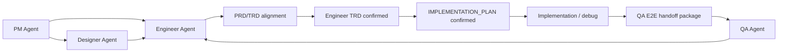
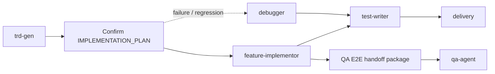
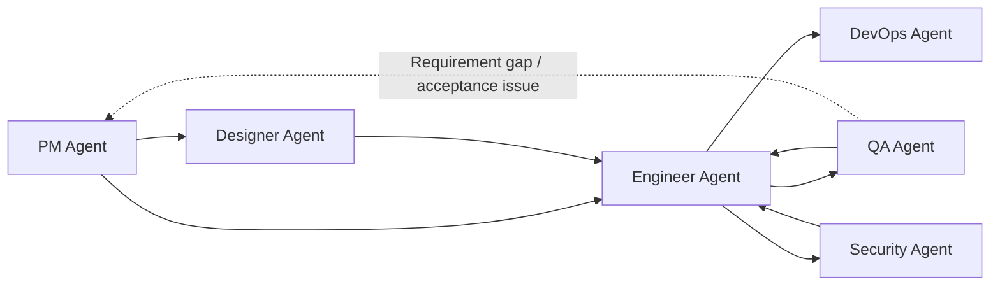
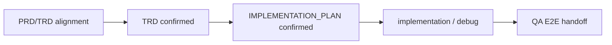
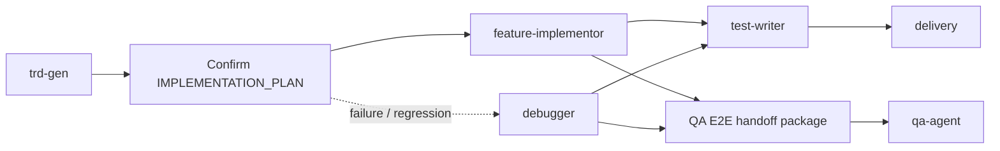

# README 协作门禁 PR Review 修复实施计划

## 1. 背景

PR #34 已按 `docs/engineer/readme-collaboration-guardrails/IMPLEMENTATION_PLAN.md` 完成 README 协作门禁主链路更新。该实施计划已经进入 `Implemented` 状态，不再作为后续修复的待确认计划。

Codex Review 随后指出 Engineer README 的 `debugger` 分支没有进入 QA E2E handoff；用户进一步确认主 README 的 `Collaboration Model` 应保留原 6 个 Agent 之间的交互方式，门禁关系应放在主关系流程下面作为补充信息。

本计划只覆盖 PR review 后的修复，不回写或重开原已实施计划。

## 2. 修复前节点

当前 PR 分支中，主 README 的 `Collaboration Model` 已将门禁节点合并进 6-Agent 主图：

当前 PR 分支中，Engineer README 的 `Typical Flow` 里 debugger 分支只进入测试和交付，没有进入 QA E2E handoff：

## 3. 目标

- 主 README / README_zh 恢复为 6 个 Agent 之间的主交互图。
- 门禁关系放在主流程图后作为补充信息，不作为主图节点。
- Engineer README / README_zh 的 `debugger` 分支连接到 `QA E2E handoff package`。
- 原已实施计划保持 `Implemented`，本计划作为本轮 review 修复的待确认计划。

## 4. 非目标

- 不修改 `agents/engineer/skills/*/SKILL.md`。
- 不修改 QA skill、eval、`skills-lock.json` 或仓库契约脚本。
- 不重写原实施计划正文或改变其完成状态。
- 不调整 PR #34 与 #28 无关的 README 内容。

## 5. 文件变更清单

| 文件 | 操作 | 变更内容 |
| --- | --- | --- |
| `README.md` | 修改 | 恢复 `Collaboration Model` 为 6 个 Agent 主交互图，并在图后补充 Guardrails Mermaid 图。 |
| `README_zh.md` | 修改 | 同步中文主交互图和 Guardrails Mermaid 图。 |
| `agents/engineer/README.md` | 修改 | 在 `Typical Flow` Mermaid 中增加 `Debug --> QAHandOff`。 |
| `agents/engineer/README_zh.md` | 修改 | 同步中文 `典型工作流` Mermaid。 |
| `docs/engineer/readme-collaboration-guardrails-review-fix/IMPLEMENTATION_PLAN.md` | 修改 | 实施后更新本计划状态和版本。 |

## 6. 修复后节点

主 README 恢复为 6-Agent 主交互图：

主图下方补充门禁关系：

Engineer README 的 debugger 修复路径进入 QA E2E handoff：

## 7. 实施顺序

1. 恢复 `README.md` / `README_zh.md` 的 6-Agent 主交互图。
2. 在主图后补充简短 Guardrails Mermaid 图。
3. 在 `agents/engineer/README.md` / `README_zh.md` 的 Typical Flow 中增加 debugger 到 QA handoff 的边。
4. 实施完成后将本计划 `status` 更新为 `Implemented`，并提升 `version`。

## 8. 验证方式

- 运行 `git diff --check`。
- 运行 `uv run scripts/check_repository_contract.py`。
- 人工确认主 README 只表达 6 个 Agent 交互，门禁在图后以 Mermaid 图补充说明。
- 人工确认英文和中文 Engineer README 的 debugger 分支都连接到 QA E2E handoff。

## 9. 确认点

确认本计划后，下一步只修改第 5 节列出的文件，并执行第 8 节验证命令。
