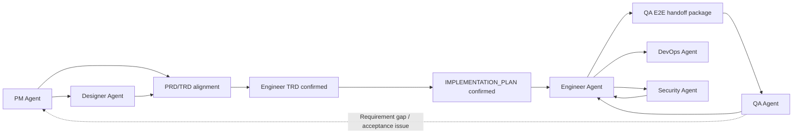
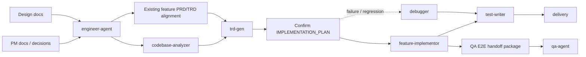
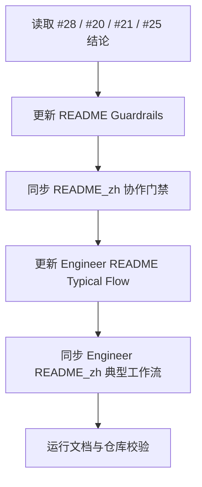

# README 协作门禁主链路实施计划

## 1. 背景

GitHub issue #28 记录了主 README 和 Engineer README 的协作模型滞后问题。#20、#21、#25 已经把 PRD/TRD 对齐、`IMPLEMENTATION_PLAN.md` 确认和 QA E2E documentation handoff 固化到 Engineer/QA specialist skill 中，但入口 README 仍主要展示简化链路，容易让新用户或维护者把这些门禁理解为 specialist 内部细节。

本次实施只做 README 层面的文档对齐，不改变 skill 行为、不新增 eval、不修改仓库运行逻辑。

## 2. 前置对齐结论

- 来源需求：GitHub issue #28 已明确验收标准和建议范围。
- PRD/TRD 状态：本次是已存在 skill 规则的入口文档补齐，不引入新的产品行为或技术行为；以 #20、#21、#25 的已合并规则作为事实来源。
- 实施范围：只更新 README 入口说明和 Engineer README 的 Typical Flow，不扩写 specialist `SKILL.md` 细则。
- 子任务拆分：改动小且文件范围集中，不拆 implementation / validation sub-agent；但仍需本计划确认后再修改文件。

## 3. 目标

- 主 README 明确现有功能变更、bug fix 和用户可见实现必须先完成 PRD/TRD 对齐判断。
- Engineer README 的主流程展示 TRD 确认、实施计划确认和 QA E2E handoff。
- README 只暴露关键门禁和跳转路径，不重复展开 specialist skill 的完整规则。
- 中英文 README 保持一致。

## 4. 非目标

- 不修改 `agents/engineer/skills/*/SKILL.md`。
- 不修改 QA specialist skill 或 E2E reference。
- 不新增或更新 eval fixture、`comparison.md`、`skills-lock.json`。
- 不修改 `AGENTS.md` 或 `CLAUDE.md`。
- 不创建 release changelog；本次只是修复 backlog issue 的实施计划，是否进入发版 changelog 由后续 release 流程判断。

## 5. 文件变更清单

| 文件 | 操作 | 变更内容 |
| --- | --- | --- |
| `README.md` | 修改 | 将现有 `Collaboration Model` Mermaid 合并更新为包含 PRD/TRD alignment、TRD confirmation、implementation plan confirmation、QA E2E handoff 的主流程图，并在图后用简短文字说明门禁含义。 |
| `README_zh.md` | 修改 | 与英文 README 同步更新合并后的 `协作方式` 主流程图和简短门禁说明。 |
| `agents/engineer/README.md` | 修改 | 更新 `Typical Flow` Mermaid，将 existing feature alignment、TRD confirmation、implementation plan confirmation、implementation/debug、QA E2E handoff 纳入主流程。 |
| `agents/engineer/README_zh.md` | 修改 | 与英文 Engineer README 同步更新 `典型工作流` Mermaid。 |

## 6. 目标流程图

主 README 使用合并后的 `Collaboration Model`，在现有 6 个 Agent 协作关系中直接嵌入关键门禁：

该图替换主 README 当前的 `Collaboration Model` Mermaid。图后只补一句简短说明：现有功能变更、bug fix 和用户可见实现需要先完成 PRD/TRD 对齐，TRD 与实施计划确认后再进入实现；影响用户流程的实现完成后移交 QA E2E 文档流程。

Engineer README 的 `Typical Flow` 展示更完整的工程链路：

中文 README 使用同样结构，仅翻译节点文案，不改变流程含义。

## 7. 实施顺序

1. 更新 `README.md`
   - 将 `Collaboration Model` Mermaid 合并更新为包含门禁的主流程图。
   - 在图后补充简短门禁说明。
   - 只写入口级规则，不重复贴 `engineer-agent` / `feature-implementor` 的完整决策树。

2. 更新 `README_zh.md`
   - 与英文版保持同样信息密度。
   - 术语保持一致：PRD/TRD 对齐、TRD 确认、实施计划确认、QA E2E handoff。

3. 更新 `agents/engineer/README.md`
   - 替换 `Typical Flow` Mermaid。
   - 保留 Engineer 只负责把 PM/Designer 文档转为代码、测试和交付资产的边界。

4. 更新 `agents/engineer/README_zh.md`
   - 同步中文 Mermaid 和必要说明。
   - 不扩写 specialist 细则。

## 8. 验证方式

- 运行 `git diff --check`，确认 Markdown 无尾随空格等格式问题。
- 运行 `uv run scripts/check_repository_contract.py`，确认仓库结构契约仍通过。
- 人工检查中英文 README 信息一致。
- 人工检查 README 未重复展开 `SKILL.md` 中已有的完整门禁规则。

## 9. 风险与处理

| 风险 | 处理 |
| --- | --- |
| README 过度展开，和 `SKILL.md` 形成重复事实源 | 只写主链路和跳转路径，细则继续由 specialist skill 承担。 |
| 中英文 README 信息不一致 | 按同一结构逐段同步，并在最终 diff 中检查。 |
| Mermaid 过长影响入口可读性 | 主 README 使用简短文本门禁，Engineer README 才展示更完整的工程链路。 |
| 将 #28 扩大成 skill 行为变更 | 本计划明确不修改 skill、eval、lockfile。发现规则缺口时停止并重新评估。 |

## 10. 确认点

确认本计划后，下一步进入 README 修改。默认只修改第 5 节列出的 4 个文件，并执行第 8 节验证命令。
