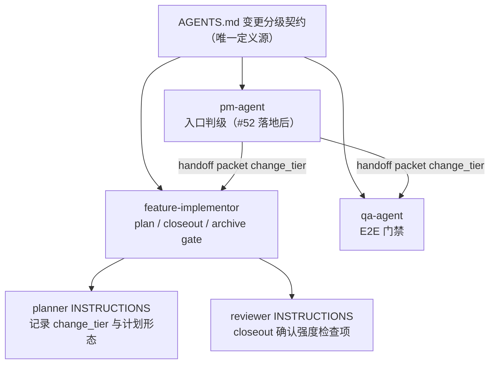

# 变更分级契约 TRD

## 1. 概述

本技术方案在 `AGENTS.md` 定义 `hotfix` / `standard` / `major` 三级变更分级契约
（`change_tier`），作为所有角色门禁强度的唯一引用来源。各 skill 的门禁不再各自
默认最严，而是在原有 gate 表述旁增加一小段分级引用，按 `change_tier` 取强度；
分级只调整门禁形态和确认次数，不取消任何证据要求。

本方案是纯文档契约变更：不修改任何脚本逻辑，不引入新的落盘结构。`hotfix` 的
轻量计划形态是在现有活跃计划中追加 scope 条目或使用简化模板，落盘位置仍是
`docs/engineer/{feature_path}/IMPLEMENTATION_PLAN.md`，因此
`scripts/check_repository_contract.py` 的实施计划校验无需同步修改。

## 2. 来源文档与需求追踪

| 来源 | 需求 |
| --- | --- |
| `docs/pm/repository-governance/change-tier-contract/PRD.md` | 三级分级、判定入口、四类门禁分级强度、证据不削弱、#52 衔接。 |
| GitHub issue #55 | 门禁强度与变更风险不匹配，需要跨角色共享的统一分级依据。 |
| GitHub issue #52 | PM entry gate 的 fast lane 判定和 handoff packet `change_tier` 字段依赖本契约。 |
| GitHub issue #54 | archive gate 落地时预留 `hotfix` 档合并确认的口子。 |
| `AGENTS.md` 现行门禁 | plan gate、closeout gate、QA E2E 门禁的既有表述需改为引用分级契约。 |

## 3. 架构概览

| 组件 | 职责 |
| --- | --- |
| `AGENTS.md` 变更分级契约章节 | 定义等级、判定信号、判定入口和各门禁分级强度；唯一定义源。 |
| `AGENTS.md` QA E2E 门禁条目 | 原"小功能也不能跳过"表述改为引用分级契约取强度。 |
| `agents/engineer/skills/feature-implementor/SKILL.md` | plan gate 与 closeout / archive 确认按 `change_tier` 取强度；QA handoff 携带 resolved `change_tier`。 |
| `agents/engineer/skills/feature-implementor/_internal/planner/INSTRUCTIONS.md` | 计划中记录 resolved `change_tier`；`hotfix` 轻量计划形态与一次确认。 |
| `agents/engineer/skills/feature-implementor/_internal/reviewer/INSTRUCTIONS.md` | closeout 检查清单增加分级强度检查项。 |
| `agents/qa/skills/qa-agent/SKILL.md` | E2E 门禁按 `change_tier` 取强度；handoff 中声明 resolved tier 与所选强度。 |
| `agents/product_manager/skills/pm-agent/SKILL.md` | 入口判级职责与 #52 `change_tier` handoff packet 字段的衔接措辞。 |

## 4. 关键设计决策

| ID | 决策 | 理由 |
| --- | --- | --- |
| D-001 | 分级定义只写在 `AGENTS.md`，各 gate 只加一小段引用，不复制等级表。 | 避免多事实源漂移；gate 原有表述保持不重写。 |
| D-002 | `hotfix` 轻量计划形态不引入新落盘结构，仍写入现有活跃计划路径。 | `check_repository_contract.py` 无需改动；具体形态（追加 scope 条目或简化模板）由各功能 TRD 阶段确定。 |
| D-003 | 判定入口分两阶段表述：#52 落地前承接 skill 自判，落地后 `pm-agent` 入口判级并写入 handoff packet。 | #52 未落地时契约即可生效，落地时无需返工措辞。 |
| D-004 | 判定信号不满足、预期可能变化或无法判级时一律按 `standard` 处理；以 `hotfix` 名义跳过预期对齐必须 blocked 或回 PM。 | 防止分级成为逃逸通道，保住 PRD/TRD 对齐门禁。 |
| D-005 | archive gate（#54）以"生效时"条件引用：`hotfix` 合并 closeout 与归档为一次确认。 | #54 与本契约并行推进，措辞互不阻塞。 |
| D-006 | Fresh Sub-Agent 门禁不参与分级。 | 它作用于 skill 自身测试流程，与产品变更分级无关。 |

## 5. 门禁分级矩阵

| 门禁 | `hotfix` | `standard` / `major` | 证据要求 |
| --- | --- | --- | --- |
| plan gate | 轻量计划形态 + 一次用户确认 | 完整 `IMPLEMENTATION_PLAN.md` 确认流程 | 任何等级都记录验证命令与结果 |
| closeout / archive gate | closeout 与归档合并为一次确认 | 独立审批 | closeout 证据记录任何等级必填 |
| QA E2E 门禁 | 只验证直接影响路径并追加结果 | 完整 PRD/TRD 预期对齐 | 结果记录任何等级必填 |
| PM entry gate（#52 落地后） | 与交付类请求走 fast lane | 留在 PM 路径 | 分类结果与 `change_tier` 进 handoff packet |

`hotfix` 完整链路中用户交互确认不超过 1 次（不含最终交付确认）：plan gate 一次
确认，closeout 与归档合并进最终交付确认。

## 6. 脚本与校验影响

| 项 | 结论 |
| --- | --- |
| `scripts/check_repository_contract.py` | 无需修改。轻量计划形态不引入新落盘结构；实施计划路径、frontmatter 契约不变。 |
| `scripts/check_eval_contract.py` / `check_eval_artifacts.py` | 无需修改。 |
| CI pytest | 无需新增测试；纯文档变更由现有契约脚本覆盖。 |
| `skills-lock.json` | `feature-implementor`、`pm-agent`、`qa-agent` 的 `computedHash` 需重算。 |

## 7. 测试与验证策略

| 验证项 | 方式 |
| --- | --- |
| 唯一定义源 | `rg "变更分级契约" AGENTS.md`；各 gate 引用不复制等级表。 |
| 契约脚本 | `uv run scripts/check_repository_contract.py`、`check_eval_contract.py`、`check_eval_artifacts.py` 全部通过。 |
| CI 同款测试 | `uv run pytest` CI 配置的确定性测试全部通过。 |
| eval 覆盖（FR-008，P1） | 后续单独补充 `hotfix` 轻量链路、`standard` 完整门禁、`hotfix` 名义滥用阻断三类用例；见第 8 节。 |

## 8. 后续工作

- eval 覆盖（PRD FR-008，P1）：在 `feature-implementor`、`qa-agent`、`pm-agent`
  的 eval 中补充 `hotfix` 场景用例，执行 fresh subagent validation 并更新
  durable `comparison.md`。本次契约落地不包含该项。
- #52 落地时：`pm-agent` handoff packet 增加 `change_tier` 字段，fast lane 判定
  直接引用本契约的 `hotfix` 判定；路由触发语料收敛到共享 routing contract 文档
  的建议并入 #52 TRD。
- #54 archive gate 落地时：按本契约的 `hotfix` 档合并确认口径实现，不另行定义。
