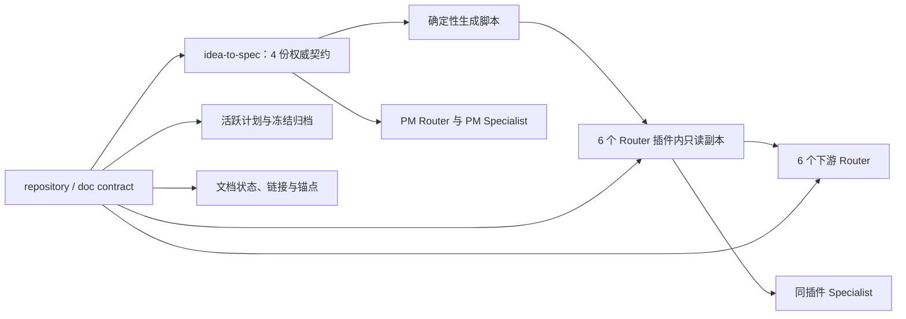

# 仓库文档权威与生命周期治理 TRD

## 1. 来源与范围

本 TRD 以已批准的 `docs/pm/repository-governance/document-authority/PRD.md`、
`docs/pm/repository-governance/document-authority/DECISIONS.md`、GitHub Issue #285
和当前仓库契约为输入。PM 文档定义产品范围与验收，本 TRD 只把已接受决策落实为
文件归属、生成关系、静态门禁和验证方案，不改变七个 Agent 的名称、能力、触发结果或
协作顺序。

变更为 `major`：它同时修改仓库规则、跨插件共享契约、Role Router、多个 Specialist、
过程文档和 contract checker。预计人工维护内容净删除 1,000–2,500 行；24 份只读生成
副本约 2,000 行，连同本功能的 PRD/TRD/计划、三篇 cookbook 和测试后，Git 总行数可
小幅净增加。新增内容限于三个拆出的权威契约、确定性生成脚本、六份插件内派生目录、
三篇操作 cookbook、QA 格式 reference 及必要测试，不新增配置项、通用抽象层、运行时
服务或兼容双轨。

### 1.1 需求追溯

| PRD 要求 | 技术落点 | 验证证据 |
| --- | --- | --- |
| FR-001 / US-001 | 文档职责矩阵、根规则收窄、专项文档与 cookbook owner | 文档契约检查与最终 diff |
| FR-002 / US-002 | 14 份当前已完成计划精确归档；本功能完成后同规则归档 | 活跃计划扫描、归档元数据检查 |
| FR-003 | PM `DECISIONS.md` 与 Engineer TRD/ADR 边界 | 路径与职责检查；无中央决策目录 |
| FR-004 / US-003 | 四份 PM 权威契约、生成的插件内只读副本、freshness check | 生成器 `--check` 与安装副本测试 |
| FR-005 / US-004 | 七个 Router 预算、共享协议移除、Specialist 本地消费 | 行/词预算检查 |
| FR-006 | QA reference 唯一拥有 E2E 模板 | 重复模板扫描与 QA 文档检查 |
| FR-007 | 五份超长文档逐份收窄或归档 | 行数、章节 owner 与 diff 审查 |
| FR-008 / US-005 | 不改注册、名称和用户可见行为 | repository contract 与确定性检查 |

## 2. 技术总览

治理采用“人工只改权威源，安装边界消费生成副本”的单向关系。派生副本与源文件同时
位于仓库中，但副本带只读声明并由脚本完整覆盖；任何手改或漏生成都由 freshness check
拒绝。

本变更没有 API、事件、数据库、网络协议或数据迁移。兼容边界是 Markdown 路径、
frontmatter、marketplace Skill 路径、安装后相对引用和 checker 的退出码。

## 3. 文档职责与唯一 owner

| 路径 | 唯一职责 | 禁止内容 | 保鲜机制 |
| --- | --- | --- | --- |
| `AGENTS.md` | 每次仓库工作必须加载的架构不变量、权限、变更分级与专项 owner 指针 | Specialist 完整协议、逐步操作手册、可从其他文件恢复的长清单 | repository contract、人工 review |
| `docs/architecture.md` | 七角色、安装方式、路由、协作链和扩展关系的当前架构地图 | 操作步骤、实施过程、历史争论、产品或技术决策账本 | 本地链接检查、架构事实 review |
| `docs/AGENTS.md` | `docs/` 树的层级、owner、frontmatter、生命周期、派生物、归档与链接规则 | Agent 执行协议、具体 Skill 工作流、发布命令 | doc contract |
| `docs/cookbook/maintain-skills.md` | 新增、修改、重命名 Role Skill 的顺序化维护步骤及权威 Skill 指针 | 重新定义同步面或 change tier | 链接检查、maintain-skills 契约 |
| `docs/cookbook/release.md` | 手动 release checklist、tag 前后核验与批准边界 | 新 Release CI、具体功能事实、GitHub Release Specialist 协议全文 | repository contract、链接检查 |
| `docs/pm/{feature_path}/DECISIONS.md` | 已接受的产品决策、理由与后果 | Engineer 技术取舍、执行步骤 | PM 文档契约 |
| `docs/engineer/{feature_path}/TRD.md`、`ADR-*.md` | 当前技术设计与需要持久化理由的技术取舍 | 产品决策、下游路由操作、已完成实施叙事 | Engineer 文档契约 |
| `agents/*/README*.md` | Role 能力目录、输入输出、简要边界和导航 | 共享契约全文、Specialist 执行细节 | marketplace/README review |
| `agents/*/skills/*/SKILL.md` | Router 入口分流或 Specialist 独有执行协议 | 人工复制跨角色通用契约 | skill hash 与 freshness check |
| 活跃 `IMPLEMENTATION_PLAN.md` | 已确认且仍需完成的当前执行范围 | `Implemented`、`Archived` 或纯历史叙事 | repository contract |
| `archive/IMPLEMENTATION_PLAN-<scope>.md` | 经批准的冻结实施历史 | 当前待办、作为当前规范被消费 | archive metadata contract |

根 `README.md` 与 `README_zh.md` 只增加架构与 cookbook 导航，不复制上述职责表。
不创建 `docs/decisions/`，也不创建空的 Design、QA、DevOps、Security 过程文档树。

## 4. 实施计划生命周期

### 4.1 当前 14 份精确归档表

归档使用 `git mv`，正文历史不改写；只把 frontmatter 调整为现有 archive contract 要求的
`status: Archived`、`implementation_scope`、`archived_at`、`archive_approved_by` 和
`source_plan`，并更新因路径变化而失效的当前态引用。

| 当前活跃路径 | 冻结归档路径 |
| --- | --- |
| `docs/engineer/agents/docs-agent/IMPLEMENTATION_PLAN.md` | `docs/engineer/agents/docs-agent/archive/IMPLEMENTATION_PLAN-docs-agent.md` |
| `docs/engineer/agents/docs-agent/docs-authoring-foundation/IMPLEMENTATION_PLAN.md` | `docs/engineer/agents/docs-agent/docs-authoring-foundation/archive/IMPLEMENTATION_PLAN-docs-authoring-foundation.md` |
| `docs/engineer/agents/docs-agent/formal-docs-sync/IMPLEMENTATION_PLAN.md` | `docs/engineer/agents/docs-agent/formal-docs-sync/archive/IMPLEMENTATION_PLAN-formal-docs-sync-multi-type.md` |
| `docs/engineer/agents/docs-agent/manual-gen/IMPLEMENTATION_PLAN.md` | `docs/engineer/agents/docs-agent/manual-gen/archive/IMPLEMENTATION_PLAN-manual-gen.md` |
| `docs/engineer/agents/docs-agent/release-notes-gen/IMPLEMENTATION_PLAN.md` | `docs/engineer/agents/docs-agent/release-notes-gen/archive/IMPLEMENTATION_PLAN-release-notes-gen.md` |
| `docs/engineer/agents/engineer-agent/skills/debugger/IMPLEMENTATION_PLAN.md` | `docs/engineer/agents/engineer-agent/skills/debugger/archive/IMPLEMENTATION_PLAN-debugger-read-only-diagnosis.md` |
| `docs/engineer/agents/engineer-agent/skills/feature-implementor/implementation-plan-archive-gate/IMPLEMENTATION_PLAN.md` | `docs/engineer/agents/engineer-agent/skills/feature-implementor/implementation-plan-archive-gate/archive/IMPLEMENTATION_PLAN-archive-path-contract-migration.md` |
| `docs/engineer/agents/pm-agent/skills/feature-catalog/IMPLEMENTATION_PLAN.md` | `docs/engineer/agents/pm-agent/skills/feature-catalog/archive/IMPLEMENTATION_PLAN-inherited-project-feature-catalog.md` |
| `docs/engineer/agents/pm-agent/skills/github-release-gen/IMPLEMENTATION_PLAN.md` | `docs/engineer/agents/pm-agent/skills/github-release-gen/archive/IMPLEMENTATION_PLAN-github-release-gen-gate-governance.md` |
| `docs/engineer/repository-governance/change-tier-contract/IMPLEMENTATION_PLAN.md` | `docs/engineer/repository-governance/change-tier-contract/archive/IMPLEMENTATION_PLAN-change-tier-contract.md` |
| `docs/engineer/repository-governance/eval-scenario-isolation/IMPLEMENTATION_PLAN.md` | `docs/engineer/repository-governance/eval-scenario-isolation/archive/IMPLEMENTATION_PLAN-eval-existing-defect-cleanup.md` |
| `docs/engineer/repository-governance/feature-path-contract/IMPLEMENTATION_PLAN.md` | `docs/engineer/repository-governance/feature-path-contract/archive/IMPLEMENTATION_PLAN-feature-path-autonomous-split-governance.md` |
| `docs/engineer/repository-governance/pm-single-entry/IMPLEMENTATION_PLAN.md` | `docs/engineer/repository-governance/pm-single-entry/archive/IMPLEMENTATION_PLAN-pm-single-entry-convergence.md` |
| `docs/engineer/repository-governance/skill-gen-rename/IMPLEMENTATION_PLAN.md` | `docs/engineer/repository-governance/skill-gen-rename/archive/IMPLEMENTATION_PLAN-skill-gen-rename.md` |

`docs-agent` 父计划虽然仍为 `Draft`，但 #117 已关闭、PR #128 已合并且正文 A8 已记录
完成，因此按 D-002 作为状态漂移归档。若实施时发现任一目标文件已存在，禁止覆盖，必须
更换不冲突的 lower kebab-case `implementation_scope`。

### 4.2 新门禁与本功能归档

`scripts/check_repository_contract.py` 增加两条稳定规则：活跃
`docs/engineer/{feature_path}/IMPLEMENTATION_PLAN.md` 的 `status` 不得为
`Implemented` 或 `Archived`；archive 文件继续只接受 `Archived` 或 `Superseded`。
本功能的计划完成 closeout 后移动到
`docs/engineer/repository-governance/document-authority/archive/IMPLEMENTATION_PLAN-document-authority.md`，
不在活跃入口保留完成态副本。

## 5. 共享契约与消费边界

### 5.1 权威源

`agents/product_manager/skills/idea-to-spec/_internal/_shared/` 保持唯一人工维护源：

| 文件 | 内容 |
| --- | --- |
| `skill-map.md` | PM 分类、Role/Specialist 映射和不属于下列通用协议的导航信息 |
| `handoff-contract.md` | handoff packet 字段、入口凭据与跨角色消费语义 |
| `closeout-contract.md` | safety-net closeout、auto-continue 和停止条件 |
| `security-escalation.md` | Security 结论升级到 PM 的条件、证据和边界 |
| `consumption-contract.md` | 正式宿主文档与 change-map 的消费协议；保留现有文件名 |

`skill-map.md` 中对应三段原文迁出后只保留链接，不保留兼容副本。PM 插件内 Skill 直接
读取这些权威文件。

### 5.2 生成副本

新增 `scripts/generate_shared_contracts.py`，固定读取上述四份 contract 文件，并向六个
下游 Router Skill 生成 `_internal/_generated/shared-contracts/`。每个目录包含同名四份
Markdown；首部声明“generated、禁止手改、源路径”，正文按源文件字节确定性生成。
目标目录为：

- `agents/designer/skills/designer-agent/_internal/_generated/shared-contracts/`
- `agents/engineer/skills/engineer-agent/_internal/_generated/shared-contracts/`
- `agents/qa/skills/qa-agent/_internal/_generated/shared-contracts/`
- `agents/devops/skills/devops-agent/_internal/_generated/shared-contracts/`
- `agents/security/skills/security-agent/_internal/_generated/shared-contracts/`
- `agents/docs/skills/docs-agent/_internal/_generated/shared-contracts/`

脚本默认覆盖生成，`--check` 只比较期望内容与工作树并以非零退出报告 missing、extra 或
stale 文件。生成目标和源映射写死在脚本常量中，不新增 manifest、配置文件或生成框架。
`scripts/check_repository_contract.py` 调用同一纯比较函数，CI 继续复用现有 checker 入口。

六个下游 Router 及其同插件全部 25 个 Specialist 改读本插件 Router 下的生成副本；
不再越过插件边界引用 PM 源文件，也不保留通用协议全文。PM 侧受拆分影响的
`pm-agent`、`idea-to-spec`、`feature-catalog`、`github-reader` 更新为新权威路径。
所有被修改 Skill 的 `skills-lock.json` `computedHash` 在同一变更刷新。

### 5.3 安装兼容性

Claude 验证按 `.claude-plugin/marketplace.json` 的七个 plugin `source` 与 `skills` 精确
复制到临时目录，确认六个下游 Router 的生成副本存在、Router 与 Specialist 的相对引用
均留在各自 plugin 根内。Codex 使用 `scripts/install_codex_skills.py --target <tmp>` 建立
完整 mirror，确认生成副本可读且没有指向 checkout 之外的路径。现有 marketplace 注册、
Skill 名称、source 路径和安装名不变。

## 6. Router 收窄与机器预算

Router 正文只允许入口凭据、路由表、阻塞条件和 Specialist 指针；入口未就绪时明确禁止
下游规划、实现、验收和交付。共享 handoff、
closeout、Security escalation 与 consumption 的详细规则只通过生成副本消费。

| Router | 最大行数 | 最大词数 |
| --- | ---: | ---: |
| `agents/product_manager/skills/pm-agent/SKILL.md` | 320 | 3000 |
| 其余六个 `agents/*/skills/*-agent/SKILL.md` Router | 160 | 1300 |

`scripts/check_repository_contract.py` 使用 UTF-8 文本的 `splitlines()` 计行、以空白分隔的
token 计词，并从固定七 Router 路径执行预算检查。frontmatter 计入预算，生成副本不计入
Router 正文预算。超限时报告实际值、阈值和文件路径。预算只约束 Router，不把行数作为
Specialist 或其他长文档的拆分依据。

## 7. Marketplace 镜像文档状态

`scripts/check_repository_contract.py` 从 marketplace 逐项计算精确镜像路径：
`docs/pm/agents/{plugin-name}/skills/{skill-name}/PRD.md` 与
`docs/engineer/agents/{plugin-name}/skills/{skill-name}/TRD.md`。文件不存在时不要求补建；
存在时 `status` 不得为 `Draft`。当前需机械改为 `Approved` 的 31 份 PRD 为：

- PM：`changelog-gen`、`competitive-brief`、`feature-catalog`、`github-reader`、
  `idea-to-spec`、`pm-agent`、`roadmap-gen`。
- Engineer：`codebase-analyzer`、`delivery`、`engineer-agent`、`feature-implementor`、
  `test-writer`、`trd-gen`。
- QA：`bug-analyzer`、`exploratory-tester`、`qa-agent`、`regression-suite`、
  `spec-based-tester`。
- DevOps：`cicd-bootstrap`、`deployment-planner`、`devops-agent`、
  `env-config-auditor`、`incident-playbook-writer`。
- Designer：`designer-agent`、`ui-ux-design`、`visual-design`。
- Security：`appsec-checklist`、`authz-reviewer`、`dependency-risk-auditor`、
  `privacy-surface-mapper`、`security-agent`。

上述名称均展开为对应 plugin 的 `docs/pm/agents/{plugin}/skills/{name}/PRD.md`。
两份 TRD 是
`docs/engineer/agents/pm-agent/skills/changelog-gen/TRD.md` 和
`docs/engineer/agents/pm-agent/skills/feature-catalog/TRD.md`。每份文件只执行状态收敛、
SemVer patch 递增和同版本日期的 frontmatter `changelog` 记录，不改产品或技术正文。
Agent 父 PRD、非 marketplace child feature 和冻结历史不受此规则影响。

## 8. QA E2E 模板 owner

| 唯一 owner | 承载内容 | 迁出来源 |
| --- | --- | --- |
| `agents/qa/skills/qa-agent/references/e2e-credential-store.md` | 本地账号文件、账号 ID 引用和敏感字段禁令 | QA E2E PRD/TRD 中的账号格式全文 |
| `agents/qa/skills/qa-agent/references/e2e-test-report.md` | 单次结果与汇总报告格式 | QA E2E PRD/TRD 中的报告模板全文 |
| `agents/qa/skills/qa-agent/references/e2e-case-format.md`（新增） | `TEST_SUITE`、`FLOW_INDEX`、`cases/TC-*` 与 `scripts/*.spec.md` 格式 | QA E2E PRD/TRD 中的用例和脚本模板全文 |

PM 文档只保留用户故事、产品约束和验收；Engineer TRD 只保留目录关系、读写时序、
兼容与验证设计；`qa-agent/SKILL.md` 和根/文档规则只保留 owner 指针。reference 变更后
刷新 `qa-agent` hash，并以现有 QA deterministic tests 验证行为不变。

## 9. 五份超长活跃文档处置

| 文件 | 结论 | 章节归属 |
| --- | --- | --- |
| `docs/pm/agents/qa-agent/e2e-case-memory/PRD.md`（665 行） | 收窄 | 保留产品目标、场景、验收和非目标；账号、用例、脚本、报告格式迁到第 8 节三个 QA reference |
| `docs/engineer/agents/qa-agent/e2e-case-memory/TRD.md`（534 行） | 收窄 | 保留目录/数据流/持久化/验证技术设计；模板正文迁到三个 QA reference |
| `docs/engineer/agents/docs-agent/TRD.md`（543 行） | 收窄为父边界 | 保留 Docs Agent 架构、公共对象和子能力边界；各功能协议留在现有 child TRD 与对应 Specialist |
| `docs/engineer/repository-governance/eval-scenario-isolation/TRD.md`（580 行） | 原位精简 | 保留最终 current-state 架构、数据模型、约束与验证；删除已完成批次、fresh 执行流水和评审过程叙事 |
| `docs/engineer/agents/docs-agent/IMPLEMENTATION_PLAN.md`（505 行） | 冻结归档 | 按第 4.1 节移动，不把历史章节迁入当前规范 |

四份 current-state 文档按现有规则更新 `version`、`last_updated` 和 frontmatter
`changelog`。不以超过 500 行为由创建新的 feature tree。

## 10. Markdown 链接与锚点门禁

`scripts/check_doc_contract.py` 扩展为检查 Git 跟踪的活跃 Markdown：解析 Markdown
本地链接，忽略 `http(s)`、`mailto`、纯图片资源和代码块；相对路径以来源文件目录解析，
仓库根路径以仓库根解析。目标文件必须存在；带 fragment 时按 GitHub 风格 ATX heading
slug（含重复标题序号）验证锚点存在。URL percent-decoding 后再匹配，路径不得逃出仓库。

冻结 `archive/`、changelog 历史、eval fixture/workspace 与生成目录不作为链接来源扫描，
但活跃文档链接到这些目标时仍检查目标文件与锚点。现有 frontmatter、feature-path、
归档命名和文档层级检查继续复用，不引入第二个 Markdown parser 依赖。

## 11. 精确影响面

| 类别 | 文件或集合 | 动作 |
| --- | --- | --- |
| 仓库入口 | `AGENTS.md`、`README.md`、`README_zh.md`、`docs/architecture.md`、`docs/AGENTS.md`、第 3 节三篇 cookbook | 收窄、建 owner、补导航 |
| 计划 | 第 4.1 节 14 对路径；本 feature 的活跃计划及完成归档路径 | `git mv`、生命周期元数据、引用修复 |
| 权威契约 | `idea-to-spec/_internal/_shared/{skill-map,handoff-contract,closeout-contract,security-escalation,consumption-contract}.md` | 拆分并保留一个人工源 |
| 派生契约 | 第 5.2 节六个 `_internal/_generated/shared-contracts/`，共 24 文件 | 由脚本生成，禁止手改 |
| Skill 消费者 | 六个下游 plugin 的全部 31 个 marketplace Skill；PM 的 `pm-agent`、`idea-to-spec`、`feature-catalog`、`github-reader` | 改引用、删重复协议、收 Router |
| Skill 注册状态 | `skills-lock.json` | 刷新所有实际改动 Skill 的 hash；marketplace manifest 不改 |
| 文档状态 | 第 7 节 31 PRD 与 2 TRD | `Approved`、patch version、changelog |
| QA owner | 第 8 节三个 reference、QA E2E PRD/TRD、`qa-agent/SKILL.md` | 模板迁移与引用 |
| 超长文档 | 第 9 节五份 | 四份收窄、一份归档 |
| 检查与测试 | `scripts/generate_shared_contracts.py`、`scripts/check_repository_contract.py`、`scripts/check_doc_contract.py` 及同名/相邻 test 文件 | 生成、新鲜度、预算、状态、链接测试 |
| 安装验证 | `scripts/install_codex_skills.py` 与 `scripts/test_install_codex_skills.py` | 复用安装器，补生成副本断言 |

## 12. 实施约束与禁止区

- 不修改七个 Agent/Skill 的名称、数量、marketplace source、发现描述或用户可见行为。
- 不新增 `docs/decisions/`、空角色文档树、Release CI、feature flag、配置 manifest、
  生成框架、缓存、重试、遥测或额外日志层。
- 不改 API、业务代码、部署、权限、tag、Release 或仓库设置。
- 不删除 14 份计划历史，不改写 archive 正文，不覆盖已存在的 archive scope。
- 不把共享契约恢复为多份人工维护副本，也不保留旧路径兼容正文。
- 不修改与第 11 节无关的文档、Skill、eval、格式或历史问题。
- 人工维护内容净删除若小于 1,000 行或超过 2,500 行，先核对是否漏删重复协议或误扩
  范围；生成副本单独计量，不作为人工权威膨胀。

## 13. 验证策略

| 层级 | 范围 | 命令或证据 | 完成条件 |
| --- | --- | --- | --- |
| 生成 | 权威源与 24 份副本 | `uv run scripts/generate_shared_contracts.py --check` | missing/extra/stale 为 0 |
| 仓库契约 | plan 生命周期、Router 预算、marketplace 文档状态、hash | `uv run scripts/check_repository_contract.py` | PASS |
| 文档契约 | frontmatter、本地链接与锚点、归档路径 | `uv run scripts/check_doc_contract.py` | PASS |
| 定向单测 | 生成、repository/doc checker、安装镜像 | `uv run --with pytest pytest scripts/test_generate_shared_contracts.py scripts/test_check_repository_contract.py agents/test_doc_contract.py scripts/test_install_codex_skills.py` | 全部通过 |
| Codex 安装 | 全量安装临时目标 | `uv run scripts/install_codex_skills.py --target <tmp>` | 引用可读、生成副本存在 |
| Claude 打包 | marketplace 七 plugin 临时复制测试 | pytest 内按 manifest source/skills 复制并解析引用 | 六个 plugin 自包含 |
| 行为回归 | 受影响 Router/Specialist | 确定性检查与精确 diff 审查 | 既有行为差异 0 |
| Diff | 范围、空白、净行数 | `git diff --check`；`git diff --stat`；精确路径 review | 无越界；人工维护内容净删 1,000–2,500 行，生成副本单列 |

负向用例必须覆盖：手改一个生成副本、Router 超任一预算、活跃计划写
`Implemented`/`Archived`、精确 marketplace 镜像文档写 `Draft`、本地链接目标缺失、
锚点缺失、路径逃出仓库。每项均应由对应 checker 非零退出。

## 14. 发布、回滚与运行关注

本变更通过普通 PR 发布，无服务部署、数据库迁移、监控、告警或运行日志。安全与隐私为
N/A：不处理凭据或用户数据；QA reference 只规定本地凭据存储格式，禁止示例包含真实
secret。

回滚以阶段为单位：归档误判时只恢复对应精确计划；安装副本不可读时回滚消费者切换与
生成副本阶段；Router 行为回归时恢复该 Router/Specialist 的上一版内容。禁止用长期双轨
副本作为回滚结果。所有回滚都必须重新运行第 13 节静态检查。

## 15. 风险、假设与开放问题

| 类型 | 项目 | Owner | Blocking |
| --- | --- | --- | --- |
| 风险 | 归档 scope 与既有文件重名导致覆盖 | 实施者以目标存在性检查阻止覆盖 | 是，单项停止 |
| 风险 | 收窄 Router 时误删阻塞语义 | 生成契约消费与预算检查共同验证 | 是 |
| 风险 | Markdown 历史文件产生无关存量失败 | 只扫描活跃来源，历史仅作为被引用目标 | 否 |
| 假设 | marketplace plugin copy 与 Codex mirror 都复制 Router `_internal/` | 两类临时安装测试证明 | 是 |
| 假设 | 31 PRD 与 2 TRD 仅状态漂移，正文已对应当前 marketplace 能力 | 状态变更只做机械 frontmatter 更新 | 是 |

开放技术问题：无。若实施证据推翻任一 blocking 假设，停止对应阶段，不以新增兼容层绕过。

## 16. L2b 拆分评估

本 TRD 少于 500 行，相关需求为 5 个 US 加 8 个 FR，低于 15 行阈值，也没有已确认的
PM child feature。计划生命周期、共享契约、Router 收窄、文档状态和链接门禁看似覆盖
多个工作面，但它们共同服务一个“唯一权威可被安装并由机器证明”的原子契约：任一部分
独立发布都会留下双权威、不可消费副本或无门禁的过渡状态，不能独立验收和回滚。
因此已评估多工作面信号但不拆 L2b，不创建 Engineer-only 子路径；实施计划按同一
`repository-governance/document-authority` 范围分阶段执行。
