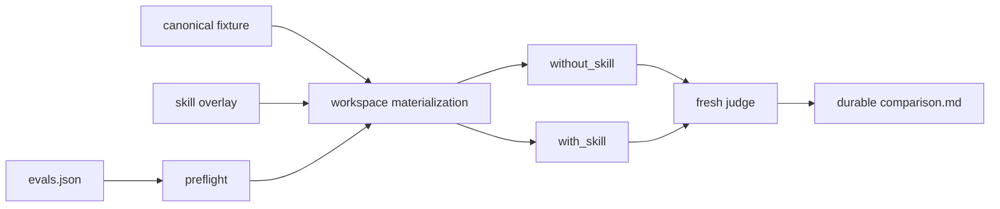

# Eval 真实场景与 Lane 隔离重构 TRD

## 1. 当前架构

`scripts/eval_runtime.py` 是共享执行运行时。每条 eval 从同一 canonical fixture 分别
物化 `without_skill` 与 `with_skill` lane；两条 lane 使用相同自然用户消息、独立
临时目录、独立 Git 根、独立 HOME 与权限边界。



Runner 只通过公共模块创建 lane、执行、判定、持久化和清理；各 Agent wrapper 不复制
协议。

## 2. Fixture 与 Overlay

- Canonical fixture 是场景的共同初始状态。
- With-skill lane 将完整 Skill 目录覆盖到隔离的发现根；without-skill lane 不暴露目标
  Skill。
- Overlay 身份在运行开始锁定，运行中修改源 Skill 不改变本次身份。
- Fixture 不包含标准答案、目标实现、测试期望泄漏或 lane 专属提示。
- Preflight 在模型调用前验证 fixture、prompt、权限、Git 根、目标 Skill 和命令约束。

## 3. Scenario 契约

每个场景有唯一 ID、自然用户 prompt、fixture、断言、owner 和目标 Skill。两条 lane 的
prompt 字节相同。断言验证可观察结果，不要求模型复述内部协议。

Fresh judge 必须来自当前运行，且以场景要求和证据为输入。静态检查拒绝：

- prompt 中泄漏预期答案或内部路径；
- with/without lane 使用不同用户消息；
- fixture 直接包含目标输出；
- 未声明的外部依赖或越权写入；
- 多个 durability identity 匹配同一 comparison。

## 4. Identity Schema v2

Durable comparison 使用七字段身份：

| 字段 | 含义 |
| --- | --- |
| `identity_schema` | 固定 schema v2 |
| `agent` | 角色 |
| `skill` | 目标 Skill |
| `eval_id` | 场景 ID |
| `fixture_fingerprint` | canonical fixture 内容身份 |
| `prompt_fingerprint` | 自然用户消息身份 |
| `skill_fingerprint` | 完整 Skill overlay 身份 |

冻结后的 freshness 要求零或一个精确 identity 匹配。零匹配表示缺少当前证据，多匹配表示
歧义；二者均由 checker 拒绝。历史 comparison 不通过文件名或最新时间猜测当前身份。

## 5. 执行与并发

`run_skill_eval.py` 是批量入口。单进程最多 10 workers；每条场景两 lane 独立。持久化
更新使用目标级写锁，避免并发覆盖。

每次场景结束无条件清理运行根、HOME、transcript、diagnostics、outputs、timing 和状态
文件。运行异常同样清理，并将基础设施 blocker 与 Skill/eval defect 分开报告。

## 6. 持久化

只有 fresh paired 结果能更新 durable `comparison.md`。内容包含 identity、两 lane
结果、断言、judge 结论、差异与残余风险。临时 `comparison.auto.md` 和 runner 过程
产物不得进入 Git。

`check_eval_contract.py` 验证定义、身份和 fixture 契约；
`check_eval_artifacts.py` 验证冻结后 comparison inventory 与禁止运行产物。

## 7. 安全边界

- Lane 仅访问物化 workspace 和明确允许的工具。
- 不复用真实 HOME、凭据、cookie、token 或宿主私有状态。
- 外部网络或应用依赖必须由场景显式声明；不可用时报告 infrastructure blocker。
- Without-skill lane 不得通过祖先目录、软链接或镜像读取目标 Skill。
- 任何 temporary root 都在结束时清理。

## 8. 验证

```bash
uv run scripts/check_eval_contract.py
uv run scripts/check_eval_artifacts.py
uv run --with pytest pytest scripts/test_eval_runtime.py scripts/test_run_skill_eval.py scripts/test_check_eval_artifacts.py
```

变更 runner、identity 或持久化契约时，按 `skill-eval-runner` 选择 fresh paired 目标并
只更新本轮证据支持的 comparisons。

## 9. 回滚与风险

回滚共享运行时与 checker 必须同步，不能保留 v1/v2 双轨。主要风险是 overlay 泄漏、
fixture 答案泄漏、并发覆盖和 stale comparison 被误认为 fresh；preflight、隔离根、
写锁和严格 identity 检查分别阻断这些风险。

无开放技术问题。后续 eval 缺陷按现有 Skill eval 流程单独处理，不追加到本 TRD 的当前
架构正文。
