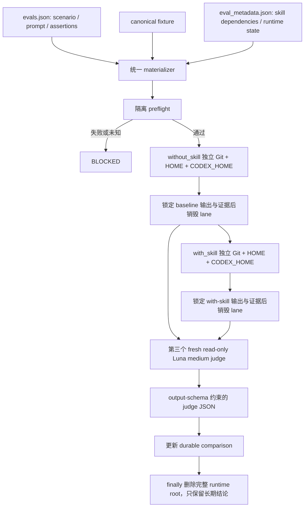

# Eval 真实场景与 Lane 隔离重构技术需求文档

## 1. 技术概述

本方案把仓库现有分散的 eval 执行方式收敛为一个共享运行时：每条保留 eval
从同一 canonical fixture 分别物化 `without_skill` 与 `with_skill`，两条 lane
使用逐字相同的自然用户消息、独立顶层临时目录、独立 Git 根、独立 `HOME` 与
`CODEX_HOME`。共享运行时在 candidate 启动前执行隔离 preflight；任何必需证据
缺失均使本轮成为 `BLOCKED`。

`with_skill` 仅增加目标 skill 及 `eval_metadata.json` 显式列出的依赖，
`without_skill` 不安装仓库或用户级 skill。两条 candidate 输出锁定且各自临时根
销毁后，第三个全新只读 `gpt-5.6-luna` medium 会话依据 assertions、必要原始
证据和两条输出判定。Judge 使用 `codex exec --output-schema` 返回受 JSON Schema
约束的结论；candidate 不接触 schema、assertions、expected output、历史 comparison
或 judge 材料。

方案只允许依据 fresh assertion evidence 对目标 skill 做最小契约修正，不引入缓存、重试、
feature flag、额外配置层、监控系统或通用插件框架。运行状态只在单条 eval 执行期间存在；
runner 退出前删除完整 runtime root，仓库长期只保留 scenario、fixture、迁移清单和 durable
`comparison.md`。

### 1.1 来源与追踪

| 来源 | 本 TRD 的技术落实 |
| --- | --- |
| PRD US-001、FR-002、FR-003 | 为每条 eval 增加 scenario；校验自然 prompt、README 和 fixture 防泄漏。 |
| PRD US-002、FR-004 | 固定七角色 pilot 门禁，通过后才迁移剩余 eval。 |
| PRD US-003、FR-005 至 FR-008 | 统一 materializer、preflight、skill overlay、paired executor 和 fresh judge。 |
| PRD US-004、FR-001、FR-009 | 维护 193 条冻结基线迁移清单并机械校验 193/193。 |
| PRD US-005、FR-009 | 未按新契约重跑的 comparison 标记 `BLOCKED`/stale。 |
| DECISIONS D-001 至 D-015 | 保留 major 级别、唯一变量、runtime artifact 零提交和不改业务协议边界。 |
| Issue #246 | 修复 QA 确定性泄漏，审计其余 runner，并重建全部常规 eval 证据。 |
| AGENTS.md eval 契约 | 固定 fresh paired lane、Luna medium、独立 judge、Behavior/Coverage/Overall 结果。 |

## 2. 冻结实现基线

| 组件 | 当前事实 | 目标差距 |
| --- | --- | --- |
| `scripts/eval_runtime.py` | 仅提供 runtime 路径、复制、删除和 cleanup。 | 缺少 canonical fixture manifest、双 lane、Git/HOME 隔离、skill overlay 与 preflight。 |
| QA `run_eval.py` | Candidate prompt 包含 lane、skill、metadata、expected output 和 assertions；命令从仓库根运行。 | 属于确定性泄漏，必须由统一 executor 替换。 |
| PM `transcript_runner.py` | 已移除部分脚手架并使用 Luna medium，但两条 lane 共用一个 HOME/CODEX_HOME，且复制全部非测试 skill 文档。 | 仍不能证明唯一变量与目标外 skill 不可见。 |
| Designer/DevOps/Docs `run_eval.py` | 三份近似重复的 fixture 复制与确定性输出检查器，不负责统一 candidate/judge。 | 应复用共享 runtime，不再复制隔离语义。 |
| Engineer/Security | 无提交的统一 paired runner。 | 必须通过同一仓库级入口执行。 |
| `check_eval_contract.py` | 校验 schema v1.0、workspace、metadata path 和 comparison 存在。 | 不校验 scenario、自然 prompt、fixture 泄漏、skill 依赖或 193 条迁移清单。 |
| `check_eval_artifacts.py` | 已阻止常见 runtime 输出进入 Git。 | 需覆盖统一 executor 新增的 snapshot/preflight/judge runtime 文件名。 |
| `.github/workflows/evals.yml` | 手动 workflow 只暴露 designer、docs、qa。 | 七角色和单 eval/skill 选择必须进入统一入口。 |

该表记录重构开始时的冻结基线。当前实现已由共享 runtime/executor、permission profile、
Git topology、offline dependency staging、source identity 和 durable transaction 替代；本轮
新增范围是清除所有过程产物、限制 10 worker 并发，以及处理首轮 fresh FAIL。

仓库当前冻结基线为 38 个常规 skill、193 条 eval：designer 11、devops 15、
docs 46、engineer 38、product_manager 50、qa 15、security 18。

## 3. 目标架构



### 3.1 共享运行时边界

`scripts/eval_runtime.py` 是唯一隔离语义来源，负责以下最小职责：

1. 从 eval workspace 复制 canonical fixture，并在复制前排除脚手架。
2. 计算排除 `.git` 与 skill overlay 后的相对路径清单和 SHA-256 内容 hash。
3. 为两条 lane 分别创建不互为父子或 sibling 的顶层临时根、`git init`、
   `HOME`、`CODEX_HOME` 和输出路径。
4. 把目标 skill 和 `skill_dependencies` 仅安装到 `with_skill` 的隔离 skill
   discovery 路径；依赖路径必须是仓库内显式相对路径。
5. 生成并判定 preflight；不完整、失败、模型不可用或 runtime 状态未知时返回
   `BLOCKED`，不启动 candidate 或不写 PASS。
6. Candidate 完成后只在当前进程中锁定最终消息、文件 manifest、Git/ref 证据和运行状态；
   comparison 与 inventory 成功事务完成后，或任何 FAIL/BLOCKED/异常发生时，都在 `finally`
   销毁 lane、依赖 staging、judge package、diagnostics 和完整 runtime root。

`scripts/run_skill_eval.py` 是唯一 paired 执行入口。它读取 `evals.json` 的 prompt，
不接受 runner 重写的 lane-specific prompt；两次 candidate 调用使用相同 prompt bytes
和相同命令参数。固定参数为：

```text
codex --ask-for-approval never --strict-config exec -C <lane-root>
  --ephemeral --ignore-rules
  --model gpt-5.6-luna -c model_reasoning_effort="medium"
```

每条 lane 的隔离 `CODEX_HOME` 只保留权限为 `0600` 的认证文件与运行期生成的
`config.toml`。配置使用 `default_permissions = "eval-candidate"`、`:root = "deny"`、
`:minimal = "read"`，只把当前 workspace 与该 lane 的隔离 `HOME` 设为可写，并显式拒绝
candidate 读取 `CODEX_HOME`。Preflight 通过 `codex sandbox -P` 证明 workspace/HOME 可用，
同时证明源仓库、另一临时根和认证文件不可读；认证与权限配置不得进入 runtime artifact。

### 3.2 Canonical fixture 与 skill overlay

Canonical fixture 是 eval workspace 删除以下内容后的宿主事实快照：

- `evals.json`、`eval_metadata.json`、`comparison.md`、`comparison.auto.md`；
- assertions、expected answer、judge schema/verdict/prompt；
- `with_skill/`、`without_skill/`、`baseline/`、`outputs/`、`diagnostics/`；
- transcript、candidate output、run status、timing、workspace snapshot；
- eval workspace 根部的脚手架 `README.md`。

宿主产品自身的嵌套 README 可以保留，但必须通过静态答案措辞检查。Skill overlay 不计入
fixture hash，但其 manifest 单独入 preflight：`without_skill` 必须为空，`with_skill`
必须恰好等于目标 skill 与显式依赖集合。禁止复制整个 `agents/` 树。

### 3.3 Preflight 契约

每轮必须同时证明以下项目；任一 `false` 或 `unknown` 均为 `BLOCKED`：

| 项目 | 通过条件 |
| --- | --- |
| Workspace | 两条 lane 根、Git 根、HOME、CODEX_HOME 均不同，且 candidate 从各自 Git 根启动。 |
| Fixture | canonical、without、with 的文件 manifest 和内容 hash 100% 一致。 |
| Prompt | 两条 candidate 消息字节和 SHA-256 完全一致。 |
| Exclusions | Candidate-visible tree 对禁止路径与高置信答案措辞扫描为 0 命中。 |
| Skill visibility | without 无目标/用户/仓库 skill；with 仅有目标 skill 和显式依赖。 |
| Source isolation | `workspace-write` + `approval never` 边界启用，未增加外部目录；源仓库不在 workspace 内。 |
| Model | `gpt-5.6-luna` 可用且 reasoning effort 为 medium；不可用时不替换。 |
| Runtime | processes、ports、database、browser、login state、downloads 均为 not-used、独立或已重置。 |
| Judge | 第三个独立根和 HOME/CODEX_HOME 已创建，只读、未启动，且尚未接收 candidate 资料。 |

`eval_metadata.json` 增加 `skill_dependencies` 和 `runtime_isolation`。后者固定记录六个
runtime surface 的 `not_used`、`isolated` 或 `reset`；`isolated`/`reset` 必须有专用
runner 在 candidate 前生成 runtime 证据，否则 preflight 阻塞。此字段不执行任意命令，
不形成可扩展 hook 系统。

### 3.4 Scenario 与静态防泄漏契约

每个 `evals.json` item 增加以下必填对象，字符串和数组均不得为空：

```json
{
  "scenario": {
    "persona": "真实用户角色",
    "situation": "用户当时所处环境",
    "trigger": "为什么现在提出请求",
    "goal": "用户要完成的结果",
    "materials": ["用户真实掌握的材料"],
    "constraints": ["用户真实提出的约束"],
    "success_criteria": ["用户可观察的完成标准"]
  }
}
```

`prompt` 继续是 candidate 唯一用户消息。`check_eval_contract.py` 增加三类检查：

1. 结构检查：scenario 七字段完整；prompt 只存在于 `evals.json`，metadata 不重复保存。
2. Prompt 硬禁用检查：拒绝 `用户说：` 包装、with/without lane、assertion、expected
   output、fixture/scenario 测试术语、skill 路径、模型与 reasoning 参数、内部 gate/step
   指令；合法业务词使用正反 fixture 防止误报。
3. Candidate fixture 检查：拒绝已知脚手架文件和 README 中的高置信答案措辞，例如
   `Expected behavior`、`dispatcher should`、`fixture verifies` 及直接复制 assertion
   清单的同义结构。

静态检查只覆盖确定性泄漏；scenario 是否具有“活人感”、README 是否为宿主原生事实及
assertions 是否面向用户结果，仍由 pilot 和迁移 review 逐条确认，不伪装成关键词机器判分。

### 3.5 Fresh judge

两条 candidate 输出与最终 workspace 证据锁定后，executor 才创建 judge package。
Package 只包含：自然 prompt、assertions、两条最终消息、两条 Git diff/文件 manifest、
必要原始 fixture 证据和 preflight 摘要；不包含 lane 自评、旧 comparison 或预设结论。

Judge 使用独立临时 Git 根、独立 HOME/CODEX_HOME、全局参数
`--ask-for-approval never`、`--strict-config`、`--ephemeral`、`--ignore-rules`、
`gpt-5.6-luna` medium，并由 `eval-judge` permission profile 将 workspace 设为只读、
拒绝 HOME 写入和 CODEX_HOME/源仓库读取。Judge 通过
`scripts/eval_judge_result.schema.json` 固定输出：

- 每条 assertion 的 `PASS`、`FAIL` 或 `NOT_EXERCISED` 与证据；
- `behavior_result: PASS | FAIL`；
- `coverage_result: FULL | PARTIAL` 与未覆盖原因；
- `overall_result: PASS | PASS (partial coverage) | FAIL | BLOCKED`；
- blocker、failure 和 next step。

Executor 校验组合规则，不信任模型自由计算 Overall：Behavior FAIL 必为 FAIL；Behavior
PASS + FULL 为 PASS；Behavior PASS + PARTIAL 为 PASS (partial coverage)。Preflight
失败由 executor 直接产生 BLOCKED，不调用 judge。

## 4. Runner 收敛方案

| 文件或角色 | 目标状态 |
| --- | --- |
| `scripts/run_skill_eval.py` | 统一执行 materialize、preflight、两条 candidate、judge、runtime 报告。 |
| QA `run_eval.py` | 删除 candidate/judge prompt 构造；保留兼容 CLI 的薄调用，转发到统一 executor。 |
| PM `transcript_runner.py` | 删除全 `agents/` mirror、共享 HOME 和自有物化逻辑；转发到统一 executor。 |
| Designer/DevOps/Docs `run_eval.py` | 共用一个确定性 post-run 检查函数；角色文件只保留兼容入口，禁止再次复制 fixture。 |
| Engineer/Security | 直接使用统一 executor，不新增角色专属 paired runner。 |
| `run_all_evals.py` | 只枚举 suite 并逐条调用统一入口，不持有隔离规则。 |
| `.github/workflows/evals.yml` | target 扩展到七角色；统一调用 `--jobs 10`，不上传 `tmp/eval-runs/**`。 |

Runner 审计清单必须覆盖：candidate 消息来源、启动 cwd、HOME/CODEX_HOME、skill 安装、
fixture 复制、assertion/expected output 可见性、runtime reset、judge freshness 和 artifact
落点。审计结论写入迁移清单，不另建日志或监控层。

### 4.1 批量并发与清理

`scripts/run_skill_eval.py` 的批量入口默认 `--jobs 10`，并将合法范围限制为 1 至 10。
线程池可以跨 agent/skill 调度不同 eval，但单个 worker 内仍严格串行执行
`without_skill → with_skill → judge`。共享 migration inventory 的 comparison + inventory
事务由单一进程内写锁保护，避免多个完成项丢失更新；每个 worker 在独立 runtime root 上
工作，并在自己的 `finally` 中递归删除该 root。批量调度器也捕获单 worker 异常并继续回收
其他 future，不允许异常绕过清理。

## 5. 迁移数据与执行门禁

新增
`docs/engineer/repository-governance/eval-scenario-isolation/migration-inventory.json`，
冻结 193 条旧记录。每条记录包含 `agent`、`skill`、`old_eval_id`、`disposition`
（retained/merged/deleted）、`new_eval_id`、`replacement_refs`、`reason`、`pilot`、
`migration_status` 和 durable comparison 路径。

`check_eval_contract.py` 对迁移清单执行以下机械验证：

- 基线记录唯一且总数恰为 193，七角色和 38 skill 计数与冻结基线一致；
- retained、merged、deleted 之和为 193，merged/deleted 必须有 reason 和替代覆盖；
- retained 的新 eval、scenario、workspace、metadata、comparison 全部存在且相互匹配；
- `migration_status: complete` 只允许在新 comparison 含 fresh preflight、judge 和合法
  Behavior/Coverage/Overall 时出现；
- 全量完成条件为 193/193 有处理结论，且所有 retained 均 complete。

迁移开始时先把 193 份旧 comparison 的 Latest result 统一标记为 `BLOCKED`，原因写明
Issue #246 新契约尚未重跑；保留历史正文。之后严格按以下阶段放行：

| 阶段 | 范围 | 完成门槛 |
| --- | --- | --- |
| 0 | 冻结迁移清单、标记 193 份旧结论 stale。 | 193/193 可定位；summary 不再把旧 PASS 当当前证据。 |
| 1 | 统一 runtime、executor、schema、checkers、runner 适配。 | 确定性隔离与泄漏测试通过。 |
| 2 | 七角色 pilot。 | 7/7 完成 scenario、paired run、fresh judge 和 comparison。 |
| 3 | 按角色迁移剩余 eval。 | 193/193 有 disposition；每个 retained 完成 fresh 证据。 |
| 4 | 仓库收尾。 | 全部 contract/test 通过，Git 跟踪 runtime artifact 为 0。 |
| 5 | Fresh FAIL 聚类整改与并发重跑。 | 共享根因、skill 契约缺口和不可能 fixture 全部修复；10 worker 重跑后无未解释 FAIL/BLOCKED，runtime root 为 0。 |

Pilot 使用以下冻结旧标识作为迁移种子；pilot 允许在 review 后改名，但必须保持迁移映射：

| 角色 | Pilot 种子 |
| --- | --- |
| designer | `ui-ux-design/eval-001-saas-dashboard` |
| devops | `deployment-planner/eval-002-python-api-only` |
| docs | `docs-agent/eval-001-route-formal-docs-sync` |
| engineer | `codebase-analyzer/eval-003-mapped-search-architecture` |
| product_manager | `idea-to-spec/eval-001-existing-project-feature-design` |
| qa | `bug-analyzer/eval-002-thin-evidence-suspected-bug` |
| security | `authz-reviewer/eval-001-rbac` |

剩余批次按 designer、devops、qa、security、engineer、docs、product_manager 执行，先用
较小角色验证批处理纪律。首轮 fresh 结果按共享路径、路由/门禁、证据核验、产物完整性和
fixture 可执行性聚类：skill 未落实既有仓库契约时最小修正 skill；材料不真实或断言互相
矛盾时修正 eval；不得把真实行为失败改写为更弱的通过条件。

## 6. 文件级影响与改动量级

| 路径 | 变更 |
| --- | --- |
| `scripts/eval_runtime.py` | 扩展共享 materializer、hash、skill overlay、isolated env、preflight 和 cleanup。 |
| `scripts/run_skill_eval.py` | 新增唯一 paired executor。 |
| `scripts/eval_judge_result.schema.json` | 新增 judge JSON Schema。 |
| `scripts/check_eval_contract.py` | 增加 scenario、prompt/fixture 泄漏、metadata、迁移清单和 fresh comparison 检查。 |
| `scripts/check_eval_artifacts.py` | 增加新 runtime artifact 名称与 snapshot/preflight 目录。 |
| `scripts/summarize_eval_results.py` | stale/BLOCKED 结果保持可解析，拒绝把旧结论计作当前 PASS。 |
| 5 个现有 runner 与 `run_all_evals.py` | 删除重复物化/判定逻辑，收敛为共享函数或薄兼容入口。 |
| 对应 runner/checker/runtime 测试 | 替换泄漏行为断言，增加隔离、BLOCKED、schema 和正反泄漏用例。 |
| 38 个 `evals.json` | 增加 scenario，重写自然 prompt 和语义 assertions，记录新 ID。 |
| 193 个 eval workspace | 更新 metadata、清理/重写 README 与 fixture、保留 durable comparison。 |
| `migration-inventory.json` | 新增 193 条冻结映射与阶段状态。 |
| `.github/workflows/evals.yml` | 七角色统一入口、固定 `--jobs 10`，移除 runtime artifact 上传。 |

阶段 1 至 4 的早期实测为生产净增加 215 行、确定性测试净删除 386 行；完整隔离终审加入
Git topology、离线依赖、source lock 与原始 Git evidence 后，以实施计划记录的首轮 closeout
实测为准。本轮追加预计主要落在 runner 并发/清理回归、目标 skill 的既有契约补齐和少量
原始 fixture，不新增重试、缓存、降级、feature flag、通用 hook、监控或额外日志层；最终
closeout 必须重新按冻结 commit 统计生产、测试、skill 和 fixture 四类净行数。

资产触达规模为：38 个 eval 定义文件、193 份 metadata、193 份 comparison、1 份迁移
清单，以及按审计结果最多 193 个 README/fixture 集合；最少触达 425 个资产文件，最多
约 618 个。每个 retained eval 产生三次 fresh 模型运行，但 transcript、输出、judge
verdict、timing、diagnostics 和 workspace snapshot 只在执行期间存在，runner 退出前删除。

## 7. 测试与验证

### 7.1 确定性测试

新增或调整测试必须覆盖：

- 两条 lane 的 fixture manifest/hash 相同、Git/HOME/CODEX_HOME 不同；
- without skill overlay 为空，with overlay 精确等于目标与显式依赖；
- 两条 prompt bytes/hash 相同，runner 无法注入 label 或 expected output；
- 禁止文件、answer-bearing README、父仓库 skill 和 sibling lane 均不可见；
- 任一 preflight 项失败或 unknown 均返回 BLOCKED 且不产生 PASS；
- judge 在 candidate 输出锁定后才创建，read-only，且 output schema/组合规则有效；
- runtime artifact 检查覆盖全部新名称；
- 成功、FAIL、BLOCKED、materialize 异常和 worker 异常都删除完整 runtime root；
- 20 个跨角色假目标证明并发峰值恰为 10，且每个目标内部 paired 顺序不变；
- 并发 durable transaction 不丢 comparison/inventory 更新；
- migration inventory 精确覆盖 193/193，并拒绝缺失、重复和虚假 complete；
- 合法宿主 README 与业务词不被 prompt/fixture 检查误报。

### 7.2 验证命令

```bash
uv run scripts/check_repository_contract.py
uv run scripts/check_eval_contract.py
uv run scripts/check_eval_artifacts.py
uv run scripts/check_doc_contract.py
uv run --with pytest pytest scripts/test_eval_runtime.py scripts/test_run_skill_eval.py \
  scripts/test_check_eval_contract.py scripts/test_check_eval_artifacts.py \
  agents/designer/test/test_designer_run_eval.py \
  agents/devops/test/test_devops_run_eval.py \
  agents/docs/test/test_docs_run_eval.py \
  agents/product_manager/test/idea-to-spec/test_transcript_runner.py \
  agents/product_manager/test/idea-to-spec/test_pm_run_eval.py \
  agents/qa/test/test_qa_run_eval.py
uv run scripts/summarize_eval_results.py
git ls-files agents tmp/eval-runs | \
  rg '(^|/)(with_skill|without_skill|baseline|outputs|diagnostics|snapshots|preflight)(/|$)|comparison\.auto\.md|transcript\.md|candidate-output\.md|subagent-verdict\.md|timing\.json|run_status\.json'
```

每个 pilot 和 retained eval 另执行统一入口；命令形式由 implementation plan 固定，但必须
支持按 agent、skill、eval ID 精确选择，且不可绕过 fresh baseline 或 judge。

## 8. 安全、运行与发布

- Candidate 与 judge 默认无 model-generated network access；需要真实外部环境的 eval 必须
  在 runtime_isolation 中声明并证明独立或重置，否则 BLOCKED。
- 认证文件不进入 candidate workspace、judge package、diagnostics 或 Git；CI 不上传 runtime tree。
- Candidate 与 judge 不加载用户全局配置；各自只加载隔离 `CODEX_HOME/config.toml` 的
  permission profile 与认证。Preflight 必须实测该边界，不能只依赖目录结构或配置文本。
- Workflow 是手动 eval 证据生成，不新增 Release CI 或 required status check。
- 迁移未完成时，未重跑 comparison 保持 stale/BLOCKED，不阻止代码契约测试运行，但不能
  作为 release 依据。
- 发布前必须满足 193/193 映射完成、全部 retained comparison 已 fresh 更新、七角色 runner
  审计无未修复泄漏、runtime artifact 零提交。

## 9. 风险与缓解

| 风险 | 影响 | 缓解 |
| --- | --- | --- |
| 静态措辞检查误报合法宿主文档 | 合法 fixture 被阻塞。 | 只硬拦高置信模式，并为合法/非法 README 建正反测试；语义 review 保持人工。 |
| Skill 文档的显式依赖遗漏 | with lane 无法执行完整协议。 | metadata 列出依赖，preflight 比对引用与 overlay manifest；遗漏即 BLOCKED。 |
| 外部 runtime 不能恢复同一初始状态 | Lane 相互污染。 | 优先独立资源；否则串行 reset 并提供证据，无法证明则 BLOCKED。 |
| 193 条迁移产生遗漏或 ID 漂移 | 旧 eval 无去向。 | 冻结 machine-readable inventory，并由 contract 精确校验 193/193。 |
| Judge 自由文本解析漂移 | 错误汇总 Behavior/Coverage。 | 使用 `--output-schema` 固定 JSON，并由 executor 重算 Overall。 |
| 批量运行成本诱发历史 baseline 复用 | Comparison 不再是同轮证据。 | Executor 不提供复用入口；失败保留 stale/BLOCKED。 |
| 并发写 durable inventory 丢更新 | Comparison 与 migration 状态不一致。 | Comparison + inventory 事务在进程内写锁中读取、重算和替换，并做并发回归。 |
| 异常路径残留大体积 runtime tree | 工作区或 CI 磁盘持续膨胀。 | Materialization 也放入受保护的 try/finally；worker 和 `MaterializedEvalRun.cleanup()` 都删除完整 root。 |

## 10. 回滚方案

本重构没有生产数据迁移。代码回滚以提交为单位恢复旧 runner 与 checker，但不得恢复旧
comparison 的 release 有效性；旧结论继续标记 stale/BLOCKED，直到按现行契约重跑。

阶段性失败时保留 migration inventory 和已完成 comparison，未完成项保持 BLOCKED。
统一 runtime 若需回退，必须在同一回滚提交中恢复所有薄 runner 的可执行入口，避免一半
runner 使用新隔离、一半使用旧隔离。`tmp/eval-runs/` 可安全删除并重新生成；durable
comparison 和迁移记录通过 Git 恢复，不从 runtime artifact 回填。

## 11. 假设、开放问题与 L2b 评估

### 11.1 假设

- 当前冻结基线保持为 Issue #246 核验的 38 skill / 193 eval；后续新增 eval 不改变原
  193 条逐项去向要求。
- 本机与 CI 的 Codex CLI 支持 `--output-schema`、`--ephemeral`、`--ignore-rules`、
  permission profile 与 `codex sandbox -P`；能力 preflight 失败即 BLOCKED。
- `gpt-5.6-luna` medium 可用于 candidate 与 judge；不可用时不替换模型。

### 11.2 开放问题

无阻塞性技术开放问题。具体 retained/merged/deleted 结论由逐条迁移 review 产生，属于
实施证据，不是待补产品或架构决策。

### 11.3 L2b 拆分评估

本 TRD 少于 500 行；PRD 共 5 条 US 与 10 条 FR，未达到 15 条门槛；方案虽覆盖七角色，
但只包含“统一运行时/检查器”和“eval 资产迁移”两个相互依赖的技术域，没有独立子功能
所有权。当前 `feature_path` 不拆分，所有产物继续镜像已确认的 PM L2 路径。

## 12. Feature Implementor Handoff 条件

`feature-implementor` 仅在以下条件同时满足后编写
`docs/engineer/repository-governance/eval-scenario-isolation/IMPLEMENTATION_PLAN.md`：

1. 同路径 PRD `1.1.0`、DECISIONS 与本 TRD `1.2.0` 均为 Approved，`change_tier` 保持 major。
2. 实施计划在原“stale 冻结 → runtime/checker → 七 pilot → 角色批次 → 全量收尾”后追加
   “过程产物清理 → 10 worker 并发 → fresh FAIL 聚类整改 → 全量重跑”。
3. 实施计划保留首轮实测量级，并在最终 closeout 按冻结 commit 重算生产、测试、skill 和
   fixture 四类净行数；不得为满足旧估算删除隔离或证据逻辑。
4. 只允许 durable FAIL evidence 支持的最小 skill 契约修正，不新增重试、缓存、feature
   flag、通用 hook、监控或日志层，也不修改无关 skill 行为。
5. 七角色 pilot 与 193 条首轮 fresh 证据继续作为诊断基线；全部已确认根因修复前不启动
   正式重跑。
6. 最终完成定义包含每条 eval 的 fresh without、fresh with、独立 judge、更新后的
   comparison、退出后 runtime artifact 为 0，以及不存在未解释的 FAIL/BLOCKED。

维护者已明确授权按该追加范围继续实施；`feature-implementor` 使用同一路径活动计划记录
执行、验证和 closeout，不另建第二份计划或从旧 Implemented 状态跳过新门禁。
