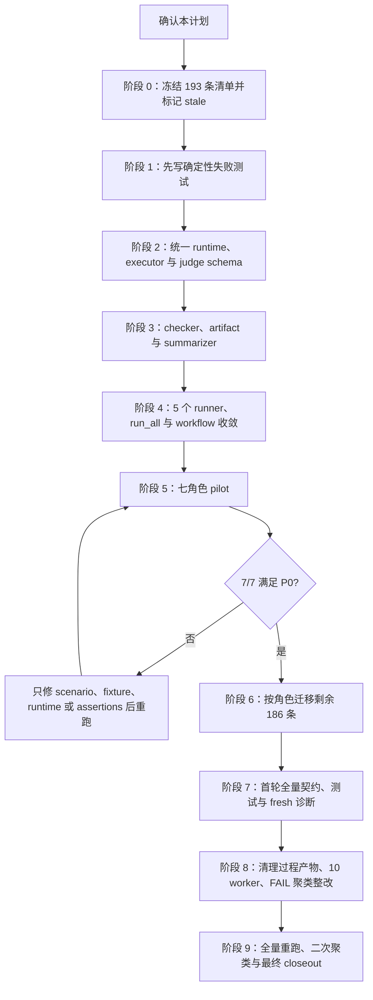

# Eval 真实场景与 Lane 隔离重构实施计划

## 1. 实施上下文与门禁

本计划承接 Issue #246，仅落实已批准的 eval 真实场景、lane 隔离、fresh paired
执行、独立 judge 与 durable comparison 重构。维护者已于 2026-08-07 明确确认按本计划实施，
代码、测试、pilot 与批量资产迁移门禁已解除。

| 门禁 | 结论 | 证据 |
| --- | --- | --- |
| PRD 对齐 | `already_approved` | PRD `1.1.0` 为 Approved；DECISIONS `1.0.0` 无冲突 |
| TRD 对齐 | 已通过 | TRD `1.2.0` 为 Approved，清理、并发与 FAIL 聚类范围已对齐 |
| Feature path | 已通过 | PRD、TRD 与本计划的 `feature_path`、`parent_feature`、`feature_level` 一致，TRD `related_prd` 正确 |
| 变更等级 | `major` | 覆盖七角色、38 个 skill、runner/checker 契约和 193 条 eval |
| 实施确认 | 已通过 | 维护者于 2026-08-07 回复“确认按计划实施” |
| Active plan / archive | 无 | 本路径此前无 `IMPLEMENTATION_PLAN.md`，也无 `implementation-plans/archive/` 历史；不写 `previous_plan_archive` |
| UI 设计 | 不适用 | 本次只改 CLI、脚本、测试与 eval 资产，不改产品 UI、交互或视觉系统 |

来源文档：

- `docs/pm/repository-governance/eval-scenario-isolation/PRD.md`
- `docs/pm/repository-governance/eval-scenario-isolation/DECISIONS.md`
- `docs/engineer/repository-governance/eval-scenario-isolation/TRD.md`

## 2. 成功标准与收紧边界

### 2.1 成功标准

1. 冻结 38 个常规 skill、193 条旧 eval，迁移清单逐条记录旧 ID、角色、skill、
   `retained` / `merged` / `deleted` 结论、理由、替代覆盖、pilot 标记、迁移状态和
   durable comparison；三类结论之和必须为 193。
2. 旧 comparison 在新契约重跑前统一为 stale / `BLOCKED`，汇总器不得把历史 PASS
   计作当前 release 证据。
3. 共享运行时从同一 canonical fixture 物化两个互相不可见的独立 Git 根、`HOME`、
   `CODEX_HOME`；两条 lane 唯一变量为目标 skill 是否加载。
4. Preflight 对 fixture、prompt、排除项、skill 可见性、源码边界、模型、六类 runtime
   surface 和 judge freshness 全部给出确定结论；任一失败或未知均为 `BLOCKED`。
5. 七角色 pilot 先达到 7/7；门禁通过后才迁移剩余 186 条旧 eval。
6. 每个 retained eval 都使用本轮 fresh `without_skill`、fresh `with_skill`、第三个
   fresh Luna medium judge，并更新 durable comparison；merged/deleted 记录理由和替代
   evidence，不伪造 paired run。
7. 193/193 有去向，全部 retained 为 complete，所有契约、确定性测试和 artifact 检查
   通过，Git 跟踪的 runtime artifact 为 0。
8. 每个 worker 无论 PASS、FAIL、BLOCKED 或异常都删除完整 runtime root；CI 不上传运行期
   树，仓库和 `tmp/eval-runs/` 最终只保留 durable `comparison.md` 所表达的结论。
9. 全部已确认 FAIL 根因先完成修改，随后以最多 10 个跨角色 worker 重跑；单条 eval 内的
   fresh without、fresh with、fresh judge 顺序不变，最终无未解释 FAIL/BLOCKED。

### 2.2 改动量级

- 最终生产执行面由 3,023 行增至 4,436 行，净增加 1,413 行；口径覆盖 workflow、薄
  runner、共享 runtime/executor/schema、checker 与 summarizer。增量对应 OS permission
  profile、单上下文顺序、可信 Git topology、离线依赖物化、原始 Git 证据、source input
  锁定、双文件事务、冻结 inventory 与兼容门禁。
- 最终确定性测试面由 4,562 行增至 5,189 行，净增加 627 行；六套旧 runner 重复测试已
  删除，共享测试补齐隔离、Git/ref、依赖完整性、事务、source drift、output gate 和 checker
  故障注入。
- 相对冻结 commit 的工作树涉及 885 个路径条目，其中 705 个 tracked 变更、180 个新文件；
  范围包含 38 份 `evals.json`、193 份 metadata、193 份 comparison、迁移 inventory、共享
  基础设施、测试和经逐条审查的宿主 fixture。
- 193 份常规 durable comparison 最终只保留最新一轮可审查结论；旧轮次由 Git 历史追溯，
  不再把 superseded comparison 递归嵌入当前文件。
- 实际量级高于阶段 1 至 4 的早期估算；最终范围未加入重试、缓存、feature flag、hook 或
  与 Issue #246 无关的业务抽象，增量均由隔离与证据契约的验收缺口直接触发。

### 2.3 禁止区

- 不修改与 fresh FAIL 无关的 skill 行为；允许按 durable assertion evidence 最小补齐已有
  仓库契约、路由、门禁、证据或产物要求，并逐项记录对应失败。
- 不修改或迁移 `agents/docs/test/manual-gen/`；`manual-gen` 保持唯一 manual-only 例外。
- 不提交 `with_skill/`、`without_skill/`、`baseline/`、`outputs/`、`diagnostics/`、
  `snapshots/`、`preflight/`、transcript、candidate output、judge verdict、timing、run status
  或 `comparison.auto.md`。
- 不新增重试、缓存、降级、feature flag、通用 hook、额外配置层、监控或日志层。
- DECISIONS 保持不变；PRD、TRD 与本计划只同步维护者明确追加的清理、并发和 FAIL 整改
  范围，不顺手重构无关代码。
- 不把模型 eval 设为 required status check，不新增 Release CI 或发布能力。

## 3. 依赖顺序



后续阶段不得绕过前置门禁；pilot 失败或模型不可用时保留 stale / `BLOCKED`，不得复用历史
baseline、降低 assertions 或静默更换模型。

## 4. 文件与文件组

| 文件或文件组 | 操作 | 计划内容 |
| --- | --- | --- |
| `docs/engineer/repository-governance/eval-scenario-isolation/migration-inventory.json` | 新增 | 冻结 193 条旧记录、七角色/38 skill 计数、disposition、替代覆盖、runner 审计和迁移状态 |
| `scripts/test_eval_runtime.py` | 新增 | materializer、manifest/hash、目录/Git/HOME 隔离、skill overlay、preflight、cleanup 测试 |
| `scripts/test_run_skill_eval.py` | 新增 | 同 prompt、candidate 顺序、BLOCKED、judge freshness/schema、Overall 重算、认证边界、10 worker 上限和全异常路径 cleanup 测试 |
| `agents/test_eval_contract.py` | 修改 | scenario、自然 prompt、fixture 泄漏、metadata、inventory 193/193 与 fresh comparison 正反测试 |
| `scripts/test_check_eval_artifacts.py` | 新增 | snapshot/preflight/judge 等新增 runtime 名称的 tracked-file 正反测试 |
| `scripts/test_summarize_eval_results.py` | 修改 | stale/BLOCKED 不计 PASS、合法两维结果和旧格式兼容测试 |
| 六个现有 runner 测试 | 修改 | 更新 designer、devops、docs、PM `run_eval` / `transcript_runner`、QA 的薄入口与泄漏回归断言 |
| `scripts/eval_runtime.py` | 修改 | canonical fixture、排除、hash、独立临时根/Git/HOME/CODEX_HOME、skill overlay、preflight 和 cleanup 的唯一实现 |
| `scripts/run_skill_eval.py` | 新增 | 读取自然 prompt；单 eval 串行 paired，批量最多 10 worker；durable 写锁后在 `finally` 删除完整 runtime root |
| `scripts/eval_judge_result.schema.json` | 新增 | assertion verdict、Behavior、Coverage、Overall、blocker/failure/next step 的严格 schema |
| `scripts/check_eval_contract.py` | 修改 | scenario、prompt/fixture 泄漏、metadata、inventory 和 fresh comparison 契约 |
| `scripts/check_eval_artifacts.py` | 修改 | 覆盖统一 runtime 新产物、目录和文件名 |
| `scripts/summarize_eval_results.py` | 修改 | 区分 stale/BLOCKED 与当前 fresh 结论，阻止旧 PASS 进入当前汇总 |
| 五个角色 `run_eval.py` | 修改 | designer、devops、docs、product_manager、qa 仅保留兼容 CLI 或确定性 post-run 检查，转发统一 executor |
| `agents/product_manager/test/idea-to-spec/transcript_runner.py` | 修改 | 删除全 `agents/` mirror、共享 HOME 和自有 paired 物化，改由 PM 兼容入口调用共享实现 |
| 三个 `run_all_evals.py` | 修改 | designer、docs、qa 只枚举目标并逐条调用统一入口，不持有隔离规则 |
| `.github/workflows/evals.yml` | 修改 | 目标扩展至七角色，支持 agent/skill/eval 精确选择，调用 `--jobs 10` 且不上传 runtime tree |
| `agents/{role}/test/{skill}/evals/evals.json`（38 份） | 修改 | 增加 scenario，重写自然 prompt 与语义 assertions，保留旧 ID 到新 ID 映射 |
| `agents/{role}/test/{skill}/**/eval_metadata.json`（193 份） | 修改 | 增加显式 skill dependencies、六类 runtime isolation；移除 prompt 和脚手架重复信息 |
| 对应 `comparison.md`（193 份） | 修改 | 先冻结为 stale/BLOCKED；retained 完成 fresh run 后写 preflight、paired、judge 与两维结果 |
| 对应 README/fixture（按审计，最多 193 组） | 修改/删除 | 只保留宿主原生事实；移除答案材料、脚手架、历史输出和 assertion 同义提示 |

“六个现有 runner 测试”指
`agents/designer/test/test_designer_run_eval.py`、
`agents/devops/test/test_devops_run_eval.py`、
`agents/docs/test/test_docs_run_eval.py`、
`agents/product_manager/test/idea-to-spec/test_pm_run_eval.py`、
`agents/product_manager/test/idea-to-spec/test_transcript_runner.py` 和
`agents/qa/test/test_qa_run_eval.py`。

## 5. 分阶段实施步骤

### 阶段 0：冻结基线与旧结论

1. 从当前 38 份 `evals.json` 生成 193 条 immutable old-eval 基线，核对角色计数为
   designer 11、devops 15、docs 46、engineer 38、product_manager 50、qa 15、security 18。
2. 逐条给出初始 `retained` / `merged` / `deleted` 结论；merged/deleted 必须同时记录
   reason 与 replacement refs，retained 在 fresh 证据完成前保持 pending。
3. 把 193 份旧 comparison 的当前结论统一改为 stale / `BLOCKED`，保留历史正文；
   inventory 与 comparison 路径必须一一可定位。
4. 记录五个角色 runner、PM transcript runner、三个 run_all 和 workflow 的泄漏审计字段，
   未审计项不得标记 complete。

验证：inventory 总数、唯一 ID、角色/skill 计数和 comparison 路径人工复核为 193/193；
阶段 3 的 checker 完成后用机器检查替代人工复核。

### 阶段 1：先写确定性测试

1. 新增 runtime 与 executor 测试，先覆盖相同 fixture/prompt、不同 Git/HOME/CODEX_HOME、
   精确 skill overlay、source/sibling 不可见、runtime unknown 即 BLOCKED、candidate 完成后才
   建 judge、schema 与 Overall 组合规则。
2. 扩展 contract、artifact、summarizer 和六个 runner 测试，加入已知 QA prompt/cwd 泄漏、
   PM 全 skill mirror/共享 HOME 泄漏、非法 README、合法宿主 README、虚假 inventory complete
   与 stale PASS 误汇总的回归用例。
3. 先运行新增/修改测试并记录预期失败原因；失败必须对应尚未实现的 TRD 行为，不能以删测试
   或弱化断言消除。

验证命令：

```bash
uv run --with pytest pytest scripts/test_eval_runtime.py scripts/test_run_skill_eval.py \
  agents/test_eval_contract.py scripts/test_check_eval_artifacts.py \
  scripts/test_summarize_eval_results.py \
  agents/designer/test/test_designer_run_eval.py \
  agents/devops/test/test_devops_run_eval.py \
  agents/docs/test/test_docs_run_eval.py \
  agents/product_manager/test/idea-to-spec/test_transcript_runner.py \
  agents/product_manager/test/idea-to-spec/test_pm_run_eval.py \
  agents/qa/test/test_qa_run_eval.py
```

### 阶段 2：实现统一运行时、executor 与 judge schema

1. 扩展 `scripts/eval_runtime.py`，集中实现 canonical fixture exclusion、SHA-256 manifest、
   独立顶层临时根、Git 初始化、隔离 HOME/CODEX_HOME、认证文件权限、skill overlay、preflight
   和销毁；不提供任意 hook 或角色扩展框架。
2. 新增 `scripts/run_skill_eval.py`，按 agent/skill/eval ID 精确解析同一条 prompt，先
   `without_skill` 后 `with_skill` 串行执行；只在两条输出及 diff/manifest 锁定后创建第三个
   只读 judge package。
3. 新增 judge JSON Schema，由 executor 校验 assertion verdict 和 Behavior/Coverage，重算
   Overall；preflight 失败直接返回 `BLOCKED`，不调用 candidate 或 judge 伪造 PASS。
4. Candidate 调用固定使用全局 approval flag：

```text
codex --ask-for-approval never --strict-config exec -C <lane-root> \
  --ephemeral --ignore-rules \
  --model gpt-5.6-luna -c model_reasoning_effort="medium"
```

5. Candidate 的隔离 `CODEX_HOME/config.toml` 选择 `eval-candidate` permission profile，
   只开放当前 workspace 与隔离 HOME 写入并拒绝源码、sibling 和认证读取；Judge 使用
   `eval-judge` 只读 profile 与 `--output-schema scripts/eval_judge_result.schema.json`。
   Candidate 与 judge 均不得静默换模型。

验证：阶段 1 的 runtime/executor 测试全部从预期失败转为通过；源仓库、用户 home、另一条
lane 与目标外 skill 不进入 candidate-visible tree。

### 阶段 3：收紧 checker、artifact 与 summarizer

1. `check_eval_contract.py` 校验 scenario 七字段、自然 prompt 硬禁用模式、candidate fixture、
   `skill_dependencies`、六类 runtime isolation、inventory 193/193 与 fresh comparison。
2. 静态规则只拦截高置信泄漏；合法业务词与宿主原生 README 必须有反例测试，语义“活人感”
   保留人工 review，不用关键词伪装模型判分。
3. `check_eval_artifacts.py` 覆盖新增 snapshot/preflight/judge 包及所有既有 runtime 名称。
4. `summarize_eval_results.py` 只把具备 fresh preflight/judge 的当前结论计入 PASS；stale
   comparison 继续可解析但只能汇总为 BLOCKED。

验证：阶段 1 对应 checker/artifact/summarizer 测试通过，并运行：

```bash
uv run scripts/check_eval_contract.py
uv run scripts/check_eval_artifacts.py
uv run scripts/summarize_eval_results.py
```

### 阶段 4：收敛 runner、run_all 与 workflow

1. 五个角色 `run_eval.py` 删除 prompt/judge 构造、fixture 复制、lane HOME 和判定重复实现；
   保留兼容参数与确有 deterministic output 时的最小 post-run 检查。
2. PM `transcript_runner.py` 删除全 skill mirror、共享 HOME/CODEX_HOME 和自有物化逻辑；
   PM `run_eval.py` 统一转发 `scripts/run_skill_eval.py`。
3. 三个 `run_all_evals.py` 只负责稳定枚举与传播退出码；Engineer/Security 直接使用统一入口，
   不新增角色 runner。
4. workflow 支持七角色及 agent/skill/eval 精确选择，安装并认证 Codex CLI 后调用统一入口
   `--jobs 10`；不上传 runtime tree，每条结束即删除过程产物。
5. 完成 runner 审计：消息来源、cwd、HOME/CODEX_HOME、skill overlay、fixture、assertion/expected
   output 可见性、runtime reset、judge freshness、artifact 落点全部有结论。

验证：六个 runner 回归测试通过；共享执行面按第 2.2 节的实测口径复核，无未说明的范围扩张。

### 阶段 5：七角色 pilot

按以下冻结旧 ID 各迁移一条：

| 角色 | Pilot 种子 |
| --- | --- |
| designer | `ui-ux-design/eval-001-saas-dashboard` |
| devops | `deployment-planner/eval-002-python-api-only` |
| docs | `docs-agent/eval-001-route-formal-docs-sync` |
| engineer | `codebase-analyzer/eval-003-mapped-search-architecture` |
| product_manager | `idea-to-spec/eval-001-existing-project-feature-design` |
| qa | `bug-analyzer/eval-002-thin-evidence-suspected-bug` |
| security | `authz-reviewer/eval-001-rbac` |

每个 pilot 依次完成 scenario review、fixture 清理、metadata、两条 fresh candidate、preflight、
独立 judge 和 durable comparison。运行入口形式为：

```bash
uv run scripts/run_skill_eval.py --agent <role> --skill <skill> --eval <eval-id>
```

7/7 的 FR-002、FR-003、FR-005 至 FR-009 全部满足后才放行阶段 6。任一 pilot 失败只修正
scenario、fixture、runtime 或 assertions 并重跑；发现业务 skill 缺陷时另行建项。

### 阶段 6：按角色迁移剩余 186 条

1. 批次固定为 designer → devops → qa → security → engineer → docs → product_manager；
   每个角色形成独立可回滚提交边界。
2. 对剩余 186 条逐条 review 并更新 inventory。每个 retained eval 单独执行 fresh Luna medium
   `without_skill`、fresh Luna medium `with_skill`、第三个 fresh Luna medium judge，并更新对应
   comparison 后才标记 complete。
3. merged/deleted 不执行虚假的 paired run，但必须记录 reason、replacement refs 和对应 durable
   evidence；没有替代覆盖时不得使用 merged/deleted。
4. 每个角色批次结束即运行 eval contract、artifact checker、summarizer 和相关确定性测试；
   任一失败停止下一角色，不跨批次掩盖失败。
5. 模型、认证或 runtime isolation 不可用时对应项保持 stale / `BLOCKED`；不复用历史 baseline，
   不把 transcript、verdict、diagnostics 或 workspace snapshot 纳入 Git。

### 阶段 7：最终验证与 closeout

按 CI 顺序执行：

```bash
uv run scripts/check_repository_contract.py
uv run scripts/check_eval_contract.py
uv run scripts/check_eval_artifacts.py
uv run scripts/check_doc_contract.py
uv run --with pytest pytest scripts/test_eval_runtime.py scripts/test_run_skill_eval.py \
  agents/test_eval_contract.py scripts/test_check_eval_artifacts.py \
  scripts/test_summarize_eval_results.py \
  agents/designer/test/test_designer_run_eval.py \
  agents/devops/test/test_devops_run_eval.py \
  agents/docs/test/test_docs_run_eval.py \
  agents/product_manager/test/idea-to-spec/test_transcript_runner.py \
  agents/product_manager/test/idea-to-spec/test_pm_run_eval.py \
  agents/qa/test/test_qa_run_eval.py
uv run scripts/summarize_eval_results.py
git ls-files agents tmp/eval-runs | \
  rg '(^|/)(with_skill|without_skill|baseline|outputs|diagnostics|snapshots|preflight)(/|$)|comparison\.auto\.md|transcript\.md|candidate-output\.md|subagent-verdict\.md|timing\.json|run_status\.json'
git diff --check
git status --short
```

最后一个 `rg` 命令预期无输出；其退出码为 1 表示零命中。Closeout 前还须核对：inventory
为 193/193、七角色 pilot 为 7/7、全部 retained complete、旧 stale PASS 未进入当前汇总、
生产/测试/资产量级符合第 2.2 节、禁止区零 diff。完成后再把本计划状态更新为
`Implemented`，记录实际文件、逐条命令结果、模型 eval comparison、剩余风险和 QA/下一责任人；
归档仍需维护者另行批准。

### 阶段 7 首轮诊断结果

- Inventory 为 193 retained / 193 complete / 0 pending；38 个 skill 分组的 durable
  comparison 均为本轮 fresh 证据，汇总为 59 PASS、9 PASS (partial coverage)、125 FAIL、
  0 BLOCKED。
- 每条 eval 均使用 `gpt-5.6-luna`、`model_reasoning_effort="medium"` 完成 fresh
  `without_skill`、fresh `with_skill` 与第三个独立 judge；同一 eval 内严格按顺序执行。
- `check_repository_contract.py`、`check_eval_contract.py`、`check_eval_artifacts.py` 与
  `check_doc_contract.py` 全部通过；精确 CI 清单为 273 passed、10 subtests passed。
- Workflow YAML、Python compile、tracked/untracked whitespace、禁止区和当时的 tracked
  runtime artifact 检查通过；首轮结果随后作为 FAIL 聚类输入，不再代表最终 closeout。
- 125 个 FAIL 重叠聚类为路由/handoff 43、gate/authority 56、证据核验 42、产物完整性 43，
  另有少量网络不可用、空材料和 Git 初始状态不成立的 fixture 设计错误。
- 维护者于 2026-08-08 明确要求继续处理全部 FAIL，并把过程产物清理与 10 并发加入同一
  closeout；因此本计划由 `Implemented` 重开为 `Draft` 活动计划，不归档。

### 阶段 8：过程产物、并发与 FAIL 整改

1. 已删除 ignored 的 `tmp/eval-runs/` 历史运行树约 7.5 GB；`AGENTS.md`、runner 和 workflow
   已统一为每条结束删除完整 runtime root，CI 不再上传过程树。
2. `run_skill_eval.py` 已增加 1 至 10 worker 批量调度和 durable 写锁；20 个假目标验证峰值
   为 10，单目标 paired 顺序保持不变。Runtime/runner/artifact 定向测试为 73 passed。
3. 已按首轮 evidence 补齐七角色 router、门禁、mapped-doc evidence、durable artifact 和
   closeout 要求；跨 skill 共享契约路径改为安装态依赖路径，避免 source repository OS deny。
4. 已修正不可能 fixture：delivery 使用真实未提交 patch topology；计划生成用例获得真实
   PRD/TRD；GitHub/changelog/roadmap/battlecard 使用用户提供的原始离线导出；成功的
   docs-audit pre-tag 场景补齐 Release Notes owner handoff。
5. skills-lock、全静态契约与确定性测试均已完成；此阶段完成后才启动模型 eval。

### 阶段 9：10 worker 全量重跑与最终 closeout

1. 静态门禁通过后以 10 worker 跨七角色完成 193 条 eval；每条内部严格执行 fresh without、
   fresh with 与 fresh read-only judge，最终为 193/193 FRESH、0 BLOCKED。
2. 最终分布为 91 PASS、55 PASS (partial coverage)、47 FAIL。47 个行为 FAIL 已按角色聚合为
   GitHub Issue #249 至 #255，后续分别判断 eval 是否偏离 skill 设计、skill 是否存在执行缺陷，
   或是否属于模型波动；它们不再作为 Issue #246 的基础设施或迁移阻塞。
3. Inventory 为 193 retained / 193 complete / 0 pending；四类 contract、完整确定性测试、
   whitespace、YAML、Python compile、禁止区和 runtime artifact 检查均通过。

### 阶段 10：Durable comparison 最新结果归一化

1. 先把共享 writer 回归改为要求每份 comparison 只有一个 `Overall result`，并确认旧实现因
   递归保留 historical context 而失败；随后移除 writer 的历史正文拼接。
2. 193 份常规 comparison 全部删除 `Historical Context (Superseded)`，只保留最新 FRESH
   结论；结果分布保持 91 PASS、55 PASS (partial coverage)、47 FAIL，`manual-gen` 不变。
3. 维护者明确要求本次不重新执行模型 eval。文件中的 normalization note 说明本次只做
   durable 格式归一化；candidate、judge 与既有结果没有被伪装成新一轮运行。
4. `scripts/test_run_skill_eval.py` 为 33 passed；完整确定性测试为 284 passed、10 subtests
   passed；repository、eval、artifact、doc 四项 contract 与 summarizer 全部通过。

## 6. Sub-Agent 分工

本任务触发复杂分工：跨七角色、至少 425 个资产文件，且必须把实现与验证上下文分离。

| 角色 | 范围 | 边界 |
| --- | --- | --- |
| 主进程 | 保留 PRD/TRD、inventory、阶段门禁、提交边界和 closeout 上下文 | 不把门禁判断外包，不允许多个 agent 同时修改同一文件组 |
| 基础设施实现 sub-agent | 阶段 1 至 4 的 runtime、executor、schema、checker、runner 与测试 | 只按本计划文件组修改，不接触 eval 业务资产和 skill 协议 |
| 角色迁移 sub-agent | Pilot 通过后按单一角色批次迁移 eval 资产 | 每条先读目标 skill 契约；只改该角色 test 资产、inventory 对应记录和 comparison |
| 独立验收 sub-agent | 使用全新只读上下文核对来源文档、diff、测试结果、inventory、禁止区和残余风险 | 不实现修复、不接受被测 lane 自评；发现问题回交对应实现批次 |

角色迁移可串行复用 sub-agent，但不得并发改 inventory；主进程在每批回收后统一写入 inventory
和 closeout。Fresh candidate/judge 是 eval 证据链，不替代独立工程验收 sub-agent。

## 7. 阶段回滚点

| 回滚点 | 触发条件 | 回滚动作 |
| --- | --- | --- |
| R0：冻结后 | inventory 计数或旧 comparison 映射错误 | 修正 inventory 与 stale 映射；不得恢复旧 PASS 的 release 有效性 |
| R1：共享基础设施后 | 隔离测试或 checker 不能稳定通过 | 回滚 runtime/executor/checker 代码，但保留 inventory 与 stale 状态 |
| R2：runner 收敛后 | 薄 runner 与共享 runtime 不兼容 | 在同一回滚中恢复全部受影响 runner 与共享入口，禁止新旧隔离语义并存 |
| R3：pilot 后 | 任一角色未满足 P0 | 停止批量迁移，只重做失败 pilot；已完成 durable evidence 保留 |
| R4：角色批次后 | 批次出现契约、模型或资产问题 | 仅回滚该角色批次的 eval 资产与 inventory 状态，前序已通过角色不重跑 |
| R5：closeout 前 | 193/193、artifact 或禁止区检查失败 | 保持计划 Draft、未完成项 stale/BLOCKED，修正后重跑最终验证 |

`tmp/eval-runs/` 可删除并重新生成，不用于恢复 durable comparison。所有回滚以 Git 提交边界
恢复仓库事实，不从 runtime artifact 回填结果。
