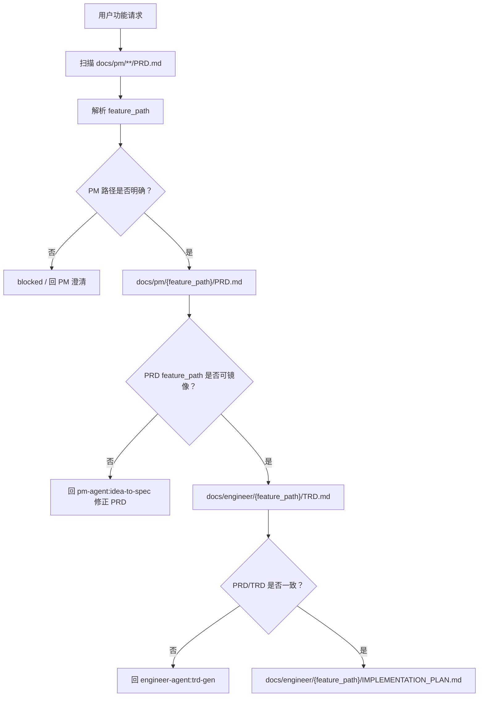

# PRD/TRD 多级功能目录契约 TRD

## 1. 来源上下文

本 TRD 承接 `docs/pm/repository-governance/feature-path-contract/PRD.md` 和 GitHub issue #37。PM 范围已经明确：将 `{feature-name}` 升级为允许多级的 `{feature_path}`，并防止 PRD、TRD、`IMPLEMENTATION_PLAN.md` 生成到错误的并列目录。

GitHub issue #197 进一步要求在 PRD/TRD 跨越多个明确子功能边界时形成 L2b 拆分提案，并新增只读的跨角色功能树梳理入口。拆分评估、报告生成和实际结构变更必须分离：前两者只读，后者在用户确认后按 `major` 执行。

issue #197 的当前实施范围是更新已确认的 skill 指令、路由、PRD/TRD 和锁文件，并新增两项 eval（`eval-009-prd-iteration-split-proposal`、`eval-016-route-document-structure-governance`，fresh 验证均 PASS/FULL）；不实际拆分、移动宿主文档目录。

## 2. 技术概览

本变更通过统一 feature path 数据模型、生成前扫描、路径镜像、frontmatter 字段和 blocked/handoff 门禁，约束 PM 到 Engineer 再到 Implementor 的文档链路。



核心规则：

- `feature_path` 是跨 PM、Engineer、Design、QA、DevOps、Security 的功能归属主键。
- `feature_path` 支持一个或多个目录段，目录段使用仓库现有 lower kebab-case slug 风格。
- PRD 是 feature path 的产品归属来源；TRD 和实施计划必须镜像 PRD。
- API 文档和 ADR 是 Engineer-owned 产物；PM 只 handoff 产品范围、接口目标和技术决策背景。
- 缺 PRD 回 PM；缺 TRD、TRD stale 或 TRD 路径不一致回 `trd-gen`。
- 旧单层目录视为一级功能，读取兼容，写入时补齐字段或按维护者确认迁移。
- 仓库自身 Agent/Skill 治理 PRD 保留 `docs/pm/agents/{agent}/skills/{skill}/PRD.md` 的 `skills` 目录段；该路径按统一多级口径处理。
- `repository-governance/...` 和 `agent-collaboration/...` 是合法顶层 namespace，分别承载仓库规则和跨 Agent 协作文档。
- `_legacy/` 只保存历史证据，不参与 canonical PRD/TRD/Plan 镜像校验，但必须具备 legacy frontmatter。
- L2a 只在同一 feature 目录拆支撑文档；L2b 命中任一信号时只生成子路径树、章节迁移映射和下游镜像影响清单，等待用户确认。
- `structure-governance` 只读扫描六个角色过程文档目录，在运行期 tmp 生成 HTML 报告；`docs/site/` 不在其职责范围。

## 3. Feature Path 数据契约

### 3.1 路径格式

| 项 | 规则 |
| --- | --- |
| 名称 | `feature_path` |
| 层级 | 1-N 级 |
| 分隔符 | `/` |
| 目录段 | lower kebab-case slug，例如 `chat-interface` |
| 示例 | `chat-interface`、`chat-interface/history-search`、`chat-interface/history-search/export/reporting` |
| 非法 | 空路径、空段、包含 `.` 或 `..`、绝对路径、重复斜杠、隐藏目录段、非 lower kebab-case 段 |

### 3.2 语义字段

| 字段 | 新建文档要求 | 旧文档兼容 | 说明 |
| --- | --- | --- | --- |
| `feature_path` | 必填 | 缺失时从目录路径推导 | 完整功能路径，作为主键。 |
| `feature` | 必填 | 现有值保留 | 兼容字段；新文档建议使用末级 slug，完整路径由 `feature_path` 表达。 |
| `parent_feature` | 必填 | 一级旧文档推导为 `N/A` | 父 feature path；一级功能为 `N/A`。 |
| `feature_level` | 必填 | 从路径段数推导 | 任意正整数，必须等于 `feature_path` 段数。 |
| `child_features` | PRD 必填 | 缺失时保留为 legacy 未声明 | 父 PRD 的直接子功能路径索引；没有直接子功能时为 `N/A`，不写入 TRD frontmatter。 |
| `related_prd` | TRD/Plan 必填 | 现有路径保留并校验 | 必须指向同一 `feature_path` 的 PRD。 |
| `related_trd` | Plan 必填 | 现有路径保留并校验 | 必须指向同一 `feature_path` 的 TRD。 |

Agent/Skill 治理 PRD 使用同一多级口径：`feature_path=agents/{agent}/skills/{skill}`、
`parent_feature=agents/{agent}/skills`、`feature_level=4`。解析器必须保留
`skills` 目录段，确保 canonical lookup 指向真实文件。

### 3.3 顶层 namespace 规则

| Namespace | 技术含义 | 路径规则 | 下游镜像 |
| --- | --- | --- | --- |
| `repository-governance/...` | 仓库级规则，包括目录契约、eval 证据规则、CI、repository contract 和 release preflight。 | 具体文档使用 `repository-governance/{topic}` 或更深路径；`parent_feature` 为去掉末段后的完整路径，二级主题可使用 `repository-governance`。 | `docs/engineer/repository-governance/{topic}/TRD.md`、`docs/qa/e2e/repository-governance/{topic}/...` 等使用同一 `feature_path`。 |
| `agent-collaboration/...` | 多个 Agent 之间的交接、分工、路由和协作门禁。 | 具体文档使用 `agent-collaboration/{topic}` 或更深路径；`parent_feature` 为去掉末段后的完整路径，二级主题可使用 `agent-collaboration`。 | `docs/engineer/agent-collaboration/{topic}/TRD.md`、`docs/design/agent-collaboration/{topic}/...` 等使用同一 `feature_path`。 |

校验规则：

1. 两个 namespace 的每个路径段仍必须通过 lower kebab-case slug 校验。
2. `repository-governance` 和 `agent-collaboration` 可作为保留父 namespace 使用；二级主题不要求存在同名根 PRD 才能通过父级校验。
3. 三级及更深路径的 `parent_feature` 必须等于去掉末段后的完整路径。
4. 下游 Design、QA、DevOps、Security 只能镜像已确认的完整 `feature_path`，不能截断为 topic 末段，也不能把同一主题改写成新的顶层目录。

### 3.4 交接包

PM 到 Engineer、Engineer 到 Implementor 的 handoff 包必须包含：

```yaml
feature_path: chat-interface/history-search
feature: history-search
parent_feature: chat-interface
feature_level: 2
feature_path_evidence:
  - source: docs/pm/chat-interface/PRD.md
    reason: Existing parent feature matched request context
  - source: https://github.com/Neplich/dev-agent-skills/issues/37
    reason: Multi-level feature path contract
source_documents:
  prd: docs/pm/chat-interface/history-search/PRD.md
  decisions: docs/pm/chat-interface/history-search/DECISIONS.md
handoff_target: engineer-agent:trd-gen
engineer_outputs:
  trd: docs/engineer/chat-interface/history-search/TRD.md
  api: docs/engineer/chat-interface/history-search/API.md
  adr: docs/engineer/chat-interface/history-search/ADR-001-search-index.md
```

### 3.5 L2b 拆分提案契约

PRD iteration、TRD iteration 和 `trd-gen` 在应用内容变更后、完成版本更新前，按以下任一信号启动评估：

1. 文档总行数大于 500 行。
2. 独立产品或技术领域数不少于 3 个。
3. PRD 的 `US-*` 与 `FR-*` 表格行数合计不少于 15 行。
4. 章节内容可明确归属不同子功能边界。

提案是只读中间结果，固定包含：以当前 feature 为根的建议子
`feature_path` 树、源章节到父/子文档的迁移映射，以及
`docs/pm`、`docs/engineer`、`docs/design`、`docs/qa/e2e`、`docs/devops`、
`docs/security` 的镜像影响清单。TRD 子树只能镜像已确认的 PRD 子树；
用户拒绝提案时保留当前路径并继续原版本流程。

## 4. 解析与扫描算法

### 4.1 PM 生成前扫描

`idea-to-spec`、`prd-gen`、`prd-iteration`、`iteration-coordinator` 和相关 PM generator 在写入 PRD、DECISIONS 或 PM draft 前执行：

1. 扫描 `docs/pm/**/PRD.md`，深度支持多级 feature path。
2. 读取每个 PRD 的 frontmatter：`feature_path`、`feature`、`parent_feature`、`feature_level`、`child_features`、`title`、`related_issue`、`related_docs`。
3. 对缺少 `feature_path` 的旧单层 PRD，从 `docs/pm/{feature}/PRD.md` 推导 `feature_path={feature}`、`feature_level=1`。
4. 根据用户请求、issue 标题/正文、现有 PRD 标题、DECISIONS 和目录路径判断是否属于已有父功能。
5. 只有在父功能证据明确或用户明确确认时，生成子路径。
6. 父功能归属不清时，输出 blocked 或最小澄清问题，不创建新顶层目录。

### 4.2 Engineer 镜像解析

`trd-gen` 在写入 TRD 前执行：

1. 读取 PM handoff 或 PRD frontmatter 的 `feature_path`。
2. 校验 `docs/pm/{feature_path}/PRD.md` 存在。
3. 校验 `feature_level` 与路径段数一致。
4. 校验 `parent_feature` 与路径父级一致；一级功能必须为 `N/A`。
5. 写入或更新 `docs/engineer/{feature_path}/TRD.md`。
6. TRD 的 `related_prd` 必须指向 `docs/pm/{feature_path}/PRD.md`。
7. 当接口契约或架构决策已稳定，写入或更新同目录下的 `API.md` 和 `ADR-*.md`。
8. 不调用 PM 内部 `api-gen` 或 `adr-gen` 生成 Engineer 文档。
9. 对 `repository-governance/...` 和 `agent-collaboration/...`，按保留 namespace 规则校验父级，不因缺少根 namespace PRD 而失败。

### 4.3 实施计划门禁

`feature-implementor` 在写入 `IMPLEMENTATION_PLAN.md` 前执行：

1. 读取 PRD 路径和 TRD 路径。
2. 校验 PRD 存在于 `docs/pm/{feature_path}/PRD.md`。
3. 校验 TRD 存在于 `docs/engineer/{feature_path}/TRD.md`。
4. 校验 PRD/TRD frontmatter 的 `feature_path`、`parent_feature`、`feature_level` 一致。
5. 校验 TRD `related_prd` 指向同一路径 PRD。
6. 校验目标实施计划路径是 `docs/engineer/{feature_path}/IMPLEMENTATION_PLAN.md`。

门禁结果：

| 情况 | 处理 |
| --- | --- |
| PRD 缺失 | 停止，回 `pm-agent:idea-to-spec` 生成或修正 PRD。 |
| PRD 缺少父级归属或 `feature_path` 不明确 | 停止，回 PM 澄清或更新 PRD。 |
| TRD 缺失 | 停止，回 `engineer-agent:trd-gen` 补 TRD。 |
| TRD stale、路径不一致或 `related_prd` 不匹配 | 停止，回 `engineer-agent:trd-gen` 修正 TRD。 |
| 多级目录缺失但 PRD/TRD 均已确认且路径一致 | 允许创建目标 Engineer 目录并写入实施计划。 |
| 用户要求跳过路径对齐 | blocked，不继续写实施计划或代码。 |

### 4.4 Debugger 和 QA 门禁

`debugger`、`qa-agent`、`spec-based-tester`、`regression-suite` 在现有功能变更、bug 修复或 E2E 文档更新前使用同一解析规则：

- 先定位 `feature_path`。
- 再读取 `docs/pm/{feature_path}/PRD.md`、`docs/engineer/{feature_path}/TRD.md` 和存在的 `docs/pm/{feature_path}/DECISIONS.md`。
- 如果需求变化，回 PM。
- 如果 PM 稳定但 TRD 缺失或冲突，回 `trd-gen`。
- 如果缺少已确认 `IMPLEMENTATION_PLAN.md`，不更新 E2E TC。

### 4.5 只读结构治理扫描

`structure-governance` 使用以下流程：

1. 递归扫描 `docs/pm`、`docs/engineer`、`docs/design`、`docs/qa`、
   `docs/devops`、`docs/security`，读取路径、frontmatter、标题、文档类型、
   `related_*` 和行数；不扫描 `docs/site/`。
2. 以 `docs/pm` 为归属来源构建功能树，再投影 Engineer、Design、QA E2E、
   DevOps 和 Security 镜像。QA E2E 只识别既有 `TEST_SUITE.md`、
   `FLOW_INDEX.md`、`cases/`、`scripts/`、`results/` 与 `_reports/` 资产。
3. 检测超长、并列错位、重复、孤儿、跨角色镜像缺失或漂移，并为每个
   finding 保存证据路径、判定依据和影响面。
4. 生成合并、L2a/L2b 拆分或移动建议；建议不修改任何源文档。
5. 将自包含 HTML 报告写入运行期 tmp 目录，并在对话中输出问题数量、
   高优先级结论、建议摘要和报告路径。

扫描和报告属于只读动作，不改变 `change_tier`；只有确认执行其中的结构
建议时，才按 `major` 进入正常 PRD/TRD iteration 和下游 owner 流程。

## 5. 目录镜像规则

| 文档类型 | 路径 |
| --- | --- |
| PM PRD | `docs/pm/{feature_path}/PRD.md` |
| PM DECISIONS | `docs/pm/{feature_path}/DECISIONS.md` |
| PM draft | `docs/pm/{feature_path}/design.md` |
| Engineer TRD | `docs/engineer/{feature_path}/TRD.md` |
| Engineer plan | `docs/engineer/{feature_path}/IMPLEMENTATION_PLAN.md` |
| Engineer API | `docs/engineer/{feature_path}/API.md` |
| Engineer ADR | `docs/engineer/{feature_path}/ADR-*.md` |
| Design docs | `docs/design/{feature_path}/...` |
| QA E2E | `docs/qa/e2e/{feature_path}/...` |
| DevOps report | `docs/devops/{feature_path}/...` |
| Security report | `docs/security/{feature_path}/...` |

目录段缺失的处理规则：

- 生成 PRD 时，如果父级 PRD 不存在且用户表达的是子功能，必须回 PM 澄清功能树，不直接创建并列顶层目录。
- 生成 TRD 时，如果 PRD 的 `feature_path` 指向嵌套目录但 PRD 文件缺失，必须回 PM。
- 生成 API 或 ADR 时，如果 PRD 未确认或 `feature_path` 不明确，必须回 PM；如果 PM 范围已确认，则由 `trd-gen` 在 `docs/engineer/{feature_path}/` 下生成，不使用 PM 内部生成器。
- 生成实施计划时，如果 PRD 或 TRD 缺失，分别回 PM 或 TRD；如果只有 Engineer 目标目录不存在，且 PRD/TRD 已确认一致，可以创建目录。
- 下游 Design、QA、DevOps、Security 不拥有 feature path 决策权；路径不清时回 PM/Engineer。

## 6. 兼容与迁移边界

### 6.1 旧单层兼容

已有 `docs/pm/{feature}/PRD.md`、`docs/engineer/{feature}/TRD.md` 和 `docs/engineer/{feature}/IMPLEMENTATION_PLAN.md` 在没有 `feature_path` 字段时，按一级功能处理：

```yaml
feature_path: <feature>
parent_feature: N/A
feature_level: 1
```

读取兼容不得因为缺少新字段而失败。新建文档必须写入新字段。实质更新旧文档时应补齐新字段，格式或错别字修正可不强制补齐。

### 6.2 误放目录迁移边界

当发现子功能已经被生成成并列一级目录时：

1. 不自动移动历史目录。
2. 先输出路径冲突分析，列出现有目录、期望目录、章节迁移映射、引用方和
   PM/Engineer/Design/QA E2E/DevOps/Security 镜像影响。
3. PM 目录移动前必须由维护者确认是否迁移及每个镜像的处理方式；没有确认
   时只阻止后续错误生成，并在 handoff 中记录冲突。
4. 目录移动和文件重命名使用 `git mv`，不得以新建文件后删除原文件替代。
   纯拆分时，承接原文档主体身份的文件也使用 `git mv`，新增子文档正常创建。
5. 迁移时同步 `feature_path`、`parent_feature`、`feature_level`、
   `related_docs`、其他 `related_*` 引用和父 PRD 子功能索引。
6. `archive/` 中的计划保持归档语义；QA `results/`
   历史只追加不覆盖。
7. 每个源章节必须可追溯到目标父/子文档，并在受影响文档 changelog 记录
   迁移，禁止静默丢失内容。

### 6.3 Legacy Artifact 归档规则

旧实施计划或缺少 owning PRD/TRD 的历史计划不作为 canonical 实施计划继续维护。处置顺序为：

1. 能明确归属父功能时，优先并入新的父功能路径，并同步 `related_prd`、`related_trd`、`feature_path`、`parent_feature`、`feature_level`。
2. 仅需保留历史证据时，归档到父功能目录下的 `_legacy/` 子目录：

   ```text
   docs/engineer/{parent_feature}/_legacy/{legacy_slug}/IMPLEMENTATION_PLAN.md
   ```

3. legacy 文件 frontmatter 必须包含：

   ```yaml
   legacy_of: "<parent_feature 或 canonical feature_path>"
   legacy_reason: "<保留为历史证据的原因>"
   superseded_by: "<canonical 文档路径或 N/A>"
   ```

4. repository contract 的 canonical PRD/TRD/Plan 扫描默认跳过 `_legacy/`，避免历史证据被误判为活跃计划。
5. repository contract 可增加独立 legacy 检查，只验证 `_legacy/` 文件的 `legacy_of`、`legacy_reason`、`superseded_by` 存在且非空。
6. `_legacy/` 下的文件不能作为 `related_trd`、QA E2E 或下游 Agent 的当前输入。

## 7. 影响文件范围

实施计划应覆盖下列文件类别，具体改动由 `feature-implementor` 在计划阶段拆分：

| 优先级 | 路径 | 预期改动 |
| --- | --- | --- |
| P0 | `agents/product_manager/skills/idea-to-spec/SKILL.md` | 将 feature document memory 和 deliverable shapes 从 `{feature-name}` 升级为 `{feature_path}`。 |
| P0 | `agents/product_manager/skills/idea-to-spec/_internal/_shared/skill-map.md` | Handoff packet 增加 feature path 字段和路径证据。 |
| P0 | `agents/product_manager/skills/idea-to-spec/_internal/_shared/gen-conventions.md` | 增加生成前扫描、父功能识别、no directory drift 规则。 |
| P0 | `agents/product_manager/skills/idea-to-spec/_internal/_shared/quality-rules.md` | 将 `> 500` 行 CRITICAL 指向 L2b 拆分评估出口。 |
| P0 | `agents/product_manager/skills/idea-to-spec/_internal/analysis/structure-governance/INSTRUCTIONS.md` | 新增六角色只读结构扫描与运行期 HTML 报告。 |
| P0 | `agents/product_manager/skills/idea-to-spec/_internal/_shared/output-conventions.md` | 定义 `docs/<agent-short>/{feature_path}/<DOC>.md` 和 frontmatter 字段。 |
| P0 | `agents/product_manager/skills/idea-to-spec/_internal/_shared/doc-schemas/*.md` | 为 PRD/DECISIONS/TEST_SPEC 等 schema 补 feature path 字段。 |
| P0 | `agents/product_manager/skills/idea-to-spec/_internal/gen/prd-gen/INSTRUCTIONS.md` | PRD 生成前扫描 `docs/pm/**/PRD.md`，路径不清时 blocked。 |
| P0 | `agents/product_manager/skills/idea-to-spec/_internal/iteration/prd-iteration/INSTRUCTIONS.md` | 更新已有 PRD 时校验路径和 frontmatter 一致。 |
| P0 | `agents/product_manager/skills/idea-to-spec/_internal/iteration/trd-iteration/INSTRUCTIONS.md` | 将 TRD 拆分评估和 PRD 镜像要求写入 Engineer handoff。 |
| P0 | `agents/product_manager/skills/pm-agent/SKILL.md` | 新增文档结构治理 request type 与只读/iteration 路由。 |
| P0 | `agents/engineer/skills/engineer-agent/SKILL.md` | Existing Feature Alignment Gate 改为 feature path。 |
| P0 | `agents/engineer/skills/trd-gen/SKILL.md` | TRD 输出路径和 handoff 语言升级为 `{feature_path}`。 |
| P0 | `agents/engineer/skills/trd-gen/_internal/trd-schema.md` | 增加 feature path frontmatter 和 `related_prd` 镜像校验。 |
| P0 | `agents/engineer/skills/feature-implementor/SKILL.md` | 实施前校验 PRD/TRD feature path 一致。 |
| P0 | `agents/engineer/skills/feature-implementor/_internal/planner/INSTRUCTIONS.md` | 写计划前执行 PRD/TRD/目录缺层门禁。 |
| P0 | `agents/engineer/skills/debugger/SKILL.md` | bug 对齐读取 `docs/pm/{feature_path}` 与 `docs/engineer/{feature_path}`。 |
| P1 | `agents/designer/**` | feature-scoped design docs 镜像 feature path。 |
| P1 | `agents/qa/**` | QA 消费 PRD/TRD/Plan 时使用同一 feature path；E2E 目录使用 `docs/qa/e2e/{feature_path}/`。 |
| P1 | `agents/devops/**` | feature-scoped DevOps 报告使用 feature path。 |
| P1 | `agents/security/**` | feature-scoped Security 报告使用 feature path。 |
| P1 | `skills-lock.json` | 如果 skill 文档发生变更，按仓库规则刷新 metadata。 |

## 8. Eval 覆盖

| Skill | Eval 场景 | 断言重点 |
| --- | --- | --- |
| `idea-to-spec` | 已有一级父功能 PRD，新需求为二级子功能。 | 生成 `docs/pm/{parent}/{child}/PRD.md`，不创建并列 `{child}`。 |
| `idea-to-spec` | 父功能归属模糊。 | blocked 或提出最小澄清，不写新顶层 PRD。 |
| `trd-gen` | 嵌套 PRD 输入。 | TRD 写入 `docs/engineer/{feature_path}/TRD.md`，`related_prd` 匹配。 |
| `feature-implementor` | PRD 存在但 TRD 缺失。 | 回 `engineer-agent:trd-gen`，不写 `IMPLEMENTATION_PLAN.md`。 |
| `feature-implementor` | PRD/TRD feature path 不一致。 | blocked 或 TRD gap handoff，不创建计划。 |
| `debugger` | bug 报告涉及已有二级功能。 | 按 feature path 读取 PRD/TRD；需求变化回 PM。 |
| `qa-agent` / `spec-based-tester` | E2E 文档更新来自嵌套功能实现。 | 引用同一路径 PRD/TRD/Plan，并写入 QA 功能树。 |
| legacy compatibility | 旧单层 fixture 无 `feature_path`。 | 作为一级功能读取，不误报缺字段。 |

issue #197 已新增并执行两项 eval：`eval-009-prd-iteration-split-proposal`（L2b 拆分提案入口）与 `eval-016-route-document-structure-governance`（结构治理路由入口）；fresh subagent 验证均为 Behavior PASS / Coverage FULL，durable `comparison.md` 已同轮更新。

## 9. 验证策略

实施完成后建议按以下顺序验证：

```bash
uv run scripts/check_repository_contract.py
```

针对本契约还应增加静态检查或人工审查：

```bash
rg -n "docs/pm/\\{feature-name\\}|docs/engineer/\\{feature\\}|docs/<agent-short>/<feature-name>" agents docs --glob "*.md"
rg -n "feature_path|parent_feature|feature_level" agents docs --glob "*.md"
find docs/pm -mindepth 2 -maxdepth 2 -name PRD.md -print
find docs/engineer -mindepth 2 -maxdepth 2 \( -name TRD.md -o -name IMPLEMENTATION_PLAN.md \) -print
rg -n "legacy_of:|legacy_reason:|superseded_by:" docs --glob "*/_legacy/**/*.md"
```

本 TRD 阶段不声称上述命令已经运行。命令是后续实施完成后的验证入口。

## 10. 发布与回滚

本变更是文档和 eval 契约升级，不新增运行时服务。发布通过普通 PR 合入：

1. 合入 PRD/TRD。
2. 由 `feature-implementor` 产出并确认实施计划。
3. 分模块更新 skill 文档、内部指令和 eval。
4. 刷新 `skills-lock.json`。
5. 运行仓库契约和 eval 契约检查。

回滚方式是普通 git revert。若已经迁移历史误放目录，回滚必须同步恢复引用路径，不能只回滚部分文档。

## 11. 安全与隐私

本变更不引入凭据、账号、token、cookie 或 SSH key。路径扫描只读取仓库内 Markdown 文档和 frontmatter。实现时不得把本地绝对路径、用户私有目录或运行期 scratch 路径写入正式 PRD/TRD/Plan frontmatter。

## 12. 风险、假设和待确认问题

| 类型 | 内容 | Owner | Blocking |
| --- | --- | --- | --- |
| Risk | 自动父功能匹配过度自信会把文档放入错误父目录。 | Engineer | Yes |
| Risk | 只更新 PM/Engineer，未更新下游消费方，会让 Design/QA/DevOps/Security 继续漂移。 | Engineer | Yes |
| Risk | 只更新文档不更新 eval，会导致规则后续回退。 | Engineer | Yes |
| Risk | 结构报告被当作移动授权，会让只读扫描越过确认门禁。 | PM | Yes |
| Decision | `feature_path` 支持多级统一口径；合法深度由功能树决定，不因超过三级而 blocked。 | Maintainer | No |
| Decision | `repository-governance/...` 和 `agent-collaboration/...` 是合法顶层 namespace；二级主题可使用保留 namespace 作为 `parent_feature`。 | Maintainer | No |
| Decision | 旧实施计划优先并入新的父功能路径；只作为历史证据保留时放入 `_legacy/` 并标记 `legacy_of`、`legacy_reason`、`superseded_by`。 | Maintainer | No |
| Assumption | 旧单层目录不批量迁移，只有确认误放、触及时补字段，或按 legacy artifact 规则归档。 | Maintainer | No |
| Decision | 新文档继续保留 `feature` 作为兼容字段；`feature_path` 是完整路径主键，一级功能时二者可以相同，嵌套功能时 `feature` 使用末级 slug。 | Engineer | No |
| Decision | L2b 任一信号只触发评估；提案确认前不执行拆分，拒绝后保持原路径。 | Maintainer | No |
| Decision | 结构建议执行按 `major` 处理，目录移动和重命名使用 `git mv`，不新增迁移脚本。 | Maintainer | No |

## 13. Feature-Implementor 交接条件

- Confirmed PRD path: `docs/pm/repository-governance/feature-path-contract/PRD.md`
- Confirmed TRD path: `docs/engineer/repository-governance/feature-path-contract/TRD.md`
- Expected implementation plan path: `docs/engineer/repository-governance/feature-path-contract/IMPLEMENTATION_PLAN.md`
- Boundary: issue #197 仅修改已确认的指令、路由、PRD/TRD 与锁文件，并新增 `eval-009-prd-iteration-split-proposal`、`eval-016-route-document-structure-governance` 两项 eval（fresh 验证均 PASS/FULL）；不执行真实文档拆分或迁移。
- Required implementation: 按 L2b、只读结构治理和受控移动契约更新指定 skill，并通过仓库确定性检查。
