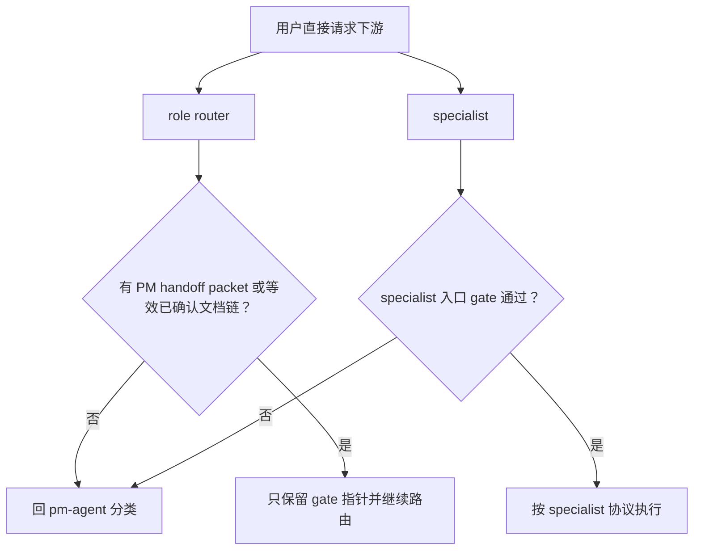

# PM 唯一入口 Batch 3 实施计划

## 1. 实施上下文

本计划实施 issue #52 的 Batch 3：在 Batch 1 完成公开发现面收口、Batch 2 完成
`pm-agent` 高召回分类与 handoff packet 后，继续处理下游入口 gate、#59 gate 去重和 #60
正文瘦身。

本批 `change_tier` 自判为 `major`：它修改多个 role router / specialist 的行为契约、
`AGENTS.md` 仓库指导和 PM 入口 eval。实施已在用户确认本计划后完成。



来源文档：

- PRD：`docs/pm/repository-governance/pm-single-entry/PRD.md`
- TRD：`docs/engineer/repository-governance/pm-single-entry/TRD.md`
- 分级与归档契约：`AGENTS.md`
- 关联 issue：#52、#59、#60、#61

## 2. 当前门禁状态

| 门禁 | 状态 | 证据 |
| --- | --- | --- |
| PRD 对齐 | 已完成 | PRD 覆盖 FR-004、FR-006 场景 7-8 |
| TRD 对齐 | 已完成 | TRD 第 4.3、4.4、6.2、8 节定义本批范围 |
| Feature path | 已解析 | `repository-governance/pm-single-entry` |
| 设计输入 | 不适用 | 本批为 skill / 文档契约变更，不涉及 UI |
| Archive gate | 不归档旧计划 | 当前目录无 archive；Batch 2 已合并但本 feature 仍在连续分批实施。归档需要 closeout 与维护者审批，本批先把活跃计划推进到 Batch 3 |
| Sub-agent 写计划 | 不启用 | 当前任务是单一实施计划更新；主进程保留 PRD/TRD/AGENTS 约束并在用户确认后实施 |

## 3. 范围

### 3.1 计划修改文件

| 类别 | 路径 | 实际操作 |
| --- | --- | --- |
| 仓库契约 | `AGENTS.md` | 收敛为 PM 唯一入口与 gate 指针声明；保留变更分级、QA E2E、archive 等仓库级规则，不复制 specialist 操作步骤 |
| Role router | `agents/engineer/skills/engineer-agent/SKILL.md` | 把 Existing Feature Alignment Gate 改为轻量指针；新增直接用户请求无 PM handoff 时回 PM 的统一规则 |
| Role router | `agents/designer/skills/designer-agent/SKILL.md` | Feature Path Gate 指针化；直接设计请求无 PM handoff 时回 PM |
| Role router | `agents/qa/skills/qa-agent/SKILL.md` | QA / E2E gate 指针化；保留 QA 路由摘要，完整 E2E 执行门禁下沉到 QA specialist 入口 |
| Role router | `agents/devops/skills/devops-agent/SKILL.md` | Feature Path Gate 指针化；repo-wide DevOps handoff 继续允许 `N/A` feature scope |
| Role router | `agents/security/skills/security-agent/SKILL.md` | Feature Path Gate 指针化；安全 review 无 PM handoff 时回 PM |
| Specialist gate | `agents/engineer/skills/feature-implementor/SKILL.md` | 保留并压缩 PRD alignment、UI design handoff、plan/archive/closeout gate；作为实现类 gate 权威副本 |
| Specialist gate | `agents/engineer/skills/debugger/SKILL.md` | 保留 expected-behavior / repair gate；无 PM handoff 或等效文档链时回 PM |
| Specialist gate | `agents/engineer/skills/project-bootstrap/SKILL.md`、`trd-gen/SKILL.md`、`test-writer/SKILL.md` | 保留各自最小前置门禁；避免复制 PM packet 字段清单 |
| QA specialist gate | `agents/qa/skills/spec-based-tester/SKILL.md`、`exploratory-tester/SKILL.md`、`bug-analyzer/SKILL.md`、`regression-suite/SKILL.md` | 保留 E2E / feature-scoped QA 的完整门禁；`qa-agent` 只指向这些权威副本 |
| 其他 specialist gate | Designer / DevOps / Security specialist `SKILL.md` | 只在已有 feature-path gate 处统一 PM handoff 与回 PM wording；不新增重复大段 gate |
| 正文瘦身样本 | `agents/product_manager/skills/idea-to-spec/SKILL.md` | 目标压到约 150 行；保留入口协议，阶段细节与示例下沉 `_internal` |
| 正文瘦身样本 | `agents/engineer/skills/feature-implementor/SKILL.md` | 目标压到约 150 行；gate 必须留在 SKILL.md，阶段执行细节下沉 `_internal` |
| 内部模块 | `agents/product_manager/skills/idea-to-spec/_internal/**`、`agents/engineer/skills/feature-implementor/_internal/**` | 承接从 SKILL.md 移出的阶段流程、模板和输出约定 |
| Eval | `agents/product_manager/test/pm-agent/evals/evals.json` 与 workspace | 补齐 FR-006 场景 7-8 的 durable eval 定义、workspace、comparison |
| Pytest | `agents/product_manager/test/pm-agent/test_pm_entry_eval.py` | 增加防绕过 deterministic 断言 |
| Contract | `scripts/check_repository_contract.py` | 兼容同一天内连续 Batch 修改同一实施计划时的 `version` / `last_updated` 检查，避免要求写未来日期 |
| Lock | `skills-lock.json` | 重算所有被修改 skill 目录的 `computedHash` |

### 3.2 明确不做

- 不修改 marketplace / README / installer 公开发现面；这些已由 Batch 1 完成。
- 不重新设计 PM handoff packet 字段；字段权威定义沿用 Batch 2 的 PM `_internal` 共享契约。
- 不新增 release CI、GitHub ruleset 或运行时强制拦截。
- 不执行 PR 合并；PR 创建后仍等待 Codex Review、CI 和维护者确认。

## 4. 实施顺序

### 4.1 Gate 去重与指针化

1. 先建立 gate 家族清单：
   - PM handoff packet 字段：权威副本在 PM `_internal` 共享契约。
   - 实现前 PRD/TRD/plan gate：权威副本在 `feature-implementor/SKILL.md`。
   - bug repair expected-behavior gate：权威副本在 `debugger/SKILL.md`。
   - bootstrap settled-spec gate：权威副本在 `project-bootstrap/SKILL.md`。
   - QA E2E / feature-scoped validation gate：权威副本在 QA specialist `SKILL.md`。
   - DevOps / Security / Designer feature path gate：权威副本在对应 specialist `SKILL.md`。
2. 更新 5 个 role router：
   - 只保留“PM handoff packet 或等效已确认文档链”的入口判断。
   - 没有 PM handoff 的直接用户请求，统一回 `pm-agent` 分类。
   - 具体执行 gate 只引用 specialist 权威副本，不复制步骤。
3. 更新 `AGENTS.md`：
   - 保留仓库级结论和路径规则。
   - 删除或压缩与 specialist gate 重复的操作性步骤。
   - 指向本 feature 的 TRD / specialist gate 作为执行细节来源。

### 4.2 Specialist gate 统一

1. 按 TRD 6.2 统一三段判断顺序：
   - 显式 PM handoff packet 完整时执行。
   - 无 packet 但存在等效已确认文档链时执行。
   - 二者都没有时不执行本 skill 协议，回 `pm-agent` 分类。
2. 保留各 specialist 的专业 gate：
   - `feature-implementor` 不直接接新需求、改功能或“帮我实现”原始请求。
   - `debugger` 不直接修未对齐预期的 bug。
   - QA specialist 不在预期未确认时固化 E2E 预期。
3. 避免在每个 specialist 重复 PM packet 字段清单；只引用 PM `_internal` 权威定义。

### 4.3 SKILL.md 瘦身

1. `feature-implementor/SKILL.md`：
   - 保留 frontmatter、职责、使用/拒绝条件、关键 gate、高层 phase、输出边界。
   - 将上下文读取细节、计划模板、实现步骤、自检模板、handoff 模板下沉到现有
     `_internal/planner`、`_internal/implementor`、`_internal/reviewer` 和 `_internal/_shared`
     模块。
   - gate 不下沉；只压缩文案。
2. `idea-to-spec/SKILL.md`：
   - 保留 Non-Negotiable Protocol、Operating Modes、Execution Lanes、Internal Routing
     Contract、Feature Document Memory 和高层 phases。
   - 将 workspace detection、lane playbooks、phase 细节、deliverable shapes、examples 下沉到
     `_internal/orchestration`、`_internal/gen` 和 `_internal/_shared`。
3. 目标：
   - 两个样本入口文件各自约 150 行。
   - 如果 `feature-implementor` 因 gate 必须留在入口文件导致略超，必须在 closeout 记录行数和原因。

### 4.4 Eval 场景 7-8

新增 FR-006 防绕过覆盖：

| 场景 | 验证点 |
| --- | --- |
| `eval-007-direct-downstream-without-handoff` | 直接点名 role router / downstream agent 且无 PM handoff packet 时，应回 `pm-agent` 分类 |
| `eval-008-direct-specialist-bypass-gate` | 绕过 router 直接触发 `feature-implementor` 等 specialist 时，specialist gate 仍执行并阻止直接实现 |

Deterministic pytest 至少检查：

- eval 定义、workspace、`comparison.md` 存在且符合 durable artifact 策略。
- role router SKILL.md 含统一 direct-request guardrail。
- `feature-implementor` / `debugger` / QA specialist 含无 handoff 回 PM 的 gate 行为。

Fresh subagent validation 仍按仓库 eval 门禁执行；若本批实际运行，则同步更新对应
`comparison.md`。

### 4.5 Contract 同日更新兼容

当前 `check_repository_contract.py` 要求 implementation plan 的 `version` 变化时
`last_updated` 字符串也必须变化，但 `last_updated` 又只能使用 `YYYY-MM-DD`。当 Batch 2 与
Batch 3 在同一天连续推进时，真实日期不能变化，不能通过写未来日期绕过。本批需要把该
校验调整为：同一天内只要 `version` 已更新、changelog 含对应版本条目，就接受
`last_updated` 保持当天日期。

## 5. Hash 重算

所有修改过的 skill 目录在提交前重算 `skills-lock.json`。命令：

```bash
uv run python - <<'EOF'
import json, importlib.util, sys
from pathlib import Path
spec = importlib.util.spec_from_file_location("checker", "scripts/check_repository_contract.py")
m = importlib.util.module_from_spec(spec)
sys.modules[spec.name] = m
spec.loader.exec_module(m)
root = Path(".")
lock_path = root / "skills-lock.json"
lock = json.loads(lock_path.read_text())
for name, entry in lock["skills"].items():
    entry["computedHash"] = m.compute_tracked_directory_hash(root, entry["source"])
lock_path.write_text(json.dumps(lock, indent=2, ensure_ascii=False) + "\n")
print("refreshed", len(lock["skills"]), "hashes")
EOF
```

## 6. 验证结果

| 验证项 | 命令 |
| --- | --- |
| diff 空白检查 | `git diff --check` -> PASS |
| 行数检查 | `wc -l agents/engineer/skills/feature-implementor/SKILL.md agents/product_manager/skills/idea-to-spec/SKILL.md` -> `feature-implementor` 152 行、`idea-to-spec` 147 行 |
| 仓库契约 | `uv run scripts/check_repository_contract.py` -> PASS |
| eval 契约 | `uv run scripts/check_eval_contract.py` -> PASS |
| eval 产物策略 | `uv run scripts/check_eval_artifacts.py` -> PASS |
| pm-agent eval pytest | `uv run --with pytest pytest agents/product_manager/test/pm-agent/test_pm_entry_eval.py -q` -> 6 passed |
| CI 同款 pytest | `uv run --with pytest pytest agents/product_manager/test/idea-to-spec agents/product_manager/test/pm-agent agents/qa/test/test_qa_run_eval.py agents/designer/test/test_designer_run_eval.py agents/devops/test/test_devops_run_eval.py agents/test_eval_contract.py` -> 91 passed |

## 7. 风险与缓解

| 风险 | 缓解 |
| --- | --- |
| gate 过度指针化导致直接触发 specialist 时失去拦截 | gate 权威副本必须留在 specialist `SKILL.md`，不移入 `_internal` |
| router 指针太弱导致合法 handoff 被反复拉回 PM | role router 保留 PM handoff packet / 等效文档链放行条件 |
| #60 瘦身删除了必要上下文 | 只下沉阶段细节与模板，不删除职责、gate、输出边界 |
| QA E2E gate 在 router 和 specialist 间漂移 | `qa-agent` 只保留路由和指针；QA specialist 保留执行门禁 |
| eval 场景 7-8 只测文本、不测行为 | 本批先补 deterministic 防回退；fresh subagent validation 如执行则更新 durable comparison |
| 同一天连续批次导致 `last_updated` 无法变化 | 小范围调整 repository contract，不写未来日期 |

## 8. 完成标准

- Batch 3 计划范围内文件已更新，未触碰 Batch 1 / Batch 2 已完成的公开发现面和 PM packet 字段定义。
- `feature-implementor` 与 `idea-to-spec` 入口文件显著瘦身，并记录最终行数。
- FR-006 场景 7-8 eval 定义、workspace、comparison 和 pytest 覆盖已补齐。
- `skills-lock.json` 已随受影响 skill 目录同步重算。
- 本地验证命令全部通过。
- PR 创建后通过 GitHub CI 和 Codex Review；如 Codex Review 提出问题，只追加 commit 修复并再次触发一次 `@codex review`。

## 9. Batch 2 已合并摘要

Batch 2 PR #72 已合并到 `main`，完成 `pm-agent` 高召回入口、请求分类、handoff packet
权威定义、FR-006 场景 1-6 eval 和多轮 Codex Review 修复。本批从该合并后基线继续，不再
重复修改 Batch 2 已确认的 PM packet 字段。

## 10. 实施 Closeout

最终状态：本地实施完成，进入 PR、CI 和 Codex Review 阶段。

已完成变更：

- `AGENTS.md` 增加 PM 唯一入口与下游 gate 指针规则，不复制 PM packet 字段或 specialist 操作步骤。
- 5 个 role router 改为轻量 PM handoff entry gate；直接用户请求缺少 PM handoff 或等效文档链时回 `pm-agent` 分类。
- Engineer、Designer、QA、DevOps、Security specialist 入口补齐 PM handoff gate，专业 gate 保留在对应 specialist 作为权威副本。
- `feature-implementor/SKILL.md` 瘦身至 152 行；因实现类 gate 必须保留在入口文件，略高于 150 行目标。
- `idea-to-spec/SKILL.md` 瘦身至 147 行；阶段细节保留在 `_internal` 模块。
- 新增 FR-006 场景 7-8 eval、workspace、durable `comparison.md`，并扩展 pm-agent deterministic pytest。
- `scripts/check_repository_contract.py` 兼容同日连续批次更新 implementation plan 时的 `version` / `last_updated` 合法状态。
- `skills-lock.json` 已全量重算 35 个 skill hash。

未运行项：

- Fresh Codex subagent validation 未在本批执行；本批只补 deterministic eval 与 durable comparison。后续若维护者要求运行模型 eval，需要按仓库 eval 门禁重新生成 with-skill 和 without-skill baseline，并同步更新 comparison。

剩余风险：

- 本批是文档与 skill 协议变更，行为执行仍依赖后续 Codex Review 和实际 agent 调用遵循这些入口 gate。
- `feature-implementor` 入口文件保留 152 行，是为了不把关键实现 gate 下沉到 `_internal` 后降低直接触发时的拦截强度。

下一 owner：

- 维护者 / PR 流程：等待 GitHub CI、Codex Review 和维护者确认后再合并；若 Codex Review 提出问题，只追加 commit 修复并再次触发一次 `@codex review`。

## 11. Codex Review 修复记录

2026-07-05 Codex Review 对提交 `7de025d` 提出两条 P2：

- `engineer-agent` 不应在用户明确 skip PM 并请求 `project-bootstrap` scaffold 时，先于 specialist override 把请求拉回 PM。
- `engineer-agent` 不应把 `trd-gen` 路径要求成 PRD + TRD + confirmed implementation plan；TRD 创建路径应允许 confirmed PM docs + stable feature path 作为 specialist entry basis。

修复结果：

- `engineer-agent/SKILL.md` 的 PM handoff entry gate 改为按 selected specialist entry basis 判断。
- 明确 `trd-gen` 可从 confirmed PM documents 与 stable feature path 进入，即使 Engineer TRD 尚不存在。
- 明确 `project-bootstrap` 在用户显式 skip PM and scaffold anyway 时可进入 specialist，由 specialist 自己处理 override 和最小 stack question。
- `test_pm_entry_eval.py` 新增 deterministic 断言覆盖这两个合法路径。

2026-07-05 Codex Review 对提交 `5b8c500` 提出一条 P2：

- FR-006 场景 8 的断言不应要求等价 PRD/TRD/IMPLEMENTATION_PLAN 文档链；`feature-implementor` 合法入口是在 PM scope 和 TRD 已确认后创建 `IMPLEMENTATION_PLAN.md`。

修复结果：

- `eval-008-direct-specialist-bypass-gate` 改为要求 PM handoff packet，或等价已确认 PRD/TRD 与当前 implementation scope。
- 场景 8 durable `comparison.md` 明确已存在 `IMPLEMENTATION_PLAN.md` 不是首次进入 `feature-implementor` planning 的前置条件。
