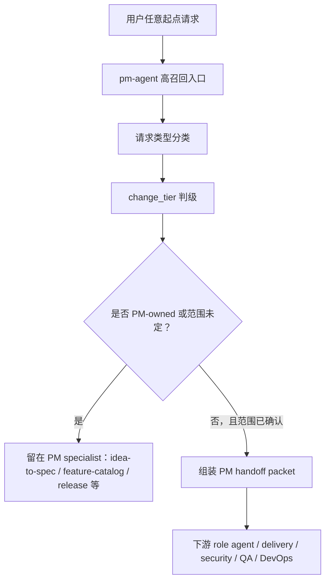

# PM 唯一入口 Batch 2 实施计划

## 1. 实施上下文

本计划实施 GitHub issue #52 的 Batch 2：在 Batch 1 已完成公开发现面收口后，补齐
`pm-agent` 作为唯一用户入口时必须承担的高召回分类、`change_tier` 判级和结构化 handoff
packet 组装能力。

本次变更的 `change_tier` 自判为 `major`：它修改 PM 入口 skill 协议和跨角色 handoff
契约面，按 `AGENTS.md` 的变更分级契约维持完整实施计划确认流程。

来源文档：

- PRD：`docs/pm/repository-governance/pm-single-entry/PRD.md`
- TRD：`docs/engineer/repository-governance/pm-single-entry/TRD.md`
- 分级契约：`AGENTS.md`
- Issue：`https://github.com/Neplich/dev-agent-skills/issues/52`
- 关联设计约束：`https://github.com/Neplich/dev-agent-skills/issues/59`、`https://github.com/Neplich/dev-agent-skills/issues/60`、`https://github.com/Neplich/dev-agent-skills/issues/61`

## 2. 当前门禁状态

| 门禁 | 状态 | 证据 |
| --- | --- | --- |
| PRD 对齐 | 已完成 | `docs/pm/repository-governance/pm-single-entry/PRD.md` 覆盖 FR-002、FR-003、FR-005 |
| TRD 对齐 | 已完成 | `docs/engineer/repository-governance/pm-single-entry/TRD.md` 第 6、8 节定义 Batch 2 范围 |
| Feature path | 已解析 | `repository-governance/pm-single-entry`，`parent_feature=repository-governance`，`feature_level=2` |
| 设计输入 | 不适用 | 本批为 skill 协议与文档契约变更，不涉及 UI / 视觉设计 |
| 实施计划 | 已实施 | 本文件 `status: "Implemented"` |

## 3. 范围

### 3.1 计划文件变更

| 路径 | 操作 | 目的 |
| --- | --- | --- |
| `agents/product_manager/skills/pm-agent/SKILL.md` | 修改 | 扩写并结构化 PM 唯一入口协议：高召回起点、请求类型分类、PM 处理动作、handoff 条件、`change_tier` 判级和 fast lane。 |
| `agents/product_manager/skills/idea-to-spec/_internal/_shared/skill-map.md` | 修改 | 在 PM `_internal` 共享模块中补齐跨角色 PM handoff packet 权威定义、必填字段、`feature_path_evidence` 结构和 downstream owner 映射。 |
| `skills-lock.json` | 修改 | 重算 `pm-agent` 与 `idea-to-spec` 的 `computedHash`。 |
| `docs/engineer/repository-governance/pm-single-entry/IMPLEMENTATION_PLAN.md` | 修改 | 实施完成后更新 closeout、验证结果、剩余风险和未运行项。 |

### 3.2 明确不做

- 不修改 README、README_zh、`.codex/INSTALL.md`、`docs/README.codex.md` 或
  `.claude-plugin/marketplace.json`：这些已由 Batch 1 覆盖。
- 不修改 5 个下游 role router、28 个 specialist gate 或 `AGENTS.md` gate 指针：这些属于
  Batch 3。
- 不新增或改造 FR-006 全量 eval fixture、contract 脚本或 durable `comparison.md`：这些属于
  Batch 4。若本批完成后需要实际运行 pm-agent fresh subagent validation，按仓库 eval 门禁另行确认并记录。

## 4. 实施流程

1. 更新 `pm-agent/SKILL.md`：
   - frontmatter description 保持高召回但控制长度，覆盖 PRD FR-002 九类用户起点。
   - 增加请求类型分类表，覆盖 `new_feature`、`existing_update`、`bug_report`、`design`、
     `validation`、`deployment`、`security`、`delivery`、`status`，以及 PM-only specialist
     类型 `feature_catalog`、`competitive_research`、`battlecard`、`changelog`、
     `release_notes`、`roadmap`、`repo_status`。
   - 明确每类请求的 PM 处理动作与 handoff 条件，落实 PRD FR-003。
   - 让 `change_tier` 判级引用 `AGENTS.md` 唯一定义源，明确 `hotfix` 和交付 / 状态查询 fast lane 不跳过分类。
   - 增加 handoff packet 组装规则，指向 PM `_internal` 共享契约，避免在入口文件复制过长字段解释。

2. 更新 `idea-to-spec/_internal/_shared/skill-map.md`：
   - 保留现有 `idea-to-spec` 内部 packet 语义，避免破坏当前 PM 文档生成链路。
   - 增加跨角色 PM handoff packet 权威定义：`request_type`、`change_tier`、feature path 五元组、`feature_path_evidence`、`source_documents`、`scope_decision`、`downstream_owner`、`required_output`、`blockers_risks`。
   - 规范 `feature_path_evidence` 为 `{source, reason}` 条目列表。
   - 补齐 downstream owner 映射，让 PM 到 Designer / Engineer / QA / DevOps / Security / delivery 的 handoff 可被下游 gate 引用。

3. 重算 `skills-lock.json`：
   - 重算 `pm-agent` hash。
   - 重算 `idea-to-spec` hash，因为修改位于 `idea-to-spec` tracked skill 目录内。

4. 实施收尾：
   - 更新本文件为实施完成状态，记录变更摘要、验证命令和未运行项。
   - 创建 PR 后按用户既定流程等待 CI 和 Codex Review，不直接合并。

## 5. Sub-Agent 分工

本批不启用复杂编码 sub-agent 分工。原因：

- 变更集中在两个 Markdown skill 契约文件和 lock hash，不涉及代码实现或跨模块运行时逻辑。
- 写集较小，主流程保留 PRD/TRD/AGENTS 约束更能减少口径漂移。
- 后续若实际执行 skill eval 或 fresh subagent validation，将按仓库 eval 门禁重新生成
  `without_skill` baseline，并更新 durable `comparison.md`。

## 6. 验证计划

| 验证项 | 命令 |
| --- | --- |
| diff 空白检查 | `git diff --check` |
| 仓库契约 | `uv run scripts/check_repository_contract.py` |
| eval 契约 | `uv run scripts/check_eval_contract.py` |
| eval 产物策略 | `uv run scripts/check_eval_artifacts.py` |
| CI 同款 pytest | `uv run --with pytest pytest agents/product_manager/test/idea-to-spec agents/qa/test/test_qa_run_eval.py agents/designer/test/test_designer_run_eval.py agents/devops/test/test_devops_run_eval.py agents/test_eval_contract.py` |

## 7. 风险与缓解

| 风险 | 缓解 |
| --- | --- |
| `pm-agent` description 过长导致 discovery 上下文重新膨胀 | 只保留九类用户起点摘要，细节放入正文分类表和 `_internal` packet 契约。 |
| handoff packet 字段在 `pm-agent` 与 `_internal` 两处漂移 | `pm-agent` 只声明必须组装 packet 并指向 `_internal/_shared/skill-map.md`，字段定义以共享模块为权威。 |
| Batch 2 提前修改下游 gate，侵入 #59 / Batch 3 | 本批只定义 PM 发出的 packet，不改下游 gate 正文。 |
| FR-006 eval 未在本批全量落地 | 作为 Batch 4 范围保留；本批维持现有 contract 与 pytest 绿，并在 PR 中说明 skill eval 是否执行。 |

## 8. 实施收尾

### 8.1 实施结果

本批已按计划完成：

- `agents/product_manager/skills/pm-agent/SKILL.md`：新增用户入口覆盖清单、请求分类协议、
  `change_tier` 判级规则和 PM handoff packet 组装要求；按 Codex Review P2 补齐 PM-only
  specialist request types，避免竞品、battlecard、release notes、changelog、roadmap 等
  PM-owned 路由被迫套入不相关类型；后续 Codex Review P2 中进一步收窄 `delivery` /
  `status` fast lane，使 repo health、backlog、PR queue、release-readiness planning 和
  blockers 明确走 `repo_status` / `github-reader`；再次按 Codex Review P2 区分 PM-only
  route context 与 cross-role handoff packet，非 feature 的 repo/release/market context 可用
  `N/A` feature scope；最新 Codex Review P2 中补充已确认的 repo-wide downstream handoff
  同样可使用 `N/A` scope 与空 evidence。
- `agents/product_manager/skills/idea-to-spec/_internal/_shared/skill-map.md`：保留原 PM 内部
  packet，新增跨角色 PM handoff packet 权威定义、`feature_path_evidence` `{source, reason}`
  结构、downstream owner 映射和示例；同步 PM-only specialist request types；允许 PM-only
  非 feature 路由使用 `N/A` scope 与空 evidence，不阻塞或编造 feature path；允许已确认
  repo-wide CI、release automation、deployment assets 或 delivery status 下游交接使用
  `N/A` scope，同时禁止用 `N/A` 跳过 feature 相关工作的 path clarification。
- `skills-lock.json`：重算 `pm-agent` 与 `idea-to-spec` 的 `computedHash`。

### 8.2 Hash 重算

| Skill | Hash |
| --- | --- |
| `pm-agent` | `5cc3464ec14ced41c6aaecb4c88a19ed6d6038db48c6632b1ddcf3c29fd070de` |
| `idea-to-spec` | `d5faadf72728e316370d923c693105ed3671c45d4ddd73c63b77461d87a5c472` |

### 8.3 验证结果

| 验证项 | 命令 | 结果 |
| --- | --- | --- |
| diff 空白检查 | `git diff --check` | 通过 |
| 仓库契约 | `uv run scripts/check_repository_contract.py` | 通过 |
| eval 契约 | `uv run scripts/check_eval_contract.py` | 通过 |
| eval 产物策略 | `uv run scripts/check_eval_artifacts.py` | 通过 |
| CI 同款 pytest | `uv run --with pytest pytest agents/product_manager/test/idea-to-spec agents/qa/test/test_qa_run_eval.py agents/designer/test/test_designer_run_eval.py agents/devops/test/test_devops_run_eval.py agents/test_eval_contract.py` | 通过（85 passed） |

### 8.4 未执行项与后续

- 未执行 fresh subagent skill eval：本批只更新 PM 入口协议与 handoff 契约，FR-006 全量 eval
  与 durable `comparison.md` 更新按 TRD 第 8 节保留到 Batch 4。
- 下一批前置条件：Batch 2 PR 需通过 GitHub CI、Codex Review 且维护者确认合并后，才能
  开始 Batch 3 的下游 gate 统一、#59 去重与 #60 正文瘦身。
