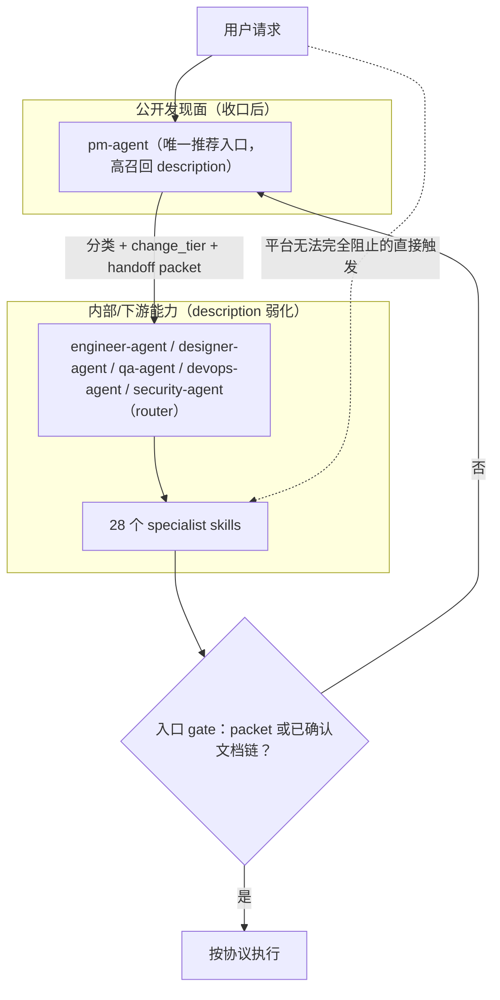

# PM 唯一对外入口与下游编排 TRD

## 1. 来源上下文

本 TRD 承接 `docs/pm/repository-governance/pm-single-entry/PRD.md`、GitHub issue #52 和
issue #61。PM 范围已明确：`pm-agent` 收口为唯一对外公开入口，5 个下游 role agent 和
28 个 specialist skills 内部化为 PM 编排下的下游能力，并对平台无法完全阻止的直接触发
路径建立防绕过机制。

本 TRD 只定义技术契约、平台约束分析、架构决策、影响范围和验证策略，**不进入实现**。
实现推迟到在途 PR #57 / #64 / #65 / #66 / #67 / #68 合并完成后进行，因为本 feature 的
实施面（`AGENTS.md`、多个 SKILL.md、marketplace.json、eval fixtures）与这些在途 PR 大量
重叠，先行实现会造成大面积冲突。届时由 `feature-implementor` 基于本 TRD 生成
`docs/engineer/repository-governance/pm-single-entry/IMPLEMENTATION_PLAN.md`，确认后再
分批进入实施。

## 2. 技术概览



三层机制协同：

1. **发现面收口**：文档与 marketplace/skill description 只把 `pm-agent` 描述为用户入口；
   下游 description 弱化为「handoff 后使用」，移除用户侧触发短语。
2. **PM 编排**：`pm-agent` 高召回捕获全部用户侧起点，分类、判级（`change_tier`）后携带
   标准化 handoff packet 交给下游。
3. **纵深防御**：specialist 内保留入口 gate 作为唯一权威 gate 副本；即使 description 弱化后
   仍被直接命中，无凭据请求依然被拉回 PM。

## 3. 平台约束分析

### 3.1 Claude Code / Codex 的 skill discovery 机制

| 平台 | 发现机制 | 能否「物理隐藏」非 PM skill |
| --- | --- | --- |
| Claude Code（marketplace 安装） | `.claude-plugin/marketplace.json` 按 plugin 注册 skill 目录；每个 skill 的 frontmatter `name` + `description` 常驻 harness 上下文，模型基于 description 自主选择触发。 | 否。只要 skill 被 plugin 注册并安装，它的 description 就进入模型可选集。marketplace schema 没有已确认的 `internal`/`hidden` 可见性字段可依赖；把 skill 移出注册表则 PM 编排也无法调用它，违背「保留下游能力」的目标。 |
| Codex（`.codex/INSTALL.md` symlink 安装） | 把 `agents/*/skills/*` 逐个 symlink 到 `.agents/skills/<skill-name>`，Codex 原生 skill discovery 读取每个 SKILL.md 的 frontmatter。 | 否。安装模型是「整 agent 目录的全部 skill 都链接」，不链接则 PM 编排同样调用不到；Codex 侧也没有 per-skill 可见性开关。 |

结论：**两个平台都无法在保留下游可编排能力的前提下物理隐藏非 PM skill**。凡安装即
可被模型直接选中，这是必须接受的平台事实（与 #61 的观察一致）。

### 3.2 FR-001 降级策略选项与取舍

| 选项 | 做法 | 优点 | 缺点 | 结论 |
| --- | --- | --- | --- | --- |
| A. internal-only 标记 | 在 SKILL.md frontmatter 增加自定义字段（如 `visibility: internal`）并在文档中声明语义。 | 声明清晰，可被 contract 脚本校验。 | 两个平台的 harness 都不消费该字段，对模型选择行为无实际影响；不隐藏 slash 命令，也不阻止用户显式直调。 | 采用，但仅作为**声明层**：供文档、contract 脚本和 reviewer 使用，表达下游不是默认入口，不指望平台执行。 |
| B. frontmatter 触发描述弱化 | 非 PM skill 的 description 移除用户侧触发短语，改写为「Downstream capability. Invoked via pm-agent handoff...」类弱触发表述。 | 直接作用于模型选择概率，是平台机制内唯一能真正降低直接命中率的手段；同时缩减常驻上下文（#61 的 10KB 问题）。 | 无法降为零：用户显式点名 skill 名称时仍会命中；弱化过度可能影响 PM 编排链路内的合法调用。 | 采用，作为**主降级手段**。description 保留 skill 职责描述与「handoff 后使用」定位，只删用户侧起点短语。 |
| C. 触发后强制回 PM | specialist 入口保留 gate：无 PM handoff packet（或等效已确认文档链）时不执行，输出回 `pm-agent` 的引导。 | 不依赖平台机制，绕过路径的最终兜底；gate 行为可被 eval 验证。 | 依赖模型遵循 SKILL.md 指令，属于行为层约束而非硬拦截；增加 specialist 入口文件少量篇幅。 | 采用，作为**纵深防御**。gate 全文唯一副本放 specialist（与 #59 对齐）。 |

**推荐降级策略 = A（声明）+ B（主手段）+ C（兜底）三层叠加。** 残余风险：模型仍可能
无视弱化 description 与 gate 指令直接执行；该风险无法在平台机制内消除，通过 FR-006 的
防绕过 eval 持续监测，并在 eval 回归时修正 description 或 gate 文案。

## 4. #61 入口策略决策记录（ADR 性质）

### 4.1 决策

**采用「PM 收口 + specialist description 弱化（#61 方案 B 语义）+ specialist 内 gate 保留
作为纵深防御」的组合策略。**

- 对外入口层面按 #52 收口：`pm-agent` 是默认入口，5 个 role router 与 28 个
  specialist 标记为非默认入口，用户显式直达下游仍是受支持路径。
- description 分工按方案 B 语义执行于 specialist 与 role router 两层：用户侧起点短语
  全部收敛到 `pm-agent` description（高召回）；role router description 收敛为「PM handoff
  后的角色内分流」；specialist description 收敛为「router/PM 编排下的执行模块」弱触发
  表述，删除与上游重叠的 trigger phrases。
- 同时承认平台无法完全阻止直接触发（3.1 节结论），specialist 内保留入口 gate 作为
  纵深防御：无 handoff packet 或等效已确认文档链时拉回 PM。

### 4.2 为什么不采用纯方案 A（接受双入口，gate 唯一副本放 specialist）

方案 A 的前提是「接受 harness 直接触发 specialist，不与之对抗」，让 router 与 specialist
各自面向用户维持一套触发短语。该前提与 #52 的核心目标直接冲突：

1. **#52 要求用户侧起点统一进入 PM**。方案 A 下「实现这个功能」仍直接命中
   `feature-implementor`，即使 gate 能拦住无凭据请求，用户体验也是「先命中错误 skill，
   再被 gate 弹回」，而不是「一开始就进入 PM 分类」；且 gate 只能拦截该 specialist 协议
   内定义的凭据缺失，无法完成 PM 侧的请求分类、change_tier 判级和跨角色编排。
2. **方案 A 保留双份 description 成本**。router 与 specialist 继续各自维护用户侧触发短语，
   #61 指出的约 10KB 常驻上下文与短语重叠漂移问题只被缓解、没有被消除。
3. **方案 A 的「router 被绕过也无所谓」只对单角色内部路由成立**。跨角色的入口判断
   （bug 是预期问题还是实现偏离、测试依据是否已确认）本来就不在 specialist gate 的职责
   内，双入口会让这些判断没有稳定的执行点。

同时不采用**纯方案 B**（仅弱化、无 gate）：3.1 节已论证平台无法保证弱化后不被直接
命中，没有 gate 的纯方案 B 会让绕过路径完全失守；方案 B 的已知缺点（用户说「实现
这个功能」可能触发不到任何 skill）由 `pm-agent` 高召回 description 承接——该短语收敛
到 PM 而不是凭空删除，用户请求仍有明确归宿。

即：本决策 = 方案 B 的 description 语义 + 方案 A 中「gate 唯一副本放 specialist」的架构
遗产，二者在 PM 收口框架下不再互斥。

### 4.3 对 #59（gate 去重）的约束

- gate 全文的**唯一权威副本放 specialist**（gate 的执行者），这一点沿用 #61 方案 A 的
  实施步骤 1，与本决策兼容：纵深防御要求 gate 不依赖 router 是否被经过。
- `AGENTS.md` 层收敛为一句契约声明 + 指向 specialist 权威副本的引用；role router 层留
  轻量指针（「入口凭据校验见 specialist gate」），不再复制全文。
- #59 去重时**不得把 gate 从 specialist 迁移到 router 或 AGENTS.md**，否则纵深防御失效。
- PM handoff packet 的字段定义（PRD FR-005）唯一权威副本放 PM skill 的 handoff
  contract（`_internal/_shared/skill-map.md` 一类共享模块）；下游 gate 按引用校验字段，
  不复制字段清单全文。

### 4.4 对 #60（SKILL.md 瘦身）的约束

- 瘦身以「router description 压缩 + 细节下沉 `_internal`」为方向，与本决策一致；role
  router SKILL.md 退化为轻量路由表的目标（≤100 行 / description 约 300 字符）继续成立。
- specialist SKILL.md 瘦身时，**入口 gate（凭据校验 + 回 PM 引导）必须留在 SKILL.md
  入口文件内**，不得下沉到 `_internal` 按需加载——gate 必须在 skill 被触发的第一时间
  生效，而 `_internal` 模块只有模型主动读取才生效。
- description 弱化改写与 #60 的 description 压缩合并为同一次编辑，避免两轮 PR 都动
  34 个 frontmatter。

## 5. Description 分工契约

| 层 | Description 职责 | 允许内容 | 禁止内容 |
| --- | --- | --- | --- |
| `pm-agent` | 唯一用户入口，高召回。 | PRD FR-002 九类用户侧起点的代表性短语（新需求、变更、bug、工程诉求、设计、测试、部署、安全、GitHub 状态）；「意图模糊、需要分流」的宽泛表述。 | 无（上限受 harness description 长度与上下文成本约束，实现时控制总长）。 |
| Role router（5 个） | PM handoff 后的角色内分流。 | 角色能力枚举 + 「invoked after pm-agent handoff / PM 编排下使用」定位；目标约 300 字符。 | 用户侧第一人称起点短语（「帮我实现」「修一下」「测一下」等）。 |
| Specialist（28 个） | 编排下的执行模块，弱触发。 | 单一职责描述 + 上游入口声明（由哪个 router/PM 场景进入）。 | 与 PM / router 重叠的 trigger phrases；「Use when the user asks...」类用户起点表述（改为「Use when routed from ...」语义）。 |

marketplace.json 的 6 个 plugin description 同步改写：`pm-agent` plugin 描述为 entry
dispatcher，其余 5 个 plugin 描述为 downstream role capability。

## 6. Handoff packet 与下游入口校验

### 6.1 Packet 契约

字段定义见 PRD FR-005（`request_type`、`change_tier`、feature path 五元组、
`source_documents`、`scope_decision`、`downstream_owner`、`required_output`、
`blockers_risks`）。技术要求：

- packet 以结构化块（YAML 或等效清单）出现在 PM handoff 输出中，字段名固定，便于
  下游 gate 与 eval 语义断言识别。
- feature path 五元组遵循 `docs/engineer/repository-governance/feature-path-contract/TRD.md`
  的解析与校验规则。
- `change_tier` 判定标准衔接变更分级契约（issue #55 / PR #68）。本 TRD 基于的 main 尚未
  合入该契约：合入后以 `AGENTS.md` 的分级定义为唯一来源；未合入期间按 issue #55 的
  hotfix / standard / major 定义执行，字段语义不变。

### 6.2 下游入口 gate 行为

specialist（及 role router）入口 gate 的统一判定顺序：

1. 请求携带显式 PM handoff packet → 校验必填字段完整性后执行；字段缺失按缺口回 PM。
2. 无 packet，但存在等效已确认文档链（如已确认的
   `docs/pm/{feature_path}/PRD.md` + `docs/engineer/{feature_path}/TRD.md` +
   已确认 `IMPLEMENTATION_PLAN.md`，且请求范围未超出文档预期）→ 视为已获编排凭据，
   可执行；这是避免「重复拉回 PM」的合法快捷路径（PRD US-004）。
3. 二者皆无 → 不执行本 skill 协议，输出回 `pm-agent` 的引导（说明拉回原因与 PM 将做
   的分类），不产出实现、测试预期或修复。

特例强化（沿用 PRD FR-004）：`feature-implementor` 对新需求原始请求、`debugger` 对
未对齐预期的 bug 报告、`qa-agent` 对未确认预期的 E2E 更新，均落入第 3 类。

## 7. 影响文件范围

实现阶段应覆盖下列类别，具体拆分见第 8 节：

| 优先级 | 路径 | 预期改动 |
| --- | --- | --- |
| P0 | `README.md`、`README_zh.md`、`.codex/INSTALL.md`、`docs/README.codex.md` | 推荐 `pm-agent` 为默认入口；下游定位为 PM 编排能力，同时保留显式直达路径。 |
| P0 | `.claude-plugin/marketplace.json` | 6 个 plugin description 收口；skill 列表保持不变。 |
| P0 | `agents/product_manager/skills/pm-agent/SKILL.md` | description 高召回扩写；路由协议增加请求分类表、change_tier 判级、handoff packet 组装。 |
| P0 | PM `_internal` 共享模块（skill-map / handoff contract） | packet 字段唯一权威定义；下游 owner 映射。 |
| P0 | 5 个 role router SKILL.md | description 弱化为 handoff 后使用；gate 全文改指针。 |
| P0 | 28 个 specialist SKILL.md frontmatter | description 弱触发改写 + `visibility: internal` 声明字段。 |
| P0 | `agents/engineer/skills/feature-implementor/SKILL.md`、`debugger/SKILL.md`、`agents/qa/skills/qa-agent/SKILL.md` 等 | 入口 gate 按 6.2 判定顺序统一改写（gate 唯一副本，#59 协同）。 |
| P0 | `AGENTS.md` | PM 唯一入口契约声明 + gate 指针化（#59 协同）。 |
| P0 | `skills-lock.json` | 随每个修改 skill 目录的批次在同一 PR 内重算受影响 `computedHash`（见第 8 节）。 |
| P1 | `agents/**/test/**/evals/`（PM 入口与防绕过 eval） | 新增/改造 FR-006 的 8 类场景，含「绕过 router 直接触发」用例。 |
| P1 | `scripts/check_repository_contract.py` | 校验 description 分工（specialist 无用户侧触发短语）、`visibility` 字段、packet 字段定义唯一性（可行范围内的静态检查）。 |

## 8. 实施拆分（后续 PR 分批计划)

**前置依赖：在途 PR #57（归档门禁）、#64（相对路径）、#65（_internal 结构）、#66（跨
Agent 依赖）、#67（feature-catalog）、#68（change_tier 契约）全部合并后再开始实现**，
因为它们与本 feature 的实施面（AGENTS.md、SKILL.md、eval fixtures）大量重叠。

| 批次 | 内容 | 依赖 | 验证 |
| --- | --- | --- | --- |
| Batch 1: 发现面收口 | marketplace.json plugin description、README / README_zh / `.codex/INSTALL.md` / `docs/README.codex.md`、5 个 role router SKILL.md frontmatter description 弱化、specialist frontmatter description 弱化 + `visibility: internal`（与 #60 的 description 压缩合并执行）。router description 与 marketplace / specialist description 同批收口，因为三者同属 Claude/Codex 的直接 discovery 输入，任何一层单独遗留都会保持公开触发面；弱化语义按第 5 节契约执行：保留角色能力枚举与「invoked after pm-agent handoff / PM 编排下使用」的内部编排定位，删除用户侧触发短语，并指向 `pm-agent` 作为用户入口。 | 在途 PR 全部合并。 | 三个契约脚本 + pytest；description 分工静态审查。 |
| Batch 2: PM router 重写 | pm-agent SKILL.md 高召回 description、请求分类协议、change_tier 判级、handoff packet 组装；PM `_internal` handoff contract 权威定义。 | Batch 1；#68 已合入（change_tier 定义来源）。 | 契约脚本 + PM 入口 eval（FR-006 场景 1-6）。 |
| Batch 3: 下游 gate 统一与 #59 去重 | 5 个 role router gate 指针化（description 弱化已在 Batch 1 完成，本批只动 gate 正文）、specialist gate 按 6.2 改写为唯一副本、AGENTS.md 契约声明；与 #59 gate 归位同一批执行。 | Batch 2。 | 契约脚本 + 防绕过 eval（FR-006 场景 7-8）。 |
| Batch 4: eval 与 contract 收尾 | PM-only 入口 eval 全量、`check_repository_contract.py` 新校验、durable `comparison.md` 更新。 | Batch 1-3。 | 三个契约脚本 + pytest + fresh subagent validation。 |

与相关 issue 的执行顺序：#59（gate 去重）在 Batch 3 内协同完成；#60（SKILL.md 瘦身）
的 description 部分并入 Batch 1，正文瘦身可与 Batch 3 同批或紧随其后；均不得先于本
feature 的决策单独改动 gate 位置或 description 分工。

`skills-lock.json` 刷新不单独成批：Batch 1-3 都会修改 tracked skill 目录，而每批 PR 必须
通过 `repository-contract`（`check_repository_contract.py` 会按目录 tracked 文件实时重算
每个 skill 的 `computedHash`），推迟刷新会让首个改动 SKILL.md 的批次因 stale lock 直接
失败。因此**每个修改 skill 目录的批次必须在同一 PR 内同步重算并更新受影响 skill 的
`computedHash`**；Batch 4 不再承担 lock 刷新，只保留真正的收尾项（eval 全量、contract
新校验、durable `comparison.md`）。

每批次为独立 PR，均需通过 PR 必跑校验顺序
`repository-contract -> eval-contract -> python-tests`，涉及 skill 行为的批次在合并前手动
触发 eval workflow。

## 9. 验证策略

实施完成后按以下顺序验证：

```bash
uv run scripts/check_repository_contract.py
uv run scripts/check_eval_contract.py
uv run scripts/check_eval_artifacts.py
uv run --extra test pytest
```

针对本契约的静态检查与人工审查入口：

```bash
# specialist description 不应再包含用户侧触发短语（示例抽查）
rg -n '实现这个功能|帮我实现|修一下|补测试' agents/*/skills/*/SKILL.md
# 下游 role agent 与 specialist 的 visibility 声明
rg -n 'visibility:' agents/*/skills/*/SKILL.md
# 用户文档只推荐 pm-agent 入口
rg -n 'pm-agent' README.md README_zh.md .codex/INSTALL.md docs/README.codex.md
```

本 TRD 阶段不声称上述命令已经运行；命令是实施完成后的验证入口。行为层验证依赖
FR-006 的 eval：每次实际执行 skill eval 或 fresh Codex subagent validation 后，必须在同一
轮变更中更新对应 durable `comparison.md`。

## 10. 发布与回滚

本变更是文档、description 和 eval 契约升级，不新增运行时服务。按第 8 节分批 PR 合入；
回滚方式是普通 git revert。注意 Batch 1（description 弱化）与 Batch 3（gate 归位）之间
存在依赖：若只回滚 Batch 3 而保留 Batch 1，specialist 将处于「弱触发但 gate 仍三层复制」
的中间态，功能不受损；若只回滚 Batch 1 而保留 Batch 3，需确认 router 指针仍能指向有效
gate 副本。

## 11. 安全与隐私

本变更不引入凭据、账号、token、cookie 或 SSH key。handoff packet 只携带仓库内文档
路径、issue/PR 引用和范围决策，不得写入本地绝对路径、用户私有目录或任何账号信息。

## 12. 风险、假设和待确认问题

| 类型 | 内容 | Owner | Blocking |
| --- | --- | --- | --- |
| Risk | 平台机制不阻止用户显式直达下游；gate 属于行为层约束，模型可能不遵循。 | Engineer | No（通过 eval 持续监测，残余风险已在 3.2 节声明） |
| Risk | specialist description 弱化过度导致 PM 编排链路内合法调用失败。 | Engineer | Yes（Batch 1 需 eval 覆盖 handoff 放行场景后才可合并） |
| Risk | 在途 PR 合并顺序变化导致实施基线漂移。 | Maintainer | Yes（实现开始前重校 TRD 第 7、8 节的文件清单） |
| Decision | 入口策略：PM 收口 + specialist description 弱化（#61 方案 B 语义）+ specialist 内 gate 纵深防御；不采用纯方案 A，理由见 4.2。 | Maintainer | No |
| Decision | gate 唯一权威副本放 specialist（约束 #59）；gate 不得随 #60 瘦身下沉到 `_internal`。 | Maintainer | No |
| Decision | `visibility: internal` 仅为声明层字段，不依赖平台执行。 | Maintainer | No |
| Assumption | `change_tier` 定义以 issue #55 / PR #68 为来源；合入后以 `AGENTS.md` 为唯一权威。 | Maintainer | No |
| Open Question | `check_repository_contract.py` 对「specialist 无用户侧触发短语」的静态校验粒度（关键词黑名单 vs 人工审查），在实施计划阶段确定。 | Engineer | No |
| Open Question | Claude Code marketplace schema 未来若提供官方 skill 可见性字段，是否迁移 `visibility` 声明。 | Maintainer | No |

## 13. Feature-Implementor 交接条件

- Confirmed PRD path: `docs/pm/repository-governance/pm-single-entry/PRD.md`
- Confirmed TRD path: `docs/engineer/repository-governance/pm-single-entry/TRD.md`
- Expected implementation plan path:
  `docs/engineer/repository-governance/pm-single-entry/IMPLEMENTATION_PLAN.md`
- Precondition: 在途 PR #57 / #64 / #65 / #66 / #67 / #68 已全部合并，且已按合并后基线
  重校本 TRD 第 7、8 节。
- Boundary: 本 TRD 不进入实现，不修改 SKILL.md、marketplace.json、skills-lock.json、
  AGENTS.md、eval 或 contract 脚本。
- Required next step: `feature-implementor` 基于本 TRD 按第 8 节分批生成详细实施计划，
  用户确认后再进入实施。
