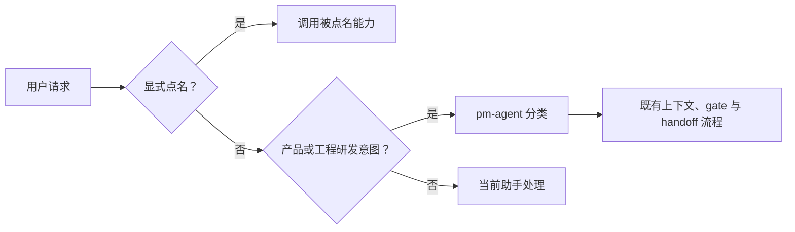

# PM 研发意图入口与路由过程收敛 TRD

## 1. 技术目标

本轮只修改 skill 的入口判断顺序和 router 的强制输出文案：


```mermaid
flowchart LR
    U["用户请求"] --> X{"显式点名？"}
    X -->|"是"| N["调用被点名能力"]
    X -->|"否"| D{"产品或工程研发意图？"}
    D -->|"是"| P["pm-agent 分类"]
    D -->|"否"| H["当前助手处理"]
    P --> G["既有上下文、gate 与 handoff 流程"]
```

不新增分类服务、隐藏路由协议或输出包装层。内部 handoff packet 和 specialist gate 保持
现状；#282 仅删除现有 skill 文档中强制用户可见 routing block 的要求。

## 2. 入口判定顺序

### 2.1 显式调用

1. 判断用户是否显式点名已安装的 `pm-agent`、role agent 或 skill。
2. 若已点名，使用被点名能力，并继续执行该能力自身的入口 gate。
3. 不用“是否为研发请求”覆盖或取消显式调用。

### 2.2 自动入口

未显式点名时：

1. 判断请求是否属于现有 PM 覆盖的产品或工程研发意图。
2. 属于研发意图时进入 `pm-agent`。
3. 不属于研发意图时由当前助手直接处理，不进入 PM 分类。
4. 只有进入 PM 后，才读取 docs、PRD、TRD、代码、项目 marker 和 handoff 证据，完成
   request type、feature path、change tier 与下游 gate 判断。

## 3. Router 输出变更

修改以下 7 个 router：

| Router | 技术动作 |
| --- | --- |
| `pm-agent` | 删除强制输出 routing decision、route、owner 或 packet 展示的要求 |
| `designer-agent` | 删除 mandatory routing block / selected specialist 展示要求 |
| `engineer-agent` | 删除 mandatory routing block / selected specialist 展示要求 |
| `qa-agent` | 删除 mandatory routing block / selected specialist 展示要求 |
| `devops-agent` | 删除 mandatory routing block / selected specialist 展示要求 |
| `security-agent` | 删除 mandatory routing block / selected specialist 展示要求 |
| `docs-agent` | 删除 mandatory routing block / selected specialist 展示要求 |

删除仅覆盖用户侧显式输出要求。下列内容不得改变：

- router 的分类与 specialist 选择条件；
- PM 与下游入口 gate；
- handoff packet 字段名称、必填性和 owner 映射；
- specialist entry basis 与职责边界；
- auto-continue、安全升级和 closeout 规则。

## 4. 精确实施面

| 同步面 | 路径或类别 | 预期改动 |
| --- | --- | --- |
| PM 入口 | `agents/product_manager/skills/pm-agent/SKILL.md` | 显式调用优先；自动入口按研发意图；上下文检查后置；删除强制路由过程输出 |
| 发现描述 | `pm-agent` frontmatter、`.claude-plugin/marketplace.json` PM description、必要 plugin description | 将“任意新请求/项目 marker 触发”收窄为研发意图默认入口，并保留显式调用 |
| 仓库规则 | `AGENTS.md` | 同步 PM 默认入口判定，删除与新目标冲突的旧 Scope Guard 文案 |
| 用户文档 | 根 README 中英文版、`.codex/INSTALL.md`、`docs/README.codex.md`、PM Agent README 中英文版 | 仅改写直接描述旧自动入口规则的段落 |
| Role router | 7 个 router `SKILL.md` | 删除强制显式 routing block / decision / owner 输出要求 |
| PRD 文档 | 受影响 router 的既有 skill PRD | 仅在存在“必须展示路由过程”的已批准要求时同步删除或改写 |
| Eval | PM 入口与 7 个 router 的 `evals.json`、workspace、受影响 durable `comparison.md` | 用真实任务请求验证入口与最终行为，不再断言 routing block |
| Deterministic tests | PM entry、router routing 与契约相关 pytest | 固定三分支入口判断，防止误删 gate/handoff |
| Lock | `skills-lock.json` | 重算本 PR 修改过的 skill 目录 hash |

## 5. Eval 策略

Eval 的编写、静态校验和 fresh paired 执行遵循项目 `skill-eval-runner`：

1. PM 自动入口至少覆盖：
   - 无 docs、但有明确研发意图；
   - 有 docs、但属于普通非研发请求；
   - 显式点名 `pm-agent` 处理非研发请求；
   - 显式点名下游 agent 或 specialist，仍进入被点名能力的既有 gate。
2. Router eval 删除“只做路由”“输出 routing decision”等测试化 prompt 和相关字段断言，
   改用真实任务请求。
3. 保留正确 specialist 选择、入口门禁、职责边界和最终任务结果的语义断言。
4. Fresh paired eval 使用新的 with-skill 与 baseline 执行；只由真实结果更新受影响的
   `comparison.md`，不手工复用旧结论。

## 6. Deterministic 验证

静态和确定性测试至少证明：

- `pm-agent` 的显式调用判断先于研发意图判断；
- 自动入口不再以 docs、PRD/TRD、代码或 marker 为首要触发依据；
- 非研发且未显式点名的请求不进入 PM；
- 7 个 router 不再要求输出 routing block、routing decision 或 selected owner；
- specialist gate、handoff schema 和 owner 映射仍存在且内容未变；
- 修改过的 skill hash 与 `skills-lock.json` 一致。

执行命令：

```bash
uv run scripts/check_repository_contract.py
uv run scripts/check_eval_contract.py
uv run scripts/check_eval_artifacts.py
uv run scripts/check_doc_contract.py
uv run --with pytest pytest <受影响的确定性测试>
git diff --check
```

涉及模型行为的 router eval 在静态检查通过后执行 fresh paired validation，最多 10 workers。

## 7. 实施约束

- 所有变更放在同一个 PR 内。
- 以删除或改写现有规则为主，不新增分类器抽象、输出协议、配置项或公共包装函数。
- 预计净改约 500–900 行；明显超出时停止并重新核对范围。
- 不改 specialist gate 逻辑、handoff 字段 schema、无关 skills 或 release 版本。
- 不自动合并 PR；创建 PR、通过本地验证并等待 CI/Codex Review 后，在合并前交由维护者确认。

## 8. 回滚

本变更没有数据迁移或运行时状态。若入口判断或 router 行为回归，整体 revert 本 PR 即可；
不得只回滚 lockfile 或 eval 产物，避免 skill 内容与验证证据失配。

## 9. 已确认决策

- 入口语义、文档更新、归档、新计划和实施门禁已由 Neplich 于 2026-08-14 批准。
- #281 使用“显式调用优先、未显式调用按研发意图判断”。
- #282 只删除 skill 流程内的强制路由过程输出要求。
- 内部分类、gate 与 handoff 契约不改。
