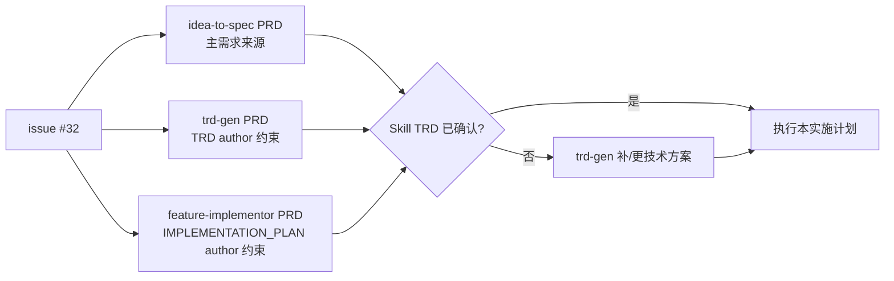
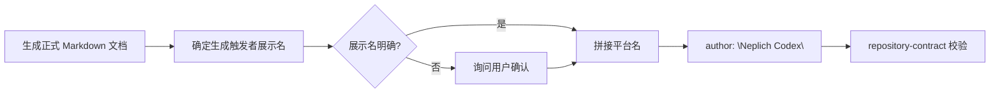

# idea-to-spec author 元数据规范实施计划

## 1. 背景

GitHub issue #32 要求自动生成或更新的 Markdown frontmatter 不再使用
`author: "AI Assistant"` 这类无法追踪来源的泛称。目标格式是“生成触发者展示名 +
Agent 平台名”，例如当前仓库本地 git 用户为 `neplich`，展示口径为
`Neplich Codex`；平台名可以是用户自定义值。

本次问题不只影响旧模板。当前 `neplich-codex/agent-skill-prds` 分支中新增的
Agent / Skill PRD 使用 `author: "Codex"`，虽然能识别平台，但仍缺少触发生成的
git 用户，同样不满足 #32 的可追溯要求。

## 2. PRD / TRD 对齐结论

### 2.1 PRD 归属

#32 不应新开独立 PM feature PRD。它是现有 Agent / Skill 文档生成契约的增强，
应并入已有 Skill PRD：

| 责任范围 | 归属 PRD | 依据 |
| --- | --- | --- |
| PM 正式文档，包括 `PRD.md`、`BRD.md`、`DECISIONS.md`、diff、impact analysis、iteration 或 validator handoff | `docs/pm/agents/pm-agent/skills/idea-to-spec/PRD.md` | `idea-to-spec` FR-S04 已定义这些 PM 文档产物。 |
| Engineer TRD | `docs/pm/agents/engineer-agent/skills/trd-gen/PRD.md` | `trd-gen` FR-S04 已定义 `docs/engineer/{feature}/TRD.md` 产物。 |
| Engineer implementation plan | `docs/pm/agents/engineer-agent/skills/feature-implementor/PRD.md` | `feature-implementor` FR-S04 已定义 `docs/engineer/{feature}/IMPLEMENTATION_PLAN.md` 产物。 |

`idea-to-spec` 是本次主 PRD，因为 #32 的直接源头位于 PM 文档生成共享约定和
`prd-gen` / `brd-gen` 示例。`trd-gen` 与 `feature-implementor` 是覆盖 issue
中 TRD、IMPLEMENTATION_PLAN 范围的同步 PRD。

### 2.2 TRD 状态

当前 checkout 中已存在 Skill PRD，但未发现对应的 Skill 级 TRD 文件；`docs/engineer/`
下只有旧 feature TRD：

- `docs/engineer/qa-e2e-case-memory/TRD.md`
- `docs/engineer/engineer-agent-subagent-division/TRD.md`

因此进入模板、脚本和历史文档修改前，先执行 TRD 对齐门禁：

1. 如果已有 Skill 级 TRD 位于其他路径，先接入真实路径并更新本计划的
   `related_pm_docs` / source context。
2. 如果不存在，则按 `engineer-agent:trd-gen` 先补技术方案，建议主 TRD 以
   `skill-idea-to-spec` 为 feature，覆盖共享 author 规则、仓库校验和跨 Skill
   同步点；`trd-gen` 与 `feature-implementor` 作为受影响组件写入同一 TRD。
3. TRD confirmed 后，再继续本实施计划的文件修改。



## 3. 目标

- 所有新生成正式 Markdown 文档的 `author` 使用“生成触发者展示名 + Agent 平台名”。
- 允许平台名为用户自定义值；仓库校验不维护固定平台名 allowlist 或 denylist。
- 禁止正式文档继续使用空值或 `AI Assistant` 这类不可完整追踪的占位泛称。
- PRD、TRD 和 IMPLEMENTATION_PLAN 的归属 Skill PRD 明确该 author 要求。
- 共享输出约定、schema、生成示例和仓库契约校验保持一致。
- 修正当前仓库已有正式文档中的 `author: "AI Assistant"` 和 `author: "Codex"`。

## 4. 非目标

- 不为 author 生成引入复杂运行时插件 API 或跨平台自动探测框架。
- 不修改 eval fixture 中语义明确的测试作者，例如 `Eval Fixture`、`Eval Runner`。
- 不修改数据集文本样例，例如 UX 指南 CSV 中的 `AI Assistant label`。
- 不重构 Agent / Skill PRD 目录结构。
- 不创建 release changelog；是否进入发版记录由后续 release 流程决定。

## 5. 目标规则

正式生成文档的 `author` 字段遵循：

```text
<生成触发者展示名> <Agent 平台名>
```

展示名来源优先级：

1. 当前仓库 `git config user.name` 的展示名。
2. GitHub 登录名或仓库上下文中能确认的展示名。
3. 无法确认触发者或平台名时询问用户，不回退到空值或 `AI Assistant` 这类占位泛称。

平台名由当前执行环境或用户确认决定，可以是 `Codex`、`Claude Code` 或自定义 Agent 平台名。



## 6. 文件变更清单

### 6.1 PRD 对齐

| 文件 | 操作 | 变更内容 |
| --- | --- | --- |
| `docs/pm/agents/pm-agent/skills/idea-to-spec/PRD.md` | 修改 | bump 版本；在 FR-S04 或新增 FR 中明确 PM 正式文档必须使用可追踪 author；补充相关 shared output / schema / gen 指令到 related docs。 |
| `docs/pm/agents/engineer-agent/skills/trd-gen/PRD.md` | 修改 | bump 版本；明确 `TRD.md` frontmatter author 使用同一命名规则。 |
| `docs/pm/agents/engineer-agent/skills/feature-implementor/PRD.md` | 修改 | bump 版本；明确 `IMPLEMENTATION_PLAN.md` frontmatter author 使用同一命名规则。 |

### 6.2 技术方案门禁

| 文件 | 操作 | 变更内容 |
| --- | --- | --- |
| `docs/engineer/skill-idea-to-spec/TRD.md` 或真实 Skill TRD 路径 | 新建或修改 | 记录 author 来源、平台名、校验范围、历史文档修正策略和验证命令；如果已有 TRD 在别处，使用真实路径。 |

### 6.3 实施修改

| 文件 | 操作 | 变更内容 |
| --- | --- | --- |
| `agents/product_manager/skills/idea-to-spec/_internal/_shared/output-conventions.md` | 修改 | 在共享 frontmatter 约定中明确 author 命名规则，不允许空值或占位泛称，平台名不做固定枚举。 |
| `agents/product_manager/skills/idea-to-spec/_internal/_shared/doc-schemas/*.md` | 修改 | 将 schema 中的 `author: <name>` 说明收紧为可追踪作者格式。 |
| `agents/product_manager/skills/idea-to-spec/_internal/gen/prd-gen/INSTRUCTIONS.md` | 修改 | 将 PRD 示例 `author: "AI Assistant"` 替换为 `author: "Neplich Codex"`，并补充规则说明。 |
| `agents/product_manager/skills/idea-to-spec/_internal/gen/brd-gen/INSTRUCTIONS.md` | 修改 | 将 BRD 示例 `author: "AI Assistant"` 替换为 `author: "Neplich Codex"`，并补充规则说明。 |
| `agents/engineer/skills/trd-gen/_internal/trd-schema.md` | 修改 | 在 TRD schema 的 metadata 部分加入 author 规则。 |
| `agents/engineer/skills/feature-implementor/_internal/planner/INSTRUCTIONS.md` | 修改 | 要求新建或更新 `IMPLEMENTATION_PLAN.md` 时保留/写入可追踪 author。 |
| `scripts/check_repository_contract.py` | 修改 | 增加正式文档 author 校验，阻止 tracked formal docs 使用空值或占位泛称，不按固定平台名枚举审计。 |

### 6.4 历史文档修正

| 文件范围 | 操作 | 变更内容 |
| --- | --- | --- |
| `docs/pm/agents/**/*.md` | 修改 | 将当前新增 Agent / Skill PRD 中的 `author: "Codex"` 修正为 `author: "Neplich Codex"`。 |
| `docs/pm/qa-e2e-case-memory/PRD.md`、`docs/pm/engineer-agent-subagent-division/*.md` | 修改 | 将旧 `author: "AI Assistant"` 修正为 `author: "Neplich Codex"`。 |
| `docs/engineer/qa-e2e-case-memory/TRD.md`、`docs/engineer/qa-e2e-case-memory/IMPLEMENTATION_PLAN.md`、`docs/engineer/engineer-agent-subagent-division/TRD.md` | 修改 | 将旧 `author: "AI Assistant"` 修正为 `author: "Neplich Codex"`；如正文或 plan 语义变化，按现有规则同步版本和 `last_updated`。 |

## 7. 实施顺序

1. **确认 Skill TRD 路径**
   - 查找是否已有 `skill-idea-to-spec`、`skill-trd-gen`、`skill-feature-implementor`
     对应 TRD。
   - 如果没有，先用 `trd-gen` 产出或更新主 TRD，再继续实施。
   - 验证：TRD source context 指向本计划中的三个 PRD。

2. **更新三个 Skill PRD**
   - 先更新 `idea-to-spec` 主 PRD。
   - 再同步 `trd-gen` 和 `feature-implementor` PRD。
   - 验证：PRD 中明确 author 命名规则和对应 artifact 范围。

3. **更新共享输出规则和生成示例**
   - 更新 `output-conventions.md`、doc schemas、`prd-gen` 和 `brd-gen`。
   - 验证：`rg -n 'author:\s*"AI Assistant"|author:\s*"Codex"' agents/product_manager/skills/idea-to-spec`
     不再命中正式生成示例。

4. **更新 Engineer 侧 TRD / IMPLEMENTATION_PLAN 规则**
   - 更新 `trd-schema.md` 和 feature-implementor planner 指导。
   - 验证：新建 TRD 与 IMPLEMENTATION_PLAN 的 metadata 规则一致。

5. **增加仓库契约校验**
   - 在 `check_repository_contract.py` 中扫描 tracked formal docs 的 YAML frontmatter。
   - 禁止空值和 `author: "AI Assistant"` 这类占位泛称。
   - 不按固定平台名枚举拦截，允许用户自定义平台名。
   - 保留 eval fixture、数据集和非正式文本样例例外。

6. **修正历史正式文档**
   - 将旧 `AI Assistant` 和新 `Codex` author 批量改为 `Neplich Codex`。
   - 验证：`rg -n '^author:\s*"AI Assistant"' docs agents --glob '*.md'`
     不再命中正式文档。

7. **运行验证并准备 eval 决策**
   - 跑确定性仓库校验。
   - 因为修改了 skill 文档和输出约定，完成后询问是否运行受影响 skill eval。

## 8. 验证方式

- `uv run scripts/check_repository_contract.py`
- `uv run scripts/check_eval_contract.py`
- `uv run scripts/check_eval_artifacts.py`
- `rg -n '^author:\s*"AI Assistant"' docs agents --glob '*.md'`
- `rg -n 'author:\s*"AI Assistant"' agents/product_manager/skills/idea-to-spec`

## 9. Eval 影响

本次会修改 `idea-to-spec` 的共享输出约定和生成指令，也会修改 `trd-gen` 与
`feature-implementor` 的文档生成规则，属于会影响 skill 行为的文档变更。
实施完成后必须主动询问是否运行对应 skill eval；用户确认后再执行模型 transcript
生成/检查和 fresh subagent validation，并按仓库规则更新对应 durable `comparison.md`。

建议询问范围：

- `agents/product_manager/test/idea-to-spec/evals/evals.json`
- `agents/engineer/test/trd-gen/evals/evals.json`
- `agents/engineer/test/feature-implementor/evals/evals.json`
