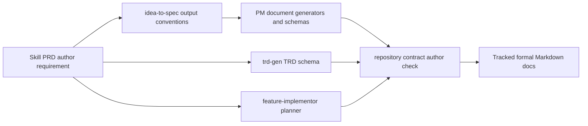

# idea-to-spec author 元数据规范 TRD

## 1. Source Context

本 TRD 承接 issue #32 和三个已确认 Skill PRD：

- `docs/pm/agents/pm-agent/skills/idea-to-spec/PRD.md`
- `docs/pm/agents/engineer-agent/skills/trd-gen/PRD.md`
- `docs/pm/agents/engineer-agent/skills/feature-implementor/PRD.md`

PM scope 已确认：正式生成或更新的 Markdown 文档不得继续使用
`author: "AI Assistant"` 或裸平台名 `author: "Codex"`；应使用“生成触发者展示名 +
Agent 平台名”的可追踪格式，例如 `Neplich Codex`。本 TRD 不改变 PM scope，
只定义落地该规则所需的技术修改、校验范围和验证命令。

## 2. Technical Overview

本次变更通过共享文档输出约定、Engineer 侧 schema / planner 指令、仓库契约校验和
历史正式文档修正共同落地 author 元数据规则。



## 3. Impacted Components

| Component / Path | Responsibility | Planned Change | Source Requirement |
| --- | --- | --- | --- |
| `agents/product_manager/skills/idea-to-spec/_internal/_shared/output-conventions.md` | PM formal document frontmatter source of truth | Define the traceable author format and forbid generic AI names. | `idea-to-spec` PRD FR-S04 / FR-S08 |
| `agents/product_manager/skills/idea-to-spec/_internal/_shared/doc-schemas/*.md` | PM doc schema examples | Replace generic `author: <name>` guidance with traceable author wording. | `idea-to-spec` PRD FR-S08 |
| `agents/product_manager/skills/idea-to-spec/_internal/gen/prd-gen/INSTRUCTIONS.md` | PRD generation example | Replace `AI Assistant` with `Neplich Codex`. | issue #32 |
| `agents/product_manager/skills/idea-to-spec/_internal/gen/brd-gen/INSTRUCTIONS.md` | BRD generation example | Replace `AI Assistant` with `Neplich Codex`. | issue #32 |
| `agents/engineer/skills/trd-gen/_internal/trd-schema.md` | Engineer TRD metadata schema | Add author metadata guidance. | `trd-gen` PRD FR-S08 |
| `agents/engineer/skills/feature-implementor/_internal/planner/INSTRUCTIONS.md` | Implementation plan metadata workflow | Require traceable author when creating or maintaining plans. | `feature-implementor` PRD FR-S08 |
| `scripts/check_repository_contract.py` | Deterministic repository contract | Detect generic author names in tracked formal Markdown frontmatter. | issue #32 acceptance |
| `docs/**/*.md` formal documents | Existing durable docs | Replace `AI Assistant` and bare `Codex` authors with `Neplich Codex`. | issue #32 acceptance |

## 4. Interfaces and Data

No runtime API, data model, or external integration changes are required.

The author value is static Markdown frontmatter data. The accepted format is:

```text
<generation requester display name> <agent platform name>
```

Examples:

- `Neplich Codex`
- `Neplich Claude Code`

The repository contract only validates committed formal Markdown frontmatter. It does
not parse arbitrary prose, eval fixture author values such as `Eval Fixture`, or data
set examples where `AI Assistant` is not a document author.

## 5. Implementation Constraints

- Keep changes scoped to author metadata rules and historical author cleanup.
- Do not change Agent routing, marketplace registration, or skill behavior unrelated
  to formal document metadata.
- Use direct wording in docs; avoid process commentary in the final user-facing
  documents.
- Do not modify eval runtime artifacts or data set examples that are not formal docs.
- Preserve current document structure and add minimal requirement rows or metadata
  guidance instead of rewriting full PRDs.

## 6. Validation Strategy

| Level | Scope | Command / Evidence | Required Before Handoff |
| --- | --- | --- | --- |
| Repository contract | Author metadata check and existing repo contracts | `uv run scripts/check_repository_contract.py` | Yes |
| Eval contract | Ensure eval metadata and workspaces remain valid | `uv run scripts/check_eval_contract.py` | Yes |
| Eval artifacts | Ensure no runtime artifacts were committed | `uv run scripts/check_eval_artifacts.py` | Yes |
| Static author scan | Confirm generic author frontmatter is gone | `rg -n '^author:\s*"(AI Assistant|Codex)"' docs agents --glob '*.md'` | Yes |
| Targeted template scan | Confirm generator examples no longer use generic author values | `rg -n 'author:\s*"AI Assistant"|author:\s*"Codex"' agents/product_manager/skills/idea-to-spec` | Yes |

## 7. Rollout and Operations

This is a documentation and repository-contract change. Rollout is by PR merge.

Rollback is a standard git revert of the documentation, script, and author metadata
cleanup commit. No deployment, migration, monitoring, alerting, or runtime rollback
is required.

## 8. Security and Privacy

The author value is not a secret. The rule improves auditability by recording the
triggering user display name and platform name. It must not include emails, tokens,
machine hostnames, or other sensitive local identifiers.

## 9. Risks and Open Questions

| Type | Item | Owner | Blocking |
| --- | --- | --- | --- |
| Risk | Over-broad scanning may flag prose examples or eval fixtures that are not formal docs. | Engineer | Yes |
| Risk | Bare `Codex` appears in many newly generated Agent / Skill PRDs and must be cleaned in the same change as the checker. | Engineer | Yes |
| Assumption | `Neplich Codex` is the correct display value for this repo and current platform. | Maintainer | No |

## 10. Feature-Implementor Handoff

- Confirmed TRD path: `docs/engineer/skill-idea-to-spec/TRD.md`
- Implementation plan path:
  `docs/engineer/document-author-metadata/IMPLEMENTATION_PLAN.md`
- Handoff condition: maintainer confirmed this TRD and the existing implementation
  plan on 2026-06-12.
- Next step: update PRDs, shared output rules, Engineer metadata rules,
  repository contract, and historical formal document authors.
