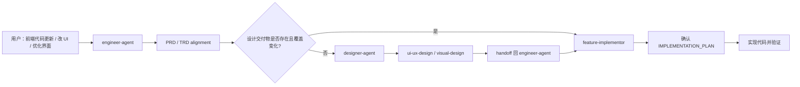

# 前端 UI 更新路由契约 PRD

## 1. 背景

GitHub issue #35 记录了一个跨角色路由缺口：当用户表达“更新前端代码”“改 UI”“优化界面实现”等本地项目开发诉求时，请求容易被外部 `ui-ux-pro-max` skill 吸走，而不是进入本仓库的 Engineer / Designer 协作流程。

本仓库不应修改或弱化外部 `ui-ux-pro-max`。目标是在仓库内部明确：前端代码更新由 `engineer-agent` 作为工程入口承接；当设计交付物缺失、过期或不覆盖当前变化时，Engineer handoff 给 `designer-agent` 补齐设计文档；Designer 停在设计交付，完成后明确交回 Engineer，由 Engineer 负责 TRD、`IMPLEMENTATION_PLAN.md`、代码和验证。

## 2. 目标

1. 把前端代码更新、UI 实现、界面优化、设计落地明确归类为 Engineering 入口。
2. 保留现有 PRD/TRD alignment 和 `IMPLEMENTATION_PLAN.md` 用户确认门禁。
3. 让 Engineer 在进入实现前检查相关设计交付物是否存在且覆盖当前 UI 变化。
4. 让 Designer 处理来自 Engineer 的 UI maintenance / frontend-update design request，并在设计完成后停止，明确交回 Engineer。
5. 用 eval 固化路由行为，防止后续回退到外部 UI skill 或让 Designer 直接实现代码。

## 3. 非目标

- 不修改外部 `ui-ux-pro-max` skill。
- 不删除、不替换本仓库 Designer 的 `ui-ux-design` 或 `visual-design`。
- 不让 Designer 写前端代码、测试、部署配置或工程实现清单。
- 不绕过 PM / PRD / TRD alignment gate。
- 不绕过 `docs/engineer/{feature_path}/IMPLEMENTATION_PLAN.md` 用户确认门禁。

## 4. 功能需求

| ID | Requirement | Priority | Acceptance Criteria |
| --- | --- | --- | --- |
| FR-001 | Engineer 入口识别 | P0 | `engineer-agent` 将“更新前端代码 / 改 UI / 优化界面实现 / 设计落地”识别为 Engineering request，而不是建议直接使用外部 UI skill。 |
| FR-002 | PRD/TRD 对齐 | P0 | Engineer 对现有功能 UI 变化继续先执行 existing feature PRD/TRD alignment gate；需求变化回 PM，TRD gap 回 `trd-gen`。 |
| FR-003 | 设计交付物检查 | P0 | 涉及页面结构、交互流程、视觉系统、组件规范、可用性或信息层级变化时，Engineer 检查 `docs/design/{feature_path}/ui-ux-spec.md` 和 `visual-system.md` 是否存在且覆盖当前变化。 |
| FR-004 | Designer handoff | P0 | 设计交付物缺失、过期或不覆盖当前变化时，Engineer handoff 到 `designer-agent`，并说明需要补齐的设计输入。 |
| FR-005 | Designer 停止边界 | P0 | `designer-agent` 只更新 `docs/design/{feature_path}/ui-ux-spec.md` 和/或 `visual-system.md`，不写代码，并在输出中明确 handoff 回 `engineer-agent`。 |
| FR-006 | Feature Implementor 门禁 | P0 | `feature-implementor` 的实施计划引用已确认设计交付物，或明确说明为什么本次 UI 变化不需要 Designer 更新。设计交付物缺失或冲突时，不开始实现。 |
| FR-007 | Eval 覆盖 | P0 | Engineer、Feature Implementor、Designer 的相关 eval 覆盖该路由契约，并在实际执行 eval 后更新 durable `comparison.md`。 |
| FR-008 | Lockfile 同步 | P0 | 修改 skill 文档后同步更新 `skills-lock.json`。 |

## 5. 用户流程

## 6. 验收标准

| ID | Criteria | Verification |
| --- | --- | --- |
| AC-001 | Engineer 不把本地前端实现请求导向外部 `ui-ux-pro-max`。 | 检查 `engineer-agent` SKILL / README / eval。 |
| AC-002 | 设计缺失时 Engineer 能明确 handoff 给 `designer-agent`。 | 检查 `engineer-agent` 与 `feature-implementor` 文档和 eval。 |
| AC-003 | Designer 能处理 Engineer 来源的 UI 维护设计请求，并停止在设计交付。 | 检查 `designer-agent` 文档和 eval。 |
| AC-004 | Feature Implementor 实施计划引用设计交付物或说明无需更新设计的理由。 | 检查 `feature-implementor` 文档和 eval。 |
| AC-005 | 外部 `ui-ux-pro-max` 不在本仓库变更范围内。 | 检查 diff。 |
| AC-006 | 仓库契约、eval 契约和 artifact 策略通过。 | 运行 repository / eval contract 检查。 |

## 7. 相关实现文档

- GitHub issue: `https://github.com/Neplich/dev-agent-skills/issues/35`
- Engineer: `agents/engineer/skills/engineer-agent/SKILL.md`
- Feature Implementor: `agents/engineer/skills/feature-implementor/SKILL.md`
- Designer: `agents/designer/skills/designer-agent/SKILL.md`
- Eval definitions:
  - `agents/engineer/test/engineer-agent/evals/evals.json`
  - `agents/engineer/test/feature-implementor/evals/evals.json`
  - `agents/designer/test/designer-agent/evals/evals.json`
