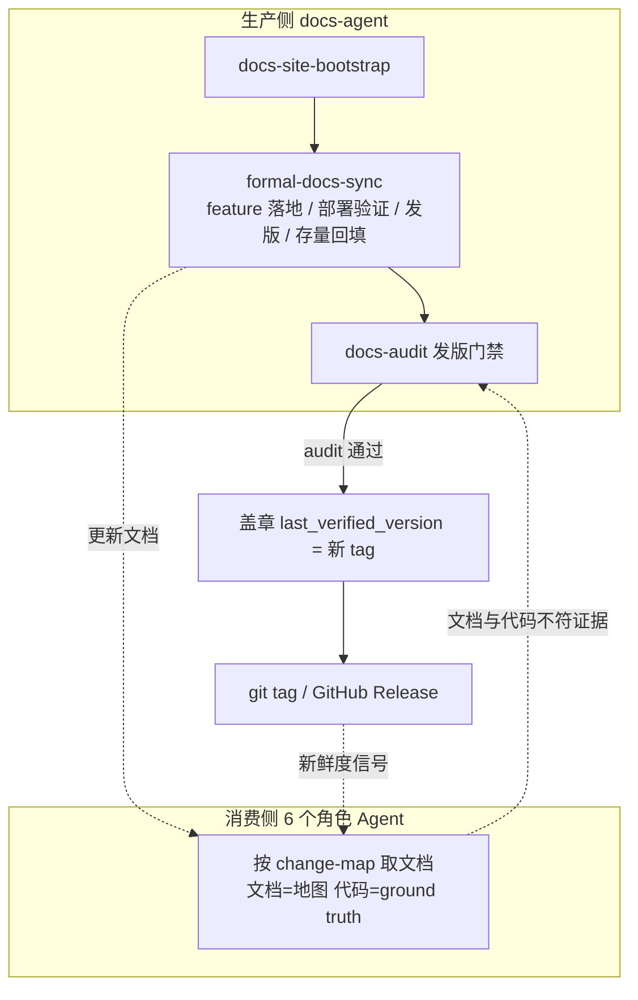
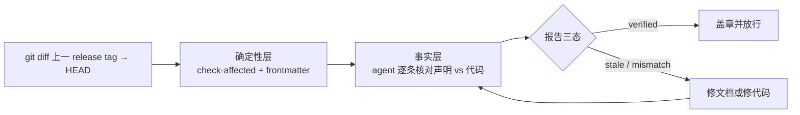

# docs-agent PRD

## 背景

现有 6 个角色 Agent 全部产出过程文档（PRD、TRD、测试报告、部署计划等），协作链完成后代码已交付，但没有任何角色对"描述系统当前状态的正式文档"负责：API contract 文档、数据库 schema 文档、产品手册、运维 runbook。这类文档在真实项目里最容易与代码脱节。

参考实现来自 AI Hub 项目（内部宿主项目）已长期运行的 `docs/site` 体系与 `hub-docs-maintainer` 项目 skill，其机制包括：

- VitePress 文档站，frontmatter 中 `visibility` 驱动 public / internal 双站点生成。
- 内容模型：`title`、`visibility`、`doc_type`、`owners`、`related_code`、`last_verified_version`。
- 校验脚本：frontmatter 完整性、版本一致性、`change-map.yaml` 代码到文档映射的 affected 检查。
- 文档生命周期三节点：功能 PR、部署验证、正式发版。
- 维护 skill：读者分层（agent / human / archive）、变更路由表、文档类型到模板映射、"latest state 不混历史"写作纪律。

本 PRD 定义第 7 个角色 Agent `docs-agent`，把上述机制通用化为 marketplace 能力，同时为现有 6 个 Agent 定义正式文档的消费契约。

## 目标

1. 新增 `docs-agent` 角色，负责宿主项目正式文档层（结果文档）的初始化、同步与审计。
2. 提供 `docs-site-bootstrap` skill：按用户显式请求初始化 VitePress 文档站骨架、文档标准与空 `change-map.yaml`。
3. 提供 `formal-docs-sync` skill：在协作链三个节点（feature 落地、部署验证、发版）同步 API、数据库、设计、运维、产品文档，并在每次同步时生长 `change-map.yaml` 条目。
4. 提供 `docs-audit` skill：发版前对 diff 影响域内的文档做事实性校验，通过后统一盖章 `last_verified_version`。
5. 为现有 6 个 Agent 定义正式文档消费契约：任务落点命中 `change-map.yaml` 时优先读取对应文档，代码仍是 ground truth。
6. 文档版本锚定 git tag / GitHub Release，不引入独立文档版本体系。
7. 支持接手已有项目：通过存量回填为现有实现生成正式文档基线，并种子化 change-map。

## 非目标

- 不建立独立于 git tag / GitHub Release 的文档版本方案，不做多版本站点快照。
- 不接管 `pm-agent` 的 release 沟通职责；`release-notes-generator` 与 `changelog-generator` 归属不变；站点存在时仅 release-notes 输出目标指向站点 `release-notes/` 目录，changelog 版本归档仍按既有契约留在 `docs/changelog/`。
- 不把 VitePress 或 npm 依赖强加给宿主项目；bootstrap 仅在用户显式请求时执行。
- 不把站点渲染纳入本仓库 PR 必跑校验链；渲染是宿主项目的运行时关注点。
- 不改变过程文档（`docs/pm/`、`docs/engineer/` 等）的既有契约与路径。
- 不假设特定语言或框架；存在 OpenAPI schema 等机器可读证据时作为加速路径而非前提。

## 用户画像

| Persona | Description | Key Needs | Pain Points |
|---------|-------------|-----------|-------------|
| 宿主项目维护者 | 在自己项目安装 agent 套件的开发者 | 正式文档与代码持续一致，发版前有兜底校验 | 文档腐烂无人负责，发现时已误导协作者 |
| 6 个角色 Agent | 消费正式文档做评估、debug、审查的下游 | 按任务落点精准取到可信文档 | 每次全库扫描成本高，文档过期会误导判断 |
| 文档读者 | 阅读 API、数据库、产品、运维文档的人 | 可导航站点，能判断文档新鲜度 | 无法区分文档描述的是当前状态还是历史状态 |

## 用户故事与场景

| ID | User Story | Priority | Acceptance Criteria |
|----|-----------|----------|---------------------|
| US-A01 | 作为维护者，我想在项目中初始化文档站骨架，以便获得统一的目录分类、模板与校验脚本。 | P0 | bootstrap 后存在站点目录分类、frontmatter 标准、模板、预处理与校验脚本、空 `change-map.yaml`；未显式请求时不执行。 |
| US-A02 | 作为维护者，我想在 feature 落地时自动同步受影响的正式文档，以便文档不依赖人工自觉。 | P0 | `feature-implementor` closeout 后，`formal-docs-sync` 依据 TRD 影响域证据（frontmatter `related_code` 字段或影响模块章节，缺失时回退已确认实施计划 scope 与实际 diff）更新对应文档并追加 change-map 条目。 |
| US-A03 | 作为维护者，我想在发版前对文档做事实性校验，以便过期声明不随版本发布。 | P0 | diff 影响域内文档逐条核对，产出 verified / stale / mismatch 三态报告；mismatch 未处理时发版流程 blocked。 |
| US-A04 | 作为角色 Agent，我想按任务落点读取正式文档，以便降低探索成本且不被过期内容误导。 | P0 | 任务路径命中 change-map 时优先读取映射文档；关键判断回代码验证；文档缺失时静默降级为代码扫描。 |
| US-A05 | 作为角色 Agent，我在工作中发现文档与代码不符时，想把它变成可追踪证据，以便 docs-agent 修正。 | P1 | 不符事实以结构化形式记入产出，作为 `docs-audit` 输入。 |
| US-A06 | 作为维护者，接手已有项目时，我想为现有实现回填生成正式文档基线，以便文档站从第一天就描述系统当前状态。 | P0 | 回填按维护者确认的范围分批执行；已有 feature-catalog 产物时优先作为回填地图；生成文档的同时生成 change-map 种子条目；MVP 覆盖 api 链路。 |

## 功能需求

| ID | Feature | Description | Priority | Acceptance Criteria |
|----|---------|-------------|----------|---------------------|
| FR-A01 | docs-site-bootstrap | 初始化 VitePress 站点骨架：目录分类（api / database / design / product / ops / release-notes / standards）、frontmatter 内容模型、文档类型模板、prepare 与 check 脚本（含 visibility public / internal 双站点过滤生成）、空 `change-map.yaml`。模板以文本形式内置于 skill。骨架一次性完整生成（全部目录分类与双站点机器），文档内容随协作链节点与存量回填渐进填充。 | P0 | 空项目 bootstrap 后骨架完整可构建；重复执行幂等；未显式请求时不触发。 |
| FR-A02 | formal-docs-sync | 三个同步节点：feature 落地同步 api / database / design 文档；部署验证同步 ops 文档；发版同步产品手册，并核对 release-notes 站点落位（release-notes 内容由 release-notes-generator 产出，sync 不重复生成）。数据来源为 TRD、过程文档与代码证据。第四模式见 FR-A09 存量回填。完整三节点覆盖为产品目标范围；MVP 按决议 6/8 收窄为 api 链路（feature 落地节点与存量回填），database / design / ops / release-notes / 产品手册的同步为后续迭代，不作为 MVP 验收面。 | P0 | 同步只更新受影响文档；每次同步追加或修正 change-map 条目；文档描述 latest state，不堆积变更历史。MVP 验收仅覆盖 api 链路。 |
| FR-A03 | docs-audit | 发版门禁。确定性层：diff 命中 change-map 后检查要求更新的文档是否被更新、frontmatter 完整（校验范围排除 `.meta/` 机器消费区）。事实层：agent 对影响域文档逐条核对声明与代码（API path / 参数 / 错误结构、schema 字段、env 变量）。 | P0 | 产出版本化 audit 报告；三态结论；全部 verified 或修复后统一盖章 `last_verified_version`。 |
| FR-A04 | 消费契约 | 6 个现有 Agent 增加读取协议：任务落点命中 change-map 时优先读映射文档；`debugger` 可把 API contract 文档作为 expected-behavior 依据来源之一。 | P0 | 协议以 `_shared` 共享约定为主、各 SKILL.md 指针为辅；无文档站时静默降级，不产生额外询问。 |
| FR-A05 | 信任模型 | 文档是声明状态，代码是 ground truth。影响结论的关键判断必须回代码验证；`last_verified_version` 与当前版本差距决定信任度。 | P0 | 消费契约与 audit 协议均显式引用该模型；文档与代码不符时输出分歧证据而非采信文档。 |
| FR-A06 | change-map 双向索引 | `change-map.yaml` 写方向供 sync / audit 判定受影响文档，读方向供 6 个 Agent 按任务落点取文档。 | P0 | 同一份数据服务两个方向；条目由 sync 在 feature 落地时生长，或由存量回填批量种子化，不要求人工预先维护全量映射。 |
| FR-A07 | 版本锚定 | `last_verified_version` 取值域为宿主项目 git tag / GitHub Release；无版本体系的宿主项目该字段可缺省。 | P1 | 字段仅由 audit 通过后盖章写入；缺省时 audit 报告需注明版本锚不可用。 |
| FR-A08 | 逻辑与数据分层 | 通用逻辑（读者分层、路由方法、模板映射、写作纪律、生命周期节点）内置于 skill；项目数据（change-map 条目、模块名、目录微调）留在宿主项目 `standards/`。 | P0 | skill 内不出现任何宿主项目专有路径或模块名；bootstrap 生成的数据层文件归宿主项目所有。 |
| FR-A09 | 存量回填（sync 第四模式） | 接手已有项目时，formal-docs-sync 以回填模式运行：按维护者确认的范围（优先复用 PM feature-catalog 产物作为地图）为现有实现生成正式文档基线，并生成 change-map 种子条目；按模块分批推进，每批需维护者确认。 | P0 | 含存量代码的项目可分批产出文档基线与 change-map 种子；MVP 覆盖 api 链路，database / ops 随后续迭代；无 feature-catalog 产物时按代码扫描圈定范围并要求确认。 |

## 参考实现对齐

| 参考机制（AI Hub `docs/site` + `hub-docs-maintainer`） | 通用化归属 |
|---|---|
| 读者分层、文档类型模板映射、变更路由方法、写作纪律 | skill 逻辑层，随 marketplace 分发 |
| `change-map.yaml` 具体条目、模块名、目录微调 | 宿主项目数据层，bootstrap 生成骨架，sync 生长内容 |
| `check-frontmatter` / `check-affected` / `check-version` 脚本 | bootstrap 模板的一部分，宿主项目 CI 自选接入 |
| `visibility` 双站点预处理 | bootstrap 模板的一部分 |
| 发版前文档校验（原为人工习惯） | `docs-audit` 固化为发版门禁 |

## 验收标准

| ID | Criteria | Verification |
|----|----------|--------------|
| AC-01 | bootstrap 在空 workspace 产出完整站点骨架且幂等。 | eval fixture：空项目与已 bootstrap 项目各一。 |
| AC-02 | sync 在带代码变更的 fixture 上只更新受影响文档并生长 change-map。 | eval fixture：含 TRD 与代码 diff 的 workspace。 |
| AC-03 | audit 对注入的文档-代码不符 fixture 报告 mismatch 并 blocked 发版建议。 | eval fixture：文档声明与代码事实不一致的 workspace。 |
| AC-04 | 6 个 Agent 在有文档站的 workspace 中优先按 change-map 取文档，无文档站时行为与现状一致。 | 现有 Agent eval 增补消费场景断言。 |
| AC-05 | skill 文档、marketplace 注册、skills-lock、eval 齐备且通过全部契约检查。 | `check_repository_contract.py`、`check_eval_contract.py`、`check_doc_contract.py`。 |
| AC-06 | 回填模式在含存量代码的 fixture 上生成 api 文档基线与 change-map 种子条目，且分批范围经确认。 | eval fixture：含存量 API 代码与 feature-catalog 产物的 workspace。 |

## 非功能需求

| Category | Requirement | Metric | Target |
|----------|-------------|--------|--------|
| Portability | 技术栈无关，不假设框架 | eval 覆盖 | 无框架假设导致的失败断言 |
| Determinism | 契约类校验由脚本承担，事实判断由 agent 承担 | 校验分层 | 脚本不做事实判断，agent 不重复脚本职责 |
| Traceability | audit 报告版本化归档 | 报告存在性 | 每次发版门禁执行留档 |
| Cost | 消费按 change-map 精准取文档 | 上下文规模 | 不因文档层引入全库文档加载 |

## 用户流程

发版门禁细化：

Error flow：宿主项目无文档站时，sync 与 audit 提示可先执行 bootstrap，不静默创建站点；消费侧静默降级为代码扫描。

## 数据模型

| Entity | Key Attributes | Relationships |
|--------|----------------|---------------|
| Formal Doc | path, doc_type, visibility, related_code, last_verified_version | described_by change-map entry |
| Change-Map Entry | code_glob, required_docs, trigger | grown_by formal-docs-sync, read_by 6 Agents |
| Audit Report | version, scope_diff, findings(verified/stale/mismatch) | gates release, produced_by docs-audit |
| Site Skeleton | taxonomy dirs, templates, scripts, standards | created_by docs-site-bootstrap |

## 接口与文件触点

| Endpoint | Method | Purpose |
|----------|--------|---------|
| 宿主 `docs/site/standards/change-map.yaml` | File read/write | 双向索引：sync 生长、audit 判定、Agent 消费 |
| 宿主 `docs/site/**/*.md` frontmatter（排除 .meta/ 机器消费区） | File read/write | 内容模型与版本盖章 |
| 宿主 git tag / GitHub Release | Read | 版本锚与 diff 基准 |
| `docs/engineer/{feature_path}/TRD.md` | File read | sync 的影响域证据（frontmatter related_code 或影响模块章节）与变更事实来源 |
| `.claude-plugin/marketplace.json` | File write | 注册 docs-agent 与 4 个 skill 路径（同名 router + 3 个 specialist） |

## 假设与约束

| Type | Description | Impact if Wrong |
|------|-------------|-----------------|
| Constraint | `AGENTS.md` 是仓库指导唯一来源，本 Agent 契约需在其中登记。 | 指导分叉导致协作链不认识第 7 个角色。 |
| Constraint | 过程文档契约不变，正式文档层是新增而非替代。 | 破坏现有 6 个 Agent 的文档记忆。 |
| Assumption | 宿主项目使用 git 并可选使用 GitHub Release。 | 无 git 的宿主无法使用版本锚与 audit diff 基准。 |
| Assumption | TRD 的影响域证据（related_code 字段或影响模块章节）足以圈定 sync 与 audit 的影响域。 | 影响域漏判时需人工补充 change-map 条目。 |

## 发布计划与里程碑

| Phase | Scope | Target Date | Owner |
|-------|-------|-------------|-------|
| Workstream 1 | 消费契约：`_shared` 约定 + 6 个 Agent SKILL.md 指针，在已有文档站的宿主项目验证 | TBD | Maintainer |
| Workstream 2 | `docs-site-bootstrap` + `formal-docs-sync`：站点骨架模板、三节点同步与存量回填（api 链路） | TBD | Maintainer |
| Workstream 3 | `docs-audit`：发版门禁、版本盖章、报告归档 | TBD | Maintainer |

推进顺序为 1 → 2 → 3：消费侧改动最小且可在已有文档站的项目立即验证；消费跑通证明文档格式可被消费，再建生产侧；门禁最后收口闭环。

## 风险与缓解

| Risk | Likelihood | Impact | Mitigation |
|------|------------|--------|------------|
| 过期文档误导 Agent 判断 | Medium | 高（比无文档更糟） | 信任模型 P0：关键判断回代码验证；`last_verified_version` 差距降低信任 |
| 全量 audit 成本过高导致门禁被跳过 | Medium | 门禁名存实亡 | 影响域按 diff × change-map 圈定，只核对受影响文档 |
| 正式文档堆积 feature 增量变成变更日志 | Medium | 文档失去"当前状态"语义 | 模板与写作纪律固化 latest state 规则，audit 检查文档形态 |
| bootstrap 模板与宿主项目结构冲突 | Low | 初始化失败或覆盖已有文档 | bootstrap 幂等、遇已有内容 blocked 并要求用户确认 |
| 新 Agent eval 成本高（尤其 sync fixture） | High | 交付周期拉长 | MVP 收窄为 bootstrap + api 文档单链路，database / ops 后续迭代 |
| 大代码库存量回填成本高 | Medium | 回填烂尾或质量下降 | 按模块分批 + feature-catalog 地图 + 每批维护者确认；MVP 收窄为 api 链路 |

## 待确认问题

| # | Question | Owner | Deadline | Resolution |
|---|----------|-------|----------|------------|
| 1 | 消费契约改动落在各 Agent SKILL.md 还是集中于新 `_shared` 约定文件，指针粒度如何取？ | Maintainer | 2026-07-14 | 集中放 docs-agent 的 `_internal/_shared/consumption-contract.md` 作为权威约定，6 个 Agent specialist SKILL.md 各加一行指针，与 skill-map.md 先例一致 |
| 2 | audit 报告归档路径：沿用 QA `_reports/{platform-version}/` 先例，还是站点 `.meta/` 或 `docs/docs/`？ | Maintainer | 2026-07-14 | 归档到宿主站点 `docs/site/.meta/audit/audit-{version}.md`；`.meta/` 为机器消费区，不进导航、不受 frontmatter 校验约束 |
| 3 | `visibility` 双站点是否进入 MVP，还是先单站点、双站点后置？ | Maintainer | 2026-07-14 | visibility 双站点全进 MVP：bootstrap 骨架内置 visibility 过滤生成脚本、public / internal 双首页与双站点配置 |
| 4 | bootstrap 是否额外生成宿主项目本地维护 skill（仿 `hub-docs-maintainer`），还是逻辑全部留在 marketplace skill？ | Maintainer | 2026-07-14 | 不生成宿主本地维护 skill；逻辑全部留在 marketplace 的 `formal-docs-sync`，宿主差异落 `standards/` 与 change-map 数据层 |
| 5 | `pm-agent` release 类 skill 输出目标切换到站点 `release-notes/` 的触发条件与向后兼容方式？ | Maintainer | 2026-07-14 | 按站点存在性自动切换：宿主存在 `docs/site/release-notes/` 时 release 类 skill 输出指向站点目录，不存在时维持现状，无配置项；切换范围仅限 release-notes 输出，changelog 归档路径不变 |
| 6 | MVP 的 sync 链路只覆盖 api 文档是否成立，database / ops 的迭代切分点？ | Maintainer | 2026-07-14 | MVP 仅覆盖 api 链路（feature 落地节点）；database、ops 作为后续两次迭代 |
| 7 | 存量回填落在 bootstrap、独立 skill 还是 sync 模式？ | Maintainer | 2026-07-14 | 作为 formal-docs-sync 的第四模式；复用同一套模板映射、写作纪律与 change-map 生长逻辑 |
| 8 | 存量回填是否进 MVP，覆盖范围如何切？ | Maintainer | 2026-07-14 | 进 MVP，api 链路先行；database、ops 回填随各自迭代补齐 |
