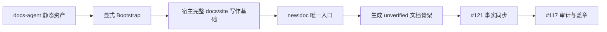

# Docs Authoring Foundation PRD

## 问题

`docs-site-bootstrap` 的执行协议、宿主脚本、页面、配置和五类模板目前共同内嵌在
单个内部指令文件中。静态正文没有作为真实资产存在，导致 Bootstrap、正式文档
编写流程和测试无法共同消费同一文件来源，内容演进时容易形成重复和漂移。

宿主已有 frontmatter、影响检查、版本检查、导航和站点构建能力，但没有机械创建
正式文档骨架的统一入口。维护者或 Agent 仍需手工选择模板、填写元数据、校验目标
路径并维护 change map，难以获得一致、可复验的创建结果。

## 产品目标

1. 提供与 AI Hub 文档站结构兼容、但可由宿主独立运行的默认写作基础。
2. 将 Bootstrap 静态输出资产化，使 Bootstrap、后续写作流程和测试共享同一来源。
3. 提供确定性脚手架，用唯一命令创建符合宿主写作 contract 的正式文档骨架。
4. 保持 Bootstrap 的完整交付、冲突保护、结果回读和重复执行零差异语义。

## 范围

- 将可按字节复制的 Bootstrap 静态输出迁入
  `docs-site-bootstrap/assets/docs/site/**`，并保持与宿主 `docs/site/**` 相同的
  相对路径；动态 manifest 继续由运行时生成。
- 让 Skill 指令只保留入口 gate、冲突处理、manifest 协议、写入顺序、资产索引和
  回读规则，不再内嵌完整静态正文。
- 交付 API、database、design、ops、product 五类宿主模板；每个模板只包含一个
  可由机器识别并提取的 scaffold 区块。
- 提供唯一宿主命令 `npm run new:doc -- ...`，其唯一实现为
  `docs/site/scripts/scaffold-doc.mjs`。
- 对文档类型、目标目录、必填输入、覆盖行为和 change-map 修改实施确定性约束；
  新页面固定为 `unverified`，页面与 change map 作为同一原子变更处理。
- 保持 Bootstrap 始终交付完整宿主基础；渐进加载只约束后续单类型写作流程，不能
  用于裁剪 Bootstrap 输出。

## 非目标与职责边界

- 不复制 AI Hub 的业务名称、代码路径、owners、历史版本、change map、release
  metadata 或正式文档正文；AI Hub 只作为结构来源、fixture 和验收样本。
- 不把 AI Hub 仓库、项目本地 Skill 或 CI 作为宿主运行时依赖。
- 不动态发现任意宿主 schema，不扫描全仓猜测事实，不批量生成全站正文。
- Release Notes 的生成与编辑归 issue #116，不进入 `new:doc`。
- 文档版本审计、状态变化和 `last_verified_version` 统一盖章归 issue #117。
- 多类型正式文档的范围确认、证据提取、事实写作和写后核对归 issue #121；本功能
  只提供写作基础与机械创建入口。
- 不修改宿主 GitHub Actions，不创建 tag、GitHub Release、镜像或部署产物。

## 关键产品决策

### 资产化交付

所有可复制的 Bootstrap 静态内容以真实资产文件为唯一交付来源。指令、脚手架实现
和测试不得再维护完整静态正文副本。

### 五模板唯一 scaffold 区块

五类模板既是宿主写作规则，也是对应文档骨架的唯一来源。脚手架只提取当前模板中
唯一、稳定标记的 scaffold 区块；单类型写作无需读取其他四类模板正文。

### `new:doc` 唯一入口

用户侧只暴露 `npm run new:doc -- ...`，实现固定为 `scaffold-doc.mjs`，不提供第二
套命令或可选实现。调用方必须显式提供类型、路径和必填元数据，脚手架不得伪造已
验证版本或未经证据确认的正文事实。

### Bootstrap 完整交付

Bootstrap 每次都交付完整目录、模板、脚本、配置和初始页面，并保留冲突确认、
`kept-as-is`、manifest 回读和重复执行 zero-diff。后续流程可以渐进读取，但不能
改变 Bootstrap 的完整性。

## 产品流程

## 验收面

issue #122 的验收标准按以下分组执行：

1. **资产与 Bootstrap**：静态输出来自同构资产路径并保持字节一致；冲突 gate、
   `kept-as-is`、manifest 回读和重复 zero-diff 保持；通用资产不含 AI Hub 项目事实。
2. **模板与渐进加载**：五类模板符合 #118 并参与宿主文档检查；每类只有一个
   scaffold 区块；单类型写作无需加载其他模板正文。
3. **脚手架**：唯一 `new:doc` 入口覆盖五类文档、显式输入、dry-run、类型与路径
   约束、默认不覆盖、固定 `unverified`、有界 change-map merge、原子写入、写后
   解析和 `test:docs`；Release Notes 明确交给 #116。
4. **宿主兼容性**：保留现有 prepare、check、public/internal build 和测试入口；
   导航仍由站点准备脚本生成，不重新定义宿主 CI workflow。
5. **测试与 eval**：确定性测试覆盖五类成功路径及输入、路径、覆盖、模板、dry-run、
   merge 和回滚反向场景；完成 fresh with-skill、fresh without-skill 验证并更新
   durable `comparison.md`。

## 依赖与开放问题

- issue #118 的 frontmatter 契约是硬前置；issue #121 依赖本功能提供完整宿主基础、
  五类模板和确定性 `new:doc`。
- 当前无阻塞开放问题。若 frontmatter 契约、模板类型、唯一命令名、change-map 合并
  语义或与 #116、#117、#121 的边界变化，必须先回到 PM 范围确认。

## 规格来源说明

本 PRD 由维护者已确认的 issue #122 规格转化而来。issue 中
`feature_level: 2` 的标注以仓库路径层级契约为准，修正为 level 3。
