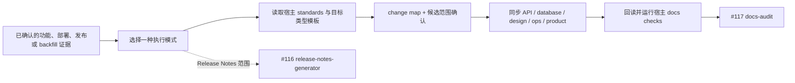

# Formal Docs Sync 多类型扩展 PRD

## 问题

`formal-docs-sync` 已定义 feature delivery、deployment verification、release 和
existing-system backfill 四种模式，也具备证据定界、change map 定位、当前状态写作、
写后回读以及 `unverified` 审计交接等基础能力，但已验收范围仍主要覆盖 feature 与
backfill 的 API 页面及 API `code_glob`。

宿主 VitePress 站点已经通过 issue #118 固化统一 frontmatter 契约，并通过 issue #122
交付 API、database、design、ops、product 五类模板和确定性 `new:doc` 脚手架。本功能
需要在这些硬前置上把同步能力扩展到五类正式文档，同时避免为每种类型复制 specialist、
模板正文或宿主业务事实。

## 产品目标

1. 将 `formal-docs-sync` 的已验收能力从 API 扩展为 API、database、design、ops 和
   product 五类当前状态正式文档同步。
2. 保持四种执行模式的证据、范围确认和职责边界清晰，禁止把计划、猜测或未来状态写成
   当前事实。
3. 统一执行八步站点契约：读取宿主标准和目标模板、应用 change map、确认候选范围、
   有界写入与回读、应用 #118、运行宿主检查并交给 #117 审计。
4. 通过渐进加载让单类型任务只读取通用入口和对应类型模块，不读取其他四类规则。
5. 始终以宿主 `docs/site/standards/templates/` 为模板单一真源，并优先建议使用宿主
   `npm run new:doc` 创建新页面骨架。

## 范围

- 扩展现有 `formal-docs-sync`，不新增重复 specialist。
- `SKILL.md` 仅保留入口门禁、四模式选择和通用同步流程指针。
- `_internal/INSTRUCTIONS.md` 作为渐进加载入口，承载通用八步站点契约。
- 为 API、database、design、ops、product 分别提供独立类型模块，定义该类型特有的
  证据检查、模板消费规则和输出约束。
- Feature delivery 根据已确认实现同步 API、database、design、适用的 product 页面及
  对应 change-map 条目；design 继续服从既有 closeout gate。
- Deployment verification 根据已确认部署事实同步 ops、upgrade 和 rollback 内容及
  对应映射，不把计划中的部署方式写成当前状态。
- Release 模式只同步受本次发布影响的 product / ops 页面并核对版本事实。
- Existing-system backfill 支持五类文档的有限确认批次，优先使用 feature catalog 与
  既有 change map，一次只执行一个批次。

## 非目标与职责边界

- 不定义或复制 frontmatter 字段、值域与校验语义；统一消费 issue #118 的契约真源。
- 不执行 `last_verified_version` 版本盖章；新改页面保持 `unverified`，交给 issue #117
  的 `docs-audit` 审计。
- 不生成、编辑 Release Notes 正文、版本索引或 release metadata；release 模式遇到该
  范围必须 handoff issue #116 的站内 `release-notes-generator`。
- 不创建或发布 GitHub Release，不创建或移动 tag，不发布镜像、不更新 Helm、不执行
  部署。
- 不初始化文档站；缺少 `docs/site/` 或 standards 时 handoff `docs-site-bootstrap`。
- 不迁移 AI Hub 的业务路径、项目事实、非 VitePress 逻辑、仓库本地 Skill、
  `docs/dev/` 或 archive 内容，也不把 AI Hub 作为运行时依赖。
- 不新增动态宿主 schema 或第二套可配置文档契约。

## 关键产品决策

### 单一 specialist、按类型渐进加载

四模式共享范围确认、当前状态写作、change-map 更新、回读、宿主检查和审计交接。
类型差异只进入五个独立模块；单类型执行只加载入口与一个目标类型模块，避免协议漂移和
无关上下文扩张。

### 宿主标准与模板是事实来源

每次执行先读取宿主 standards 入口，再读取目标类型模板。Marketplace skill 不内嵌
模板正文；新页面骨架优先由宿主 `npm run new:doc` 创建，正文仍必须由确认后的证据
填充并回读核对。

### 页面与 change map 同属确认范围

候选页面、代码范围、证据、排除项、未解决问题和 change-map delta 必须一起展示并等待
维护者确认。只写已确认范围；没有映射时先提出目标页面、代码范围和新条目，不从仓库
扫描直接扩张为全站生成。

### Release Notes 保持独立职责

Release 模式可核对和同步受影响的 product / ops 当前事实，但站内 Release Notes 的
正文、索引和 metadata 始终交给 #116 specialist；本功能不以 release 模式绕过边界。

## 产品流程

## 验收面

1. **Feature delivery**：可基于完整证据链同步 API、database、design 和适用的 product
   页面；design 的七项 closeout 条件和原子范围保持有效。
2. **Deployment verification**：可同步 ops runbook、upgrade、rollback、环境变量、
   启动方式及 Helm / Compose 等已验证当前事实。
3. **Release**：只同步受影响 product / ops 页面并核对版本事实；Release Notes 请求
   明确 handoff #116。
4. **Existing-system backfill**：五类文档均支持按 feature catalog 或 change map 划定的
   单批次确认，不做全站扫描生成。
5. **站点契约**：所有类型执行通用八步协议，页面和 change-map 条目同范围确认并写后
   回读；新改页面符合 #118 且保持 `unverified`。
6. **模板与加载**：宿主五模板是唯一正文来源；新页面优先建议 `npm run new:doc`；
   单类型任务不加载其他四类模块。
7. **验证**：宿主 docs checks 通过；AI Hub-shaped fixture 使用
   `npm run test:docs`；S2 完成 fresh with-skill、fresh without-skill 和 durable
   `comparison.md`。
8. **独立性与负向边界**：AI Hub 不可用时 skill 仍可执行，且不越权初始化站点、盖章、
   操作 Release / tag / 部署或定义动态 schema。

## 依赖与开放问题

- issue #118 和 #122 已合并，是本功能的硬前置；本功能分别消费其 frontmatter 契约与
  五模板 / `new:doc` 单一来源。
- issue #117 是同步成功后的审计与统一盖章 owner；issue #116 是站内 Release Notes
  owner。
- 当前无阻塞产品开放问题。若五类模板、frontmatter 契约、design closeout gate、
  Release Notes 边界或宿主检查入口变化，必须先回到 PM 范围确认。

## 规格来源说明

本 PRD 由维护者已批准的 GitHub issue #121 蒸馏而来；`request_type` 为
`existing_update`，`change_tier` 为 `major`，功能路径按仓库契约记录为层级 3。
