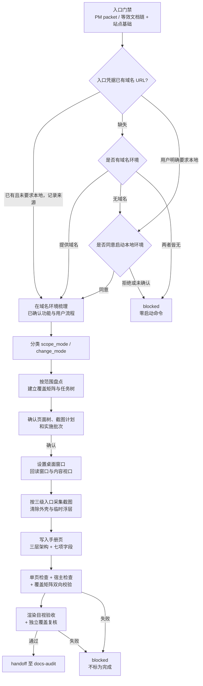

# manual-gen PRD

## 背景

`manual-gen` 与 `docs-agent` 的其他四个 specialist 分工：`docs-site-bootstrap` 初始化站点骨架，`formal-docs-sync` 同步 API / 数据库 / 设计 / 运维 / 产品五类当前事实，`release-notes-gen` 产出站内版本说明，`docs-audit` 执行发版门禁。这四者主要消费代码与已确认过程文档；`manual-gen` 还必须消费真实运行界面和截图证据。

结果是文档站能说明平台"有什么"，却不能交付读者照着做完一件业务任务的图文手册。宿主项目的真实缺口是：新用户拿到平台后，没有一份以真实界面为证据、按业务任务组织、可被目标角色复现的操作说明。

`web-manual-docx` 一类工具已验证了有效约束：以真实界面为截图证据、清除浏览器外壳与临时浮层、图文混排、交付前做页面渲染与目视验收。本功能借鉴这套约束，但把交付目标从 DOCX 换成宿主项目的正式文档站。

**不扩展 `formal-docs-sync` 的理由。** 其五个类型模块共享「代码与已确认文档 → 纯文本当前事实」的证据链，而手册的证据链是「运行界面截图 → 图文混排的任务导向文档」。证据来源、工具依赖、产物形态三者均不同：作为第六个 type 模块塞入，会迫使其八步宿主契约的第 1、2、5、7 步为截图链开例外口子，污染既有五类契约。独立 skill 的边界更干净，代价是 marketplace 注册、`skills-lock.json`、`docs-agent` 路由分支与新 test 目录，属 `major` 级变更。

## 目标

1. `docs-agent:manual-gen` 在文档站入口门禁已满足时，为维护者确认的局部或完整手册范围，基于当前代码、真实运行界面和可见操作生成或更新站内图文用户操作手册。
2. 建立截图证据链的运行环境协商协议：域名环境优先，本地环境需显式同意，两者皆不可用时明确阻塞。
3. 建立可复现的截图视口契约：显式设定桌面窗口，分别回读实际窗口与内容视口，按截图自然比例展示。
4. 手册信息架构按平台层、业务层、操作层三级组织；先区分增量补增与整体重写，再按独立用户任务决定目录和叶子页，保证目标角色可复现。
5. 正式文档层新增 `doc_type: manual` 与独立根 `docs/site/manual/`，与现有五类平级，并交付配套模板与脚手架支持。
6. 局部范围保持有限批次；完整手册范围先完成全功能盘点、覆盖矩阵和完整页面树确认，再按已确认批次持续实施，并以全量覆盖门禁结束。

## 非目标

- 不创建独立的 DOCX 手册生成 skill。
- 不实现浏览器自动化框架、应用启动脚本或部署环境；只消费宿主已有的执行入口。
- 不把局部请求扩张为所有角色、所有管理后台模块或全站页面；维护者明确要求完整手册或完整文档站时，必须保留该全量范围，不能用局部批次规则将其缩小。
- 不由 `manual-gen` 单独生成非手册类型的完整文档站；`full-site` 请求由 PM 拆分职责，`manual-gen` 只执行其中已确认的手册范围。
- 不改动 `formal-docs-sync` 现有五类契约与八步流程，不改动 `release-notes-gen` 与 `docs-audit` 的既有职责边界。
- 不为截图过期新增告警机制或第二套变更检测协议。
- 不发明新的宿主浏览器能力契约；执行入口复用仓库既有三级优先级。
- 不在本功能内统一仓库 `-generator` 后缀的命名规范；该项作为独立治理变更另行推进。

## 用户画像

| Persona | Description | Key Needs | Pain Points |
|---------|-------------|-----------|-------------|
| 宿主项目维护者 | 在自己项目安装 agent 套件、需要对外交付操作说明的开发者 | 手册以真实界面为证据、范围可控、可增量更新 | 手写手册成本高且很快过期；截图散落无统一标准 |
| 平台新用户 | 首次使用宿主平台、需要完成具体业务任务的人 | 按任务组织的步骤、能对上界面的截图、明确的预期结果 | 只有功能清单，不知道从哪一步开始，也不知道做对了没有 |
| 客户成功 / 售前 | 需要向外部演示或答疑的人 | 可直接引用的图文说明，敏感信息已脱敏 | 自己截图容易带出真实数据与浏览器外壳 |
| `docs-audit` | 发版前核对正式文档事实的下游 | 手册页有明确的证据边界与版本锚 | 无 `related_code` 的页面无法界定核对范围 |

## 用户故事与场景

| ID | User Story | Priority | Acceptance Criteria |
|----|-----------|----------|---------------------|
| US-M01 | 作为维护者，我想提供一个可通过域名访问的环境，让 skill 在真实界面上生成已确认范围的图文手册。 | P0 | 入口凭据或 handoff 已提供域名环境时，skill 直接使用该 URL 并记录来源，不重复提问；域名证据缺失时才先询问域名环境，获得后按已确认的局部或完整手册范围梳理功能与用户流程。 |
| US-M02 | 作为维护者，我不希望 skill 未经允许就在我机器上启动本地服务。 | P0 | 无可用域名环境或用户明确要求本地时，skill 先询问是否同意自行启动本地环境；未获明确同意前不执行任何启动命令；用户拒绝时结果为 blocked。 |
| US-M03 | 作为维护者，当环境、登录态或功能可用性不足时，我要看到明确的阻塞项而不是被补齐的假手册。 | P0 | 证据不足时明确记录阻塞项与缺失证据，不虚构界面、不使用无关示例图、不把手册标为完成。 |
| US-M04 | 作为平台新用户，我要按手册目录先理解平台定位与适用角色，再找到我的业务场景，最后照着操作步骤做完任务。 | P0 | 手册目录与正文清晰呈现平台层、业务层、操作层；操作层每个关键操作含七项固化字段，步骤可由目标角色复现。 |
| US-M05 | 作为客户成功，我要确信手册截图与图注里不含 Token、密钥、邮箱、个人信息、费用与调用日志。 | P0 | 默认使用测试数据；已知敏感字段在截图与图注中不出现；环境相关的长串标识不原样抄进正文。 |
| US-M06 | 作为维护者，我不希望生成手册的过程在我的业务数据上产生副作用。 | P0 | 创建、删除、发布、权限变更等状态变更操作只在已确认的测试范围执行；范围外不执行。 |
| US-M07 | 作为维护者，我要局部补增和完整手册都按已确认计划推进。 | P0 | 局部请求确认单个有限批次；完整手册先确认全量覆盖矩阵、完整页面树和全部实施批次，之后逐批持续执行，除非范围或页面树变化，否则不把每批重新确认为新的范围门禁。 |
| US-M08 | 作为维护者，我要手册页与站点其他文档一样通过既有的 frontmatter 校验、导航校验与发版审计。 | P0 | 手册页使用 `doc_type: manual`，满足共享 frontmatter 契约七个必填字段，通过宿主既有 docs 检查，并可被 `docs-audit` 正常处理。 |
| US-M09 | 作为维护者，我要在交付前确认截图与文档页面在站点上渲染正确。 | P0 | 交付前对渲染出的手册页面做目视验收；渲染失败或截图缺失时结果为 blocked。 |
| US-M10 | 作为 `docs-audit`，我要能界定每个手册页的证据范围。 | P1 | 每个手册页的 `related_code` 填承载该界面的前端路由或组件路径，非空且可定位。 |
| US-M11 | 作为维护者，我希望新增功能优先在仍然有效的现有目录中补页或拆分子目录，而整体重写时重新验证信息架构。 | P0 | `change_mode: extend` 保留有当前证据支持的路径并补增或拆分；`change_mode: rewrite` 从当前产品功能模型推导目标树，旧文档只作核对证据。 |
| US-M12 | 作为维护者，我要在写后知道手册是否真的覆盖了确认范围，而不只是构建成功。 | P0 | 完成单页、导航、覆盖矩阵双向映射和独立覆盖审查；完整手册存在未解释遗漏时不得标记完成。 |

## 功能需求

| ID | Feature | Description | Priority | Acceptance Criteria |
|----|---------|-------------|----------|---------------------|
| FR-M01 | 入口门禁 | 要求 PM handoff packet 或等效已确认文档链，并要求宿主已存在 `docs/site/` 基础与标准入口。沿用 `formal-docs-sync` 同级的入口依据强度；直接调用不豁免该门禁。站点基础缺失时不初始化站点，返回 `docs-site-bootstrap` handoff。 | P0 | 缺少入口依据时零站点写入并引导补齐；站点基础缺失时给出 bootstrap handoff 而非自行创建目录。 |
| FR-M02 | 运行环境协商协议 | 入口凭据或 handoff 已提供域名可访问环境时，直接使用该已确认 URL 并记录来源，不再提问。仅当域名证据缺失时，第一个问题才询问是否有可通过域名访问的截图环境，且不得与本地启动合并成并列二选一。仅当无可用域名环境，或用户明确要求改用本地环境时，才询问是否同意自行启动本地环境；未获明确同意前不得执行启动命令。两者皆不可用时 blocked。 | P0 | 三条路径各自可复现：handoff 已提供域名时不重复提问并进入采集；域名证据缺失时先单独询问域名环境；需本地时先征得同意；拒绝或无环境时 blocked 且零启动命令。 |
| FR-M03 | 视口契约 | 截图前显式设置维护者确认的桌面窗口尺寸；未指定时可使用 1920×1080 作为窗口目标，但不得把它推断为内容视口。分别回读实际窗口尺寸与页面内容视口，确认未进入非预期响应式布局。截图按其自然宽高比展示，不强制缩放成 1920×1080 或 16:9。 | P0 | 窗口设定、实际窗口回读、内容视口回读为可观察证据；无法回读或进入非预期布局时停止采集；交付图片无横向或纵向拉伸。 |
| FR-M04 | 执行入口优先级 | 截图执行入口复用仓库既有三级优先级：repo harness > Chrome plugin / browser connector > Playwright fallback。不新增第四种宿主能力契约，不假设 Playwright 是唯一有效工具；宿主提供的 harness 内部使用 Playwright 时仍按 repo harness 计。 | P0 | 选定入口时说明其为何覆盖当前采集需求；三级均不可用时 blocked。 |
| FR-M05 | 截图卫生 | 同一批次内截图保持统一窗口、内容视口、缩放、主题与导航状态；只保留产品内容，去除浏览器标签栏、地址栏、工具栏、窗口边框，以及加载态、翻译弹窗、促销横幅、营销弹窗等与所记录任务无关的浮层。属于已确认操作步骤本身的菜单或对话框是产品证据。 | P0 | 交付截图不含浏览器外壳与任务无关浮层；操作步骤依赖的菜单或对话框被保留；图片保留采集结果的自然比例。 |
| FR-M06 | 脱敏与副作用边界 | 默认使用测试数据；隐藏 Token、密钥、邮箱、个人信息、费用、调用日志等敏感字段；环境相关的长串标识不原样抄进正文。创建、删除、发布、权限变更等状态变更操作只能在已确认的测试范围执行。 | P0 | 截图与图注不含已知敏感字段；正文不含环境相关长串标识；范围外副作用操作不被执行。 |
| FR-M07 | 手册信息架构 | 目录按平台层、业务层、操作层三级组织，而非扁平页面清单。平台层写平台定位、适用对象与角色边界；业务层写业务场景、能力目的与模块关系；操作层写可执行任务流程、步骤与结果。`extend` 模式复用仍有当前证据支持的现有层级并按需要新增页面或拆分子目录；`rewrite` 模式不把旧目录当作目标骨架。 | P0 | 目录与正文呈现三个层次；每个路径的保留、新增、拆分或替换都能追溯到当前产品证据和已确认模式。 |
| FR-M08 | 操作条目字段结构 | 每个关键操作至少包含七项固化字段：适用角色、前置条件、编号操作步骤、可见界面说明、对应截图与图注、预期结果、注意事项或异常处理。该字段结构由 manual 模板的 `docs-scaffold` 块固化。 | P0 | 每个操作条目七项字段齐备；缺项时不视为完成。 |
| FR-M09 | 批次与范围确认 | `bounded` 写入前展示并确认一个有限候选批次。`full-manual` 写入前展示并确认完整覆盖矩阵、目标页面树、全部实施批次和显式排除项；之后一次执行一个已批准批次并持续推进，范围或页面树变化时才重新确认。 | P0 | 未确认时零写入；局部请求不扩张；完整手册不会被批次规则缩小，所有已确认批次均有完成状态。 |
| FR-M10 | manual 文档类型与站点落点 | 共享 frontmatter 契约的 `doc_type` 枚举新增 `manual`，手册页落在独立根 `docs/site/manual/`，与 API / 数据库 / 设计 / 运维 / 产品五类平级，不归入 `product`。`docs-audit` 的枚举副本同步更新。 | P0 | 手册页 `doc_type: manual` 通过宿主 frontmatter 校验；`docs-audit` 不因未知枚举判定页面无效。 |
| FR-M11 | manual 模板与脚手架 | `docs-site-bootstrap` 交付资产新增 manual 模板（含唯一 `docs-scaffold` 块与 FR-M08 字段结构）、`docs/site/manual/index.md` 根索引、脚手架类型映射与导航分区。模板是唯一模板源，skill 内不维护第二份模板正文。 | P0 | 宿主可通过既有脚手架入口创建手册页；skill 内无重复模板正文。 |
| FR-M12 | 证据边界与版本锚 | 手册页 `related_code` 填承载该界面的前端路由或组件路径，非空且可定位，用途是 `docs-audit` 的证据边界。新建或更新的手册页 `last_verified_version` 置为 `unverified`，版本盖章仍归 `docs-audit`。 | P0 | 每个手册页有可定位的 `related_code`；本 skill 不盖版本章。 |
| FR-M13 | 渲染目视验收 | 交付前运行宿主既有 docs 检查，并对渲染出的手册页面做目视验收，确认截图可见、图文对应、导航可达。截图随站点构建打包，读者访问的文档与截图属同一构建版本，因此不为截图过期新增告警机制。 | P0 | 验收结果与命令、工作目录、退出状态一并记录；渲染失败或截图缺失时 blocked。 |
| FR-M14 | 阻塞语义 | 环境、登录态、功能可用性、截图权限、执行入口或渲染验收任一不满足时，明确记录阻塞项与缺失证据，不伪造完成状态、不虚构界面、不使用无关示例图。 | P0 | 任一阻塞条件下手册不被标为完成，报告含阻塞项、owner 与下一步。 |
| FR-M15 | 边界保持 | 不修改 `formal-docs-sync` 的五类契约与八步流程，不生成或编辑 Release Notes 面，不创建或移动 tag，不执行发版操作，不初始化站点。 | P0 | 现有同步、回填与 Release Notes 边界零回归。 |
| FR-M16 | 存量宿主升级路径 | 已 bootstrap 过的宿主通过重跑 `docs-site-bootstrap` 获得 manual 类型支持，复用其既有幂等、逐文件 keep/overwrite 与 manifest `kept-as-is` 记录机制。宿主本地改过相关脚本时会进入既有冲突决策流程。 | P1 | 存量宿主重跑后可创建并校验手册页；不为此新增第二套升级机制。 |
| FR-M17 | 范围模式分类 | 盘点或写作前把 `scope_mode` 分类为 `bounded`、`full-manual` 或 `full-site`。明确的局部页面/流程为 `bounded`；完整手册、整个产品功能覆盖为 `full-manual`；所有正式文档面为 `full-site`。 | P0 | 分类及依据进入计划和最终报告；`full-site` 中非手册范围返回 PM 拆分，手册子范围继续由本 skill 执行。 |
| FR-M18 | 目录变更模式分类 | 独立于范围模式分类 `change_mode`：用户明确要求舍弃旧文档、重写或重建时为 `rewrite`；未明确要求替换且目标是新增、补齐或更新时默认为 `extend`。新增功能可以在现有有效目录下新增叶子页或拆分子目录。 | P0 | 全量不自动等于换目录，增量也不默认旧目录正确；计划记录现有路径的保留、新增、拆分或替换依据。 |
| FR-M19 | 写前覆盖矩阵与拆页 | `full-manual` 在写任何页面前，基于当前代码、路由、真实界面和角色权限建立完整覆盖矩阵。每个独立用户任务必须有且只有一个归属叶子页；独立入口、目标结果、权限/前置条件、风险、异常处理、截图证据或更新节奏任一不同，默认拆页。必须连续完成同一目标且共享入口和结果的动作可合并。 | P0 | 矩阵至少含角色、入口、可见功能、独立目标、操作与结果、权限/前置、父页、叶子页、代码/界面证据和截图需求；无归属或重复归属任务阻止写作。 |
| FR-M20 | 写后覆盖门禁 | 写后先校验叶子页可复现性，再校验确认范围的功能、任务、页面、导航和覆盖矩阵双向映射。父级索引只描述范围、关系与导航，不替代操作页。完整手册还需独立覆盖复核，未解释遗漏时不得完成。 | P0 | 可见路由、菜单动作、按钮、对话框和适用角色均已审计；每个独立任务有归属页；叶子页包含步骤和结果；页面均可导航到达；独立复核无未解释遗漏。 |

## 非功能需求

| Category | Requirement | Metric | Target |
|----------|-------------|--------|--------|
| Portability | 技术栈无关，不假设宿主框架或浏览器工具实现 | eval 覆盖 | 无框架或工具名假设导致的失败断言 |
| Reproducibility | 同一环境重复执行产出一致的桌面页面状态 | 视口回读 | 每轮截图前记录实际窗口与内容视口，且未进入非预期响应式布局 |
| Safety | 未经同意不启动本地环境，不执行范围外副作用操作 | 反向场景 | 拒绝与未确认两种场景下零启动命令、零副作用 |
| Privacy | 已知敏感字段不进入截图、图注与正文 | 负向断言 | 敏感字段与环境长串标识零出现 |
| Scope control | 局部不扩张、全量不收缩 | 范围与批次纪律 | 未确认零写入；完整手册的已确认批次全部闭环 |
| Cost | 一份手册的截图规模可控 | 截图数量 | 单批次维持在维护者确认的范围内 |

## 用户流程

主流程：

阻塞流：环境不可用、登录态缺失、功能不可达、截图权限不足、三级执行入口均不可用、窗口或内容视口无法回读、内容进入非预期响应式布局、覆盖矩阵未闭环、独立复核或渲染验收失败——任一情况记录阻塞项与缺失证据并停止，不以虚构界面或无关示例图补齐。

## UI/UX 需求

本功能的产物形态是宿主文档站中的手册页面，UI 要求即页面呈现要求：

- **目录呈现**：侧边导航与页面标题层级同时体现平台层、业务层、操作层，读者能从平台定位逐级下钻到具体操作。
- **图文混排**：截图紧邻其所属步骤，图注说明该图展示的界面区域与关键控件，不出现无图注的孤立截图或无截图的纯步骤描述。
- **截图一致性**：同一批次内截图使用一致的窗口、内容视口、缩放、主题和导航状态；保留图片自然宽高比，不以固定 16:9 容器拉伸。
- **可复现性**：操作步骤按编号排列，每步对应可见界面元素；读者按步骤操作后能用「预期结果」自查是否成功。
- **无关内容清除**：页面与截图中不出现浏览器外壳、加载态、临时浮层、促销与营销内容。

## 数据模型

| Entity | Key Attributes | Relationships |
|--------|----------------|---------------|
| Manual Page | path, `doc_type: manual`, visibility, stage, owners, related_code, last_verified_version, 所属层级（平台 / 业务 / 操作） | belongs_to 站点 manual 根；described_by change-map entry |
| Operation Entry | 适用角色, 前置条件, 编号操作步骤, 可见界面说明, 截图与图注, 预期结果, 注意事项与异常处理 | contained_in Manual Page；references Screenshot Asset |
| Screenshot Asset | 文件路径, 采集视口, 来源环境, 采集时刻页面状态 | referenced_by Operation Entry；随站点构建打包 |
| Manual Template | `docs-scaffold` 块, 目标 `doc_type: manual`, 七项字段骨架 | delivered_by `docs-site-bootstrap`；consumed_by `manual-gen` |
| Change-Map Entry | code_glob, required_docs, trigger | grown_by `manual-gen`；read_by `docs-audit` 与消费侧 Agent |
| Coverage Matrix | role, entry point, visible feature, independent goal, operation/result, prerequisite, parent page, owning leaf page, code/interface evidence, screenshot need | precedes Manual Page writes；validated_bidirectionally_after writes |

## 接口与文件触点

| Touchpoint | Method | Purpose |
|----------|--------|---------|
| 宿主 `docs/site/manual/**` | File read/write | 手册页与根索引的读写落点 |
| 宿主截图资产目录 | File write | 截图落盘位置，随站点构建打包 |
| 宿主 `docs/site/standards/change-map.yaml` | File read/write | 手册页的代码到文档映射条目 |
| 宿主 `docs/site/standards/templates/` manual 模板 | File read | 唯一模板源，含 `docs-scaffold` 块 |
| 宿主 docs 检查命令 | Execute | frontmatter、导航与站点构建校验 |
| 运行环境（域名或本地） | Read / Navigate | 截图证据来源；本地启动需显式同意 |
| `agents/docs/skills/docs-agent/SKILL.md` | File write | 保留范围模式与完整站点拆分边界后路由到 `manual-gen` |
| `agents/docs/skills/manual-gen/**` | File write | 范围/目录分类、覆盖矩阵、拆页、截图和写后校验的权威执行契约 |
| `agents/docs/skills/docs-site-bootstrap/assets/docs/site/standards/doc-granularity.md` | File write | 向宿主交付增量/重写目录策略、任务拆页和索引页职责 |
| `skills-lock.json` | File write | 刷新 `docs-agent`、`manual-gen`、`docs-site-bootstrap` 的内容哈希 |
| `agents/docs/README.md` / `README_zh.md` | File write | 将 `manual-gen` 输入从有限范围更新为已确认的局部或完整手册范围 |

## 假设与约束

| Type | Description | Impact if Wrong |
|------|-------------|-----------------|
| Constraint | 宿主已有 `docs/site/` 基础与标准入口；本 skill 不初始化站点。 | 无站点宿主直接 blocked，需先走 `docs-site-bootstrap`。 |
| Constraint | `doc_type` 枚举同时存在于 skill 契约与 `docs-site-bootstrap` 交付给宿主的脚本资产中，两处必须同步。 | 只改其一会让手册页在宿主 frontmatter 校验中失败。 |
| Constraint | 截图执行入口沿用仓库既有三级优先级，不新增宿主能力契约。 | 另立契约会与 QA 既有约定分叉，宿主需维护两套认知。 |
| Assumption | 宿主文档站构建产物包含截图静态资产，读者访问的文档与截图属同一构建版本。 | 若截图由外部动态加载，则需要另行定义过期检测，本 PRD 的「无运行期漂移」结论不成立。 |
| Assumption | 维护者能提供可访问的运行环境与可用的测试数据范围。 | 无环境或无测试数据时本功能只能产出阻塞报告。 |
| Assumption | 手册页的界面可映射到具体前端路由或组件路径，用于填充 `related_code`。 | 无法映射时该页无法满足必填 frontmatter，需要维护者补充依据。 |

## 依赖

**内部依赖**

- `docs-agent`：路由分流与入口凭据检查。
- `docs-site-bootstrap`：交付 manual 模板、根索引、脚手架类型映射与导航分区；存量宿主的升级路径。
- `docs-agent/_internal/_shared/frontmatter-contract.md`：`doc_type` 枚举的权威定义。
- `docs-audit`：手册页的发版审计与版本盖章。
- `formal-docs-sync`：入口依据与变更映射纪律的同级参照；本功能不修改其契约，也不让其有限回填规则覆盖完整手册范围。

**外部依赖**

- 宿主提供的截图执行入口：repo harness、Chrome plugin / browser connector 或 Playwright。
- 宿主运行环境：可通过域名访问的部署，或经用户同意启动的本地环境。

## 发布计划与里程碑

| Phase | Scope | Target Date | Owner |
|-------|-------|-------------|-------|
| Phase 1 | 对齐 `scope_mode`、`change_mode`、覆盖矩阵、拆页和完成门禁的 PRD/TRD | 2026-08-18 | Maintainer |
| Phase 2 | 更新 `docs-agent` 路由与 `manual-gen` 入口、执行和报告契约 | 2026-08-18 | Maintainer |
| Phase 3 | 更新宿主文档粒度标准与 Docs 双语说明，刷新受影响 Skill 哈希 | 2026-08-18 | Maintainer |
| Phase 4 | 运行共享契约、仓库契约、文档契约、现有测试与 diff 验证，并做独立范围复核 | 2026-08-18 | Maintainer |

推进顺序 1 → 2 → 3 → 4：先固定当前需求和技术事实，再修改执行契约与宿主标准，最后同步锁文件并验证；不重复改动已经存在的 `doc_type: manual` 类型和站点脚本。

## 风险与缓解

| Risk | Likelihood | Impact | Mitigation |
|------|------------|--------|------------|
| 浏览器窗口为 1920×1080，但浏览器外壳使内容视口更小；若把图片强制进 16:9 会变形 | High | 手册截图与真实桌面界面比例不符 | FR-M03 分别记录实际窗口和内容视口，只校验桌面布局并保持截图自然比例 |
| 模型为补齐手册而虚构界面或使用无关示例图 | Medium | 手册失去证据价值且难以察觉 | FR-M14 阻塞语义 + eval 反向场景断言；证据不足时明确 blocked |
| 局部手册无边界扩张，或完整手册被有限批次规则错误缩小 | Medium | 前者失控，后者遗漏功能 | FR-M17 先判定范围；FR-M09 分别定义局部批次和完整计划 |
| 旧目录被无条件继承或无条件推翻 | High | 增量改动过度或全量重写继续沿用过时结构 | FR-M18 将范围和目录策略分离，并要求逐项记录保留、新增、拆分或替换依据 |
| 构建与链接通过后误判为覆盖完成 | High | 可运行但功能缺页 | FR-M19 写前矩阵 + FR-M20 写后双向校验与独立覆盖复核 |
| 生成过程在真实业务数据上产生副作用 | Medium | 破坏宿主数据 | FR-M06 状态变更操作仅限已确认测试范围；eval 只选择可证明非写入的核心流程，或使用具备测试账号、测试数据与重置权限的可丢弃环境 |
| `doc_type` 枚举两处不同步 | Medium | 手册页在宿主校验中失败，功能实际不可用 | 列为约束项，Phase 1 内两处同时变更并由契约检查覆盖 |
| 存量宿主脚本本地改动导致重跑冲突 | Low | 升级路径受阻 | 复用 `docs-site-bootstrap` 既有逐文件 keep/overwrite 与 manifest 机制，不新增机制 |
| eval 依赖外部实时站点，站点改版导致断言无触发条件 | Medium | 误判为 skill 回归 | 未触发断言记 `NOT EXERCISED`，计入 Coverage result 而非 Behavior result |

## 待确认问题

| # | Question | Owner | Deadline | Resolution |
|---|----------|-------|----------|------------|
| 1 | 手册能力扩展 `formal-docs-sync` 还是新建独立 skill？ | Maintainer | 2026-08-05 | 新建独立 skill。五个类型模块共享纯文本证据链，手册的证据来源、工具依赖与产物形态三者均不同，作为第六个 type 会迫使八步契约开例外口子。 |
| 2 | 手册页使用哪个 `doc_type`，落在站点何处？ | Maintainer | 2026-08-05 | 新增 `doc_type: manual`，独立根 `docs/site/manual/`，与现有五类平级，不归入 `product`。 |
| 3 | manual 模板是否固化操作条目的字段结构？ | Maintainer | 2026-08-05 | 固化七项字段（适用角色 / 前置条件 / 编号操作步骤 / 可见界面说明 / 截图与图注 / 预期结果 / 注意事项与异常处理），后续有问题再改。该固化约束的是单个操作条目，与「eval 不比对站点目录结构」不冲突。 |
| 4 | `related_code` 必填非空，手册页填什么？ | Maintainer | 2026-08-05 | 填承载该界面的前端路由或组件路径，用途是 `docs-audit` 的证据边界，不承担截图过期告警职责。 |
| 5 | 截图过期如何检测？ | Maintainer | 2026-08-05 | 不新增告警机制。截图随站点构建打包，读者访问的文档与截图属同一构建版本，无运行期漂移；复检形态是生成时在渲染出的页面上做目视验收。 |
| 6 | 是否为截图能力定义新的宿主契约？ | Maintainer | 2026-08-05 | 不定义。复用仓库既有三级优先级 repo harness > Chrome plugin / browser connector > Playwright fallback，权威定义在 `AGENTS.md` 与 QA 三个 skill 中。 |
| 7 | 桌面截图尺寸如何保证？ | Maintainer | 2026-08-18 | 显式设置确认的桌面窗口尺寸，分别回读实际窗口和内容视口；回读不可由设定值推断。1920×1080 只可作为窗口目标，不强制内容视口或图片为 16:9。 |
| 8 | eval 用哪个运行环境样本？ | Maintainer | 2026-08-06 | 按 #235 契约不再固定样本：每轮执行前由维护者确认平台名、可访问 URL 与本地代码路径后注入。已淘汰 Grafana Play、Practice Software Testing Toolshop、Playwright TodoMVC 与早期 mermaid.live 固定选型。 |
| 9 | eval 执行入口选哪个？ | Maintainer | 2026-08-06 | 按 skill 采集入口优先级执行：repo harness > Chrome 插件 / browser connector > Playwright fallback（对齐 `manual-gen/_internal/INSTRUCTIONS.md` 采集入口契约），保证两条 lane 都能生成本轮新的 `without_skill` baseline。 |
| 10 | eval 的采集脚本是否入库？ | Maintainer | 2026-08-06 | 按 #245 收敛后仅 eval-001 保留通用采集执行说明（`evals/README.md`），不再提交 eval 专属 `scripts/*.spec.md`（随 eval-004/005 删除）；平台相关采集脚本按宿主与采集入口（repo harness > Chrome 插件 > Playwright）在运行期准备，截图仍写隔离 scratch workspace，不入库。 |
| 11 | eval 断言如何避免脆弱？ | Maintainer | 2026-08-05 | 一律语义判断，不比对具体目录结构，不断言手册划分出哪几个业务模块或模块叫什么名字；目录组织是 skill 应随宿主平台自适应的能力。 |
| 12 | eval 测试集是否覆盖付费功能与多角色？ | Maintainer | 2026-08-18 | 不预设固定平台能力或认证方式。局部模式按确认流程注入角色和安全事实；完整手册模式必须盘点所有确认适用角色和可见功能。环境相关标识脱敏不绑定具体场景。 |
| 13 | skill 命名？ | Maintainer | 2026-08-05 | `manual-gen`，与 `trd-gen`、`prd-gen` 的 `-gen` 后缀对齐。仓库现有四个 `-generator` 后缀 skill 的命名统一作为独立治理变更另行推进，不并入本功能。 |
| 14 | 完整手册是否必然重建目录？ | Maintainer | 2026-08-18 | 否。`scope_mode` 与 `change_mode` 独立：完整手册可在有效现有目录上补齐，只有明确要求舍弃旧文档、重写或重建时才使用 `rewrite`。 |
| 15 | 新增功能是否可以沿用现有目录？ | Maintainer | 2026-08-18 | 可以。未要求替换时默认为 `extend`，但要核对受影响目录；独立任务可新增叶子页，满足拆分条件时建立子目录。 |
| 16 | 完整手册能否继续按批次实施？ | Maintainer | 2026-08-18 | 可以。先一次确认完整覆盖矩阵、页面树和全部批次，再逐批持续实施；批次是执行单位，不是缩小全量范围的依据。 |
| 17 | 完成标准是否等于构建、链接和渲染通过？ | Maintainer | 2026-08-18 | 否。还需覆盖矩阵双向映射、任务级叶子页检查、导航可达和独立覆盖复核。 |
