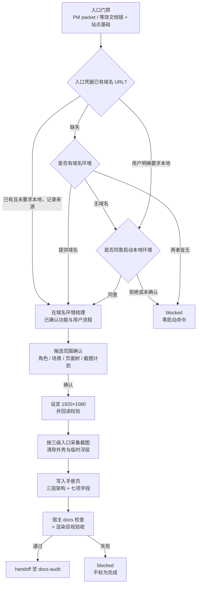

# manual-gen PRD

## 背景

`docs-agent` 已有 4 个 specialist：`docs-site-bootstrap` 初始化站点骨架，`formal-docs-sync` 同步 API / 数据库 / 设计 / 运维 / 产品五类当前事实，`release-notes-gen` 产出站内版本说明，`docs-audit` 执行发版门禁。这四者共享同一条证据链——代码与已确认过程文档推导出纯文本当前事实。

结果是文档站能说明平台"有什么"，却不能交付读者照着做完一件业务任务的图文手册。宿主项目的真实缺口是：新用户拿到平台后，没有一份以真实界面为证据、按业务任务组织、可被目标角色复现的操作说明。

`web-manual-docx` 一类工具已验证了有效约束：以真实界面为截图证据、清除浏览器外壳与临时浮层、图文混排、交付前做页面渲染与目视验收。本功能借鉴这套约束，但把交付目标从 DOCX 换成宿主项目的正式文档站。

**不扩展 `formal-docs-sync` 的理由。** 其五个类型模块共享「代码与已确认文档 → 纯文本当前事实」的证据链，而手册的证据链是「运行界面截图 → 图文混排的任务导向文档」。证据来源、工具依赖、产物形态三者均不同：作为第六个 type 模块塞入，会迫使其八步宿主契约的第 1、2、5、7 步为截图链开例外口子，污染既有五类契约。独立 skill 的边界更干净，代价是 marketplace 注册、`skills-lock.json`、`docs-agent` 路由分支与新 test 目录，属 `major` 级变更。

## 目标

1. 新增 `docs-agent:manual-gen` specialist：在文档站入口门禁已满足时，为维护者确认的有限功能范围，基于真实运行界面截图生成或更新站内图文用户操作手册。
2. 建立截图证据链的运行环境协商协议：域名环境优先，本地环境需显式同意，两者皆不可用时明确阻塞。
3. 建立可复现的截图视口契约：1920×1080 显式设定并在截图前回读校验。
4. 手册信息架构按平台层、业务层、操作层三级组织，操作条目字段结构固化，保证目标角色可复现。
5. 正式文档层新增 `doc_type: manual` 与独立根 `docs/site/manual/`，与现有五类平级，并交付配套模板与脚手架支持。
6. 沿用 `formal-docs-sync` 同级的入口依据、有限批次、变更映射与正式文档边界，不成为无边界的全站文档生成器。

## 非目标

- 不创建独立的 DOCX 手册生成 skill。
- 不实现浏览器自动化框架、应用启动脚本或部署环境；只消费宿主已有的执行入口。
- 不默认覆盖所有角色、所有管理后台模块或全站页面。
- 不改动 `formal-docs-sync` 现有五类契约与八步流程，不改动 `release-notes-gen` 与 `docs-audit` 的既有职责边界。
- 不为截图过期新增告警机制或第二套变更检测协议。
- 不发明新的宿主浏览器能力契约；执行入口复用仓库既有三级优先级。
- 不在本功能内统一仓库 `-generator` 后缀的命名规范；该项作为独立治理变更另行推进。

## 用户画像

| Persona | Description | Key Needs | Pain Points |
|---------|-------------|-----------|-------------|
| 宿主项目维护者 | 在自己项目安装 agent 套件、需要对外交付操作说明的开发者 | 手册以真实界面为证据、范围可控、可增量更新 | 手写手册成本高且很快过期；截图散落无统一标准 |
| 平台新用户 | 首次使用宿主平台、需要完成具体业务任务的人 | 按任务组织的步骤、能对上界面的截图、明确的预期结果 | 只有功能清单，不知道从哪一步开始，也不知道做对了没有 |
| 客户成功 / 售前 | 需要向外部演示或答疑的人 | 可直接引用的图文说明，敏感信息已脱敏 | 自己截图容易带出真实数据与浏览器外壳 |
| `docs-audit` | 发版前核对正式文档事实的下游 | 手册页有明确的证据边界与版本锚 | 无 `related_code` 的页面无法界定核对范围 |

## 用户故事与场景

| ID | User Story | Priority | Acceptance Criteria |
|----|-----------|----------|---------------------|
| US-M01 | 作为维护者，我想提供一个可通过域名访问的环境，让 skill 在真实界面上生成有限范围的图文手册。 | P0 | 入口凭据或 handoff 已提供域名环境时，skill 直接使用该 URL 并记录来源，不重复提问；域名证据缺失时才先询问域名环境，获得后在该环境梳理已确认的功能与用户流程，产出图文混排手册页与截图资产。 |
| US-M02 | 作为维护者，我不希望 skill 未经允许就在我机器上启动本地服务。 | P0 | 无可用域名环境或用户明确要求本地时，skill 先询问是否同意自行启动本地环境；未获明确同意前不执行任何启动命令；用户拒绝时结果为 blocked。 |
| US-M03 | 作为维护者，当环境、登录态或功能可用性不足时，我要看到明确的阻塞项而不是被补齐的假手册。 | P0 | 证据不足时明确记录阻塞项与缺失证据，不虚构界面、不使用无关示例图、不把手册标为完成。 |
| US-M04 | 作为平台新用户，我要按手册目录先理解平台定位与适用角色，再找到我的业务场景，最后照着操作步骤做完任务。 | P0 | 手册目录与正文清晰呈现平台层、业务层、操作层；操作层每个关键操作含七项固化字段，步骤可由目标角色复现。 |
| US-M05 | 作为客户成功，我要确信手册截图与图注里不含 Token、密钥、邮箱、个人信息、费用与调用日志。 | P0 | 默认使用测试数据；已知敏感字段在截图与图注中不出现；环境相关的长串标识不原样抄进正文。 |
| US-M06 | 作为维护者，我不希望生成手册的过程在我的业务数据上产生副作用。 | P0 | 创建、删除、发布、权限变更等状态变更操作只在已确认的测试范围执行；范围外不执行。 |
| US-M07 | 作为维护者，我要手册按我确认的有限批次推进，而不是一次生成全站。 | P0 | 写入前展示候选范围与页面树并等待确认；一次执行一个确认批次，报告剩余候选，下一批需新确认。 |
| US-M08 | 作为维护者，我要手册页与站点其他文档一样通过既有的 frontmatter 校验、导航校验与发版审计。 | P0 | 手册页使用 `doc_type: manual`，满足共享 frontmatter 契约七个必填字段，通过宿主既有 docs 检查，并可被 `docs-audit` 正常处理。 |
| US-M09 | 作为维护者，我要在交付前确认截图与文档页面在站点上渲染正确。 | P0 | 交付前对渲染出的手册页面做目视验收；渲染失败或截图缺失时结果为 blocked。 |
| US-M10 | 作为 `docs-audit`，我要能界定每个手册页的证据范围。 | P1 | 每个手册页的 `related_code` 填承载该界面的前端路由或组件路径，非空且可定位。 |

## 功能需求

| ID | Feature | Description | Priority | Acceptance Criteria |
|----|---------|-------------|----------|---------------------|
| FR-M01 | 入口门禁 | 要求 PM handoff packet 或等效已确认文档链，并要求宿主已存在 `docs/site/` 基础与标准入口。沿用 `formal-docs-sync` 同级的入口依据强度；直接调用不豁免该门禁。站点基础缺失时不初始化站点，返回 `docs-site-bootstrap` handoff。 | P0 | 缺少入口依据时零站点写入并引导补齐；站点基础缺失时给出 bootstrap handoff 而非自行创建目录。 |
| FR-M02 | 运行环境协商协议 | 入口凭据或 handoff 已提供域名可访问环境时，直接使用该已确认 URL 并记录来源，不再提问。仅当域名证据缺失时，第一个问题才询问是否有可通过域名访问的截图环境，且不得与本地启动合并成并列二选一。仅当无可用域名环境，或用户明确要求改用本地环境时，才询问是否同意自行启动本地环境；未获明确同意前不得执行启动命令。两者皆不可用时 blocked。 | P0 | 三条路径各自可复现：handoff 已提供域名时不重复提问并进入采集；域名证据缺失时先单独询问域名环境；需本地时先征得同意；拒绝或无环境时 blocked 且零启动命令。 |
| FR-M03 | 视口契约 | 截图统一 1920×1080 桌面视口。该分辨率必须由 skill 显式设定，并在截图前回读实际视口尺寸校验。回读校验是独立于设定的一步，不可省略、不可由「已设定」推断。 | P0 | 设定与回读为两个可观察步骤；回读结果与 1920×1080 不符时不产出截图，先纠正或阻塞。 |
| FR-M04 | 执行入口优先级 | 截图执行入口复用仓库既有三级优先级：repo harness > Chrome plugin / browser connector > Playwright fallback。不新增第四种宿主能力契约，不假设 Playwright 是唯一有效工具；宿主提供的 harness 内部使用 Playwright 时仍按 repo harness 计。 | P0 | 选定入口时说明其为何覆盖当前采集需求；三级均不可用时 blocked。 |
| FR-M05 | 截图卫生 | 同一份手册内截图保持统一视口、缩放、主题与导航状态；只保留产品内容，去除浏览器标签栏、地址栏、工具栏、窗口边框，以及加载态、翻译弹窗、促销横幅、营销弹窗等与所记录任务无关的浮层。属于已确认操作步骤本身的菜单或对话框（如展开导出、分享控件）是产品证据，应作为该步骤的可见界面保留。 | P0 | 交付截图不含浏览器外壳与任务无关浮层；操作步骤依赖的菜单或对话框被保留；同一手册内页面尺寸与视觉比例一致。 |
| FR-M06 | 脱敏与副作用边界 | 默认使用测试数据；隐藏 Token、密钥、邮箱、个人信息、费用、调用日志等敏感字段；环境相关的长串标识不原样抄进正文。创建、删除、发布、权限变更等状态变更操作只能在已确认的测试范围执行。 | P0 | 截图与图注不含已知敏感字段；正文不含环境相关长串标识；范围外副作用操作不被执行。 |
| FR-M07 | 手册信息架构 | 目录按平台层、业务层、操作层三级组织，而非扁平页面清单。平台层写平台定位、适用对象与角色边界；业务层写业务场景、能力目的与模块关系；操作层写可执行任务流程、步骤与结果。采用与宿主站点一致的多级导航与标题层级，具体落点与 `change-map` 及既有信息架构保持一致，不硬编码新的站点目录。 | P0 | 目录与正文呈现三个层次；层级落点与宿主既有信息架构一致。 |
| FR-M08 | 操作条目字段结构 | 每个关键操作至少包含七项固化字段：适用角色、前置条件、编号操作步骤、可见界面说明、对应截图与图注、预期结果、注意事项或异常处理。该字段结构由 manual 模板的 `docs-scaffold` 块固化。 | P0 | 每个操作条目七项字段齐备；缺项时不视为完成。 |
| FR-M09 | 有限批次与范围确认 | 写入前展示候选范围：覆盖的角色与业务场景、候选页面父子树、每页的证据与截图计划、change-map 与导航增量、显式排除项。等待确认后执行一个批次，报告剩余候选，下一批需新确认。不得扩张为全站用户端与管理端盘点。 | P0 | 未确认时零写入；一次一个批次；剩余候选被报告。 |
| FR-M10 | manual 文档类型与站点落点 | 共享 frontmatter 契约的 `doc_type` 枚举新增 `manual`，手册页落在独立根 `docs/site/manual/`，与 API / 数据库 / 设计 / 运维 / 产品五类平级，不归入 `product`。`docs-audit` 的枚举副本同步更新。 | P0 | 手册页 `doc_type: manual` 通过宿主 frontmatter 校验；`docs-audit` 不因未知枚举判定页面无效。 |
| FR-M11 | manual 模板与脚手架 | `docs-site-bootstrap` 交付资产新增 manual 模板（含唯一 `docs-scaffold` 块与 FR-M08 字段结构）、`docs/site/manual/index.md` 根索引、脚手架类型映射与导航分区。模板是唯一模板源，skill 内不维护第二份模板正文。 | P0 | 宿主可通过既有脚手架入口创建手册页；skill 内无重复模板正文。 |
| FR-M12 | 证据边界与版本锚 | 手册页 `related_code` 填承载该界面的前端路由或组件路径，非空且可定位，用途是 `docs-audit` 的证据边界。新建或更新的手册页 `last_verified_version` 置为 `unverified`，版本盖章仍归 `docs-audit`。 | P0 | 每个手册页有可定位的 `related_code`；本 skill 不盖版本章。 |
| FR-M13 | 渲染目视验收 | 交付前运行宿主既有 docs 检查，并对渲染出的手册页面做目视验收，确认截图可见、图文对应、导航可达。截图随站点构建打包，读者访问的文档与截图属同一构建版本，因此不为截图过期新增告警机制。 | P0 | 验收结果与命令、工作目录、退出状态一并记录；渲染失败或截图缺失时 blocked。 |
| FR-M14 | 阻塞语义 | 环境、登录态、功能可用性、截图权限、执行入口或渲染验收任一不满足时，明确记录阻塞项与缺失证据，不伪造完成状态、不虚构界面、不使用无关示例图。 | P0 | 任一阻塞条件下手册不被标为完成，报告含阻塞项、owner 与下一步。 |
| FR-M15 | 边界保持 | 不修改 `formal-docs-sync` 的五类契约与八步流程，不生成或编辑 Release Notes 面，不创建或移动 tag，不执行发版操作，不初始化站点。 | P0 | 现有同步、回填与 Release Notes 边界零回归。 |
| FR-M16 | 存量宿主升级路径 | 已 bootstrap 过的宿主通过重跑 `docs-site-bootstrap` 获得 manual 类型支持，复用其既有幂等、逐文件 keep/overwrite 与 manifest `kept-as-is` 记录机制。宿主本地改过相关脚本时会进入既有冲突决策流程。 | P1 | 存量宿主重跑后可创建并校验手册页；不为此新增第二套升级机制。 |

## 非功能需求

| Category | Requirement | Metric | Target |
|----------|-------------|--------|--------|
| Portability | 技术栈无关，不假设宿主框架或浏览器工具实现 | eval 覆盖 | 无框架或工具名假设导致的失败断言 |
| Reproducibility | 同一环境重复执行产出一致的视口与页面状态 | 视口回读 | 每轮截图前回读均为 1920×1080 |
| Safety | 未经同意不启动本地环境，不执行范围外副作用操作 | 反向场景 | 拒绝与未确认两种场景下零启动命令、零副作用 |
| Privacy | 已知敏感字段不进入截图、图注与正文 | 负向断言 | 敏感字段与环境长串标识零出现 |
| Boundedness | 单次执行只覆盖一个确认批次 | 批次纪律 | 未确认零写入，剩余候选被报告 |
| Cost | 一份手册的截图规模可控 | 截图数量 | 单批次维持在维护者确认的范围内 |

## 用户流程

主流程：

阻塞流：环境不可用、登录态缺失、功能不可达、截图权限不足、三级执行入口均不可用、回读视口不符、渲染验收失败——任一情况记录阻塞项与缺失证据并停止，不以虚构界面或无关示例图补齐。

## UI/UX 需求

本功能的产物形态是宿主文档站中的手册页面，UI 要求即页面呈现要求：

- **目录呈现**：侧边导航与页面标题层级同时体现平台层、业务层、操作层，读者能从平台定位逐级下钻到具体操作。
- **图文混排**：截图紧邻其所属步骤，图注说明该图展示的界面区域与关键控件，不出现无图注的孤立截图或无截图的纯步骤描述。
- **截图一致性**：同一手册内所有截图取自 1920×1080 视口、统一缩放、统一主题、统一导航状态，读者不会因图片比例跳变而失去方位感。
- **可复现性**：操作步骤按编号排列，每步对应可见界面元素；读者按步骤操作后能用「预期结果」自查是否成功。
- **无关内容清除**：页面与截图中不出现浏览器外壳、加载态、临时浮层、促销与营销内容。

## 数据模型

| Entity | Key Attributes | Relationships |
|--------|----------------|---------------|
| Manual Page | path, `doc_type: manual`, visibility, stage, owners, related_code, last_verified_version, 所属层级（平台 / 业务 / 操作） | belongs_to 站点 manual 根；described_by change-map entry |
| Operation Entry | 适用角色, 前置条件, 编号操作步骤, 可见界面说明, 截图与图注, 预期结果, 注意事项与异常处理 | contained_in Manual Page；references Screenshot Asset |
| Screenshot Asset | 文件路径, 采集视口, 来源环境, 采集时刻页面状态 | referenced_by Operation Entry；随站点构建打包 |
| Manual Template | `docs-scaffold` 块, 目标 `doc_type: manual`, 七项字段骨架 | delivered_by `docs-site-bootstrap`；consumed_by `manual-gen` |
| Change-Map Entry | code_glob, required_docs, trigger | grown_by `manual-gen`；read_by `docs-audit` 与消费侧 Agent |

## 接口与文件触点

| Touchpoint | Method | Purpose |
|----------|--------|---------|
| 宿主 `docs/site/manual/**` | File read/write | 手册页与根索引的读写落点 |
| 宿主截图资产目录 | File write | 截图落盘位置，随站点构建打包 |
| 宿主 `docs/site/standards/change-map.yaml` | File read/write | 手册页的代码到文档映射条目 |
| 宿主 `docs/site/standards/templates/` manual 模板 | File read | 唯一模板源，含 `docs-scaffold` 块 |
| 宿主 docs 检查命令 | Execute | frontmatter、导航与站点构建校验 |
| 运行环境（域名或本地） | Read / Navigate | 截图证据来源；本地启动需显式同意 |
| `agents/docs/skills/docs-agent/_internal/_shared/frontmatter-contract.md` | File write | `doc_type` 枚举新增 `manual` |
| `agents/docs/skills/docs-audit/_internal/INSTRUCTIONS.md` | File write | 同步该枚举副本 |
| `agents/docs/skills/docs-agent/SKILL.md` | File write | Available Skills、Routing Signals、Specialist Gate Pointers 增加 `manual-gen` |
| `.claude-plugin/marketplace.json`、`skills-lock.json` | File write | 注册新 skill 与元数据 |
| `AGENTS.md`、`agents/docs/README.md` | File write | specialist 计数与仓库 skill 总数 |

## 假设与约束

| Type | Description | Impact if Wrong |
|------|-------------|-----------------|
| Constraint | 宿主已有 `docs/site/` 基础与标准入口；本 skill 不初始化站点。 | 无站点宿主直接 blocked，需先走 `docs-site-bootstrap`。 |
| Constraint | `doc_type` 枚举同时存在于 skill 契约与 `docs-site-bootstrap` 交付给宿主的脚本资产中，两处必须同步。 | 只改其一会让手册页在宿主 frontmatter 校验中失败。 |
| Constraint | 截图执行入口沿用仓库既有三级优先级，不新增宿主能力契约。 | 另立契约会与 QA 既有约定分叉，宿主需维护两套认知。 |
| Assumption | 宿主文档站构建产物包含截图静态资产，读者访问的文档与截图属同一构建版本。 | 若截图由外部动态加载，则需要另行定义过期检测，本 PRD 的「无运行期漂移」结论不成立。 |
| Assumption | 维护者能提供可访问的运行环境与可用的测试数据范围。 | 无环境或无测试数据时本功能只能产出阻塞报告。 |
| Assumption | 手册页的界面可映射到具体前端路由或组件路径，用于填充 `related_code`。 | 无法映射时该页无法满足必填 frontmatter，需要维护者补充依据。 |

## 依赖

**内部依赖**

- `docs-agent`：路由分流与入口凭据检查。
- `docs-site-bootstrap`：交付 manual 模板、根索引、脚手架类型映射与导航分区；存量宿主的升级路径。
- `docs-agent/_internal/_shared/frontmatter-contract.md`：`doc_type` 枚举的权威定义。
- `docs-audit`：手册页的发版审计与版本盖章。
- `formal-docs-sync`：入口依据、有限批次与变更映射纪律的同级参照；本功能不修改其契约。

**外部依赖**

- 宿主提供的截图执行入口：repo harness、Chrome plugin / browser connector 或 Playwright。
- 宿主运行环境：可通过域名访问的部署，或经用户同意启动的本地环境。

## 发布计划与里程碑

| Phase | Scope | Target Date | Owner |
|-------|-------|-------------|-------|
| Phase 1 | 正式文档层扩展：`doc_type: manual` 枚举、manual 模板与根索引、脚手架类型映射与导航分区、`docs-audit` 枚举同步 | TBD | Maintainer |
| Phase 2 | `manual-gen` skill 本体：入口门禁、环境协商、视口契约、采集与卫生、三层架构与七项字段、批次确认、渲染验收、阻塞语义 | TBD | Maintainer |
| Phase 3 | 注册与文档：`docs-agent` 路由、marketplace 注册、`skills-lock.json`、README 与 `AGENTS.md` 计数 | TBD | Maintainer |
| Phase 4 | eval：通用 fixture、按宿主入口准备的运行期采集脚本、`evals.json`、fresh subagent validation 与 `comparison.md` | TBD | Maintainer |

推进顺序 1 → 2 → 3 → 4：文档类型是 skill 写入的前置条件，先扩展类型层再实现 skill 本体；注册在能力可用后进行；eval 最后收口。

## 风险与缓解

| Risk | Likelihood | Impact | Mitigation |
|------|------------|--------|------------|
| 浏览器工具的桌面预设落到远小于 1920 的视口，触发站点响应式移动布局 | High | 手册截图与桌面实际界面不符 | FR-M03 把回读校验定为独立且不可省略的一步，不由「已设定」推断 |
| 模型为补齐手册而虚构界面或使用无关示例图 | Medium | 手册失去证据价值且难以察觉 | FR-M14 阻塞语义 + eval 反向场景断言；证据不足时明确 blocked |
| 手册扩张为全站用户端与管理端盘点 | Medium | 批次失控，交付周期与成本不可预期 | FR-M09 批次确认纪律，沿用 `formal-docs-sync` 同级约束 |
| 生成过程在真实业务数据上产生副作用 | Medium | 破坏宿主数据 | FR-M06 状态变更操作仅限已确认测试范围；eval 只选择可证明非写入的核心流程，或使用具备测试账号、测试数据与重置权限的可丢弃环境 |
| `doc_type` 枚举两处不同步 | Medium | 手册页在宿主校验中失败，功能实际不可用 | 列为约束项，Phase 1 内两处同时变更并由契约检查覆盖 |
| 存量宿主脚本本地改动导致重跑冲突 | Low | 升级路径受阻 | 复用 `docs-site-bootstrap` 既有逐文件 keep/overwrite 与 manifest 机制，不新增机制 |
| eval 依赖外部实时站点，站点改版导致断言无触发条件 | Medium | 误判为 skill 回归 | 未触发断言记 `NOT EXERCISED`，计入 Coverage result 而非 Behavior result |

## 待确认问题

| # | Question | Owner | Deadline | Resolution |
|---|----------|-------|----------|------------|
| 1 | 手册能力扩展 `formal-docs-sync` 还是新建独立 skill？ | Maintainer | 2026-08-05 | 新建独立 skill。五个类型模块共享纯文本证据链，手册的证据来源、工具依赖与产物形态三者均不同，作为第六个 type 会迫使八步契约开例外口子。 |
| 2 | 手册页使用哪个 `doc_type`，落在站点何处？ | Maintainer | 2026-08-05 | 新增 `doc_type: manual`，独立根 `docs/site/manual/`，与现有五类平级，不归入 `product`。 |
| 3 | manual 模板是否固化操作条目的字段结构？ | Maintainer | 2026-08-05 | 固化七项字段（适用角色 / 前置条件 / 编号操作步骤 / 可见界面说明 / 截图与图注 / 预期结果 / 注意事项与异常处理），后续有问题再改。该固化约束的是单个操作条目，与「eval 不比对站点目录结构」不冲突。 |
| 4 | `related_code` 必填非空，手册页填什么？ | Maintainer | 2026-08-05 | 填承载该界面的前端路由或组件路径，用途是 `docs-audit` 的证据边界，不承担截图过期告警职责。 |
| 5 | 截图过期如何检测？ | Maintainer | 2026-08-05 | 不新增告警机制。截图随站点构建打包，读者访问的文档与截图属同一构建版本，无运行期漂移；复检形态是生成时在渲染出的页面上做目视验收。 |
| 6 | 是否为截图能力定义新的宿主契约？ | Maintainer | 2026-08-05 | 不定义。复用仓库既有三级优先级 repo harness > Chrome plugin / browser connector > Playwright fallback，权威定义在 `AGENTS.md` 与 QA 三个 skill 中。 |
| 7 | 1920×1080 如何保证？ | Maintainer | 2026-08-05 | 显式设定并在截图前回读校验；回读是独立于设定的一步，不可省略。实测浏览器工具的 desktop 预设会落到 691×837 并触发响应式移动布局。 |
| 8 | eval 用哪个运行环境样本？ | Maintainer | 2026-08-06 | 按 #235 契约不再固定样本：每轮执行前由维护者确认平台名、可访问 URL 与本地代码路径后注入。已淘汰 Grafana Play、Practice Software Testing Toolshop、Playwright TodoMVC 与早期 mermaid.live 固定选型。 |
| 9 | eval 执行入口选哪个？ | Maintainer | 2026-08-06 | 按 skill 采集入口优先级执行：repo harness > Chrome 插件 / browser connector > Playwright fallback（对齐 `manual-gen/_internal/INSTRUCTIONS.md` 采集入口契约），保证两条 lane 都能生成本轮新的 `without_skill` baseline。 |
| 10 | eval 的采集脚本是否入库？ | Maintainer | 2026-08-06 | 按 #245 收敛后仅 eval-001 保留通用采集执行说明（`evals/README.md`），不再提交 eval 专属 `scripts/*.spec.md`（随 eval-004/005 删除）；平台相关采集脚本按宿主与采集入口（repo harness > Chrome 插件 > Playwright）在运行期准备，截图仍写隔离 scratch workspace，不入库。 |
| 11 | eval 断言如何避免脆弱？ | Maintainer | 2026-08-05 | 一律语义判断，不比对具体目录结构，不断言手册划分出哪几个业务模块或模块叫什么名字；目录组织是 skill 应随宿主平台自适应的能力。 |
| 12 | eval 测试集是否覆盖付费功能与多角色？ | Maintainer | 2026-08-06 | 不预设固定的付费功能或多角色矩阵，也不把认证方式写死为匿名。每轮按维护者选定的具体有限流程注入适用角色、认证条件与安全执行依据；平台层断言仍核验适用对象和角色边界。环境相关标识脱敏并入 eval-001 通用断言，不绑定分享场景或具体编码实现。 |
| 13 | skill 命名？ | Maintainer | 2026-08-05 | `manual-gen`，与 `trd-gen`、`prd-gen` 的 `-gen` 后缀对齐。仓库现有四个 `-generator` 后缀 skill 的命名统一作为独立治理变更另行推进，不并入本功能。 |
