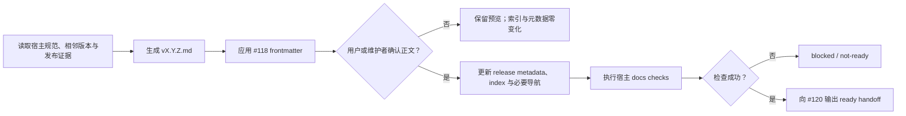

# Release Notes Generator PRD

## 问题

`docs-agent` 已负责宿主正式文档层，但还没有独立 specialist 完整生成并交付站内
Release Notes。既有能力混合了 VitePress 页面维护和 GitHub Release 操作，使正文
事实、站内索引、宿主校验与外部发布动作的责任边界不清，也无法向下游 GitHub
Release 流程提供可验证的就绪证据。

Release Notes 还承担研发、测试、运维和交付共同使用的版本事实。如果只追求简短
摘要，功能、架构、数据库、部署、资产、升级步骤或风险可能被遗漏；如果在正文确认
前更新版本索引和元数据，则宿主会出现半完成的版本状态。

## 产品目标

1. 在 `docs-agent` 中提供独立的 `release-notes-generator` specialist，完整交付宿主
   `docs/site/release-notes/vX.Y.Z.md`。
2. 仅基于可验证发布证据写作；证据存在时完整覆盖功能、架构、数据库、部署、资产、
   升级与风险事实。
3. 把正文确认设为索引、元数据与必要导航更新的硬门禁，避免未确认内容成为站点事实。
4. 使用 issue #118 的 frontmatter 单一契约，并通过宿主定义的 docs checks。
5. 只在正文已确认且检查成功后，向 issue #120 输出结构化 ready handoff。

## 范围

- 检测宿主 `docs/site/release-notes/`，读取该目录的编写规范和相邻版本页面。
- 读取已确认的目标版本、release scope，以及代码、配置、数据库、部署、资产、升级、
  测试和风险等可验证证据。
- 生成目标版本站内页面，应用 `doc_type: release` 的统一 frontmatter 契约。
- 展示完整正文并等待用户或维护者明确确认。
- 仅在确认后，按宿主契约更新 `.meta/releases.json`、Release Notes index 和必要导航。
- 执行宿主 docs checks；AI Hub-shaped 宿主使用 `npm run test:docs`。
- 输出包含版本、页面、确认、检查、索引/元数据和来源证据的 #120 handoff。
- 宿主缺少文档站时，阻塞写入并 handoff `docs-site-bootstrap`。

## 非目标与职责边界

- 不生成、创建、编辑或发布 GitHub Release，不收集或格式化 GitHub Release 专用的
  PR、贡献者与 compare 信息；这些能力归 issue #120。
- 不创建或移动 tag，不发布 Harbor 镜像，不更新 Helm，不执行部署。
- 不负责初始化文档站；缺少站点时交给 `docs-site-bootstrap`。
- 不重新定义 frontmatter 字段、值域或校验语义；统一消费 issue #118 的契约真源。
- 不负责 tag 前和 tag 后审计，不写最终版本锚，不改变 `last_verified_version` 的盖章
  时序；这些能力归 issue #117。
- 不承担 API、database、design、ops 或 product 等一般正式文档的同步与回填；这些
  能力归 issue #121 的 `formal-docs-sync`。
- 不修改 AI Hub 仓库；AI Hub 仅作为迁移证据和验收样本，不是运行时依赖。

## 关键产品决策

### 站内版本事实优先

站内 Release Notes 是下游 GitHub Release 使用的版本事实来源。GitHub 维护信息可以
在 #120 补充可追溯性，但不能覆盖或改写已确认的站内事实。

### 证据驱动且不以简洁牺牲完整性

正文只写可由输入证据支持的事实。某类证据存在时，必须保留对研发、测试、运维与
交付有用的关键信息；某类证据缺失时，不猜测、不补写虚构章节结论，并明确记录证据
缺口或不适用依据。

### 确认后才更新派生状态

目标版本页面正文可以先生成供审阅，但 `.meta/releases.json`、Release Notes index
和必要导航在确认前必须零变化。确认后的派生更新必须遵循宿主已有格式，不引入第二套
索引或元数据 schema。

### Ready 是双条件结论

只有 `confirmation_status: confirmed` 且宿主 docs checks 成功时，#120 handoff 才能
标记为 ready。正文未确认、检查未执行或检查失败时，只能输出 blocked/not-ready 状态
和下一步，不能把页面存在等同于完成。

## 产品流程

## 验收面

1. **宿主与输入门禁**：识别 AI Hub-shaped 的 Release Notes 规范、相邻版本和发布
   证据；缺少 `docs/site/release-notes/` 时不初始化站点，正确 handoff bootstrap。
2. **页面完整性**：生成目标版本页面，符合 issue #118 七字段契约并使用
   `doc_type: release`；有证据的功能、架构、数据库、部署、资产、升级和风险信息不被
   过度压缩。
3. **确认门禁**：确认前不更新 `.meta/releases.json`、Release Notes index 或导航；
   只有用户或维护者明确确认后才更新。
4. **宿主验证**：执行宿主定义的 docs checks；AI Hub-shaped fixture 必须通过
   `npm run test:docs`。
5. **下游交付**：成功时输出符合 #120 要求的 ready handoff；未确认或检查失败时不
   标记 ready。
6. **负向边界**：执行过程不操作 GitHub Release、tag、镜像、Helm 或部署，不修改
   AI Hub 仓库，也不代替 #117、#121 的职责。
7. **Skill 可用性**：完成 fresh with-skill 与同 prompt/fixture 的 fresh
   without-skill validation，并更新 durable `comparison.md`。

## 依赖与开放问题

- issue #118 已提供统一 frontmatter 契约，是页面生成的硬前置。
- issue #122 已提供 AI Hub-shaped bootstrap 资产和宿主脚手架，可作为后续 eval
  fixture 基础；不得把该 fixture 误当成运行时依赖。
- issue #117 消费本站点页面和 release metadata 证据执行双阶段审计；issue #120
  消费本 specialist 的 ready handoff，但必须等待 #117 pre-tag audit 返回
  `ready_for_tag` 后才能准备 GitHub Release 草稿；issue #121 与本能力按文档类型
  分工。
- 当前无阻塞产品开放问题。若宿主版本格式、版本索引 schema、导航生成方式或 #120
  handoff 字段发生变化，必须先回到 PM 范围确认。

## 规格来源说明

本 PRD 由维护者已批准的 GitHub issue #116 蒸馏而来；`request_type` 为
`existing_update`，`change_tier` 为 `major`，功能路径按仓库契约记录为层级 3。
