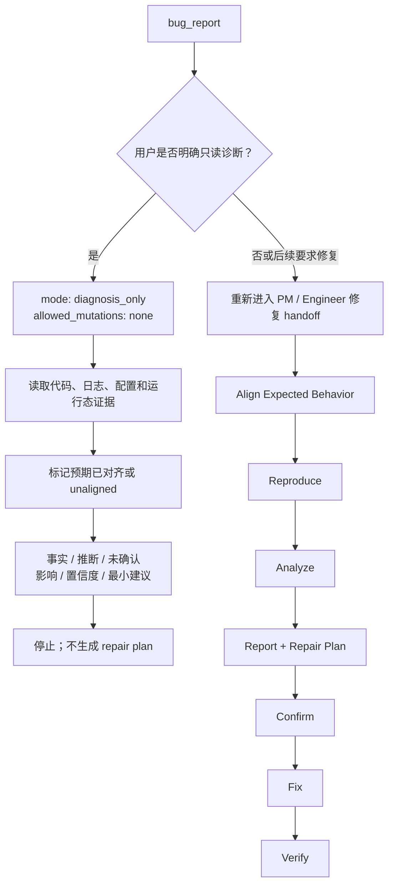

# debugger PRD

## 背景

`debugger` 隶属于 `engineer-agent`。当前实现只有完整修复流程：预期对齐、复现、根因
分析、修复计划确认、最小修复和验证。目标是在同一 skill 中增加 `diagnosis_only`，解决
用户只想调查原因却被修复门禁阻止收集证据的问题；既有修复流程保持不变。

## 目标

1. 为明确要求“只诊断、不修复”的请求提供 `diagnosis_only` 只读模式。
2. 保留现有完整修复模式的预期对齐、修复计划确认、最小修复和验证门禁。
3. 让 `pm-agent` 与 `engineer-agent` 把只读诊断路由到现有 `debugger`，不创建平行 skill。
4. 让诊断结论区分已证实事实、推断和未对齐的预期行为。

## 非目标

- 不接管 `engineer-agent` 之外角色的职责；不在上下文不足时伪造结论。
- 不把 `debugger` 的 specialist 行为泛化成整个 `engineer-agent` 的能力。
- 不把 repository contract 或 eval 误写成每次 runtime 必跑步骤，除非当前 skill 明确要求。
- 不新增 `diagnose-only`、`diagnosis-only` 或其他能力重叠的 skill。
- 不允许 `diagnosis_only` 修改代码、测试、E2E、配置、数据库或外部系统状态。
- 不允许 `diagnosis_only` 替代后续修复所需的 PM、PRD/TRD 和 repair-plan 门禁。

## 用户画像

| Persona | Description | Key Needs | Pain Points |
|---------|-------------|-----------|-------------|
| 直接调用用户 | 已知道要使用 `debugger` 的用户 | 直接获得当前 skill 的真实产物 | 泛化 PRD 会误导输入和输出 |
| `engineer-agent` Dispatcher | 根据用户意图选择下游 skill | 清晰 trigger 和 route boundary | 描述过宽会误路由 |
| 维护者 | 维护 skill 文档和确定性检查的人 | 可追溯、可校验的契约 | related docs 不全会漏掉真实实现 |

## 用户故事与场景

| ID | User Story | Priority | Acceptance Criteria |
|----|-----------|----------|---------------------|
| US-S01 | 作为用户，我想在 `debugger` 场景下获得对应工作流，以便得到真实产物。 | P0 | 输出满足 FR-S04，不以泛化描述替代实际 artifact。 |
| US-S02 | 作为 dispatcher，我想知道何时选择 `debugger`，以便避免自路由或跨 skill 误路由。 | P0 | FR-S01 和 route / handoff 与父级 SKILL.md 一致。 |
| US-S03 | 作为维护者，我想快速定位依赖文档，以便校验实现是否漂移。 | P1 | related_docs 覆盖 public entry、parent dispatcher 和必要 internal/reference 文件。 |
| US-S04 | 作为只想确认原因的用户，我希望 Agent 在不修改任何状态的前提下读取代码、日志和运行态证据，并给出清晰结论。 | P0 | 请求进入 `diagnosis_only`，输出诊断报告后停止，不生成修复计划或询问是否立即修复。 |
| US-S05 | 作为后续决定修复的用户，我希望此前只读诊断不能绕过正式修复门禁。 | P0 | 后续修复重新进入 PM/Engineer handoff、PRD/TRD 对齐、repair plan confirmation、最小修复和验证流程。 |

## 功能需求

| ID | Feature | Description | Priority | Acceptance Criteria |
|----|---------|-------------|----------|---------------------|
| FR-S01 | Trigger Matching | `debugger` 必须覆盖当前实现的触发场景，而不是只复述 frontmatter 摘要。 | P0 | 匹配场景与 parent dispatcher 和 `debugger` SKILL.md 一致。 |
| FR-S02 | Context Intake | 失败命令、日志、复现步骤、相关代码、GitHub bug issue、按 `feature_path` 定位的 PRD/TRD/DECISIONS 里的期望行为。 | P0 | 缺少真正阻塞的上下文时才澄清或 blocked；可推导上下文不应被写成硬门槛。 |
| FR-S03 | Workflow Execution | 必须按当前实现工作流执行，并保留已实现的 gate、phase 或 mode。 | P0 | Mermaid 流程和工作流条目覆盖关键阶段。 |
| FR-S04 | Artifact Output | 阶段性产物：期望对齐结论、复现证据、根因分析、repair plan、确认后的最小修复和验证报告。 | P0 | 未阻塞时产出指定 artifact；blocked 时说明原因、缺口和 next owner。 |
| FR-S05 | Boundary Guard | 不接管 `engineer-agent` 之外角色的职责；不在上下文不足时伪造结论。 | P0 | 越界事项转交 owning skill/agent，不在本 skill 内扩大范围。 |
| FR-S06 | Handoff | requirement_change/missing_docs 到 pm-agent:idea-to-spec；trd_gap 到 trd-gen；QA E2E handoff；复杂修复可拆 implementation/validation sub-agent。 | P0 | Handoff 目标具体到 skill/agent/owner，并携带输入包、证据和期望结果。 |
| FR-S07 | Traceability | PRD 必须引用执行契约来源。 | P1 | related_docs、Dependencies、API Touchpoints 能覆盖关键实现来源。 |
| FR-S08 | Feature Path Debug Gate | bug 修复前必须按 `feature_path` 读取 PRD/TRD，并校验 TRD 镜像 PRD。 | P0 | 路径不清、缺 PRD、需求变化回 PM；缺 TRD、TRD stale 或 `related_prd`/frontmatter 不一致回 `trd-gen`；不得进入修复计划或 E2E 更新。 |
| FR-S09 | Dual Mode | `debugger` 支持 `diagnosis_only` 和 `repair` 两种模式；只读意图进入前者，修复意图进入后者。 | P0 | 两种模式复用同一 specialist，但拥有不同 mutation boundary 和出口。 |
| FR-S10 | Read-only Handoff | PM/Engineer handoff 为只读诊断传递 `mode: diagnosis_only` 与 `allowed_mutations: none`。 | P0 | Engineer 继续路由到现有 `debugger`，不新增 specialist，也不把只读请求误入修复计划。 |
| FR-S11 | Evidence Collection Without Approved Docs | `diagnosis_only` 可读取代码、文档、配置、日志、只读数据库查询结果和运行状态；缺 PRD/TRD 时仍可报告客观现象和可能根因。 | P0 | 缺少预期文档不会阻断只读调查，但报告必须标记 `expected_behavior_alignment: unaligned`，不得把推断称为已确认的 `implementation_deviation`。 |
| FR-S12 | Zero Mutation Boundary | `diagnosis_only` 禁止源码、测试、E2E、配置、数据库写入、外部状态变更及 commit/push/PR；可能产生持久副作用的复现命令不得执行。 | P0 | 仓库与外部状态保持不变；证据不足时记录缺口，不以写操作辅助复现。 |
| FR-S13 | Diagnosis Report | 只读报告至少包含观察到的现象与直接证据、根因判断及置信度、影响范围、尚未确认的信息和最小下一步建议。 | P0 | 已证实事实、推断和未对齐预期分层表达；报告后停止，不生成 repair plan，不询问是否立即修复。 |
| FR-S14 | Repair Re-entry | 用户后续要求修复时，`diagnosis_only` 授权立即失效，并重新进入完整修复流程。 | P0 | 重新执行 PM/Engineer handoff、PRD/TRD 对齐、问题分类、复现、repair plan confirmation、最小修复与验证，不复用只读授权绕过任一步。 |

## 当前实现对齐

### 当前状态

- Align Expected Behavior
- Reproduce
- Analyze
- Report analysis and repair plan together
- Confirm
- Fix
- Verify
- Final Report

当前 `debugger` 只有完整修复流程；缺少预期文档时，入口门禁会阻止继续调查。

### 目标双模式工作流

- `diagnosis_only`：锁定零修改边界 → 收集只读证据 → 标记预期对齐状态 → 输出结构化诊断报告 → 停止。
- `repair`：对齐预期 → 复现 → 分析 → 同轮给出根因与修复计划 → 等待确认 → 最小修复 → 验证。
- `diagnosis_only` 之后出现修复请求时，从 `repair` 入口重新执行完整门禁，不把诊断报告视为修改授权。

## 验收标准

| ID | Criteria | Verification |
|----|----------|--------------|
| AC-01 | P0 trigger、context、workflow、artifact 和 handoff 与当前实现文档一致。 | 对照 related_docs 中的 README、SKILL.md、internal/reference 文件人工 review。 |
| AC-02 | 文档不包含自路由、全量默认执行或将 specialist 行为泛化为整个 Agent 的错误描述。 | 检查 route matrix、非目标、边界和 Mermaid flow。 |
| AC-03 | 产物要求必须指向具体文件、报告、代码变更或 blocked 输出，不使用模糊替代表述。 | 检查功能需求和用户流程中的 artifact 节点。 |
| AC-04 | “只读确认这个报错原因，不要修”进入 `debugger` 的 `diagnosis_only`，并传递 `allowed_mutations: none`。 | 检查 PM、Engineer 路由契约。 |
| AC-05 | 缺少 PRD/TRD 时仍可给出客观诊断，但不会把推断表述成已确认实现偏差。 | 检查 Debugger 只读诊断契约。 |
| AC-06 | 只读诊断不修改任何状态、不创建修复计划、不询问立即修复。 | Git 差异、外部状态边界和诊断输出断言。 |
| AC-07 | 诊断后的修复请求重新进入完整门禁。 | 检查 Debugger repair re-entry gate。 |

## 非功能需求

| Category | Requirement | Metric | Target |
|----------|-------------|--------|--------|
| Accuracy | PRD 与当前 SKILL.md/README 一致 | Sub Agent review | 无已知实现差异 |
| Testability | P0 条目可由文件、命令或人工 review 验证 | Checklist | 每条有明确验收标准 |
| Traceability | 关键规则可追溯到 related docs | 文档链接 | 不依赖隐含记忆 |
| Safety | 不输出凭据、token、cookie、SSH key | 静态审查 | 0 secrets |

## 用户流程

Alternative flow: 如果请求不属于 `debugger`，应按 `engineer-agent` route matrix 转到 owning skill。

Error flow: 如果必要上下文无法满足，输出 blocked reason、missing input、next owner 和可恢复步骤。

## 交互与输出要求

- 输出先给结论、产物和证据，再说明限制和下一步。
- 对需要用户确认的事项只问当前最小阻塞问题。
- Dispatcher 选择 skill 时应说明选择理由；specialist 自身不需要把“正在使用某 skill”作为产品强制要求，除非 SKILL.md 明确要求。

## 数据模型

| Entity | Key Attributes | Relationships |
|--------|----------------|---------------|
| Skill | name, agent, trigger, workflow, output | belongs_to `engineer-agent` |
| Context | source_docs, code_or_repo_state, constraints, evidence | consumed_by Skill |
| Artifact | path, type, owner, status, evidence | produced_by Skill |
| Handoff | target, reason, packet, expected_output | emitted_when needed |
| Validation | related_docs, deterministic checks, manual review | verifies contract |
| Debug Mode | mode, allowed_mutations, expected_behavior_alignment | controls diagnosis or repair path |
| Diagnosis Report | facts, evidence, inference, confidence, impact, unknowns, next_step | produced_by `diagnosis_only` |

## 接口与文件触点

| Endpoint | Method | Purpose | Request | Response |
|----------|--------|---------|---------|----------|
| `agents/engineer/skills/debugger/SKILL.md` / parent dispatcher / marketplace | Read / CLI | 获取当前 skill 的实现契约或运行依赖 | 本地仓库上下文 | 触发、工作流、产物或数据 |
| `.claude-plugin/marketplace.json` | File read | 校验注册和 agent 归属 | JSON | plugin skill mapping |
| `agents/engineer/README.md` | File read | 校验角色边界和路由 | Markdown | role context |

## 假设与约束

| Type | Description | Impact if Wrong |
|------|-------------|-----------------|
| Constraint | 当前 PRD 描述已实现行为，不替代 SKILL.md。 | SKILL.md 改动后 PRD 需要同步。 |
| Constraint | Specialist 不应回指入口 dispatcher 形成循环 handoff。 | Handoff 应写到具体 skill/agent/owner。 |
| Constraint | `diagnosis_only` 只提供调查授权，不提供任何修改授权。 | 任何变异操作都必须停止并等待新的修复 handoff。 |
| Assumption | related docs 中的实现契约是当前 source of truth。 | 缺少 internal/reference 文件会造成校验漏项。 |

## 相关实现文档

- Internal: `agents/engineer/README.md`, `agents/engineer/README_zh.md`, `agents/engineer/skills/engineer-agent/SKILL.md`, `agents/engineer/skills/debugger/SKILL.md`, `.claude-plugin/marketplace.json`。
- Internal: 父级 dispatcher route matrix、README 和 marketplace 注册。
- External: Codex / Claude Code skill execution environment；具体外部 CLI/API 仅在 SKILL.md 明确要求时使用。

## 发布计划与里程碑

| Phase | Scope | Target Date | Owner |
|-------|-------|-------------|-------|
| Draft | 生成 `debugger` PRD | 2026-06-12 | PM |
| Review | 对照 SKILL.md、README、eval 修正差异 | 2026-06-12 | PM / Maintainer |
| Adopt | 将 PRD 纳入后续 skill 行为变更 checklist | TBD | Maintainer |

## 风险与缓解

| Risk | Likelihood | Impact | Mitigation |
|------|------------|--------|------------|
| PRD 只复述 frontmatter | Medium | 漏掉真实 workflow / gate | 将 workflow、artifact、handoff 写成 P0 requirement |
| Handoff 回到入口 dispatcher | Medium | 形成循环路由 | 写具体 specialist / owning agent / release owner |
| 产物被写成“或描述” | Medium | 文档通过但没有实际 artifact | 明确 write/update 或 blocked 条件 |

## 待确认问题

无。
