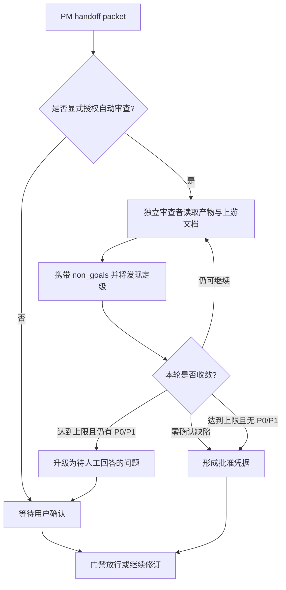

# 计划与 TRD 门禁批准者授权 PRD

## 背景

`feature-implementor` 的实施计划门禁和 `trd-gen` 的 TRD 门禁目前只接受
用户确认。自动化编排即使已经完成独立审查，也必须停在门禁处等待人工输入。

门禁继续保留，变化仅限于批准凭据的来源：默认仍由用户批准；PM handoff packet
显式授权后，满足最低要求的自动审查者也可以批准对应产物。

## 目标

1. 让 PM handoff packet 可以分别授权实施计划和 TRD 的自动审查者。
2. 未携带授权字段时保持现有人工确认行为。
3. 用统一的独立性、边界、定级、收敛和升级要求约束自动审查。
4. 让实施计划审查使用预期改动声明作为后续对账基线。
5. 让 TRD 审查使用与技术设计阶段相符的定性改动面判据。

## 非目标

- 不取消实施计划或 TRD 门禁，也不降低现有判定标准。
- 不默认启用自动审查者，也不从模糊上下文推断授权。
- 不允许同一会话内的撰写者自审替代独立审查。
- 不把根因归属等事实判断纳入本机制。
- 不把实施层的量化验证经验外推为 TRD 审查结论。

## 使用者

| Persona | Description | Key Needs | Pain Points |
| --- | --- | --- | --- |
| 维护者 | 批准 PM handoff 和工程门禁的人 | 保留默认人工控制，并能按任务显式授权 | 自动化流程总在门禁处等待人工输入 |
| 自动编排器 | 根据 handoff packet 推进角色流程 | 获得可机器读取的批准方式 | 无法区分必须人工确认与可自动审查的任务 |
| 自动审查者 | 独立检查计划或 TRD 的执行者 | 明确输入、缺陷等级、收敛条件和升级路径 | 缺少统一放行标准，容易误报或自行放行 |

## 功能需求

| ID | Feature | Description | Priority | Acceptance Criteria |
| --- | --- | --- | --- | --- |
| FR-001 | Handoff Authorization | handoff packet 支持可选的 `plan_approval` 和 `trd_approval`。 | P0 | 两字段仅接受 `user` 或 `authorized_auto_reviewer`，缺省值为 `user`。 |
| FR-002 | Default Behavior | 未携带字段时继续等待用户确认。 | P0 | 现有 handoff packet 无需迁移，原流程不变。 |
| FR-003 | Independent Context | 自动审查者与撰写者不共享会话，只读产物及 PRD、DECISIONS、TRD 等上游文档。 | P0 | 同一会话自审不能形成有效批准凭据。 |
| FR-004 | Explicit Boundaries | 自动审查 prompt 必须携带来自 PRD `non_goals` 的「有意不做」清单。 | P0 | 缺少该清单时不得按授权自动审查者放行。 |
| FR-005 | Finding Severity | 每条发现必须标注 `P0`、`P1` 或 `P2`。 | P0 | 未定级发现不能参与收敛判定。 |
| FR-006 | Convergence | 某轮零确认缺陷，或达到轮数上限且当轮无未解决 `P0` 或 `P1` 时，可以放行。 | P0 | 收敛结果能追溯到该轮发现列表。 |
| FR-007 | Escalation | 达到轮数上限仍有未收敛 `P0` 或 `P1` 时，转为一个待人工回答的问题。 | P0 | 自动审查者不得自行放行。 |
| FR-008 | Plan Baseline | 实施计划自动审查输入包含预期改动声明。 | P0 | 审查后的声明成为实施完成时预期与实际对账的基线。 |
| FR-009 | TRD Criteria | TRD 自动审查只使用定性改动面清单。 | P0 | 清单覆盖涉及模块、数据结构变化和新增依赖；TRD 侧轮数上限给足。 |

## 流程

## 验收标准

| ID | Criteria | Verification |
| --- | --- | --- |
| AC-01 | 权威 handoff contract 定义两个可选批准字段及缺省行为。 | 审查权威源和六份生成副本。 |
| AC-02 | 自动审查者的五项最低要求完整且含升级路径。 | 审查 handoff contract。 |
| AC-03 | `feature-implementor` 的计划门禁接受显式授权，并继续保留默认人工确认。 | 审查 public skill、planner 和 implementor instructions。 |
| AC-04 | 计划自动审查输入包含预期改动声明。 | 审查计划门禁文字。 |
| AC-05 | `trd-gen` 的进入、流程、质量检查和硬门禁均接受显式授权。 | 审查 TRD skill 的四处门禁。 |
| AC-06 | TRD 判据保持定性，并明确较低确定性和独立轮数设置。 | 审查 TRD review 说明。 |
| AC-07 | 生成契约、仓库契约、文档契约和 diff 检查全部通过。 | 运行仓库规定的四项命令。 |

## 约束与风险

| Type | Description | Handling |
| --- | --- | --- |
| Constraint | 只有 handoff packet 显式声明 `authorized_auto_reviewer` 才能启用自动批准。 | 所有门禁先读取对应字段，缺省按 `user`。 |
| Constraint | 计划层和 TRD 层分别授权。 | `plan_approval` 与 `trd_approval` 不互相继承。 |
| Risk | 自动审查忽略 non-goals，误把有意不做判为缺陷。 | 缺少「有意不做」清单时不接受自动批准。 |
| Risk | 轮数上限被误用为无条件放行。 | 上限轮仍有未收敛 `P0` 或 `P1` 时强制升级人工问题。 |
| Risk | TRD 审查套用实施层量化判据。 | 明确定性改动面、较低确定性和独立轮数要求。 |

## 依赖

- issue #316 提供已批准的目标状态、最低要求和非目标。
- issue #315 定义实施计划的预期改动声明，供计划自动审查使用。
- 共享契约生成脚本负责同步六份下游 handoff contract 副本。

## 已决事项

- 默认批准者为用户。
- 自动审查授权只能来自 handoff packet 的显式字段。
- 两类门禁使用同一套最低审查要求，但保留各自的判据和轮数设置。
- 本功能不引入新的运行时依赖、配置文件或抽象层。
