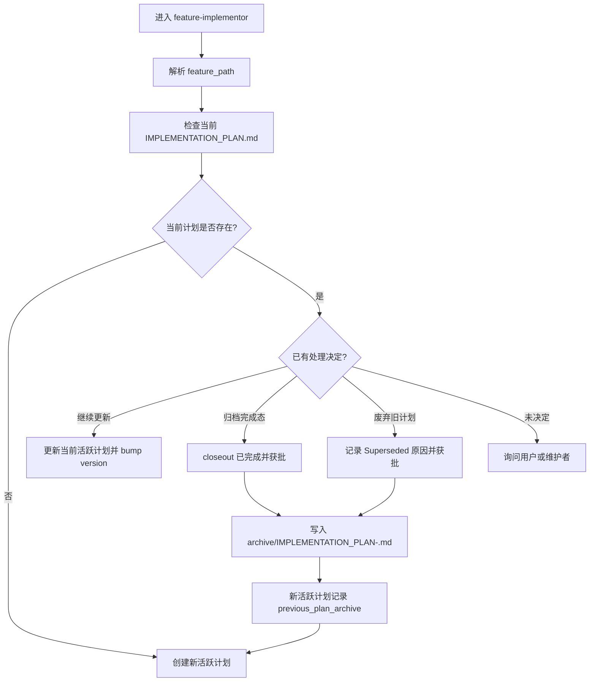

# IMPLEMENTATION_PLAN 归档门禁 PRD

## 背景

`feature-implementor` 已经要求所有实现任务先写
`docs/engineer/{feature_path}/IMPLEMENTATION_PLAN.md`，并在实现完成后执行
closeout gate。该路径作为活跃计划入口是必要的，因为 QA、DevOps 和 Security
等下游只需要读取一个确定文件。

随着 `feature_path` 支持多级功能树，同一功能会在多轮功能更新、review fix
或小范围修复中反复进入 `feature-implementor`。如果新的实施计划直接复用同一
活跃路径，旧计划可能被覆盖、混写，或者被迫拆成不自然的子 `feature_path`。
本需求在 closeout gate 之后增加 archive gate，确保旧计划先被处理，再创建或
替换下一份活跃计划。

## 目标

1. 保留 `docs/engineer/{feature_path}/IMPLEMENTATION_PLAN.md` 作为唯一活跃入口。
2. 为完成态计划增加用户或维护者批准后的归档目录和范围命名规则。
3. 在创建同一 `feature_path` 的下一份计划前，强制扫描并处理已有活跃计划。
4. 让 repository contract 和 eval 能覆盖归档 metadata 与新计划前置门禁。

## 非目标

- 不批量迁移历史 `IMPLEMENTATION_PLAN.md`。
- 不改变 QA、DevOps、Security 读取当前活跃计划的入口。
- 不用归档目录替代 git history；归档只保存人工确认过的计划快照。
- 不要求每次轻量更新都新建计划；用户仍可选择继续更新当前活跃计划。

## 用户画像

| Persona | Description | Key Needs | Pain Points |
| --- | --- | --- | --- |
| 维护者 | 审查和合并 skill 行为变更的人 | 能追踪每次实施计划对应的具体修改范围 | 旧计划被覆盖后难以判断某次修改是否按计划完成 |
| `feature-implementor` 调用者 | 按 PRD/TRD 执行实现的人 | 创建新计划前知道旧计划应归档、继续更新还是废弃 | 不知道同一路径已有计划时容易直接覆盖 |
| 下游 Agent | QA、DevOps、Security 等读取工程产物的角色 | 始终读取当前活跃计划入口 | 多个计划文件并存时不清楚哪个是当前入口 |

## 用户故事与场景

| ID | User Story | Priority | Acceptance Criteria |
| --- | --- | --- | --- |
| US-001 | 作为维护者，我想保留旧实施计划的范围命名归档，以便回看每次功能更新的计划依据。 | P0 | 完成态计划经确认后移动或复制到 `implementation-plans/archive/IMPLEMENTATION_PLAN-<scope>.md`，归档 frontmatter 记录范围、批准人和来源。 |
| US-002 | 作为 `feature-implementor` 调用者，我想在创建新计划前知道旧计划状态，以便选择归档、继续更新或废弃。 | P0 | 同一 `feature_path` 已有未归档活跃计划时，skill 必须先询问处理方式，不得直接覆盖。 |
| US-003 | 作为下游 Agent，我想只读取一个当前活跃计划，以便不猜测多个历史计划之间的关系。 | P0 | 当前计划仍固定为 `docs/engineer/{feature_path}/IMPLEMENTATION_PLAN.md`。 |

## 功能需求

| ID | Feature | Description | Priority | Acceptance Criteria |
| --- | --- | --- | --- | --- |
| FR-001 | Active Plan Entry | 当前活跃计划入口保持为 `docs/engineer/{feature_path}/IMPLEMENTATION_PLAN.md`。 | P0 | 下游 handoff、QA E2E 和 delivery 仍引用该路径作为当前计划。 |
| FR-002 | Archive Path | 完成态计划归档到 `docs/engineer/{feature_path}/implementation-plans/archive/IMPLEMENTATION_PLAN-<scope>.md`。 | P0 | `<scope>` 使用 lower kebab-case，并描述本次实现范围。 |
| FR-003 | Archive Metadata | 归档计划必须包含 `implementation_scope`、`status`、`archived_at`、`archive_approved_by` 和 `source_plan`。 | P0 | closeout 后归档的完成态计划使用 `status: "Archived"`，`source_plan` 指向原活跃入口。 |
| FR-004 | Superseded Handling | 未完成或被新方案替代的旧计划可归档为 `status: "Superseded"`，但必须记录 `superseded_reason` 和批准人。 | P1 | Superseded 计划不得被当作完成态历史计划；新活跃计划必须说明替代来源。 |
| FR-005 | Pre-Plan Gate | 创建或替换同一 `feature_path` 的活跃计划前，必须扫描当前活跃计划和 archive 目录。 | P0 | 若已有活跃计划且没有归档或继续更新决定，skill 输出 blocked/询问，不写新计划。 |
| FR-006 | User Decision Options | 发现旧计划时，只允许三种处理：归档后创建新计划、继续更新旧计划、归档为 Superseded 并记录原因。 | P0 | 选择必须写入计划正文或 frontmatter，不能只留在对话里。 |
| FR-007 | New Plan Linkage | 归档旧计划后创建新活跃计划时，新计划必须记录 `previous_plan_archive`。 | P0 | repository contract 能校验该路径存在，并校验归档 metadata 与当前 `feature_path` 一致。 |
| FR-008 | Contract Checker | repository contract 必须识别归档路径，并校验活跃计划和归档计划 metadata。 | P0 | 错误路径、缺失 metadata、无效日期、无批准人、错误 `source_plan` 或错误 `previous_plan_archive` 会失败。 |
| FR-009 | Eval Coverage | `feature-implementor` eval 至少覆盖未归档旧计划阻塞新计划，以及归档后允许新计划。 | P0 | eval 断言检查询问门禁、归档 metadata、`previous_plan_archive` 和活跃入口不变。 |

## 非功能需求

| Category | Requirement | Metric | Target |
| --- | --- | --- | --- |
| Traceability | 新旧计划关系可追踪 | Archive link | 新计划引用 `previous_plan_archive` |
| Simplicity | 下游读取路径不变 | Active entry count | 每个 `feature_path` 只有一个活跃入口 |
| Testability | 规则可机器校验 | Contract checks | metadata 和路径错误可被本地脚本发现 |
| Maintainability | 不批量迁移历史计划 | Migration scope | 仅约束本次之后新增或变更的计划 |

## 用户流程

错误流程：如果旧计划状态、归档批准人或归档范围不清楚，`feature-implementor`
必须停止写新计划，并要求用户选择处理方式。

## UI/UX 要求

本需求不涉及产品 UI。交互要求只体现在 agent 输出中：

- 发现旧计划时，输出必须列出旧计划路径、当前状态和三种处理选项。
- 需要用户确认时，只问当前最小阻塞问题。
- 归档完成后，输出必须说明当前活跃计划路径和历史归档路径。

## 数据模型

| Entity | Key Attributes | Relationships |
| --- | --- | --- |
| Active Implementation Plan | `feature_path`, `implementation_scope`, `status`, `previous_plan_archive` | 当前 `feature_path` 的唯一活跃计划 |
| Archived Implementation Plan | `implementation_scope`, `status`, `archived_at`, `archive_approved_by`, `source_plan` | 从 active plan 归档而来 |
| Superseded Plan | `implementation_scope`, `status: Superseded`, `superseded_reason`, `archive_approved_by`, `source_plan` | 被新计划替代但不代表完成 |

## API Touchpoints

| Endpoint | Method | Purpose | Request | Response |
| --- | --- | --- | --- | --- |
| `agents/engineer/skills/feature-implementor/SKILL.md` | File update | 增加 archive gate public contract | Markdown | 更新后的 skill 规则 |
| `agents/engineer/skills/feature-implementor/_internal/planner/INSTRUCTIONS.md` | File update | 创建计划前扫描旧计划 | Markdown | planner 前置门禁 |
| `agents/engineer/skills/feature-implementor/_internal/_shared/output-conventions.md` | File update | 定义 archive path 和 metadata | Markdown | 归档输出约定 |
| `scripts/check_repository_contract.py` | CLI | 校验实施计划归档契约 | repo files | pass/fail |
| `agents/engineer/test/feature-implementor/evals/evals.json` | File update | 固化行为回归 | eval definitions | eval assertions |

## 假设与约束

| Type | Description | Impact if Wrong |
| --- | --- | --- |
| Constraint | `IMPLEMENTATION_PLAN.md` 仍是当前活跃计划唯一入口。 | 下游 agent 不需要调整读取入口。 |
| Constraint | 归档必须发生在 closeout 后，并经用户或维护者确认。 | 自动归档会缺少审批证据。 |
| Assumption | `previous_plan_archive` 是检测直接覆盖旧计划的最小机器可校验字段。 | 如果不用该字段，contract checker 只能做弱语义检查。 |
| Assumption | 历史计划不批量迁移，后续被触及时再按新规则处理。 | 老文件可能暂时缺少 archive metadata。 |

## 依赖

- `implementation-plan-closeout-gate` 已定义完成态计划的 closeout 证据。
- `feature_path` contract 已要求 PRD/TRD/IMPLEMENTATION_PLAN 路径镜像。
- Eval artifact policy 已要求 durable `comparison.md` 入库、运行期产物不入库。

## 发布计划与里程碑

| Phase | Scope | Target Date | Owner |
| --- | --- | --- | --- |
| Draft | 补齐 issue 级 PRD/TRD/IMPLEMENTATION_PLAN | 2026-07-01 | PM / Engineer |
| Implement | 更新 skill、internal instructions、AGENTS、contract checker、eval | TBD | Engineer |
| Validate | 运行 repository/eval contract 和必要 fresh subagent validation | TBD | Maintainer |

## 风险与缓解

| Risk | Likelihood | Impact | Mitigation |
| --- | --- | --- | --- |
| 归档路径过多导致下游误读 | Medium | 下游不知道哪个计划有效 | 保留唯一活跃入口，并把 archive 目录标记为历史计划。 |
| checker 无法理解语义覆盖 | Medium | 直接覆盖仍可能漏检 | 使用 `previous_plan_archive` 和 `implementation_scope` 做最小机器门禁，语义判断由 planner gate 完成。 |
| Superseded 与 Archived 混用 | Medium | 历史状态难以判断 | 完成态使用 `Archived`，废弃态使用 `Superseded` 并要求原因。 |
| 规则过重影响小修复 | Low | 小修复流程变慢 | 允许继续更新当前活跃计划，不强制每次都归档。 |

## 待确认问题

| # | Question | Owner | Deadline | Resolution |
| --- | --- | --- | --- | --- |
| 1 | `previous_plan_archive` 是否作为新活跃计划的必填 frontmatter 字段，仅在存在上一份归档计划时出现？ | Maintainer | Implementation planning | Proposed: yes |
| 2 | Superseded 计划是否允许放在同一个 archive 目录，并由 `status: "Superseded"` 区分？ | Maintainer | Implementation planning | Proposed: yes |
