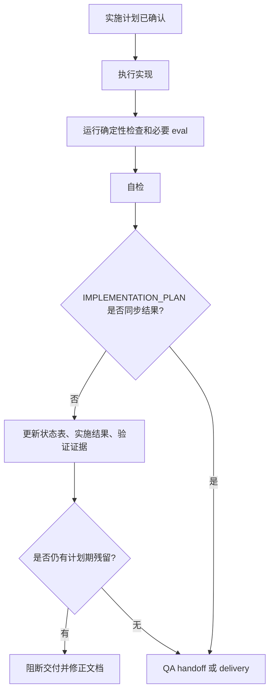

# IMPLEMENTATION_PLAN 收尾门禁 PRD

## 背景

`feature-implementor` 已经要求所有实现任务先写
`docs/engineer/{feature_path}/IMPLEMENTATION_PLAN.md` 并等待用户确认。
当前缺口在实施结束阶段：计划 frontmatter 可能已经更新为
`status: "Implemented"`，但正文仍保留“待确认”“未开始”“未执行”等计划期状态。

该矛盾会降低后续 reviewer、QA、release 审查对 durable 工程文档的信任度。

## 目标

1. 为 `feature-implementor` 增加实施收尾门禁。
2. 确保 `IMPLEMENTATION_PLAN.md` 在实施完成后同步记录实施结果和验证证据。
3. 让自检或 eval 能发现 `status: Implemented` 与正文状态矛盾。

## 非目标

- 不改变现有 PRD/TRD/IMPLEMENTATION_PLAN 进入实现前的确认门禁。
- 不改变 QA E2E 文档归档规则。
- 不提交模型 eval 的运行期 transcript、diagnostics、outputs 或 timing 文件。

## 功能需求

| ID | Feature | Description | Priority | Acceptance Criteria |
| --- | --- | --- | --- | --- |
| FR-001 | Closeout Gate | `feature-implementor` 在实现和验证完成后，必须同步更新对应 `IMPLEMENTATION_PLAN.md` 的实施状态和结果。 | P0 | 计划正文包含实施结果、验证结果、剩余风险和下一步状态。 |
| FR-002 | Stale State Detection | 自检阶段必须发现 `status: Implemented` 与正文“待确认 / 未开始 / 未执行”矛盾。 | P0 | reviewer checklist 或 eval 断言能阻止矛盾计划进入交付。 |
| FR-003 | Verification Evidence | 已运行的 deterministic checks 必须记录实际命令；未运行的检查必须记录原因。 | P0 | `IMPLEMENTATION_PLAN.md` 中能看到命令、结果和 skipped / blocked 原因。 |
| FR-004 | Eval Evidence | 实际执行 skill eval 或 fresh subagent validation 后，必须引用 durable `comparison.md`。 | P0 | 已执行 eval 的结论与 durable comparison 一致；未执行 eval 时说明原因。 |
| FR-005 | Artifact Policy | 收尾门禁不得要求提交运行期 eval 产物。 | P1 | 只提交 eval 定义、fixture metadata 和 durable `comparison.md`。 |

## 用户流程

## 验收标准

| ID | Criteria | Verification |
| --- | --- | --- |
| AC-01 | `feature-implementor` 文档明确实施收尾门禁。 | 人工 review `SKILL.md` 和 internal instructions。 |
| AC-02 | reviewer checklist 覆盖 stale plan state。 | 人工 review reviewer instructions。 |
| AC-03 | eval 覆盖 `status: Implemented` 但正文未同步的回归场景。 | `uv run scripts/check_eval_contract.py` 和 fresh subagent validation。 |
| AC-04 | repository / eval artifact contract 不受影响。 | 运行仓库确定性检查。 |

## 风险

| Risk | Impact | Mitigation |
| --- | --- | --- |
| 收尾规则过宽导致计划文档冗长 | 文档维护成本上升 | 只要求状态、结果、命令、eval 证据和风险摘要。 |
| 未执行 eval 的场景被误判为失败 | 阻塞合理交付 | 允许记录 skipped / blocked 原因。 |
| 只改文档不改 eval | 规则后续回退 | 增加 feature-implementor eval 覆盖。 |
