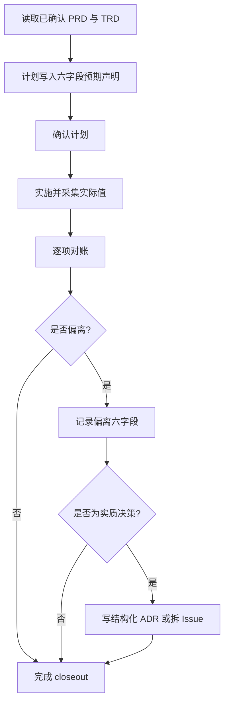

# 实施计划预期改动声明与收尾对账 PRD

## 背景

`feature-implementor` 当前要求实施计划记录文件、顺序、验证方式和对齐结果，
closeout 记录实际变更、执行命令、剩余风险和下一负责人。计划与 closeout 分别存在，
但没有逐项对账规则，因此规模、依赖、配置和抽象层偏离可能不被解释或留痕。

当前 ADR schema 也缺少偏离触发条件、预期值、实际值和处置结果等结构化字段，
无法稳定区分普通架构决策与实施偏离产生的决策。

## 目标

1. 在计划确认前形成可供 closeout 使用的预期改动声明。
2. 在实现完成后逐项比较预期值与实际值，并结构化记录所有偏离。
3. 对向上扩张与设计缺口采用默认拆分策略，避免实施阶段无记录扩张范围。
4. 让有实质决策的偏离通过 ADR frontmatter 被识别和聚合。

## 非目标

- 不把预期改动声明变成准入门槛或硬性上限。
- 不改变 hotfix 的轻量计划形态；hotfix 仍需确认，但声明可以简化。
- 不创建 `docs/engineer/ADR-INDEX.md` 或其他仓库级 ADR 索引。
- 不新增测试、依赖、配置项、抽象层、脚本或运行时机制。
- 不修改 marketplace、plugin manifest、router Skill 或其他 Skill 注册面。

## 功能需求

| ID | Feature | Description | Priority | Acceptance Criteria |
| --- | --- | --- | --- | --- |
| FR-001 | 预期改动声明 | 计划确认前记录六个声明字段，并将其作为后续对账基线。 | P0 | 计划模板和 public checkpoint 同时列出六字段。 |
| FR-002 | 常见预期值 | 新增依赖、配置、抽象层默认预期为 `0`，测试数量与 PRD 验收点数相当。 | P0 | planner instructions 给出默认值和适用说明。 |
| FR-003 | Hotfix 兼容 | hotfix 可简化声明字段，但不取消计划确认。 | P0 | 规则保留 hotfix 轻量形态和确认门禁。 |
| FR-004 | Closeout 对账 | closeout 逐项比较六个声明值与实际值。 | P0 | output conventions、public contract 和 reviewer 均要求对账。 |
| FR-005 | 偏离记录 | 每项偏离记录 `trigger`、`expected`、`actual`、`kind`、`explanation`、`resolution`。 | P0 | `kind` 与 `resolution` 只使用规定枚举。 |
| FR-006 | 默认处置 | `scope_up` 与 `design_gap` 默认拆新 Issue，并以 `parent_issue_id` 指回原 Issue。 | P0 | 仅“不拆就无法交付当前范围”时允许例外，并记录理由。 |
| FR-007 | ADR 结构化 | 偏离驱动 ADR 使用可选 frontmatter 字段表达触发、差异和结果。 | P0 | 指定的实质决策场景必须填写新增字段；普通 ADR 无需填写。 |
| FR-008 | 估算偏差降噪 | 纯 `estimate_wrong` 只在 closeout 留一行记录。 | P1 | 不要求为纯估算误差创建 ADR。 |

## 预期改动声明

| Field | Meaning | Common Expected Value |
| --- | --- | --- |
| `expected_files` | 预期改动文件数量级或明确文件集合 | 按 change tier 和已批准范围 |
| `expected_new_dependencies` | 预期新增依赖数 | `0` |
| `expected_new_config` | 预期新增配置项数 | `0` |
| `expected_new_abstractions` | 预期新增抽象层或基类数 | `0` |
| `expected_loc_magnitude` | 预期代码或契约行数区间 | 区间值 |
| `expected_tests_vs_acceptance` | 预期新增测试数与 PRD 验收点数的关系 | 相当 |

声明用于在偏离发生时触发问询和记录，不用于阻止合理实现。

## 偏离分类与处置

| Kind | Meaning | Default Resolution |
| --- | --- | --- |
| `scope_up` | 实际范围高于已确认范围 | `split_to_issue` |
| `scope_down` | 实际范围低于已确认范围 | 解释后选择 `accepted` 或 `reverted` |
| `estimate_wrong` | 工作内容未变，仅估算不准确 | closeout 记录 |
| `design_gap` | 实施发现已确认设计缺少必要内容 | `split_to_issue` |

允许的 `resolution` 为 `accepted`、`split_to_issue`、`reverted`。
偏离本身不是缺陷；未经说明的偏离才违反 closeout 契约。

## ADR 规则

以下偏离形成实质技术决策时必须写 ADR，并填写新增 frontmatter：

- 被接受的 `scope_up`；
- 引入新依赖；
- 新增抽象层或基类；
- 补全 `design_gap`。

新增可选字段为 `feature_path`、`trigger`、`expected`、`actual`、`kind`、
`resolution` 和 `spawned_issue`。普通 ADR 不需要这些字段。纯
`estimate_wrong` 不创建 ADR。

## 用户流程

## 验收标准

| ID | Criteria | Verification |
| --- | --- | --- |
| AC-01 | public checkpoint 与 planner 模板包含完整六字段声明。 | 人工对照 `SKILL.md` 与 planner instructions。 |
| AC-02 | 实施方采集实际依赖、配置、抽象层、文件、行数和测试证据。 | 人工对照 implementor instructions。 |
| AC-03 | closeout 对每个声明字段完成预期与实际比较。 | 人工对照 output conventions。 |
| AC-04 | 每项偏离均使用规定字段、分类和处置枚举。 | reviewer checklist 与静态文档审查。 |
| AC-05 | `scope_up` 与 `design_gap` 默认拆分并记录父 Issue。 | 人工审查默认处置规则。 |
| AC-06 | 偏离驱动 ADR 与普通 ADR 的 frontmatter 要求清晰分离。 | 人工对照 ADR schema。 |
| AC-07 | hotfix 可简化声明，但计划确认门禁不变。 | 人工审查 planner 与 public contract。 |
| AC-08 | 变更没有创建 ADR 索引或修改禁止区域。 | diff 审查。 |

## 接口与文件触点

| File | Responsibility |
| --- | --- |
| `agents/engineer/skills/feature-implementor/SKILL.md` | 暴露计划声明和 closeout 对账契约。 |
| `agents/engineer/skills/feature-implementor/_internal/planner/INSTRUCTIONS.md` | 定义六字段计划模板与常见预期值。 |
| `agents/engineer/skills/feature-implementor/_internal/implementor/INSTRUCTIONS.md` | 采集供 closeout 使用的实际值。 |
| `agents/engineer/skills/feature-implementor/_internal/reviewer/INSTRUCTIONS.md` | 检查对账完整性和偏离记录。 |
| `agents/engineer/skills/feature-implementor/_internal/_shared/output-conventions.md` | 定义逐项对账、分类和处置格式。 |
| `agents/product_manager/skills/idea-to-spec/_internal/_shared/doc-schemas/adr-schema.md` | 定义偏离驱动 ADR 的可选结构化字段。 |

## 约束

- Issue #315 是本功能的需求来源。
- ADR 仍位于对应 `docs/engineer/{feature_path}/`，不创建中央决策目录。
- 过程文档与实际 diff 的文件范围必须一致。
- `skills-lock.json` 仅作为本地 Skill 内容变更后的派生 hash 更新。
