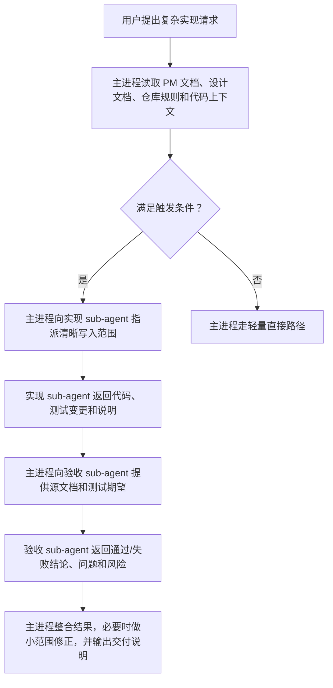
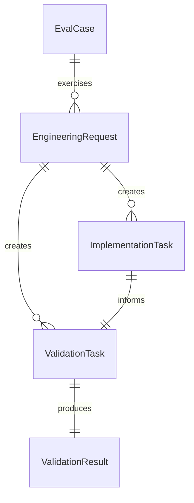

# Engineer Agent 编码阶段 sub-agent 分工 PRD

## 1. 背景与动机

Engineer Agent 负责代码库分析、功能实现、测试补充、问题修复和交付收尾等工程工作。复杂编码任务中，主进程通常需要同时保留需求文档、设计约束、代码上下文、实现细节、测试反馈和最终交付判断。

这会带来产品风险：本应负责高层上下文和最终判断的主进程，可能被大量底层实现细节挤占。结果可能表现为最终整合质量下降、验收标准遗漏、测试覆盖判断不充分，或交付说明中的风险表达不清晰。

本能力为复杂 Engineer Agent 编码任务引入明确的 sub-agent 分工模式。主进程保留上下文和最终判断；在任务复杂度满足条件时，实现工作交给实现 sub-agent，验收工作交给独立验收 sub-agent。

## 2. 目标与非目标

### 目标

1. 通过保留主进程上下文，提升 Engineer Agent 在复杂编码任务中的交付质量。
2. 明确实现委派要求，包括写入范围、模块边界、预期行为和禁止触碰区域。
3. 明确独立验收要求，以需求文档、设计文档、仓库规则和测试证据作为判断依据。
4. 增加持久化指导和 eval 覆盖，让该行为可重复、可回归，而不是依赖临时提示。

### 非目标

1. 不强制所有 Engineer Agent 请求都拆分 sub-agent。
2. 不改变 PM、Designer、QA、DevOps、Security 的角色边界。
3. 不为实现 sub-agent 或验收 sub-agent 新增公开 marketplace Agent。
4. 不用 sub-agent review 替代确定性测试。
5. 不覆盖 TRD 或 IMPLEMENTATION_PLAN 的文档编写 sub-agent 委派；这些是相邻但独立的已实现能力。
6. 本 PRD 不包含代码实现。

## 3. 用户画像

| 用户画像 | 描述 | 核心诉求 | 痛点 |
| --- | --- | --- | --- |
| 仓库维护者 | 维护 `dev-agent-skills`，审核 Agent 行为变更。 | Agent 边界稳定、变更风险可控、行为有 eval 兜底。 | 只改提示词的行为不容易验证，且可能静默回退。 |
| Engineer Agent 使用者 | 使用 Engineer Agent 处理功能实现、bug 修复和交付任务。 | 复杂任务执行可靠、最终总结清晰、降低需求遗漏风险。 | 长任务容易丢失上下文，或把实现和验收判断混在一起。 |
| Skill 作者 | 更新 specialist skill 指令和 eval fixture。 | 触发规则清楚、实现要求可落地、验收标准可测试。 | 行为模糊会导致 eval 脆弱，skill 输出不一致。 |

## 4. 用户故事与场景

| ID | 用户故事 | 优先级 | 验收标准 |
| --- | --- | --- | --- |
| US-001 | 作为仓库维护者，我希望 Engineer Agent 将复杂编码任务拆成主进程保留上下文、实现 sub-agent 编码、验收 sub-agent 审查三个职责，以便最终交付判断更稳定。 | P0 | 给定一个带 PM 或设计文档的复杂编码任务，当 Engineer Agent 进入实现阶段时，应由主进程作为协调者，并把实现和验收分配给不同 sub-agent。 |
| US-002 | 作为 Skill 作者，我希望实现 sub-agent 的任务描述包含文件归属、模块边界、预期行为和禁止事项，以避免委派工作覆盖无关改动。 | P0 | 给定一次实现委派，当生成 sub-agent 任务描述时，必须包含写入范围、职责边界、预期输出，以及不得回退无关改动的约束。 |
| US-003 | 作为仓库维护者，我希望验收 sub-agent 基于需求文档、设计文档、仓库规则和测试结果判断，以避免只做泛泛总结。 | P0 | 给定一次实现结果，当委派验收时，验收应检查需求符合度、测试覆盖、角色边界和遗留风险。 |
| US-004 | 作为 Engineer Agent 使用者，我希望简单任务保持轻量，以避免小改动引入不必要流程。 | P1 | 给定单文件小改、纯解释、纯代码阅读或用户明确不拆分的请求，Engineer Agent 可以不触发 sub-agent 分工。 |
| US-005 | 作为仓库维护者，我希望有一个 eval 证明该行为在真实文档驱动实现场景中生效，以便长期防回退。 | P0 | 给定 eval fixture，当验证 Engineer Agent 输出时，断言应确认实现与验收 sub-agent 分工，以及主进程最终整合。 |

## 5. 功能需求

| ID | 功能 | 描述 | 优先级 | 验收标准 |
| --- | --- | --- | --- | --- |
| FR-001 | 触发规则 | 定义 Engineer Agent 何时应优先使用 sub-agent 分工处理编码任务。 | P0 | 指导中明确复杂编码任务、多文件或多模块修改、spec 驱动实现、需要回归验证的 bug 修复、上下文较重任务属于触发场景。 |
| FR-002 | 非触发路径 | 定义何时不要求 sub-agent 分工。 | P0 | 指导中明确简单单文件修改、纯解释、纯阅读和用户明确不拆分属于非触发场景。 |
| FR-003 | 主进程职责 | 保留主进程作为协调者和最终整合者。 | P0 | 指导中说明主进程保留 PM 文档、设计文档、仓库规则、实现边界、测试证据、风险和最终交付说明。 |
| FR-004 | 实现 sub-agent 契约 | 定义实现委派必须包含的内容。 | P0 | 委派任务必须包含负责文件或模块、预期行为、测试期望、禁止触碰区域，以及不得回退无关改动。 |
| FR-005 | 验收 sub-agent 契约 | 定义验收委派必须包含的内容。 | P0 | 验收必须检查源需求、设计约束、仓库规则、测试结果、角色边界和遗留风险。 |
| FR-006 | Specialist skill 覆盖 | 更新复杂编码阶段相关 Engineer Agent dispatcher 和 specialist skill 指导。 | P0 | `engineer-agent`、`feature-implementor`、`debugger` 指导体现 implementation/validation split；TRD 文档编写委派属于相邻能力，`project-bootstrap` 是否纳入由实施决策确认。 |
| FR-007 | 仓库文档对齐 | 让仓库级指导与新的 Engineer Agent 行为保持一致。 | P1 | 仓库级文档描述该分工模式，但不改变角色归属。 |
| FR-008 | Eval 覆盖 | 新增或更新至少一个“文档驱动实现 + 独立验收”的 eval。 | P0 | Eval 断言检查触发行为、实现委派质量、验收依据和最终整合总结。 |

## 6. 非功能需求

| 类别 | 需求 | 指标 | 目标 |
| --- | --- | --- | --- |
| 可靠性 | 行为应能抵抗提示词调整带来的回退。 | Eval 覆盖 | MVP 至少 1 个真实场景 eval。 |
| 可维护性 | 指导应避免在大量文件中重复长规则。 | 指令重复度 | 共享概念尽量复用，必要处保持简洁。 |
| 易用性 | 简单任务保持快速直接。 | 流程开销 | 非触发场景不强制拆分 sub-agent。 |
| 可追踪性 | 行为能追溯到 PM 需求和 Issue 目标。 | 需求追踪 | P0 需求由文档或 eval 断言覆盖。 |
| 安全性 | 委派实现必须避免覆盖无关用户改动。 | 委派描述质量 | 实现任务包含写入范围和禁止事项。 |

## 7. 用户流程

### 主流程：复杂 spec 驱动实现

### 替代流程：简单任务

1. 用户提出单文件小改、解释或代码阅读请求。
2. Engineer Agent 判断请求不满足复杂度阈值。
3. Engineer Agent 选择最窄可用 specialist 路径直接处理。
4. 最终输出不声称已经完成独立 sub-agent 验收，除非实际发生。

### 异常流程：验收发现需求缺口

1. 验收 sub-agent 发现验收标准遗漏、测试缺口或角色边界问题。
2. 主进程判断该问题属于小范围修正、实现缺陷还是需求不明确。
3. 主进程执行小范围修正、向用户澄清，或在交付说明中报告遗留风险。

## 8. UI/UX 要求

该能力没有面向终端用户的图形界面。用户可感知的体验体现在 Engineer Agent 的对话过程和最终交付说明中。

交互行为要求：

- 使用 sub-agent 分工时说明正在使用该模式及原因。
- 最终输出保持清晰，包含实现结果、验收结论、测试情况和遗留风险。
- 不暴露无关的内部协作噪声，除非这些信息会影响用户判断。
- 如果没有使用验收 sub-agent，不应暗示已经完成独立验收。

## 9. 数据模型

| 实体 | 关键属性 | 说明 |
| --- | --- | --- |
| EngineeringRequest | 请求类型、复杂度信号、源文档、目标模块 | 从用户请求和仓库上下文中推导。 |
| ImplementationTask | 写入范围、模块归属、预期行为、测试、禁止事项 | 由主进程传递给实现 sub-agent。 |
| ValidationTask | 源文档、变更文件、测试结果、验收标准、仓库规则 | 由主进程传递给验收 sub-agent。 |
| ValidationResult | 问题、通过/失败状态、测试缺口、边界风险、遗留风险 | 用于主进程做最终交付判断。 |
| EvalCase | fixture workspace、prompt、assertions、comparison 结果 | 用于长期守护预期行为。 |

## 10. API 触点

| Endpoint | Method | 用途 | Request | Response |
| --- | --- | --- | --- | --- |
| N/A | N/A | 该能力不引入运行时 API。 | N/A | N/A |

内部触点：

| 触点 | 用途 | 预期变化 |
| --- | --- | --- |
| `agents/engineer/skills/engineer-agent/SKILL.md` | Dispatcher 行为 | 增加复杂编码任务 sub-agent 分工指导。 |
| `agents/engineer/skills/feature-implementor/SKILL.md` | Spec 驱动实现行为 | 增加实现委派和验收要求。 |
| `agents/engineer/skills/debugger/SKILL.md` | Bug 修复工作流行为 | 增加面向回归验证的委派指导。 |
| `agents/engineer/test/.../evals.json` | 行为守护 | 新增或更新真实场景 eval 断言。 |

## 11. 假设与约束

| 类型 | 描述 | 如果不成立的影响 |
| --- | --- | --- |
| 假设 | 当前会话支持 sub-agent 执行能力。 | 如果不支持，需要降级为明确的结构化 handoff 语言。 |
| 假设 | `feature-implementor` 和 `debugger` 足以覆盖 MVP。 | 如果 `project-bootstrap` 必须纳入，实施和 eval 范围会扩大。 |
| 约束 | 仓库变更应保持小范围，不做无关重构。 | PR 只应触及相关指导、文档、eval 和 fixture。 |
| 约束 | Eval 变更必须遵循共享 `evals.json` schema version `1.0`。 | 无效 eval 定义会阻塞仓库契约检查。 |
| 约束 | 不提交运行期 eval 产物。 | Transcript、outputs、diagnostics 等生成物不得进入 git。 |

## 12. 依赖

| 依赖 | 类型 | 描述 |
| --- | --- | --- |
| Engineer Agent skill 文档 | 内部 | Dispatcher 和 specialist skill 指导决定实际行为。 |
| Eval runner 和契约检查 | 内部 | 用于验证行为并避免 fixture 或产物漂移。 |
| 仓库指导 | 内部 | 如果该行为影响仓库级 Agent 协作，`AGENTS.md` 需要增加简短规则。 |
| 当前 sub-agent 能力 | 运行时 | 实际工程任务中需要该能力支持目标工作流。 |

## 13. 发布计划与里程碑

| 阶段 | 范围 | 目标时间 | Owner |
| --- | --- | --- | --- |
| Phase 1 | 更新 Engineer Agent dispatcher 和 MVP specialist 指导，覆盖复杂编码任务。 | TBD | Engineer maintainer |
| Phase 2 | 增加真实 eval fixture 和断言，覆盖文档驱动实现与独立验收。 | TBD | Engineer maintainer |
| Phase 3 | 运行确定性仓库检查，并在维护者确认后运行相关模型 eval。 | TBD | Maintainer |
| Phase 4 | 复盘 `project-bootstrap` 是否需要同样模式，再决定是否扩大范围。 | TBD | PM / Engineer maintainer |

## 14. 风险与缓解

| 风险 | 可能性 | 影响 | 缓解方式 |
| --- | --- | --- | --- |
| 过度触发 sub-agent 分工，拖慢简单任务。 | 中 | 中 | 保留明确非触发场景和轻量直接路径。 |
| 实现和验收 prompt 过于泛化。 | 中 | 高 | 强制包含具体写入范围、源文档、测试和禁止事项。 |
| Eval 只验证措辞，没有验证行为。 | 中 | 高 | 使用语义断言覆盖路由、委派质量、验收依据和最终总结。 |
| 多个 skill 中的指导重复且不一致。 | 中 | 中 | 保持共享概念简洁，并对齐 dispatcher 与 specialist wording。 |
| 验收 sub-agent 被误用为测试替代品。 | 低 | 高 | 明确确定性测试在适用时仍然必须执行。 |

## 15. 待确认问题

| # | 问题 | Owner | 截止点 | 结论 |
| --- | --- | --- | --- | --- |
| 1 | `project-bootstrap` 是否纳入 MVP，还是作为后续阶段？ | PM / Engineer maintainer | 实施前 | 待确认 |
| 2 | 默认触发阈值应基于文件数量、模块数量、是否存在 PM/design 文档，还是组合启发式？ | Engineer maintainer | 实施前 | 待确认 |
| 3 | 当确定性测试和验收 sub-agent 都可用时，验收应在测试前还是测试后执行？ | Engineer maintainer | 实施前 | 待确认 |
| 4 | 使用该工作流时，最终交付说明是否必须包含独立的“验收结论”行？ | PM / Engineer maintainer | 实施前 | 待确认 |

## 16. 附录

### 来源 Issue

- GitHub Issue: [#12 feat: Engineer Agent 编码阶段引入实现与验收 sub-agent 分工](https://github.com/Neplich/dev-agent-skills/issues/12)

### MVP 验收摘要

- 复杂编码任务默认触发 sub-agent 分工。
- 实现委派包含清晰范围和禁止事项。
- 验收委派检查源文档、测试和角色边界。
- 主进程保留上下文并负责最终整合。
- 至少一个真实场景 eval 守护该行为。
