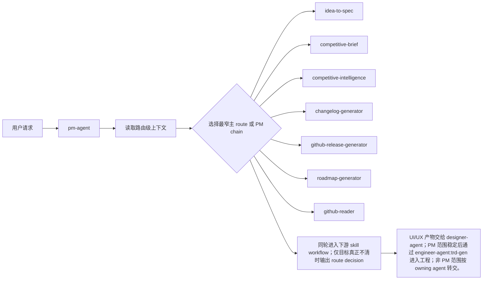

# pm-agent PRD

## 背景

`pm-agent` 是 Product Manager Agent 的统一入口，负责产品需求、范围收敛、项目状态、竞品、路线图和发布沟通。它的产品目标是把用户的角色级请求分流到一个最小足够的 specialist skill，而不是把一次请求扩展成全量流水线。

## 目标

1. 作为入口 dispatcher，识别用户意图并选择一个主 route。
2. 保持 route matrix 与 README、dispatcher `SKILL.md`、marketplace 和 skill 目录一致。
3. 在需要跨角色协作时说明 owning agent、输入包和期望产物。
4. 支持后续维护者通过 related docs 和 eval fixture 追踪行为漂移。

## 非目标

- 不把 `pm-agent` 自身当作下游 specialist route。
- 不默认同时执行所有 specialist skills。
- 不直接实现代码、测试、部署配置或安全修复。

## 用户画像

| Persona | Description | Key Needs | Pain Points |
|---------|-------------|-----------|-------------|
| 交付团队用户 | 通过 Codex / Claude Code 发起角色级任务的人 | 用自然语言进入正确 specialist workflow | 不知道该直接调用哪个 skill |
| Agent 维护者 | 维护 README、SKILL.md、marketplace、eval 和 PRD 的人 | 让路由、产物和边界可验证 | 文档泛化会掩盖实现差异 |
| 下游角色 Agent | 消费本 Agent 输出继续工作的角色 | 获得清晰 handoff 和当前限制 | 上游输出过宽会导致返工 |

## 用户故事与场景

| ID | User Story | Priority | Acceptance Criteria |
|----|-----------|----------|---------------------|
| US-A01 | 作为用户，我想通过 `pm-agent` 进入产品需求、范围收敛、项目状态、竞品、路线图和发布沟通流程，以便获得最小足够的 specialist 处理。 | P0 | 给定匹配请求，输出一个主 route、选择理由和下一步产物。 |
| US-A02 | 作为维护者，我想确认 route matrix 不自路由、不全量执行，以便和 eval 保持一致。 | P0 | 流程图只从 dispatcher 指向 specialist：`idea-to-spec`, `competitive-brief`, `competitive-intelligence`, `changelog-generator`, `github-release-generator`, `roadmap-generator`, `github-reader`。 |
| US-A03 | 作为下游 Agent，我想收到明确 handoff，以便继续工作时不重猜上下文。 | P1 | handoff 包含 target、source docs、blocked reason 或 expected output。 |

## 功能需求

| ID | Feature | Description | Priority | Acceptance Criteria |
|----|---------|-------------|----------|---------------------|
| FR-A00 | Entry Dispatcher | `pm-agent` 必须作为入口 dispatcher，负责激活角色级流程。 | P0 | README、marketplace 和 entry SKILL 都指向 `pm-agent`。 |
| FR-A01 | Route Matrix | Dispatcher 默认选择一个最小主 route；只有用户明确要求或目标强烈暗示更广 PM 链路时，才定义后续 multi-skill chain。 | P0 | 主 route 属于 `idea-to-spec`, `competitive-brief`, `competitive-intelligence`, `changelog-generator`, `github-release-generator`, `roadmap-generator`, `github-reader`，不包含 `pm-agent` 自身。 |
| FR-A02 | Context Boundary | Dispatcher 只收集路由所需上下文；实现/审查/测试细节由被选 specialist 收集。 | P0 | 缺少内容级上下文不会让入口停在元路由。 |
| FR-A03 | Artifact Ownership | 下游 specialist 拥有具体产物写入和验证责任；PM 主输出路径必须覆盖 `docs/pm/{feature_path}/`、`docs/roadmap.md`、`docs/changelog/changelog-v{version}.md` 和 `docs/release-notes/`。 | P0 | Dispatcher 输出预期产物路径和类型，不伪装成 specialist report。 |
| FR-A04 | Handoff | UI/UX 产物交给 designer-agent；PM 范围稳定后通过 engineer-agent:trd-gen 进入工程；非 PM 范围按 owning agent 转交。 | P0 | Handoff 指向 owning skill/agent，并说明输入包、`feature_path` 证据和期望输出。 |
| FR-A05 | Feature Path Routing | 当请求需要 PRD/BRD/DECISIONS/design.md 时，PM 入口必须把请求交给 `idea-to-spec` 解析合法多级 `feature_path`。 | P0 | 子功能不直接生成并列顶层 PM 目录；父功能不清楚时 blocked 或澄清。 |

## 当前实现对齐

### 路由矩阵

| Route | Current Implementation Trigger |
|---|---|
| `idea-to-spec` | 想法收敛、PRD/BRD/DECISIONS、existing-project feature/update、空仓库产品定义 |
| `competitive-brief` | 竞品研究、定位比较、市场扫描、messaging gaps |
| `competitive-intelligence` | 销售 battlecard、deal support、objection handling、interactive HTML battlecard |
| `changelog-generator` | 开发者视角 changelog、released/unreleased/full regeneration |
| `github-release-generator` | 站内 Release Notes 与审计门禁完成后的 GitHub Release preview、draft、publish |
| `roadmap-generator` | roadmap、milestone、version planning、后续优先级同步 |
| `github-reader` | GitHub repo health、issue/PR/milestone/backlog/release blockers |

## 验收标准

| ID | Criteria | Verification |
|----|----------|--------------|
| AC-01 | Agent route matrix 与 README、entry SKILL、marketplace 和 skill 目录一致，且不自路由。 | 对照 related_docs 和 `.claude-plugin/marketplace.json` 人工 review。 |
| AC-02 | 默认只选择一个最小主 route；明确要求或强烈暗示 broader PM workflow 时才串联 PM skills。 | 检查功能需求、路由矩阵和 Mermaid flow。 |
| AC-03 | 跨角色 handoff 指向 owning agent/skill，并包含输入包与期望产物。 | 检查功能需求、用户流程和 handoff 描述。 |
| AC-04 | feature-scoped PM 产物使用 `docs/pm/{feature_path}/`，子功能归属不清时不会创建新顶层目录。 | 对照 `idea-to-spec` 规则和 eval fixture。 |

## 非功能需求

| Category | Requirement | Metric | Target |
|----------|-------------|--------|--------|
| Accuracy | route 与 README / SKILL / marketplace 一致 | Review / eval | P0 场景无自路由或误路由 |
| Traceability | 关键行为能回到 related docs | 文档链接 | route、artifact、handoff 均有来源 |
| Maintainability | 新增/删除 skill 后 PRD 可同步 | repository contract | skill 清单一致 |
| Safety | 不输出凭据或越权修改 | 静态审查 | 0 secrets |

## 用户流程

Alternative flow: 如果 route 目标真正不清，最多提出一个路由级澄清问题。

Error flow: 如果请求属于其他角色，转交 owning agent，而不是继续扩大本 Agent 范围。

## 交互与输出要求

- 回复优先呈现选中的 route、原因、需要的输入和可交付结果。
- 对非技术用户保留必要边界，不暴露内部协议细节为强制前置知识。
- 不把全量 chain 画成默认路径；broader chain 必须有明确用户目标或被目标强烈暗示。

## 数据模型

| Entity | Key Attributes | Relationships |
|--------|----------------|---------------|
| Agent | name, role, entry_skill, source_dir | owns specialist routes |
| Skill | name, trigger, output, boundary | selected_by Agent |
| Request | intent, scope, constraints, evidence | routed_to Skill |
| Artifact | path, type, owner, status | produced_by Skill |
| Handoff | target, packet, expected_output | links Agent/Skill |

## 接口与文件触点

| Endpoint | Method | Purpose | Request | Response |
|----------|--------|---------|---------|----------|
| `.claude-plugin/marketplace.json` | File read | 获取 Agent 与 skill 注册 | JSON | registered routes |
| `agents/product_manager/README.md` | File read | 获取角色边界和 route matrix | Markdown | role contract |
| `agents/product_manager/skills/pm-agent/SKILL.md` | File read | 获取 dispatcher 协议 | Markdown | route behavior |
| `skills-lock.json` | File read | 追踪 skill metadata | JSON | lock consistency |

## 假设与约束

| Type | Description | Impact if Wrong |
|------|-------------|-----------------|
| Constraint | `AGENTS.md` 是仓库指导唯一来源。 | 指导分叉会导致 PRD 与实现不一致。 |
| Constraint | Agent 协作通过 Markdown 和项目资产完成，不依赖共享状态机。 | PRD 不应写成强制流水线。 |
| Assumption | 当前 specialist 清单来自 marketplace 和目录。 | 新增 skill 后需要同步本 PRD。 |

## 相关实现文档

- Internal: `agents/product_manager/README.md`, `agents/product_manager/README_zh.md`, `.claude-plugin/marketplace.json`, `agents/product_manager/skills/pm-agent/SKILL.md`, `skills-lock.json`, `agents/product_manager/test/pm-agent/evals/evals.json`。
- Internal: 对应 eval fixture / comparison 用于行为回归。
- External: Codex / Claude Code 的 skill discovery 或 plugin marketplace。

## 发布计划与里程碑

| Phase | Scope | Target Date | Owner |
|-------|-------|-------------|-------|
| Draft | 生成并校验 Agent PRD | 2026-06-12 | PM |
| Review | 对齐 route matrix、handoff 和 related docs | TBD | Maintainer |
| Adopt | 后续 skill 行为变化时同步更新 | TBD | Maintainer |

## 风险与缓解

| Risk | Likelihood | Impact | Mitigation |
|------|------------|--------|------------|
| Dispatcher 被写成自路由 | Medium | 用户误以为存在循环 route | PRD 与 eval 均要求无自路由 |
| 一次请求执行所有 specialist | Medium | 范围膨胀 | route matrix 明确一个主 route |
| 新增 skill 后 PRD 过期 | Medium | 文档漂移 | 将 PRD 更新纳入 skill 维护 checklist |

## 待确认问题

| # | Question | Owner | Deadline | Resolution |
|---|----------|-------|----------|------------|
| 1 | 是否把 PRD 与 marketplace/skills-lock 一致性纳入 repository contract？ | Maintainer | TBD | Unresolved |
| 2 | 是否为 Agent PRD 建立独立 validator？ | Maintainer | TBD | Unresolved |
