# changelog-generator PRD

## 背景

`changelog-generator` 隶属于 `pm-agent`，当前 PRD 描述的是仓库内 skill 的产品契约。文档必须对齐 `SKILL.md`、父级 README、dispatcher route matrix 和 marketplace，避免把通用模板误写成已实现行为。

本仓库是 Markdown-first skill marketplace。用户可见能力常通过 skill 文档、eval fixture、durable `comparison.md`、CI workflow、release workflow 和协作边界规则落地。`docs:`、`test:`、`ci:` 这类 conventional commit prefix 在传统应用仓库中经常代表低价值内部变更，但在本仓库中也可能代表真实产品能力、验证能力或发布流程变化。`changelog-generator` 需要读取 PR body 和必要上下文判断语义影响，而不是仅凭标题前缀无条件跳过。

## 目标

1. 明确 `changelog-generator` 的真实触发条件、上下文、工作流、产物和 handoff。
2. 让维护者能用 PRD 对照 `SKILL.md` / README / eval 检查行为漂移。
3. 将 Sub Agent 校验发现的实现差异收敛为可验收 requirement。
4. 保持与 `pm-agent` 的角色边界一致。
5. 在 docs-first / skill marketplace 仓库中保留重要文档、测试和 CI 变更进入 changelog 的能力。

## 非目标

- 不接管 `pm-agent` 之外角色的职责；不在上下文不足时伪造结论。
- 不把 `changelog-generator` 的 specialist 行为泛化成整个 `pm-agent` 的能力。
- 不把 repository contract 或 eval 误写成每次 runtime 必跑步骤，除非当前 skill 明确要求。
- 不把所有 `docs:`、`test:`、`ci:` PR 都强制纳入 changelog；低价值内部维护变更仍可省略。
- 不替代 release-notes-generator 的用户公告写作；本 skill 只维护 changelog 条目。

## 用户画像

| Persona | Description | Key Needs | Pain Points |
|---------|-------------|-----------|-------------|
| 直接调用用户 | 已知道要使用 `changelog-generator` 的用户 | 直接获得当前 skill 的真实产物 | 泛化 PRD 会误导输入和输出 |
| `pm-agent` Dispatcher | 根据用户意图选择下游 skill | 清晰 trigger 和 route boundary | 描述过宽会误路由 |
| 维护者 | 维护 skill 文档和 eval 的人 | 可追溯、可校验的契约 | related docs 不全会漏掉真实实现 |
| Release owner | 根据 merged PR 生成发布变更记录的人 | changelog 与真实能力变化一致 | 低价值前缀过滤会漏掉 docs-first 能力变化 |

## 用户故事与场景

| ID | User Story | Priority | Acceptance Criteria |
|----|-----------|----------|---------------------|
| US-S01 | 作为用户，我想在 `changelog-generator` 场景下获得对应工作流，以便得到真实产物。 | P0 | 输出满足 FR-S04，不以泛化描述替代实际 artifact。 |
| US-S02 | 作为 dispatcher，我想知道何时选择 `changelog-generator`，以便避免自路由或跨 skill 误路由。 | P0 | FR-S01 和 route / handoff 与父级 SKILL.md 一致。 |
| US-S03 | 作为维护者，我想快速定位依赖文档，以便校验实现是否漂移。 | P1 | related_docs 覆盖 public entry、parent dispatcher 和必要 internal/reference/eval 文件。 |
| US-S04 | 作为 release owner，我想让 docs/test/ci PR 按语义影响判断是否进入 changelog，以便发布记录不漏掉 skill 行为、验证或发布流程变化。 | P0 | FR-S08 和 FR-S09 能同时覆盖 skill marketplace 重要变化和传统仓库低价值变更省略。 |

## 功能需求

| ID | Feature | Description | Priority | Acceptance Criteria |
|----|---------|-------------|----------|---------------------|
| FR-S01 | Trigger Matching | `changelog-generator` 必须覆盖当前实现的触发场景，而不是只复述 frontmatter 摘要。 | P0 | 匹配场景与 parent dispatcher 和 `changelog-generator` SKILL.md 一致。 |
| FR-S02 | Context Intake | merged PRs、release tags、compare range；few/no PRs 时读取 compare commits fallback；issues 仅作为未合并引用兜底。 | P0 | 缺少真正阻塞的上下文时才澄清或 blocked；可推导上下文不应被写成硬门槛。 |
| FR-S03 | Workflow Execution | 必须按当前实现工作流执行，并保留已实现的 gate、phase 或 mode。 | P0 | Mermaid 流程和工作流条目覆盖关键阶段。 |
| FR-S04 | Artifact Output | 创建或更新 docs/changelog/changelog-v{version}.md、docs/changelog/changelog-unreleased.md，或 Full regeneration 的 per-version files；根 CHANGELOG.md 只做索引。 | P0 | 未阻塞时产出指定 artifact；blocked 时说明原因、缺口和 next owner。 |
| FR-S05 | Boundary Guard | 不接管 `pm-agent` 之外角色的职责；不在上下文不足时伪造结论。 | P0 | 越界事项转交 owning skill/agent，不在本 skill 内扩大范围。 |
| FR-S06 | Handoff | 用户视角公告交 release-notes-generator；项目状态交 github-reader；in-scope changelog 可结束。 | P0 | Handoff 目标具体到 skill/agent/owner，并携带输入包、证据和期望结果。 |
| FR-S07 | Traceability | PRD 必须引用执行契约来源。 | P1 | related_docs、Dependencies、API Touchpoints 能覆盖关键实现来源。 |
| FR-S08 | Semantic Inclusion | `docs:`、`test:`、`ci:`、`build:` 和 `style:` PR 不得仅凭标题前缀无条件跳过；必须在 PR body、标题和可得文件上下文中判断是否影响 skill 行为、routing、eval fixture、durable comparison、installation、marketplace、release workflow、CI gate 或协作边界。 | P0 | 当 PR body 明确描述上述影响时，条目可以进入 Added / Changed / Fixed / Security 等合适 section，并保留 PR 链接。 |
| FR-S09 | Low-Value Omission | 传统应用仓库或低价值维护 PR 仍可省略，例如拼写修复、README 排版、内部测试重命名、CI 版本 bump 或无用户可见影响的脚本维护。 | P0 | eval 必须覆盖低价值 docs/test/ci 仍被跳过的样例，避免 changelog 噪音回归。 |
| FR-S10 | Repository Context Awareness | 当仓库表现为 skill marketplace、documentation-first、library release 或其他文档即产品的项目时，前缀降权规则应更依赖语义影响；当仓库是传统应用且 body 无用户可见信号时，允许维持省略。 | P1 | 判断规则在 SKILL.md 和 prefix reference 中明确描述，并可由 eval 语义断言验证。 |

## 实现契约

### 目标工作流

- 选择 released / unreleased / full mode
- 收集 merged PRs 和 tags
- few/no PRs 时使用 compare commits fallback
- 自动跳过 bot、依赖 bump、release chore 和明确 internal scope 噪音
- 对 docs/test/ci/build/style PR 进行语义影响判断
- 按 conventional prefix 分类并标记 breaking changes
- 省略空 section 并更新根索引

### Docs/Test/CI 语义纳入信号

| Signal | Include When | Default Section |
|--------|--------------|-----------------|
| Skill behavior | PR body 描述 skill 执行规则、routing、handoff、门禁或 agent 协作边界变化 | Changed |
| Eval evidence | PR body 描述 eval fixture、assertion、durable `comparison.md`、fresh subagent validation 或 required check 策略变化 | Changed |
| Installation / marketplace | PR body 描述 marketplace registry、skill metadata、安装方式或锁文件语义变化 | Added / Changed |
| Release workflow | PR body 描述 changelog preflight、GitHub release、tag、draft release 或发布复核流程变化 | Changed |
| User-facing documentation | PR body 描述用户直接依赖的 README、reference 或 public skill docs 能力变化 | Added / Changed |

### 低价值省略信号

| Signal | Skip When |
|--------|-----------|
| Formatting-only docs | 仅修正错别字、排版、链接文本或无行为影响的 README 示例 |
| Internal test maintenance | 仅重命名测试、整理 fixture、调整 mock，且不改变验证契约 |
| Internal CI maintenance | 仅更新 runner 版本、缓存策略、依赖安装细节，且不改变 release 或 required gate |
| Dependency / release chore | bot PR、`chore(deps)`、`build(deps)`、`chore(release)` 或 bump pattern |

## 验收标准

| ID | Criteria | Verification |
|----|----------|--------------|
| AC-01 | P0 trigger、context、workflow、artifact 和 handoff 与当前实现文档一致。 | 对照 related_docs 中的 README、SKILL.md、internal/reference 或 eval 文件人工 review。 |
| AC-02 | 文档不包含自路由、全量默认执行或将 specialist 行为泛化为整个 Agent 的错误描述。 | 检查 route matrix、非目标、边界和 Mermaid flow。 |
| AC-03 | 产物要求必须指向具体文件、报告、代码变更或 blocked 输出，不使用模糊替代表述。 | 检查功能需求和用户流程中的 artifact 节点。 |
| AC-04 | `docs:` / `test:` / `ci:` PR 不再被无条件跳过；skill marketplace 中的行为、eval、release、installation 和协作边界变化可进入 changelog。 | 更新 `SKILL.md`、`cc-prefixes.md` 和 changelog-generator eval，覆盖 issue #29 场景。 |
| AC-05 | 传统应用仓库中低价值 docs/test/ci 维护 PR 仍可被省略。 | eval 至少包含一个低价值 docs/test/ci 省略样例。 |

## 非功能需求

| Category | Requirement | Metric | Target |
|----------|-------------|--------|--------|
| Accuracy | PRD 与当前 SKILL.md/README 一致 | Sub Agent review | 无已知实现差异 |
| Testability | P0 条目可由文件、命令或人工 review 验证 | Checklist | 每条有明确验收标准 |
| Traceability | 关键规则可追溯到 related docs | 文档链接 | 不依赖隐含记忆 |
| Compatibility | 低价值维护变更不污染 changelog | Eval semantic assertions | 低价值 docs/test/ci 样例保持跳过 |
| Safety | 不输出凭据、token、cookie、SSH key | 静态审查 | 0 secrets |

## 用户流程

```mermaid
flowchart LR
    Request["用户请求"] --> Match["匹配 skill trigger"]
    Match --> Context["读取/确认实现契约上下文"]
    Context --> Step1["选择 released / unreleased / full mode"]
    Step1 --> Step2["收集 merged PRs 和 tags"]
    Step2 --> Step3["跳过 bot/deps/release chore/internal scope"]
    Step3 --> Step4{"低价值前缀?"}
    Step4 -- "否" --> Step5["按 conventional prefix 分类并标记 breaking changes"]
    Step4 -- "是" --> Step6["读取 PR body 和上下文判断语义影响"]
    Step6 -- "影响 skill / eval / release / install / collaboration" --> Step5
    Step6 -- "低价值维护" --> Skip["省略条目"]
    Step5 --> Step7["省略空 section 并更新根索引"]
    Skip --> Step7
    Step7 --> Artifact["输出具体产物或 blocked 结果"]
    Artifact --> Handoff["交接或结束"]
```

Alternative flow: 如果请求不属于 `changelog-generator`，应按 `pm-agent` route matrix 转到 owning skill。

Error flow: 如果必要上下文无法满足，输出 blocked reason、missing input、next owner 和可恢复步骤。

## 交互与输出要求

- 输出先给结论、产物和证据，再说明限制和下一步。
- 对需要用户确认的事项只问当前最小阻塞问题。
- Dispatcher 选择 skill 时应说明选择理由；specialist 自身不需要把“正在使用某 skill”作为产品强制要求，除非 SKILL.md 明确要求。

## 数据模型

| Entity | Key Attributes | Relationships |
|--------|----------------|---------------|
| Skill | name, agent, trigger, workflow, output | belongs_to `pm-agent` |
| Context | source_docs, code_or_repo_state, constraints, evidence | consumed_by Skill |
| Artifact | path, type, owner, status, evidence | produced_by Skill |
| Handoff | target, reason, packet, expected_output | emitted_when needed |
| Validation | related_docs, evals, manual review | verifies contract |
| PR Signal | title, body, author, changed files when available, repository type | informs classification |

## 接口与文件触点

| Endpoint | Method | Purpose | Request | Response |
|----------|--------|---------|---------|----------|
| `agents/product_manager/skills/changelog-generator/SKILL.md` / parent dispatcher / marketplace | Read / CLI | 获取当前 skill 的实现契约或运行依赖 | 本地仓库上下文 | 触发、工作流、产物或数据 |
| `agents/product_manager/skills/changelog-generator/references/cc-prefixes.md` | File read | 获取 conventional prefix 纳入和省略规则 | Markdown | prefix classification policy |
| `gh pr list --json number,title,body,mergedAt,author` | CLI read | 获取 PR 标题、正文和作者用于语义判断 | repo、date range 或 tag range | merged PR metadata |
| `.claude-plugin/marketplace.json` | File read | 校验注册和 agent 归属 | JSON | plugin skill mapping |
| `agents/product_manager/README.md` | File read | 校验角色边界和路由 | Markdown | role context |

## 假设与约束

| Type | Description | Impact if Wrong |
|------|-------------|-----------------|
| Constraint | 当前 PRD 描述已实现行为，不替代 SKILL.md。 | SKILL.md 改动后 PRD 需要同步。 |
| Constraint | Specialist 不应回指入口 dispatcher 形成循环 handoff。 | Handoff 应写到具体 skill/agent/owner。 |
| Assumption | related docs 中的实现契约是当前 source of truth。 | 缺少 internal/reference 文件会造成校验漏项。 |
| Constraint | 低价值前缀只能降权，不能无条件排除。 | release changelog 会漏掉 docs-first 能力变化。 |
| Assumption | PR body 足以表达大多数 docs/test/ci PR 的语义影响；必要时可结合 changed files 或 compare fallback。 | body 缺失时需要保守判断并记录分类依据。 |

## 相关实现文档

- Internal: `agents/product_manager/README.md`, `agents/product_manager/README_zh.md`, `agents/product_manager/skills/pm-agent/SKILL.md`, `agents/product_manager/skills/changelog-generator/SKILL.md`, `agents/product_manager/skills/changelog-generator/references/cc-prefixes.md`, `.claude-plugin/marketplace.json`, `agents/product_manager/test/changelog-generator/evals/evals.json`。
- Engineer: `docs/engineer/skill-changelog-generator/TRD.md`。
- Issue: `https://github.com/Neplich/dev-agent-skills/issues/29`。
- Internal: 父级 dispatcher route matrix、README 和 marketplace 注册。
- External: Codex / Claude Code skill execution environment；具体外部 CLI/API 仅在 SKILL.md 明确要求时使用。

## 发布计划与里程碑

| Phase | Scope | Target Date | Owner |
|-------|-------|-------------|-------|
| Draft | 生成 `changelog-generator` PRD | 2026-06-12 | PM |
| Review | 对照 SKILL.md、README、eval 修正差异 | 2026-06-12 | PM / Maintainer |
| Semantic policy | 明确 docs/test/ci 语义纳入和低价值省略规则 | 2026-06-15 | PM / Engineer |
| Adopt | 将 PRD 纳入后续 skill 行为变更 checklist | TBD | Maintainer |

## 风险与缓解

| Risk | Likelihood | Impact | Mitigation |
|------|------------|--------|------------|
| PRD 只复述 frontmatter | Medium | 漏掉真实 workflow / gate | 将 workflow、artifact、handoff 写成 P0 requirement |
| Handoff 回到入口 dispatcher | Medium | 形成循环路由 | 写具体 specialist / owning agent / release owner |
| 产物被写成“或描述” | Medium | 文档通过但没有实际 artifact | 明确 write/update 或 blocked 条件 |
| 过度纳入 docs/test/ci | Medium | changelog 噪音增加 | 保留低价值省略规则并用 eval 覆盖传统仓库场景 |
| 过度依赖标题前缀 | High | 漏掉 skill marketplace 真实能力变化 | 对低价值前缀读取 body 和上下文判断语义影响 |

## 待确认问题

| # | Question | Owner | Deadline | Resolution |
|---|----------|-------|----------|------------|
| 1 | 是否将本 PRD 纳入对应 skill eval 的 durable comparison 检查？ | Maintainer | TBD | Unresolved |
| 2 | 是否需要为 `changelog-generator` 增加专门 PRD validator？ | Maintainer | TBD | Unresolved |
| 3 | body 缺失且 changed files 无法获取时，低价值前缀 PR 是否默认跳过？ | Maintainer / Engineer | Implementation planning | 建议默认跳过并在输出中记录依据，除非标题本身明确表达用户可见影响。 |

## 文档变更记录

| Version | Date | Changes |
|---------|------|---------|
| 1.1.0 | 2026-06-15 | 增加 docs/test/ci 语义纳入、低价值省略、仓库上下文判断和 issue #29 验收要求。 |
| 1.0.0 | 2026-06-12 | Initial version. |
