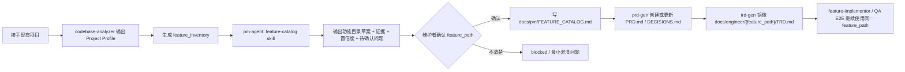

# 接手项目功能目录与项目画像 PRD

## 背景

当用户从中间接手一个已有项目时，`engineer-agent:codebase-analyzer` 已能输出
Project Profile，覆盖技术栈、目录结构、依赖、架构模式和工程约定，但缺少一个
明确流程，把代码现状、已有文档和业务入口整理成可维护的功能目录。

`feature_path` 是跨 PM、Engineer、Design、QA、DevOps、Security 的功能归属
主键。如果接手项目时没有先建立清晰的功能地图，后续 PRD、TRD、
IMPLEMENTATION_PLAN 和 QA E2E 目录容易在单次请求中临时命名，导致同一个功能
在不同角色文档里无法稳定对齐，出现并列顶层目录或父功能归属漂移。

## 目标

1. `codebase-analyzer` 能在 Project Profile 中输出 `feature_inventory`：
   功能候选清单、证据来源、置信度和待确认问题。
2. `pm-agent` 有独立 `feature-catalog` specialist skill，处理“中途接手项目，
   先建立功能目录和项目功能画像”的请求。
3. 新 skill 产出带证据和置信度的功能目录草案，经维护者确认后才写正式文档，
   不直接批量生成 PRD。
4. 确认后的功能沿既有链路交接：`prd-gen` 创建或更新
   `docs/pm/{feature_path}/PRD.md` 和 `DECISIONS.md`，PM 文档确认后显式
   handoff 给 `engineer-agent:trd-gen` 镜像 TRD。

## 非目标

- 不要求一次性为整个旧项目生成完整 PRD/TRD。
- 不按代码目录机械复制正式功能目录；代码目录、路由、API 和数据模型只作为
  证据来源。
- 不替代 `prd-gen` 的 PRD 生成、`trd-gen` 的技术设计或 QA 的 E2E 用例沉淀。
- 不修改既有 `feature_path` contract 的机器校验规则。

## 用户画像

| Persona | Description | Key Needs | Pain Points |
| --- | --- | --- | --- |
| 接手项目的维护者 | 中途接管已有代码库的人 | 快速回答“这个项目现在有哪些功能、哪些模块支撑这些功能” | 只有代码没有功能地图，新增文档时命名漂移 |
| PM Agent 使用者 | 用 PM 链路整理需求的人 | 在写 PRD 前先有一份可确认的功能目录草案 | 单次请求临时命名 `feature_path`，产生并列顶层目录 |
| 下游 Agent | Engineer、QA、DevOps、Security 等角色 | 各角色文档共享同一 `feature_path` | 同一功能在不同角色目录下名字不一致 |

## 用户故事与场景

| ID | User Story | Priority | Acceptance Criteria |
| --- | --- | --- | --- |
| US-001 | 作为接手项目的维护者，我想让 Agent 系统性梳理现有功能，以便建立可维护的功能目录。 | P0 | 输出功能目录草案，包含候选功能、建议 `feature_path`、证据、置信度、待确认问题和关联代码路径。 |
| US-002 | 作为维护者，我想在草案确认后再生成正式文档，以便避免 Agent 批量伪造 PRD。 | P0 | 未经确认时 skill 停在草案和最小澄清问题；确认后才写正式功能目录文档并交给 `prd-gen`。 |
| US-003 | 作为下游 Agent 使用者，我想让确认后的功能沿既有链路流转，以便 PRD、TRD 和 QA 目录使用同一 `feature_path`。 | P0 | PM 文档确认后显式 handoff 给 `trd-gen`，handoff packet 携带 `feature_path`、`feature`、`parent_feature`、`feature_level` 和 `feature_path_evidence`。 |
| US-004 | 作为 monorepo 维护者，我想在范围不清时被最小化追问，以便不产生错误归属的功能目录。 | P0 | 范围不清时输出 blocked 和最小澄清问题，不创建新的并列顶层目录。 |

## 功能需求

| ID | Feature | Description | Priority | Acceptance Criteria |
| --- | --- | --- | --- | --- |
| FR-001 | Feature Inventory Output | `codebase-analyzer` 在 Project Profile 中输出 `feature_inventory` 段。 | P0 | 每个条目包含 `candidate_feature`、`suggested_feature_path`、`evidence`（routes/pages/api_endpoints/services/data_models/background_jobs/tests/docs）、`confidence` 和 `open_questions`。 |
| FR-002 | Feature Catalog Skill | `pm-agent` 下新增 `feature-catalog` specialist skill，处理接手项目建立功能目录的请求。 | P0 | skill 可被“建立功能目录”“功能画像”“接手项目先梳理功能”等短语触发，并在 `pm-agent` 路由表注册。 |
| FR-003 | Catalog Draft First | skill 先产出功能目录草案，带证据、置信度和待确认问题，不直接批量生成 PRD。 | P0 | 草案未确认时不创建 `docs/pm/{feature_path}/PRD.md`，也不写正式功能目录文档。 |
| FR-004 | Business Capability Naming | 功能目录按用户能理解的业务能力建，代码目录、路由、API 和数据模型只作为证据。 | P0 | 草案不机械复制代码目录名；已有 `docs/pm/**/PRD.md` 的功能复用既有 `feature_path`。 |
| FR-005 | Blocked Gate | 父功能不清或 monorepo 范围不清时输出 blocked 或最小澄清问题。 | P0 | 不创建新的并列顶层目录；unresolved 条目记录 open questions。 |
| FR-006 | Confirmed Catalog Artifact | 维护者确认后，skill 写正式功能目录文档 `docs/pm/FEATURE_CATALOG.md`。 | P0 | 文档包含确认的功能树、每个功能的证据与置信度，以及尚未确认的遗留问题。 |
| FR-007 | PRD Cooperation | 确认 `feature_path` 后，配合 `prd-gen` 创建或更新 `docs/pm/{feature_path}/PRD.md` 和 `DECISIONS.md`。 | P0 | `feature-catalog` 自身不生成 PRD 正文，只移交确认后的功能上下文。 |
| FR-008 | Engineer Handoff | PM 文档确认后显式 handoff 给 `engineer-agent:trd-gen` 镜像 `docs/engineer/{feature_path}/TRD.md`。 | P0 | handoff packet 包含 `feature_path`、`feature`、`parent_feature`、`feature_level` 和 `feature_path_evidence`。 |
| FR-009 | Evidence Format | feature catalog 条目的证据结构与 `feature_inventory` 对齐，作为 `feature_path_evidence` 的标准来源。 | P1 | 下游 handoff packet 可直接引用 catalog 条目证据，不另建证据格式。 |
| FR-010 | Eval Coverage | eval 覆盖无文档老项目、已有父 PRD 的子功能、monorepo 范围不清需要澄清三个场景。 | P0 | 断言检查草案先行、证据与置信度、父功能复用和 blocked 行为。 |

## 非功能需求

| Category | Requirement | Metric | Target |
| --- | --- | --- | --- |
| Traceability | 每个候选功能可追溯到证据 | Evidence link | 草案条目均携带代码或文档证据 |
| Consistency | 功能命名跨角色稳定 | feature_path reuse | 确认后的 `feature_path` 被 PRD/TRD/QA 复用 |
| Safety | 不伪造正式文档 | Confirmation gate | 未确认不写 `docs/pm/{feature_path}/PRD.md` |
| Simplicity | 追问最小化 | Clarification count | blocked 时只问当前最小阻塞问题 |

## 用户流程

错误流程：父功能归属或 monorepo 范围不清时，skill 停在草案，输出 blocked
和最小澄清问题，不创建新的并列顶层目录，也不生成正式文档。

## UI/UX 要求

本需求不涉及产品 UI。交互要求只体现在 agent 输出中：

- 草案输出必须区分“待确认”与“已确认”，并逐条列出证据和置信度。
- 需要澄清时，只问当前最小阻塞问题。
- 确认后输出必须说明正式功能目录文档路径和下一步 handoff 目标。

## 数据模型

| Entity | Key Attributes | Relationships |
| --- | --- | --- |
| Feature Inventory Entry | `candidate_feature`, `suggested_feature_path`, `evidence`, `confidence`, `open_questions` | 由 `codebase-analyzer` 产出，作为 catalog 草案输入 |
| Catalog Draft Entry | 候选功能、建议 `feature_path`、证据、置信度、待确认问题、关联代码路径 | 由 `feature-catalog` 产出，等待维护者确认 |
| Confirmed Catalog | 功能树、每功能证据与置信度、遗留问题 | 写入 `docs/pm/FEATURE_CATALOG.md` |
| Handoff Packet | `feature_path`, `feature`, `parent_feature`, `feature_level`, `feature_path_evidence` | 从 confirmed catalog 移交 `prd-gen` / `trd-gen` |

## API Touchpoints

| Endpoint | Method | Purpose | Request | Response |
| --- | --- | --- | --- | --- |
| `agents/engineer/skills/codebase-analyzer/SKILL.md` | File update | Project Profile 增加 `feature_inventory` | Markdown | 更新后的输出契约 |
| `agents/product_manager/skills/feature-catalog/SKILL.md` | File create | 新 specialist skill 公开契约 | Markdown | skill 文档 |
| `agents/product_manager/skills/pm-agent/SKILL.md` | File update | 注册路由信号和默认路由 | Markdown | 更新后的 dispatcher |
| `.claude-plugin/marketplace.json` | File update | 注册 skill | JSON | 更新后的 registry |
| `skills-lock.json` | File update | 新增 lock 条目并刷新受影响 hash | JSON | 更新后的 lock |
| `agents/product_manager/test/feature-catalog/evals/evals.json` | File create | 固化行为回归 | eval definitions | eval assertions |

## 假设与约束

| Type | Description | Impact if Wrong |
| --- | --- | --- |
| Constraint | 功能目录草案必须先于任何正式文档产出。 | 跳过确认会批量伪造 PRD。 |
| Constraint | 确认后的 PRD/TRD 生成仍归 `prd-gen` / `trd-gen` 所有。 | skill 越界会重复既有链路逻辑。 |
| Assumption | `feature_inventory` 的证据分类足以支撑 `feature_path_evidence`。 | 证据格式不足时下游 handoff 需要二次整理。 |
| Assumption | 旧单层功能目录继续兼容为一级功能。 | 强制迁移会放大接手成本。 |

## 依赖

- `codebase-analyzer` 已输出 Project Profile，可扩展 `feature_inventory` 段。
- `feature_path` contract 已定义多级 lower kebab-case 路径和
  `feature_path`/`parent_feature`/`feature_level` frontmatter。
- `idea-to-spec`（prd-gen）和 `trd-gen` 已覆盖确认后的 PRD/TRD 生成。

## 发布计划与里程碑

| Phase | Scope | Target Date | Owner |
| --- | --- | --- | --- |
| Draft | 补齐 issue 级 PRD/TRD/IMPLEMENTATION_PLAN | 2026-07-04 | PM / Engineer |
| Implement | 增强 codebase-analyzer、新增 feature-catalog skill、注册与 eval | 2026-07-04 | Engineer |
| Validate | 运行 repository/eval contract 与 pytest；模型 eval 由维护者在 PR 上决定触发 | TBD | Maintainer |

## 风险与缓解

| Risk | Likelihood | Impact | Mitigation |
| --- | --- | --- | --- |
| 草案被误当成确认结论 | Medium | 错误 `feature_path` 流入正式文档 | 草案必须显式标记待确认，确认门禁不通过不落正式文档。 |
| 候选功能机械复制代码目录 | Medium | 功能目录不可读 | 按业务能力命名，代码路径只作为证据。 |
| monorepo 范围误判 | Medium | 功能归属漂移 | 范围不清时 blocked 并最小化追问。 |
| skill 边界与 idea-to-spec 重叠 | Low | 路由混乱 | 明确 feature-catalog 只负责接手画像与目录，需求收敛仍归 idea-to-spec。 |

## 待确认问题

| # | Question | Owner | Deadline | Resolution |
| --- | --- | --- | --- | --- |
| 1 | 正式功能目录文档是否固定为 `docs/pm/FEATURE_CATALOG.md`，多 workspace monorepo 是否需要按范围拆分？ | Maintainer | Implementation planning | Proposed: 固定单文件入口，monorepo 范围在文档内分节 |
| 2 | 旧单层功能目录是否在被实质更新时才补齐 `feature_path`/`parent_feature`/`feature_level`？ | Maintainer | Implementation planning | Proposed: yes，与既有 feature path contract 保持一致 |
