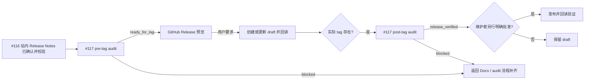

# github-release-generator PRD

## 背景

PM 侧现有 `release-notes-generator` 同时包含面向用户的版本说明和 GitHub Release
操作，职责与 issue #116 新增的 Docs `release-notes-generator` 重叠。issue #116 已将
VitePress 站内 Release Notes 的生成、确认、索引、元数据和宿主文档校验交给
docs-agent；issue #117 已将发版审计拆成 pre-tag `ready_for_tag` 与 post-tag
`release_verified` 两个状态。

本功能把 PM 侧 skill 原地收敛更名为 `github-release-generator`。站内 Release Notes
是版本事实的权威来源；本 skill 只把已确认事实转换为符合项目风格的 GitHub Release，
并补充 compare、PR、commit 和贡献者的可追溯链接。

## 当前状态与目标状态

| 维度 | 当前状态 | 目标状态 |
| --- | --- | --- |
| PM skill | `release-notes-generator` 同时描述公告、GitHub Release 和部分站内交接 | 更名为 `github-release-generator`，仅拥有 GitHub Release 生命周期 |
| 站内 Release Notes | Docs specialist 已承接，但 PM 旧名仍造成职责混淆 | `docs-agent:release-notes-generator` 是唯一站内版本说明 owner |
| 发版时序 | PM 旧流程未完整消费 #117 双态 | 草稿在 `ready_for_tag` 后；发布在实际 tag、`release_verified` 和独立批准后 |
| Codex 安装名 | PM/Docs 同名时使用限定名双安装 | 更名后两个 skill 均恢复朴素名；通用冲突机制继续保留 |

## 目标

1. 建立站内 Release Notes、文档审计、GitHub Release 之间不可绕过的顺序门禁。
2. 保证 GitHub Release 与已确认的站内版本事实一致，不由 GitHub 维护信息反向改写事实。
3. 为 GitHub Release 补充可点击的 compare、PR、commit 和贡献者追溯信息。
4. 将预览、draft 与发布拆开，所有发布操作都要求维护者另行明确批准。
5. 消除 PM/Docs 同名 skill，同时保留安装器的通用同名冲突能力。

## 非目标

- 不写入或修改 `docs/site/`，不生成 VitePress Release Notes。
- 不更新站点 frontmatter、版本索引、元数据或导航。
- 不执行或替代宿主 `test:docs` / docs check。
- 不创建、移动、重打或删除 tag。
- 不发布容器镜像、不更新 Helm、不执行部署。
- 不接管 #117 的 pre-tag/post-tag 审计、统一盖章或版本事实验证。
- 不把 PR/commit 原始列表直接堆叠成面向用户的版本说明。
- G1 不重写迁移后的 eval 语义；完整 eval 内容重写属于 G2。

## 用户与需求

| 用户 | 需求 |
| --- | --- |
| Release owner | 从已确认站内 Release Notes 生成一致、可追溯的 GitHub Release |
| 维护者 | 在发布前看到完整预览，并分别批准 draft 变更与最终发布 |
| Docs owner | 保持站内事实源不被 PM skill 覆盖或改写 |
| 仓库维护者 | 保持 marketplace、安装器、skills lock 和路由指针一致 |

## 功能需求

| ID | 需求 | 优先级 | 验收条件 |
| --- | --- | --- | --- |
| FR-001 | #116 ready handoff 入口门禁 | P0 | 仅当宿主存在已初始化正式文档站（存在 `docs/site/` 且具备 #116 站内 Release Notes 能力链）时生效，并要求 `release_version`、`site_release_note_path`、`confirmation_status: confirmed`、宿主 docs check 成功结果、索引/元数据说明和来源证据完整；有文档站但任一项缺失即 blocked。无文档站时 #116/#117 handoff 门禁整体不适用，降级为维护者已确认的版本事实源与每次写入前的维护者显式批准；缺少可信事实源仍 blocked |
| FR-002 | 版本与 compare 对齐 | P0 | 目标版本、目标 tag、上一版本 tag 和 compare 范围可互相验证；无法对齐时返回站内 Release Notes/发版范围流程补齐 |
| FR-003 | #117 pre-tag 门禁 | P0 | 仅当宿主存在已初始化正式文档站时，才要求可信 pre-tag handoff 返回 `ready_for_tag` 后生成可提交预览或创建/更新 draft；无文档站时不因缺少 #116/#117 handoff 阻塞预览，但必须记录降级依据，并以维护者已确认的版本事实源作为预览基线，任何 draft 写入仍须本次维护者显式批准 |
| FR-004 | 事实一致性 | P0 | 读取已确认站内 Release Notes，保留功能、架构、数据库、部署、资产、升级和风险事实，不覆盖改写 |
| FR-005 | GitHub 可追溯性 | P0 | 补充完整 compare、代表性 PR/commit 和贡献者链接，且不以原始清单替代用户版本说明 |
| FR-006 | 结构来源与预览 | P0 | 以 `reference/release-outline.md` 作为标题与正文结构的唯一来源，不读取或继承相邻 GitHub Release 格式；任何 draft 写入前先展示标题与正文预览；eval 结果、assertion 计数、review 轮次、QA 证据汇总等内部质量证据只进入 changelog 的 Skill Eval 汇总，不进入用户向 GitHub Release 正文 |
| FR-007 | draft 生命周期 | P0 | `ready_for_tag` 后可生成完整 draft 预览；仅在用户明确要求且不产生 tag 副作用时创建或更新远端 draft，缺少现有 draft 与实际 tag 时保持预览并阻塞远端创建；写后回读并核对 tag、标题、正文、draft 状态和远端 tag 零变化 |
| FR-008 | 发布三重门禁 | P0 | 宿主存在已初始化正式文档站时，实际 tag、#117 post-tag `release_verified` 与维护者另行明确批准三者齐备才可发布，既有强度不变；无文档站时 #116/#117 handoff 门禁不适用，发布仍要求实际 tag、维护者已确认的版本事实源及本次写入前的维护者显式批准，并在最终报告记录降级依据 |
| FR-009 | 发布后验证 | P0 | 发布后回读 GitHub Release，核对 tag、标题、正文、draft/published 状态和 URL |
| FR-010 | 职责边界 | P0 | 全程不触碰站内页面、tag、镜像、Helm 或部署，不替代 Docs 校验 |
| FR-011 | skill 更名与路由拆分 | P0 | PM 旧目录、注册和 PM 侧指针替换为 `github-release-generator`；Docs 侧旧名保持不变 |
| FR-012 | 安装兼容 | P0 | 更名后 PM `github-release-generator` 与 Docs `release-notes-generator` 均按朴素名安装；通用同名冲突测试继续通过 |

## 状态流程

## 阻塞与恢复

以下任一情况必须返回 `blocked`，不得生成可发布 Release 或继续写入：

- 站内 Release Notes 不存在或 handoff 路径不可读；
- `confirmation_status` 不是 `confirmed`；
- 宿主 docs check 失败、未执行或缺少成功证据；
- 版本、tag 或 compare 范围无法对齐；
- 未取得可信 `ready_for_tag`；
- 发布时实际 tag 不存在、post-tag 不是 `release_verified` 或缺少本次独立批准；
- GitHub 回读结果与预期不一致。

阻塞结果必须指出缺失字段、失败证据和下一 owner：站内内容/确认/文档校验回
`docs-agent:release-notes-generator`，pre-tag/post-tag 事实审计回 `docs-agent:docs-audit`，
版本或 compare 产品范围不清回 `pm-agent`。

## 验收标准

| ID | 验收标准 | 验证方式 |
| --- | --- | --- |
| AC-001 | 没有完整 #116 ready handoff 时明确阻塞 | review skill gate 与 eval 结构 |
| AC-002 | 未取得 `ready_for_tag` 时不创建/更新 draft | review #117 pre-tag gate |
| AC-003 | GitHub Release 与站内 Release Notes 的版本事实一致 | 对照页面与生成预览 |
| AC-004 | compare、PR、commit、贡献者链接可追溯 | 人工检查链接与范围 |
| AC-005 | 无用户要求时不创建/更新 draft；无三重门禁时不发布 | review mutation gate |
| AC-006 | 发布后执行回读验证 | 检查最终报告证据 |
| AC-007 | 执行过程不修改 `docs/site/`、tag、镜像、Helm 或部署状态 | git/API 操作审查 |
| AC-008 | PM 旧 skill 名从 PM 能力、注册和指针中消失，Docs specialist 保持原职责 | 全仓语义 grep 与 registry review |
| AC-009 | 更名后两个 skill 朴素安装，通用冲突机制仍受测试保护 | 安装器测试与 repository checker |
| AC-010 | 四项 checker 与 CI 同款 pytest 全部通过 | 命令退出码为 0 |

## 非功能需求

| 类别 | 要求 |
| --- | --- |
| 准确性 | 站内 Release Notes 是版本事实真源；GitHub 数据仅补可追溯性 |
| 安全性 | 默认只预览；写 draft 与最终发布均遵守最小授权 |
| 可审计性 | 所有门禁输入、compare 范围、写入和回读结果进入最终报告 |
| 兼容性 | 同名限定安装机制继续作为通用能力存在，不为本例硬编码 |
| 最小变更 | specialist 总数不变，不新增运行时服务、依赖、数据库或部署组件 |

## 决策与约束

- `request_type: existing_update`，`change_tier: major`。
- PM 侧 skill 采用原地收敛更名，不保留兼容旧目录或旧注册别名。
- Docs `release-notes-generator` 不更名、不改职责。
- #116 的限定名双安装和 lock 双记录机制保留为通用能力；本例因不再同名而恢复朴素名。
- G1 只完成文档链、skill/注册/路由/安装迁移和最小 eval 结构；G2 再重写 eval 语义并执行 fresh 配对验证。

## 依赖

- 上游：issue #116 的已确认站内 Release Notes ready handoff。
- 时序：issue #117 的 `ready_for_tag` / `release_verified` 双态与可信 handoff 包。
- 总跟踪：issue #115。
- frontmatter/docs CI：issue #118。
