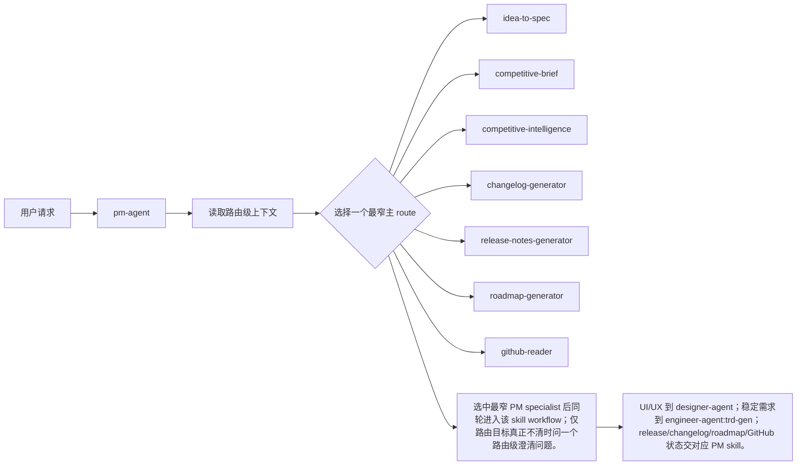

# pm-agent PRD

## 背景

`pm-agent` 隶属于 `pm-agent`，当前 PRD 描述的是仓库内已实现 skill 的产品契约。文档必须对齐 `SKILL.md`、父级 README、dispatcher route matrix 和 marketplace，避免把通用模板误写成已实现行为。

## 目标

1. 明确 `pm-agent` 的真实触发条件、上下文、工作流、产物和 handoff。
2. 让维护者能用 PRD 对照 `SKILL.md` / README / eval 检查行为漂移。
3. 将 Sub Agent 校验发现的实现差异收敛为可验收 requirement。
4. 保持与 `pm-agent` 的角色边界一致。

## 非目标

- 不接管 `pm-agent` 之外角色的职责；不在上下文不足时伪造结论。
- 不把 `pm-agent` 的 specialist 行为泛化成整个 `pm-agent` 的能力。
- 不把 repository contract 或 eval 误写成每次 runtime 必跑步骤，除非当前 skill 明确要求。

## 用户画像

| Persona | Description | Key Needs | Pain Points |
|---------|-------------|-----------|-------------|
| 直接调用用户 | 已知道要使用 `pm-agent` 的用户 | 直接获得当前 skill 的真实产物 | 泛化 PRD 会误导输入和输出 |
| `pm-agent` Dispatcher | 根据用户意图选择下游 skill | 清晰 trigger 和 route boundary | 描述过宽会误路由 |
| 维护者 | 维护 skill 文档和 eval 的人 | 可追溯、可校验的契约 | related docs 不全会漏掉真实实现 |

## 用户故事与场景

| ID | User Story | Priority | Acceptance Criteria |
|----|-----------|----------|---------------------|
| US-S01 | 作为用户，我想在 `pm-agent` 场景下获得对应工作流，以便得到真实产物。 | P0 | 输出满足 FR-S04，不以泛化描述替代实际 artifact。 |
| US-S02 | 作为 dispatcher，我想知道何时选择 `pm-agent`，以便避免自路由或跨 skill 误路由。 | P0 | FR-S01 和 route / handoff 与父级 SKILL.md 一致。 |
| US-S03 | 作为维护者，我想快速定位依赖文档，以便校验实现是否漂移。 | P1 | related_docs 覆盖 public entry、parent dispatcher 和必要 internal/reference/eval 文件。 |

## 功能需求

| ID | Feature | Description | Priority | Acceptance Criteria |
|----|---------|-------------|----------|---------------------|
| FR-S01 | Trigger Matching | `pm-agent` 必须作为 `pm-agent` 的入口 dispatcher，默认选择一个最窄下游 specialist；只有用户明确要求或目标强烈暗示多个 PM 能力时，才定义 multi-skill chain。 | P0 | 匹配场景与 parent dispatcher 和 `pm-agent` SKILL.md 一致。 |
| FR-S02 | Context Intake | PM 意图和输出类型；内容级上下文由下游 PM skill 收集。 | P0 | 缺少真正阻塞的上下文时才澄清或 blocked；可推导上下文不应被写成硬门槛。 |
| FR-S03 | Workflow Execution | 必须按当前实现工作流执行，并保留已实现的 gate、phase 或 mode。 | P0 | Mermaid 流程和工作流条目覆盖关键阶段。 |
| FR-S04 | Artifact Output | 选中最窄 PM specialist 后同轮进入该 skill workflow；仅路由目标真正不清时问一个路由级澄清问题。 | P0 | 未阻塞时产出指定 artifact；blocked 时说明原因、缺口和 next owner。 |
| FR-S05 | Boundary Guard | 不接管 `pm-agent` 之外角色的职责；不在上下文不足时伪造结论。 | P0 | 越界事项转交 owning skill/agent，不在本 skill 内扩大范围。 |
| FR-S06 | Handoff | UI/UX 到 designer-agent；稳定需求到 engineer-agent:trd-gen；release/changelog/roadmap/GitHub 状态交对应 PM skill。 | P0 | Handoff 目标具体到 skill/agent/owner，并携带输入包、证据和期望结果。 |
| FR-S07 | Traceability | PRD 必须引用执行契约来源。 | P1 | related_docs、Dependencies、API Touchpoints 能覆盖关键实现来源。 |

## 当前实现对齐

### 路由矩阵

| Route | Current Implementation Trigger |
|---|---|
| `idea-to-spec` | 想法收敛、PRD/BRD/DECISIONS、existing-project feature/update、空仓库产品定义 |
| `competitive-brief` | 竞品研究、定位比较、市场扫描、messaging gaps |
| `competitive-intelligence` | 销售 battlecard、deal support、objection handling、interactive HTML battlecard |
| `changelog-generator` | 开发者视角 changelog、released/unreleased/full regeneration |
| `release-notes-generator` | 用户视角 release notes、draft release、publish release |
| `roadmap-generator` | roadmap、milestone、version planning、后续优先级同步 |
| `github-reader` | GitHub repo health、issue/PR/milestone/backlog/release blockers |

## 验收标准

| ID | Criteria | Verification |
|----|----------|--------------|
| AC-01 | P0 trigger、context、workflow、artifact 和 handoff 与当前实现文档一致。 | 对照 related_docs 中的 README、SKILL.md、internal/reference 或 eval 文件人工 review。 |
| AC-02 | 文档不包含自路由、全量默认执行或将 specialist 行为泛化为整个 Agent 的错误描述。 | 检查 route matrix、非目标、边界和 Mermaid flow。 |
| AC-03 | 产物要求必须指向具体文件、报告、代码变更或 blocked 输出，不使用模糊替代表述。 | 检查功能需求和用户流程中的 artifact 节点。 |

## 非功能需求

| Category | Requirement | Metric | Target |
|----------|-------------|--------|--------|
| Accuracy | PRD 与当前 SKILL.md/README 一致 | Sub Agent review | 无已知实现差异 |
| Testability | P0 条目可由文件、命令或人工 review 验证 | Checklist | 每条有明确验收标准 |
| Traceability | 关键规则可追溯到 related docs | 文档链接 | 不依赖隐含记忆 |
| Safety | 不输出凭据、token、cookie、SSH key | 静态审查 | 0 secrets |

## 用户流程

Alternative flow: 如果请求不属于 `pm-agent`，应按 `pm-agent` route matrix 转到 owning skill。

Error flow: 如果必要上下文无法满足，输出 blocked reason、missing input、next owner 和可恢复步骤。

## 交互与输出要求

- 输出先给结论、产物和证据，再说明限制和下一步。
- 对需要用户确认的事项只问当前最小阻塞问题。
- Dispatcher 选择 skill 时应说明选择理由；specialist 自身不需要把“正在使用某 skill”作为产品强制要求，除非 SKILL.md 明确要求。

## 数据模型

| Entity | Key Attributes | Relationships |
|--------|----------------|---------------|
| Skill | name, agent, trigger, workflow, output | belongs_to `pm-agent` |
| Context | source_docs, code_or_repo_state, constraints, evidence | consumed_by Skill |
| Artifact | path, type, owner, status, evidence | produced_by Skill |
| Handoff | target, reason, packet, expected_output | emitted_when needed |
| Validation | related_docs, evals, manual review | verifies contract |

## 接口与文件触点

| Endpoint | Method | Purpose | Request | Response |
|----------|--------|---------|---------|----------|
| `agents/product_manager/skills/pm-agent/SKILL.md` / parent dispatcher / marketplace | Read / CLI | 获取当前 skill 的实现契约或运行依赖 | 本地仓库上下文 | 触发、工作流、产物或数据 |
| `.claude-plugin/marketplace.json` | File read | 校验注册和 agent 归属 | JSON | plugin skill mapping |
| `agents/product_manager/README.md` | File read | 校验角色边界和路由 | Markdown | role context |

## 假设与约束

| Type | Description | Impact if Wrong |
|------|-------------|-----------------|
| Constraint | 当前 PRD 描述已实现行为，不替代 SKILL.md。 | SKILL.md 改动后 PRD 需要同步。 |
| Constraint | Specialist 不应回指入口 dispatcher 形成循环 handoff。 | Handoff 应写到具体 skill/agent/owner。 |
| Assumption | related docs 中的实现契约是当前 source of truth。 | 缺少 internal/reference 文件会造成校验漏项。 |

## 相关实现文档

- Internal: `agents/product_manager/README.md`, `agents/product_manager/README_zh.md`, `agents/product_manager/skills/pm-agent/SKILL.md`, `.claude-plugin/marketplace.json`, `agents/product_manager/test/pm-agent/evals/evals.json`。
- Internal: 父级 dispatcher route matrix、README 和 marketplace 注册。
- External: Codex / Claude Code skill execution environment；具体外部 CLI/API 仅在 SKILL.md 明确要求时使用。

## 发布计划与里程碑

| Phase | Scope | Target Date | Owner |
|-------|-------|-------------|-------|
| Draft | 生成 `pm-agent` PRD | 2026-06-12 | PM |
| Review | 对照 SKILL.md、README、eval 修正差异 | 2026-06-12 | PM / Maintainer |
| Adopt | 将 PRD 纳入后续 skill 行为变更 checklist | TBD | Maintainer |

## 风险与缓解

| Risk | Likelihood | Impact | Mitigation |
|------|------------|--------|------------|
| PRD 只复述 frontmatter | Medium | 漏掉真实 workflow / gate | 将 workflow、artifact、handoff 写成 P0 requirement |
| Handoff 回到入口 dispatcher | Medium | 形成循环路由 | 写具体 specialist / owning agent / release owner |
| 产物被写成“或描述” | Medium | 文档通过但没有实际 artifact | 明确 write/update 或 blocked 条件 |

## 待确认问题

| # | Question | Owner | Deadline | Resolution |
|---|----------|-------|----------|------------|
| 1 | 是否将本 PRD 纳入对应 skill eval 的 durable comparison 检查？ | Maintainer | TBD | Unresolved |
| 2 | 是否需要为 `pm-agent` 增加专门 PRD validator？ | Maintainer | TBD | Unresolved |
