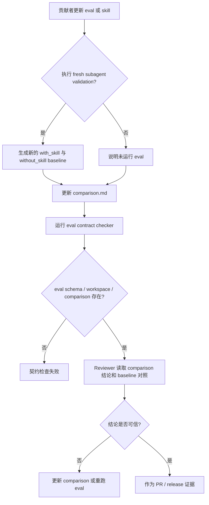

# 评测基线证据契约 PRD

## 1. 背景与动机

PR #45 和后续 review 暴露了 eval durable result 的边界问题：baseline 是
`comparison.md` 的对照输入，不是独立的机器可判定对象。尝试用脚本扫描
`Without Skill / Baseline` 自由文本会不断遇到误伤，例如无法区分“baseline 运行缺失”
和“baseline 输出里描述某个业务流程被阻塞”。

`comparison.md` 是 skill eval 的长期可信入口。它存在的目的，是在 skill 上线前保留一次真实或类真实环境的运行、判断和人工 / agent review 记录。baseline 的内容来自同一份 eval prompt 和 fixture 下的 `without_skill` 运行，用来和 `with_skill` 结果做比较。最终 PASS、PARTIAL 或 BLOCKED 结论应由执行 eval 的 sub-agent、fresh judge 或 reviewer 基于 comparison 全文判断，而不是由仓库脚本根据 baseline 自由文本推断。

## 2. 目标与非目标

### 目标

1. 明确 baseline 是 `comparison.md` 的 without-skill 对照输入，不是 deterministic checker 的独立判定对象。
2. 明确每次通过 fresh subagent validation 执行 skill eval 时，必须基于同一 prompt 和 fixture 重新生成新的 `without_skill` baseline，并由 sub-agent / reviewer 写入 durable comparison 结论。
3. 保留 `comparison.md` 作为最新 eval 结论入口，确保 PR 评论或对话中的 eval 结论与已提交或拟提交的 comparison 一致。
4. 用仓库检查校验 eval schema、workspace、durable `comparison.md` 存在性和 runtime artifact 策略，而不是扫描 baseline 文案语义。
5. 在不提交 runtime artifact 的前提下，保留可审查的 durable comparison 结果。

### 非目标

- 不改变 `evals.json` schema version。
- 不提交模型 transcript、diagnostics、outputs、timing、run status 或 `comparison.auto.md`。
- 不要求一次性重跑所有历史 eval baseline；但后续每次 fresh subagent validation 都不能复用历史 baseline。
- 不用脚本判断 baseline 生成内容是否语义完整、覆盖充分、是否缺失或是否足以代表 skill 质量；该判断保留给 sub-agent / 人工 review。
- 不重写与 baseline 证据无关的 eval fixture 或 skill 行为。

## 3. 用户角色

| 角色 | 描述 | 核心诉求 | 痛点 |
| --- | --- | --- | --- |
| 仓库维护者 | 负责合并 PR、发布版本和维护 eval 契约。 | 快速找到最新 eval 结论和证据入口。 | baseline 自由文本被脚本误判会制造无效阻塞。 |
| PR 审查者 | 审查 skill、eval 和治理规则变更。 | 以 `comparison.md` 为准判断 eval 结论是否可信。 | 同类语义问题不能靠简单 regex 稳定判断。 |
| Skill 作者 | 编写或更新 skill eval 的贡献者。 | 清楚知道 comparison 如何记录 baseline。 | 不知道何时该写 PASS、PARTIAL 或 BLOCKED。 |

## 4. 用户故事与场景

| ID | 用户故事 | 优先级 | 验收标准 |
| --- | --- | --- | --- |
| US-001 | 作为仓库维护者，我希望 baseline 的角色被明确为对照输入，以免把 baseline 自由文本误当成机器判定对象。 | P0 | `AGENTS.md` 和 `README.md` 明确 baseline 只支撑 comparison，不由 checker 判断 PASS / PARTIAL / BLOCKED。 |
| US-002 | 作为 reviewer，我希望 CI 只检查结构契约和产物卫生，以免 regex 误伤合法 comparison。 | P0 | `uv run scripts/check_eval_contract.py` 不再根据 baseline 文案失败。 |
| US-003 | 作为 skill 作者，我希望 baseline 缺失、失败或行为差异都能由 reviewer 在 comparison 结论中解释，而不是被固定脚本语义抢先裁决。 | P0 | `comparison.md` 仍是 durable latest result；脚本只要求它存在。 |
| US-004 | 作为维护者，我希望保持 runtime artifact 策略，以免 eval 证据污染 git 历史。 | P1 | 不提交 runtime transcript、diagnostics、outputs、timing、run status 或 `comparison.auto.md`。 |
| US-005 | 作为 skill 作者，我希望 fresh subagent validation 明确 baseline 的作用，以免把 baseline 当成独立测试结果。 | P0 | 运行协议说明 `without_skill` 是 comparison 对照输入，最终结论由 sub-agent / reviewer 写入 `Latest result`。 |
| US-006 | 作为维护者，我希望每次 Fresh Sub-Agent 评测都生成新的 baseline，以免 comparison 引用过期对照。 | P0 | fresh subagent validation 规则明确不得复用历史 baseline；无法生成时必须在 `comparison.md` 说明影响。 |

## 5. 功能需求

| ID | 功能 | 描述 | 优先级 | 验收标准 |
| --- | --- | --- | --- | --- |
| FR-001 | Baseline 角色说明 | `AGENTS.md` 和 `README.md` 必须说明 baseline 是 without-skill 对照输入，不是独立机器判定对象。 | P0 | 文档明确最终结论以 `comparison.md` 的 `Latest result` 和 reviewer/sub-agent 判断为准。 |
| FR-002 | 移除 Baseline 文案校验 | `check_eval_contract.py` 不应扫描 `Without Skill / Baseline` 自由文本来判断 PASS / PARTIAL / BLOCKED。 | P0 | 含 diagnostic-only、blocked、skipped、not generated 等 baseline 文案的 `comparison.md` 不会因语义文本本身失败。 |
| FR-003 | 保留 Durable Comparison 存在性 | 每个 eval workspace 仍必须包含 durable `comparison.md`。 | P0 | 缺少 `comparison.md` 时 `uv run scripts/check_eval_contract.py` 失败。 |
| FR-004 | 结论一致性 | PR 评论或对话中的 eval 结论必须与已提交或拟提交的 `comparison.md` 保持一致。 | P0 | 文档规则明确该要求。 |
| FR-005 | Runtime Artifact 策略 | 本修复必须保持既有 runtime artifact 禁止提交策略。 | P1 | `uv run scripts/check_eval_artifacts.py` 通过。 |
| FR-006 | 回归测试 | checker 行为必须有确定性测试覆盖。 | P1 | `uv run --with pytest pytest agents/test_eval_contract.py` 覆盖“不校验 baseline 语义”的样例。 |
| FR-007 | Fresh Subagent Baseline 门禁 | 每次 fresh subagent validation 必须使用同一 eval prompt 和 fixture 重新生成新的 `without_skill` baseline，并把 `without_skill` 结果作为 comparison 对照输入。 | P0 | 仓库级 eval 规则说明 baseline 的输入角色、不得复用历史 baseline，以及无法生成时的记录要求。 |
| FR-008 | Baseline Runner 检查边界 | deterministic runner 可报告 `without_skill_outputs`、baseline output metadata，以及所有 target 都位于 `without_skill/` 或 `baseline/` 下的 baseline-only assertions；这些结果不能独立导致 runner 失败。 | P0 | QA、Designer、DevOps 和 Product Manager deterministic runner 只把 with-skill 产物和包含 with-skill target 的 assertions 作为失败门禁。 |

## 6. 非功能需求

| 分类 | 需求 | 指标 | 目标 |
| --- | --- | --- | --- |
| 可靠性 | Contract checker 输出必须可重复。 | 多次本地运行 | 同一文件集得到同一违规列表 |
| 可维护性 | 新增校验逻辑应小而集中。 | 修改脚本范围 | 优先限制在 `check_eval_contract.py` 和现有测试 |
| 性能 | 仓库扫描保持轻量。 | 当前仓库运行耗时 | 与现有 eval contract 检查接近 |
| 可追溯性 | 最新 eval 结论必须落在 durable comparison。 | 人工 review | `comparison.md` 中可看到结果依据 |

## 7. 用户流程

## 8. 交互要求

本需求不涉及产品界面。CLI 输出应简洁、可行动：

- 包含缺失或非法 eval 定义路径；
- 指出缺失的 workspace、`eval_metadata.json` 或 durable `comparison.md`；
- 不根据 baseline 自由文本输出 PASS / PARTIAL / BLOCKED 语义判断。

## 9. 数据模型

本功能复用现有 Markdown eval 产物。

| 对象 | 来源 | 相关字段 |
| --- | --- | --- |
| Durable comparison | `agents/**/comparison.md` | `Latest result`、`Without Skill / Baseline`、`Baseline`、`Failures`、`Next Steps` |
| Eval metadata | `eval_metadata.json` | `eval_id`、`workspace_root`、deterministic output metadata |
| Eval definition | `evals.json` | `id`、`workspace`、`assertions` |

## 10. 接口触点

不需要修改运行时 API。受影响的是本地脚本接口：

| 接口 | 用途 | 预期行为 |
| --- | --- | --- |
| `uv run scripts/check_eval_contract.py` | 校验 eval schema、workspace、metadata 和 durable comparison 存在性。 | 不根据 baseline 文案判断 PASS / PARTIAL / BLOCKED。 |
| `uv run scripts/check_eval_artifacts.py` | 校验 runtime artifact 策略。 | 继续拒绝已提交的 runtime artifact。 |
| `uv run --with pytest pytest agents/test_eval_contract.py` | eval 检查回归测试。 | 覆盖 schema、metadata、workspace、comparison 存在性和 baseline 语义不校验样例。 |
| `agents/**/test/run_eval.py` | deterministic runner 辅助检查。 | 只把 with-skill 产物和包含 with-skill target 的 assertion 作为失败门禁；baseline 相关产物和 baseline-only 断言只报告。 |

## 11. 假设与约束

| 类型 | 描述 | 如果不成立的影响 |
| --- | --- | --- |
| 假设 | `Latest result` 是 durable comparison 中的 reviewer/sub-agent 结论入口。 | reviewer 需要回到 comparison 全文判断。 |
| 假设 | `PARTIAL` 和 `BLOCKED` 是可接受的 durable result 语义。 | 文档需要约定替代表述。 |
| 假设 | Baseline 内容质量需要结合当前 skill、fixture 和实际运行结果由 sub-agent / 人工 review 判断。 | 不能用仓库脚本替代语义 review。 |
| 假设 | Fresh subagent validation 能够在同一隔离 workspace 中完成 with-skill 和新的 without_skill baseline 两次运行。 | 无法生成新的 baseline 时，由 reviewer 在 comparison 结论中说明影响。 |
| 约束 | Runtime eval artifacts 不得提交。 | 历史清理只能编辑 durable Markdown。 |
| 约束 | 现有 `evals.json` schema version 保持 `1.0`。 | checker 不应要求 schema 迁移。 |

## 12. 依赖

- GitHub issue #46 作为问题来源。
- PR #45 和 `eval-010-implementation-plan-closeout-sync` 作为已修复样例。
- 现有脚本：
  - `scripts/check_eval_contract.py`
  - `scripts/check_eval_artifacts.py`
  - `agents/test_eval_contract.py`
- `AGENTS.md` 中的 eval artifact 策略。

## 13. 发布计划与里程碑

| 阶段 | 范围 | 目标日期 | 负责人 |
| --- | --- | --- | --- |
| 阶段 1 | 补充 PRD、TRD 和实施计划。 | 2026-06-24 | 维护者 / Codex |
| 阶段 2 | 移除 baseline 语义校验并更新回归测试。 | 待定 | 工程负责人 |
| 阶段 3 | 补充 Baseline 作用说明。 | 待定 | 工程负责人 |
| 阶段 4 | 运行仓库检查并准备 PR。 | 待定 | 维护者 / Codex |

## 14. 风险与缓解

| 风险 | 可能性 | 影响 | 缓解 |
| --- | --- | --- | --- |
| baseline 语义不再由 CI 自动拦截。 | 中 | 需要 reviewer 主动判断 comparison 结论。 | 明确 `comparison.md` 是 durable 结论入口，PR 评论必须与其一致。 |
| 历史 baseline 无法追溯。 | 高 | reviewer 需要判断旧 comparison 是否仍可信。 | 不伪造结果；后续重跑 eval 时更新 comparison。 |
| Checker 捕获 baseline 合法文案。 | 低 | 误阻塞 PR。 | 移除 baseline 自由文本语义校验。 |
| 全量模型 baseline 重跑成本高。 | 高 | 清理周期变长。 | 本次不强制重跑历史 eval；后续 fresh subagent validation 必须生成新的 baseline。 |

## 15. 待确认问题

| # | 问题 | 负责人 | 截止时间 | 结论 |
| --- | --- | --- | --- | --- |
| 1 | 是否允许少数 eval 在明确“不需要 baseline”的情况下保持 `Latest result: PASS`？ | 维护者 | 实现前 | 允许；是否可信由 reviewer/sub-agent 的 comparison 结论判断。 |
| 2 | 历史 74 个弱 baseline comparison 是否一次性修完，还是分 agent 分批处理？ | 维护者 | 实现前 | 本次一次性清理。 |
| 3 | `PARTIAL` 是否作为仓库推荐的非完整通过标准词？ | 维护者 | 实现前 | 可用；是否使用由 reviewer/sub-agent 根据 comparison 结论决定。 |
