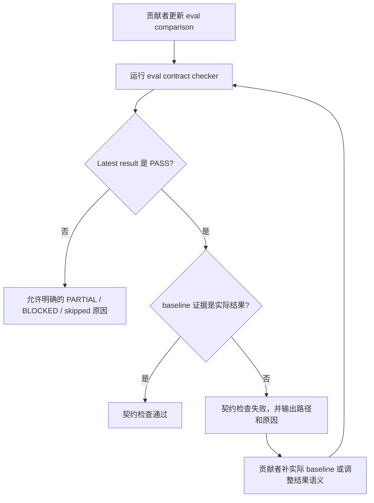

# 评测基线证据契约 PRD

## 1. 背景与动机

PR #45 的 review 暴露了 eval durable result 的证据语义问题：
`comparison.md` 中的 `Latest result: PASS` 不能与缺失、blocked、skipped
或纯假设性的 `Without Skill / Baseline` 结果并存，否则维护者和 reviewer
会误以为完整 with-skill / without-skill 对照已经通过。

Issue #46 进一步盘点了历史 `comparison.md`：严格的 `PASS` 与
blocked / skipped baseline 直接冲突已经为 0，但仍有 72 个历史文件使用
`Baseline behavior is diagnostic only.`。本地扩展扫描还发现 2 个
`Baseline behavior remains diagnostic: ...` 变体，语义上也属于弱 baseline
证据。

`comparison.md` 是 skill eval 的长期可信入口。若 PASS 结论没有真实 baseline
结果支撑，后续 release、PR review 和 eval 回归判断会继续依赖人工识别。

## 2. 目标与非目标

### 目标

1. 明确完整 `PASS` 的 durable eval result 必须具备真实 baseline / without-skill 证据。
2. 对缺失 baseline 的历史 eval 使用 `PARTIAL`、`BLOCKED` 或明确 skipped 语义，避免把不完整 eval 写成完整通过。
3. 用仓库检查阻止 `PASS` 与弱 baseline 证据再次进入 PR。
4. 在不提交 runtime artifact 的前提下，保留可审查的 durable comparison 结果。

### 非目标

- 不改变 `evals.json` schema version。
- 不提交模型 transcript、diagnostics、outputs、timing、run status 或 `comparison.auto.md`。
- 不要求每个 eval 都必须立即重新跑模型 baseline；无法补齐时可先使用非 PASS 语义。
- 不重写与 baseline 证据无关的 eval fixture 或 skill 行为。

## 3. 用户角色

| 角色 | 描述 | 核心诉求 | 痛点 |
| --- | --- | --- | --- |
| 仓库维护者 | 负责合并 PR、发布版本和维护 eval 契约。 | 快速判断 eval 是否完整可信。 | `PASS` 与弱 baseline 并存时需要人工追查。 |
| PR 审查者 | 审查 skill、eval 和治理规则变更。 | 自动发现 durable result 证据矛盾。 | 同类问题只能靠 review 经验发现。 |
| Skill 作者 | 编写或更新 skill eval 的贡献者。 | 清楚知道 comparison 如何记录 baseline。 | 不知道何时该写 PASS、PARTIAL 或 BLOCKED。 |

## 4. 用户故事与场景

| ID | 用户故事 | 优先级 | 验收标准 |
| --- | --- | --- | --- |
| US-001 | 作为仓库维护者，我希望每个 `Latest result: PASS` comparison 都包含实际 baseline 证据，以免发布判断被放大。 | P0 | `PASS` 文件不含 diagnostic-only、blocked、skipped、not generated 或 not run baseline 文案。 |
| US-002 | 作为 reviewer，我希望 CI 能拦截矛盾的 comparison 文案，以便同类问题在 review 前被发现。 | P0 | `uv run scripts/check_eval_contract.py` 能报告 invalid PASS baseline evidence 的路径。 |
| US-003 | 作为 skill 作者，我希望 baseline 未生成时有允许的记录方式，以免伪造 pass/fail。 | P0 | Comparison 可使用 `PARTIAL` / `BLOCKED` 并写明 baseline 原因，同时通过契约检查。 |
| US-004 | 作为维护者，我希望保持 runtime artifact 策略，以免 eval 证据污染 git 历史。 | P1 | 不提交 runtime transcript、diagnostics、outputs、timing、run status 或 `comparison.auto.md`。 |

## 5. 功能需求

| ID | 功能 | 描述 | 优先级 | 验收标准 |
| --- | --- | --- | --- | --- |
| FR-001 | PASS Baseline 证据 | 包含 `Latest result: PASS` 的 durable `comparison.md` 必须包含实际 baseline / without-skill 结果，或明确说明该 eval 不需要 baseline。 | P0 | Contract checker 拒绝 diagnostic-only 或缺失 baseline 证据的 `PASS`。 |
| FR-002 | 弱 Baseline 检测 | 仓库必须拒绝与 `Latest result: PASS` 并存的弱 baseline 文案。 | P0 | Checker 能捕获 PASS 下的 `Baseline behavior is diagnostic only.` 和 `Baseline behavior remains diagnostic:`。 |
| FR-003 | Blocked / Skipped 冲突检测 | baseline section 写明 baseline blocked、skipped、not generated 或 not run 时，不能同时保留完整 `PASS`。 | P0 | Checker 输出 comparison 文件路径和失败原因。 |
| FR-004 | 非 PASS 的不完整状态 | baseline 证据不完整时，可使用 `PARTIAL`、`BLOCKED` 或等价非 PASS 文案并写清原因。 | P0 | latest result 不是完整 PASS 时，契约不强制要求实际 baseline 证据。 |
| FR-005 | 历史 Comparison 清理 | 现有弱 baseline comparison 文件必须补实际 baseline 结果，或移出完整 PASS 语义。 | P0 | tracked comparison 中不再存在 `Latest result: PASS` 下的弱 baseline 证据。 |
| FR-006 | 回归测试 | checker 行为必须有确定性测试覆盖。 | P1 | `uv run --with pytest pytest agents/test_eval_contract.py` 覆盖失败和通过样例。 |
| FR-007 | Runtime Artifact 策略 | 本修复必须保持既有 runtime artifact 禁止提交策略。 | P1 | 清理后 `uv run scripts/check_eval_artifacts.py` 通过。 |

## 6. 非功能需求

| 分类 | 需求 | 指标 | 目标 |
| --- | --- | --- | --- |
| 可靠性 | Contract checker 输出必须可重复。 | 多次本地运行 | 同一文件集得到同一违规列表 |
| 可维护性 | 新增校验逻辑应小而集中。 | 修改脚本范围 | 优先限制在 `check_eval_contract.py` 和现有测试 |
| 性能 | 仓库扫描保持轻量。 | 当前仓库运行耗时 | 与现有 eval contract 检查接近 |
| 可追溯性 | 每个历史 comparison 改动必须保留 PASS、PARTIAL 或 BLOCKED 的原因。 | 人工 review | `comparison.md` 中可看到结果依据 |

## 7. 用户流程

## 8. 交互要求

本需求不涉及产品界面。CLI 输出应简洁、可行动：

- 包含 comparison 文件路径；
- 说明 `Latest result: PASS` 需要实际 baseline 证据；
- 指出触发失败的弱 baseline 或冲突文案。

## 9. 数据模型

本功能复用现有 Markdown eval 产物。

| 对象 | 来源 | 相关字段 |
| --- | --- | --- |
| Durable comparison | `agents/**/comparison.md` | `Latest result`、`Without Skill / Baseline`、`Baseline`、`Failures`、`Next Steps` |
| Eval metadata | `eval_metadata.json` | `eval_id`、`workspace_root`、deterministic output metadata |
| Eval definition | `evals.json` | `id`、`workspace`、`assertions` |

## 10. 接口触点

不需要修改运行时 API。受影响的是本地脚本接口：

| 接口 | 用途 | 预期行为 |
| --- | --- | --- |
| `uv run scripts/check_eval_contract.py` | 校验 eval schema 和 durable comparison 证据。 | PASS 与弱 baseline 或矛盾 baseline 并存时失败。 |
| `uv run scripts/check_eval_artifacts.py` | 校验 runtime artifact 策略。 | 继续拒绝已提交的 runtime artifact。 |
| `uv run --with pytest pytest agents/test_eval_contract.py` | eval 检查回归测试。 | 覆盖合法和非法 baseline 证据样例。 |

## 11. 假设与约束

| 类型 | 描述 | 如果不成立的影响 |
| --- | --- | --- |
| 假设 | `Latest result: PASS` 是当前 durable comparison 的完整通过标记。 | checker 需要支持额外完整通过写法。 |
| 假设 | `PARTIAL` 和 `BLOCKED` 是可接受的非完整通过 durable result 语义。 | 实现前需要调整产品文案。 |
| 约束 | Runtime eval artifacts 不得提交。 | 历史清理只能编辑 durable Markdown。 |
| 约束 | 现有 `evals.json` schema version 保持 `1.0`。 | checker 不应要求 schema 迁移。 |

## 12. 依赖

- GitHub issue #46 作为问题来源。
- PR #45 和 `eval-010-implementation-plan-closeout-sync` 作为已修复样例。
- 现有脚本：
  - `scripts/check_eval_contract.py`
  - `scripts/check_eval_artifacts.py`
  - `agents/test_eval_contract.py`
- `AGENTS.md` 中的 eval artifact 策略。

## 13. 发布计划与里程碑

| 阶段 | 范围 | 目标日期 | 负责人 |
| --- | --- | --- | --- |
| 阶段 1 | 补充 PRD、TRD 和实施计划。 | 2026-06-24 | 维护者 / Codex |
| 阶段 2 | 实现 checker 和回归测试。 | 待定 | 工程负责人 |
| 阶段 3 | 更新历史 comparison 文件。 | 待定 | 工程负责人 |
| 阶段 4 | 运行仓库检查并准备 PR。 | 待定 | 维护者 / Codex |

## 14. 风险与缓解

| 风险 | 可能性 | 影响 | 缓解 |
| --- | --- | --- | --- |
| 批量 comparison 编辑造成 review 噪音。 | 中 | Review 成本上升。 | 采用机械、局部改动，并让结果语义明确。 |
| 历史 baseline 无法追溯。 | 高 | 部分 eval 不能继续保持完整 PASS。 | 使用 `PARTIAL` 或 `BLOCKED` 并写清原因，不伪造结果。 |
| Checker 捕获 baseline 以外的合法 diagnostic 文案。 | 中 | 误阻塞 PR。 | 限定在包含 `Latest result: PASS` 且 baseline 相关的文件。 |
| 全量模型 baseline 重跑成本高。 | 高 | 清理周期变长。 | 本次不强制重跑；缺证据时使用非 PASS 语义。 |

## 15. 待确认问题

| # | 问题 | 负责人 | 截止时间 | 结论 |
| --- | --- | --- | --- | --- |
| 1 | 是否允许少数 eval 在明确“不需要 baseline”的情况下保持 `Latest result: PASS`？ | 维护者 | 实现前 | 未决 |
| 2 | 历史 74 个弱 baseline comparison 是否一次性修完，还是分 agent 分批处理？ | 维护者 | 实现前 | 未决 |
| 3 | `PARTIAL` 是否作为仓库推荐的非完整通过标准词？ | 维护者 | 实现前 | 未决 |
