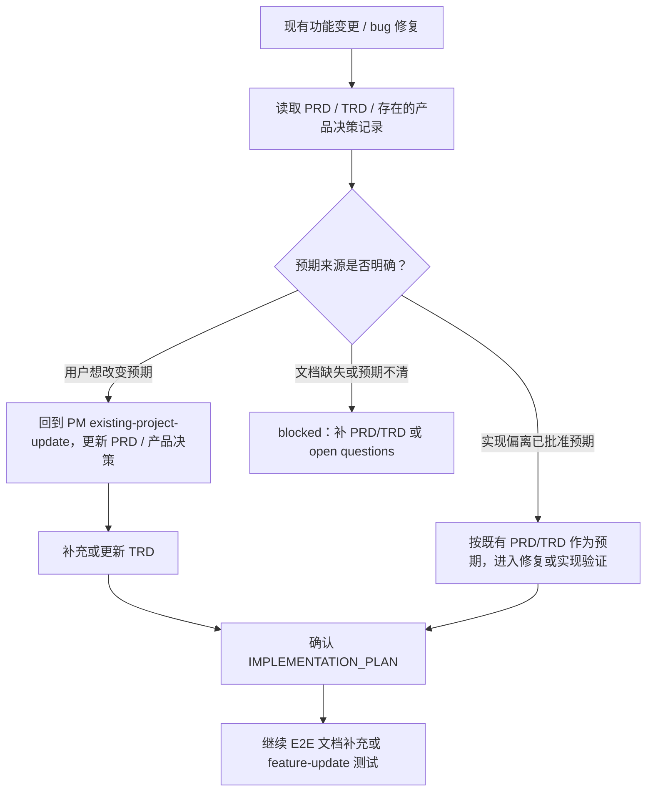
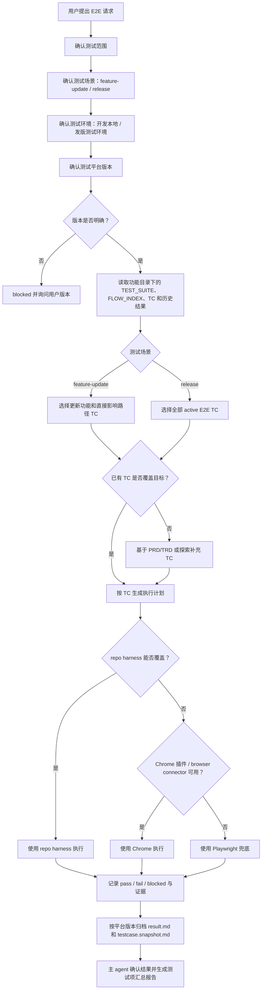
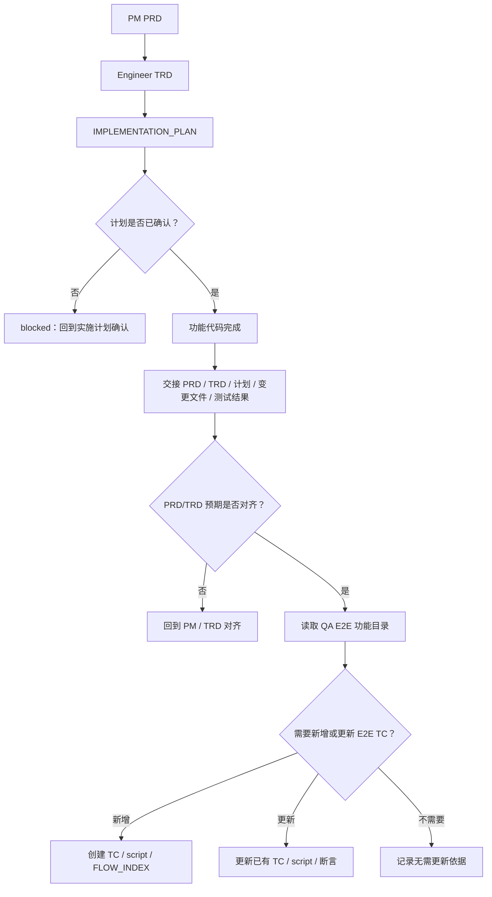
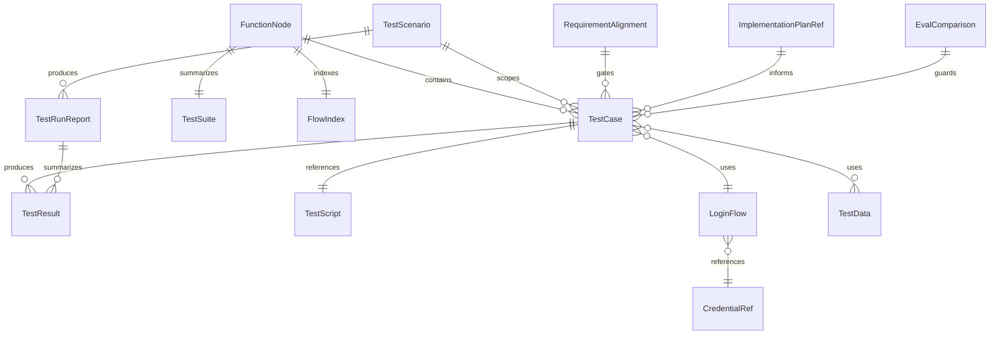

# QA Agent E2E 用例沉淀与复用 PRD

## 1. 背景与动机

QA Agent 当前已经具备 E2E 测试用例沉淀的基础规则：独立 QA 或 E2E 请求应优先读取既有测试用例，并将新增 E2E 场景保存为可复用 Markdown 文件。现有规则仍偏向文档约定，历史上使用 `docs/qa/{feature}/` 存放 feature-scoped QA 资产，缺少统一的功能树目录、可执行用例格式、共享登录方式、平台版本归档、执行入口优先级和 subagent 执行模型。

新功能规划链路已经形成 PRD、TRD 和 IMPLEMENTATION_PLAN 的文档生成流程：PM 确认 PRD 后移交 Engineer 生成 `docs/engineer/{feature}/TRD.md`，TRD 确认后由 `feature-implementor` 生成 `docs/engineer/{feature}/IMPLEMENTATION_PLAN.md` 并进入代码实现。该链路仍缺少代码完成后的 E2E 测试文档生成步骤，导致功能落地后测试流程不一定被沉淀为可复用 TC，也不一定能回写到 QA 的功能树目录。

在以 E2E 为主要验证方式的项目中，QA Agent 如果每次都重新探索仓库、重新理解页面与流程，会造成测试资产无法沉淀、测试范围难以复用、版本结果不可追溯、登录凭据存在泄露风险，以及主 agent 在多用例执行中丢失汇总视角。

本能力将 QA Agent 的 E2E 工作流升级为功能分级、用例复用、版本归档、凭据安全和 subagent 执行的统一协议，并将 QA 相关测试资产统一迁移到 `docs/qa/e2e/{一级功能}/{二级功能}/{三级功能}/` 功能树目录。后续 QA-Agent 基于 PRD/TRD 生成 E2E 测试时，也直接基于该功能树目录进行分类、记录和更新。

TRD 完成后，仓库后续 issue 已补齐现有功能变更、轻量 bug fix 和 eval 产物的流程门禁：进入实现或修复前需要先确认 PRD/TRD 预期，所有实现任务都需要已确认的 `IMPLEMENTATION_PLAN.md`，实际执行 skill eval 或 fresh subagent validation 后需要更新 durable `comparison.md`。因此 E2E 用例生成、更新和执行不能绕过这些前置产物，否则测试流程可能沉淀了未确认的产品预期或与 eval 结论不一致的行为。

## 2. 目标与非目标

### 目标

1. 建立按一级、二级、三级功能组织的 E2E 测试用例目录，并将 QA 测试资产统一迁移到该功能树目录，不再依赖单层 feature 目录。
2. 定义 `TC-NNN-*.md` 的可执行测试用例格式，覆盖执行入口、流程描述、脚本引用、断言、版本记录和结果归档。
3. 统一执行入口优先级：repo harness 优先，其次 Chrome 插件或 browser connector，最后 Playwright 兜底。
4. 支持多个测试用例复用同一套登录方式，平台账号和 SSH 账号按 QA Agent reference 自动写入统一本地账号文件，测试文档不得保存明文账号、密码、token、cookie 或 session。
5. 每次 E2E 执行前确认测试平台版本，并按版本归档测试结果和用例快照。
6. 基于用户需求、PRD、TRD 或自主探索生成可复用 E2E 用例，并直接按功能树目录分类、记录和更新。
7. 在功能代码完成后，基于 PRD、TRD、IMPLEMENTATION_PLAN、变更文件和测试证据补充或更新 E2E 测试文档。
8. 单个 E2E 测试任务由 subagent 执行，主 agent 负责范围确认、任务拆分、结果统计和汇报。
9. 区分功能更新和发版两类 E2E 测试场景：功能更新时在开发环境对更新功能做本地 E2E；发版时在发版版本对应的测试环境做全量 E2E 功能测试。
10. 主 agent 确认 subagent 测试结果后，按测试项生成汇总表格，并按测试平台版本和测试时间归档到测试结果目录。
11. 现有功能变更或 bug 修复触发 E2E 文档更新前，先确认 PRD/TRD 和存在的产品决策记录是否覆盖当前预期；如果预期变化或文档缺失，先回到 PM/TRD 对齐。
12. 代码完成后的 E2E 文档补充必须依赖已确认的 `IMPLEMENTATION_PLAN.md`；小功能、单文件变更和轻量 bug fix 不得绕过实施计划门禁。
13. 实际执行 QA/Engineer 相关 skill eval 或 fresh subagent validation 后，必须更新 durable `comparison.md`，并保持 PR/对话结论与 `comparison.md` 一致。
14. 增加 QA skill 文档和 eval 覆盖，防止行为回退为临时探索或一次性测试清单。

### 非目标

1. 不新增通用 E2E runner。
2. 不要求所有项目迁移到 Playwright。
3. 不要求 QA Agent 修改生产代码或自动修复测试失败。
4. 不要求一次性补齐所有历史功能的 E2E 用例库。
5. 不在测试文档中保存或生成真实明文凭据；测试账号统一存放在仓库内被 ignore 的本地账号文件，测试文档只引用账号 ID。
6. 不用 subagent 汇总替代确定性测试结果或人工证据判断。
7. 不在本 PRD 中重新定义 Engineer Agent 或 Debugger 的完整实现协议；本 PRD 只要求 QA E2E 流程消费并遵守这些前置门禁。

## 3. 用户画像

| 用户画像 | 描述 | 核心诉求 | 痛点 |
| --- | --- | --- | --- |
| 仓库维护者 | 维护 `dev-agent-skills` 的 Agent 与 skill 行为。 | QA 行为稳定、协议可验证、敏感信息不落入文档。 | 只靠提示词约定容易回退，E2E 结果难以追踪。 |
| QA Agent 使用者 | 使用 QA Agent 执行验收、探索、回归和浏览器测试。 | 已有测试流程可复用，测试范围清楚，结果可追溯。 | 每次重新探索会浪费时间，测试结论难以复核。 |
| Skill 作者 | 维护 QA specialist skill 和 eval fixture。 | 用例格式、执行入口和归档规则明确。 | 目录结构和断言不统一会导致 eval 脆弱。 |
| 安全审查者 | 关注测试资产中的凭据和敏感数据处理。 | 文档中不出现明文账号、密码、token 或 cookie。 | 测试步骤容易为了方便而写入敏感信息。 |

## 4. 用户故事与场景

| ID | 用户故事 | 优先级 | 验收标准 |
| --- | --- | --- | --- |
| US-001 | 作为 QA Agent 使用者，我希望按一级、二级、三级功能查找 QA 和 E2E 用例，以便快速定位目标流程。 | P0 | QA 测试资产应统一存储在 `docs/qa/e2e/{一级功能}/{二级功能}/{三级功能}/` 下，E2E 用例存入 `cases/`。 |
| US-002 | 作为 QA Agent 使用者，我希望执行 E2E 前先确认测试范围和平台版本，以便测试结果能准确归档。 | P0 | QA Agent 在执行前必须询问或确认范围和平台版本，并把结果写入对应版本目录。 |
| US-003 | 作为仓库维护者，我希望 repo harness 存在时优先使用仓库测试入口，以便遵循项目已有验证方式。 | P0 | 当 repo harness 能覆盖 TC 时，QA Agent 必须优先使用该 harness，而不是直接使用 Chrome 或 Playwright。 |
| US-004 | 作为 QA Agent 使用者，我希望多个 TC 复用同一套登录方式，以便登录流程变更时只维护一处。 | P0 | TC 通过 `_shared/login-flows/` 引用登录方式，不在每个 TC 中复制登录步骤和凭据。 |
| US-005 | 作为安全审查者，我希望测试文档不保存明文凭据，以便避免测试资产泄露敏感信息。 | P0 | `cases/`、`scripts/`、`results/` 中不得出现明文账号、密码、token、cookie 或 session。 |
| US-006 | 作为 Skill 作者，我希望 PRD/TRD 能生成可复用 E2E TC，以便从需求文档直接沉淀验收流程。 | P0 | QA Agent 能从 PRD/TRD 抽取用户路径、验收标准、页面、接口和状态，并直接写入 `docs/qa/e2e/{一级功能}/{二级功能}/{三级功能}/` 功能树目录。 |
| US-007 | 作为 QA Agent 使用者，我希望已有 E2E 用例能随功能更新而增量调整，以便历史结果保留、当前用例保持有效。 | P0 | 功能更新时只更新当前 TC 和索引，历史版本结果不被覆盖。 |
| US-008 | 作为仓库维护者，我希望功能代码完成后自动进入 E2E 文档补充判断，以便新功能不是只完成代码和单元测试。 | P0 | feature-implementor 完成功能代码后，应将 PRD、TRD、IMPLEMENTATION_PLAN、变更文件和测试结果交给 QA 路径判断是否需要新增或更新 E2E TC。 |
| US-009 | 作为仓库维护者，我希望所有 E2E 测试任务默认由 subagent 执行，以便主 agent 保留统计和判断上下文。 | P0 | 主 agent 负责拆分和汇总，subagent 负责执行单个 TC 并返回 pass、fail 或 blocked 证据。 |
| US-010 | 作为功能开发者，我希望功能更新时只对更新功能做开发环境本地 E2E，以便快速验证本次变更，不把局部开发验证扩成发版全量验证。 | P0 | QA Agent 能识别 `feature-update` 场景，默认范围为本次更新功能及其直接影响路径，测试环境为开发环境本地环境。 |
| US-011 | 作为发版负责人，我希望发版时在测试环境对发版版本做全量 E2E 功能测试，以便形成可追溯的发版准入证据。 | P0 | QA Agent 能识别 `release` 场景，默认范围为全部 active E2E TC，测试环境为发版版本对应的测试环境。 |
| US-012 | 作为仓库维护者，我希望主 agent 最终输出按测试项汇总的报告，以便不用逐个打开 TC 结果也能判断整体质量。 | P0 | 主 agent 确认 subagent 结果后，生成包含测试项、TC、范围、环境、执行入口、结果、证据和风险的汇总表格，并按平台版本和测试时间归档。 |
| US-013 | 作为仓库维护者，我希望现有功能变更或 bug 修复进入 E2E 文档更新前先对齐 PRD/TRD，以便测试用例不会固化未确认的产品预期。 | P0 | 如果变更是实现偏离已批准 PRD/TRD，先按原预期修复；如果变更改变预期，先回 PM 更新 PRD/产品决策并补 TRD；如果文档缺失或预期不清，E2E 更新 blocked。 |
| US-014 | 作为仓库维护者，我希望轻量变更也先有确认过的实施计划，以便 E2E 文档能追踪真实实现范围。 | P0 | 代码完成后 E2E 文档补充必须引用已确认的 `IMPLEMENTATION_PLAN.md`；缺失时不能直接新增或更新 TC。 |
| US-015 | 作为 Skill 作者，我希望 eval 通过结论同步到 durable `comparison.md`，以便 PR、对话和持久化验证结果一致。 | P0 | 只要实际执行 skill eval 或 fresh subagent validation，就更新对应 `comparison.md` 的最新结果、执行方式、关键结论、失败或 next steps、运行期产物策略。 |

## 5. 功能需求

| ID | 功能 | 描述 | 优先级 | 验收标准 |
| --- | --- | --- | --- | --- |
| FR-001 | 功能树目录 | QA 测试资产按一级、二级、三级功能分类存储。 | P0 | 指导中明确使用 `docs/qa/e2e/{一级功能}/{二级功能}/{三级功能}/`，不再使用 `docs/qa/{feature}` 作为 QA 测试资产主路径；历史 `docs/qa/{feature}` 资产后续迁移到功能树目录。 |
| FR-002 | 用例文件格式 | 定义 `TC-NNN-<short-slug>.md` 的标准字段。 | P0 | TC 包含基本信息、平台版本记录、凭据与环境、执行入口、流程描述、断言、脚本引用和历史验证。 |
| FR-003 | 测试脚本引用 | 每个 TC 可以引用对应流程脚本，脚本允许保存可执行片段，以保证每次测试执行一致。 | P0 | TC 中包含 `scripts/TC-NNN-<short-slug>.spec.md` 引用；脚本可描述或保存 repo harness、Chrome 或 Playwright fallback 的执行步骤和可执行片段；脚本不得写入明文凭据。 |
| FR-004 | 共享登录方式 | 多个 TC 可复用同一登录流程。 | P0 | 登录方式存储在 `docs/qa/e2e/_shared/login-flows/`，TC 只引用登录方式。 |
| FR-005 | 本地账号文件引用 | 测试使用的账号、密码、SSH 账号、SSH 密码或 SSH key 路径统一存放到本地账号文件 `.qa/e2e/accounts.local.json`；该文件默认写入 `.gitignore`，不进入提交。 | P0 | TC、脚本、登录流程和结果只引用账号 ID，例如 `platform.default.admin` 或 `ssh.dev.deploy`；不得保存明文凭据；QA Agent 在用户提供账号信息时按 reference 文档格式自动 upsert 到本地账号文件。 |
| FR-006 | 测试数据引用 | 测试数据可共享或局部化。 | P1 | 共享数据放在 `_shared/data/`，功能专属数据可放在功能目录下的 `data/`。 |
| FR-007 | 平台版本确认 | 每次执行 E2E 前确认测试平台版本；版本缺失时必须 blocked 并询问用户。 | P0 | QA Agent 执行前询问或确认版本，例如 `v1.2.0`、`v1.2.0-rc.1`、`v1.2.0-fix.1` 或部署版本号；不得使用 `unknown` 目录临时归档。 |
| FR-008 | 版本结果归档 | 每次执行结果按 TC 和平台版本归档。 | P0 | 结果写入 `results/TC-NNN-<short-slug>/{platform-version}/result.md`，并保存 `testcase.snapshot.md`。 |
| FR-009 | 执行入口优先级 | 明确 repo harness、Chrome、Playwright 的选择顺序。 | P0 | repo harness 可覆盖时必须优先；无法覆盖时用 Chrome；Chrome 不可用时才用 Playwright 兜底。 |
| FR-010 | 范围确认 | E2E 执行前确认测试范围。 | P0 | QA Agent 必须确认单个三级功能、二级功能、一级功能，或基于 PRD/TRD/代码变更推导范围。 |
| FR-011 | PRD/TRD 生成 TC | 从需求和技术文档生成可复用 E2E 用例。 | P0 | 生成的 TC 直接写入 `docs/qa/e2e/{一级功能}/{二级功能}/{三级功能}/` 功能树目录，至少覆盖三级功能主路径，高风险路径补充异常、边界、权限和空状态。 |
| FR-012 | 自主探索沉淀 | 用户要求探索并建立测试流程时，将可复用流程沉淀为 TC。 | P0 | 先读已有索引和 TC；已有同类流程更新，不重复创建；新流程写入功能树。 |
| FR-013 | 已有 TC 更新 | 功能更新时增量更新已有 TC。 | P0 | 流程、UI、路由、接口、状态、登录和数据变化应更新当前 TC 或共享资源；历史结果只追加不覆盖。 |
| FR-014 | 代码完成后 E2E 文档补充 | feature-implementor 完成功能代码后，触发 E2E 文档生成或更新判断。 | P0 | 功能实现完成后，应基于 PRD、TRD、IMPLEMENTATION_PLAN、变更文件、已有测试结果和 QA 功能树目录，判断是否新增 TC、更新已有 TC、补充脚本或标记无需 E2E 更新。 |
| FR-015 | 实施链路交接 | 将 E2E 文档补充纳入 PRD -> TRD -> IMPLEMENTATION_PLAN -> 代码实现后的后续流程，并在 `feature-implementor` 和主 agent 最终汇总两个位置都触发。 | P0 | Engineer/QA 指导中明确代码完成后需要向 QA E2E 文档流程交接；`feature-implementor` 完成实现时输出交接包，主 agent 最终汇总时再次检查是否已完成 E2E 文档补充；交接内容至少包含需求来源、实现范围、变更文件、验证命令、已知风险和建议功能目录。 |
| FR-016 | Subagent 执行 | 所有 E2E 测试任务默认由 subagent 执行。 | P0 | 主 agent 拆分任务并汇总，subagent 返回单个 TC 的执行结果、证据和 blocked 原因；即使只有一个 TC，也默认使用 subagent 执行，除非运行环境不支持 subagent。 |
| FR-017 | E2E 测试场景 | E2E 执行分为功能更新和发版两类场景。 | P0 | 功能更新场景使用开发环境本地测试，范围为更新功能和直接影响路径；发版场景使用发版版本测试环境，范围为全部 active E2E 功能测试用例。 |
| FR-018 | 主 agent 汇总报告 | 主 agent 确认各 subagent 结果后，按测试项生成汇总报告。 | P0 | 汇总报告以 Markdown 表格记录测试项、功能目录、TC、测试场景、环境、平台版本、测试时间、执行入口、结果、证据链接、blocked 原因和风险；报告格式由 QA Agent reference 固化；报告写入按平台版本和测试时间命名的结果文件。 |
| FR-019 | Eval 覆盖 | 增加或更新 QA eval 验证关键行为。 | P0 | Eval 覆盖已有 TC 二次复用、功能树生成、版本归档、共享登录、凭据安全、执行入口优先级、代码完成后 E2E 文档补充、功能更新/发版双场景、汇总报告归档和 subagent 模式。 |
| FR-020 | PRD/TRD 对齐门禁 | 现有功能变更、轻量变更或 bug 修复触发 E2E 文档更新前，先确认产品预期来源。 | P0 | QA E2E 流程读取 PRD、TRD 和存在的产品决策记录；区分实现偏离、预期变化、文档缺失和 TRD gap；预期未对齐时不得直接生成、更新或执行作为验收依据的 E2E TC。 |
| FR-021 | 实施计划门禁 | 代码完成后的 E2E 文档补充必须引用已确认的实施计划。 | P0 | 小功能、单文件变更和轻量 bug fix 均不能跳过 `docs/engineer/{feature}/IMPLEMENTATION_PLAN.md`；缺失或未确认时，E2E 文档补充 blocked 并回到 Engineer 计划流程。 |
| FR-022 | Durable comparison 同步 | skill eval 或 fresh subagent validation 的结论必须写回 durable `comparison.md`。 | P0 | 实际执行 eval 后，`comparison.md` 记录 latest result、执行模式、with-skill 行为、baseline 或 without-skill 行为、失败项、next steps 和运行期产物策略；PR/对话结论必须与该文件一致。 |

## 6. 非功能需求

| 类别 | 需求 | 指标 | 目标 |
| --- | --- | --- | --- |
| 可复用性 | 已有 TC 应成为后续 E2E 的首要执行范围。 | 二次执行行为 | 已有 TC 足够覆盖时不重新全量探索。 |
| 可追溯性 | 测试结果可追溯到 TC、平台版本和执行证据。 | 结果归档 | 每次执行都有版本化 `result.md` 和用例快照。 |
| 汇总可读性 | 主 agent 汇总报告可直接支撑开发验收或发版判断。 | 报告字段 | 汇总报告包含按测试项排列的结果表格，并可追溯到 TC 结果和证据。 |
| 安全性 | 测试资产不得泄露明文凭据。 | 敏感字段检查 | 文档中不出现明文账号、密码、token、cookie、session。 |
| 可维护性 | 登录方式和测试数据支持共享复用。 | 复用粒度 | 登录方式变更只需更新 `_shared/login-flows/`。 |
| 一致性 | QA specialist skill 使用同一 E2E 协议。 | skill 覆盖 | `qa-agent`、`spec-based-tester`、`exploratory-tester`、`regression-suite` 行为一致。 |
| 流程完整性 | 新功能实现完成后应补齐 E2E 文档判断。 | 交接覆盖 | PRD -> TRD -> IMPLEMENTATION_PLAN -> 代码实现后存在 QA E2E 文档补充步骤。 |
| 产品一致性 | 现有功能变更和 bug 修复的 E2E 更新不能脱离已批准预期。 | 前置判断 | E2E 文档更新前完成 PRD/TRD 对齐，预期不清时 blocked。 |
| 产物一致性 | Eval 结论和 durable comparison 保持一致。 | 持久化结果 | 实际 eval 后更新 `comparison.md`，不得只在对话或 PR 评论中记录 pass。 |
| 可验证性 | 行为可通过 eval 长期守护。 | Eval 覆盖 | P0 行为至少被语义断言覆盖。 |

## 7. 用户流程

### 场景分类：功能更新与发版测试

| 测试场景 | 触发时机 | 默认环境 | 默认范围 | 结果用途 |
| --- | --- | --- | --- | --- |
| `feature-update` | 功能开发、功能变更、修复完成后 | 开发环境本地测试环境 | 本次更新功能、直接影响路径和相关回归 TC | 支撑开发验收、实现交接和局部回归判断。 |
| `release` | 发版前、版本准入、release candidate 验证 | 发版版本对应的测试环境 | 全部 active E2E 功能测试用例 | 支撑发版准入、质量汇总和版本验收。 |

QA Agent 必须在 E2E 执行前确认或推断测试场景。无法判断是功能更新还是发版时，应询问用户本次测试属于哪类场景。功能更新不得默认扩大为全量发版测试；发版测试不得只执行变更功能的局部用例。

### 前置流程：现有功能变更 / bug 修复的产品预期对齐

当 E2E 文档更新来自现有功能变更、轻量变更或 bug 修复时，QA E2E 流程必须先确认当前变更是否已经被 PRD/TRD 覆盖。



对齐规则：

1. 如果实现偏离已批准 PRD/TRD，E2E 用例应以已批准预期为准，待修复计划确认后再更新测试文档。
2. 如果用户要求改变已批准预期，先回到 PM 更新 PRD 或产品决策，再由 TRD 补齐技术设计；E2E TC 不直接固化新预期。
3. 如果 PRD/TRD 缺失或预期不清，E2E 文档更新和执行作为验收依据时必须 blocked，并说明缺失信息。
4. `DECISIONS.md` 是存在时读取的产品决策记录，不是 PRD 和已确认 TRD 足够时的硬性前置文件。
5. 对齐完成后仍需确认 `IMPLEMENTATION_PLAN.md`，小功能、单文件变更和轻量 bug fix 也不能跳过该门禁。

### 主流程：执行已有 E2E 用例



### 替代流程：基于 PRD/TRD 生成 TC

1. QA Agent 读取 PRD、TRD、已有功能目录和共享登录方式。
2. QA Agent 抽取一级、二级、三级功能、用户路径、验收标准、页面、接口和状态。
3. QA Agent 为每个三级功能生成主路径 TC，并按风险补充异常、边界、权限和空状态 TC。
4. QA Agent 将 TC 写入 `cases/`，将流程脚本写入 `scripts/`，将覆盖关系写入 `FLOW_INDEX.md`。

### 替代流程：功能代码完成后补充 E2E 文档

1. `feature-implementor` 完成功能代码、确定性测试和实现总结后，收集 PRD、TRD、已确认的 IMPLEMENTATION_PLAN、变更文件、测试命令、测试结果和已知风险。
2. 主 agent 先检查该交接包是否经过 PRD/TRD 对齐，且是否存在已确认的 `IMPLEMENTATION_PLAN.md`；缺失时 blocked，并回到 PM 或 Engineer 对齐流程。
3. 主 agent 将完整交接包传给 QA E2E 文档流程，判断新功能对应的一级、二级、三级功能目录。
4. QA Agent 读取目标目录下的 `TEST_SUITE.md`、`FLOW_INDEX.md`、`cases/`、`scripts/` 和历史 `results/`。
5. 如果已有 TC 覆盖本次功能变更，则增量更新 TC、脚本或断言，并记录影响来源。
6. 如果没有可复用 TC，则基于 PRD、TRD、IMPLEMENTATION_PLAN 和实际代码变更创建新的 TC 与脚本。
7. 如果本次代码变更不需要 E2E 更新，则记录“不需要更新”的理由和依据。
8. 如用户要求执行 E2E，默认按 `feature-update` 场景在开发环境本地测试更新功能和直接影响路径，不执行发版全量 E2E。



### 替代流程：自主探索并建立测试流程

1. QA Agent 先读取已有 `FLOW_INDEX.md`、`cases/`、共享登录方式和历史结果。
2. QA Agent 根据用户授权进行目标文件或页面探索。
3. QA Agent 将可复用流程沉淀为 TC；一次性观察写入报告。
4. 已有同类流程增量更新，不重复创建同义 TC。

### 替代流程：发版全量 E2E 测试

1. QA Agent 确认测试场景为 `release`，并确认发版版本、测试环境入口和测试账号引用。
2. QA Agent 读取 `docs/qa/e2e/` 下所有 active E2E TC 和共享登录方式。
3. QA Agent 按一级、二级、三级功能拆分执行任务；每个 TC 默认由 subagent 执行。
4. 主 agent 汇总所有 TC 的 pass、fail、blocked、证据和风险。
5. 主 agent 将按测试项汇总的发版 E2E 报告写入全局结果汇总目录。

### 汇总报告归档流程

1. 所有 subagent 返回单项 TC 结果后，主 agent 先核对结果完整性和 blocked 原因。
2. 主 agent 生成测试项汇总表格，至少包含测试项、功能目录、TC、测试场景、测试环境、平台版本、执行入口、结果、证据链接、blocked 原因和风险。
3. 汇总报告按测试平台版本和测试时间归档：
   - 功能更新局部报告：`docs/qa/e2e/{一级功能}/{二级功能}/{三级功能}/_reports/{platform-version}/test-reports-{YYYY-MM-DDTHH-mm-ss}.md`
   - 发版全量报告：`docs/qa/e2e/_reports/{platform-version}/test-reports-{YYYY-MM-DDTHH-mm-ss}.md`
4. 汇总报告中的每个测试项必须链接到对应 `result.md` 或标明 blocked 且无结果文件。
5. 汇总报告必须使用 `agents/qa/skills/qa-agent/references/e2e-test-report.md` 中定义的固定格式，不允许临时改字段或省略 P0 字段。

### Skill eval 结果持久化流程

1. 当 QA 或 Engineer 相关 skill eval、模型 transcript 检查或 fresh Codex subagent validation 被实际执行后，主 agent 检查对应 eval fixture 是否存在 durable `comparison.md`。
2. 如果存在 `comparison.md`，必须更新 latest result、执行模式、关键行为结论、失败项或 next steps、运行期产物策略。
3. 如果 eval 被 blocked，应在 `comparison.md` 中记录 blocked 原因和恢复条件，而不是只在对话中说明。
4. PR 评论、对话总结和 `comparison.md` 的 eval 结论必须一致。
5. 运行期产物仍按仓库 eval 产物策略处理，不提交 transcript、outputs、diagnostics 或 subagent verdict。

### 异常流程：凭据或环境不可用

1. QA Agent 发现缺少本地账号文件、账号引用、登录方式、测试数据或环境入口。
2. 对受影响 TC 标记为 `blocked`。
3. 结果中记录缺失项和恢复验证所需信息。
4. 不在文档或结果中补写明文凭据。

## 8. UI/UX 要求

该能力没有终端用户图形界面。用户可感知体验体现在 QA Agent 的对话、测试计划、执行汇总和 Markdown 资产中。

交互要求：

- 执行前必须清楚询问或确认测试范围和平台版本。
- 当选择执行入口时，必须说明使用 repo harness、Chrome 或 Playwright 的原因。
- 当已有 TC 足够覆盖目标时，输出应引用具体 TC 文件，而不是泛化描述。
- 当使用 subagent 执行时，最终汇报应按 TC 汇总 pass、fail、blocked、证据和风险。
- 当缺少凭据或环境时，输出应明确 blocked 原因，不猜测或编造测试结果。

## 9. 数据模型

| 实体 | 关键属性 | 说明 |
| --- | --- | --- |
| FunctionNode | 一级功能、二级功能、三级功能、目录路径 | E2E 资产的分类节点。 |
| TestSuite | 功能范围、覆盖摘要、TC 清单、执行入口摘要 | 存储在 `TEST_SUITE.md`。 |
| FlowIndex | 已有流程、覆盖点、路由/API/页面、对应 TC、最近更新 | 存储在 `FLOW_INDEX.md`。 |
| TestCase | TC 编号、功能归属、来源、状态、流程、断言、脚本引用、历史验证 | 存储在 `cases/TC-NNN-*.md`。 |
| TestScript | TC 编号、执行方式、操作步骤、可执行脚本片段、断言脚本、兜底路径 | 存储在 `scripts/TC-NNN-*.spec.md`，用于保证重复执行一致；不得包含明文凭据。 |
| LoginFlow | 登录方式编号、角色、入口、成功断言、凭据引用 | 存储在 `_shared/login-flows/`。 |
| CredentialRef | 账号引用 ID、账号类型、角色、适用平台或主机、权限说明 | 测试文档只保存引用 ID；真实账号信息存储在 `.qa/e2e/accounts.local.json`，并由 `.gitignore` 默认屏蔽。 |
| TestData | 数据集编号、用途、数据准备方式、敏感性说明 | 存储在 `_shared/data/` 或功能目录 `data/`。 |
| TestResult | TC 编号、平台版本、日期、执行方式、结果、证据、blocked 原因 | 存储在 `results/TC-NNN-*/{platform-version}/result.md`。 |
| TestScenario | 场景类型、触发时机、默认环境、默认范围 | `feature-update` 对应开发环境本地局部 E2E；`release` 对应发版版本测试环境全量 E2E。 |
| TestRunReport | 测试场景、平台版本、测试时间、环境、测试项汇总、整体结论 | 功能更新报告存储在功能目录 `_reports/{platform-version}/test-reports-{test-time}.md`；发版报告存储在 `docs/qa/e2e/_reports/{platform-version}/test-reports-{test-time}.md`；报告格式由 QA Agent reference 固定。 |
| RequirementAlignment | 变更来源、PRD/TRD 覆盖状态、产品决策记录、结论、blocked 原因 | 用于判断现有功能变更或 bug 修复是否可以进入 E2E 文档补充或执行。 |
| ImplementationPlanRef | 实施计划路径、确认状态、实现范围、验证命令、风险 | 代码完成后 E2E 文档补充的必备输入。 |
| EvalComparison | eval id、latest result、执行模式、关键结论、失败项、next steps、运行期产物策略 | 存储在 durable `comparison.md`，用于对齐 PR、对话和持久化 eval 结论。 |



推荐目录模型：

```text
docs/qa/e2e/
├── _shared/
│   ├── login-flows/
│   │   └── LF-001-admin-login.spec.md
│   └── data/
│       └── DS-001-admin-user.md
├── _reports/
│   └── {platform-version}/
│       └── test-reports-{YYYY-MM-DDTHH-mm-ss}.md
└── {一级功能}/
    └── {二级功能}/
        └── {三级功能}/
            ├── TEST_SUITE.md
            ├── FLOW_INDEX.md
            ├── _reports/
            │   └── {platform-version}/
            │       └── test-reports-{YYYY-MM-DDTHH-mm-ss}.md
            ├── cases/
            │   └── TC-NNN-<short-slug>.md
            ├── scripts/
            │   └── TC-NNN-<short-slug>.spec.md
            └── results/
                └── TC-NNN-<short-slug>/
                    └── {platform-version}/
                        ├── result.md
                        └── testcase.snapshot.md
```

汇总报告 reference 固定格式：

QA Agent 需要新增 `agents/qa/skills/qa-agent/references/e2e-test-report.md`，用于固定测试报告 Markdown 格式。主 agent 生成测试报告时必须使用该 reference 的字段、顺序和表格结构。

```markdown
# E2E 测试汇总报告

## 基本信息
- 测试场景：feature-update / release
- 测试平台版本：
- 测试环境：开发环境本地 / 发版测试环境
- 测试时间：
- 测试范围：
- 整体结论：pass / fail / blocked

## 测试项汇总
| 测试项 | 功能目录 | TC | 执行入口 | 结果 | 证据 | Blocked 原因 | 风险 |
| --- | --- | --- | --- | --- | --- | --- | --- |
```

## 10. API 触点

| Endpoint | Method | 用途 | Request | Response |
| --- | --- | --- | --- | --- |
| N/A | N/A | 该能力不引入运行时 API。 | N/A | N/A |

内部触点：

| 触点 | 用途 | 预期变化 |
| --- | --- | --- |
| `AGENTS.md` | 仓库级 QA 规则 | 更新 E2E 用例持久化、功能树目录、执行入口优先级和凭据安全约束。 |
| `agents/qa/README.md` | QA Agent 英文说明 | 同步新的 E2E 用例存储和执行协议。 |
| `agents/qa/README_zh.md` | QA Agent 中文说明 | 同步新的 E2E 用例存储和执行协议。 |
| `agents/qa/skills/qa-agent/SKILL.md` | QA dispatcher | 增加范围确认、版本确认、功能树读取、执行入口选择和 subagent 汇总要求。 |
| `agents/qa/skills/qa-agent/references/e2e-credential-store.md` | QA 本地账号存储 reference | 定义平台账号、SSH 账号的本地 JSON 格式、自动落盘规则、账号 ID 引用方式和禁止回显规则。 |
| `agents/qa/skills/qa-agent/references/e2e-test-report.md` | QA 测试报告 reference | 定义主 agent 汇总测试报告的固定字段、表格结构、结果枚举和报告路径规则。 |
| `agents/qa/skills/spec-based-tester/SKILL.md` | 需求验收 | 增加 PRD/TRD 生成 TC、已有 TC 执行和结果归档要求。 |
| `agents/qa/skills/exploratory-tester/SKILL.md` | 探索测试 | 增加探索结果沉淀到功能树和更新已有流程要求。 |
| `agents/qa/skills/regression-suite/SKILL.md` | 回归验证 | 增加已有 TC 更新、版本结果归档、功能更新局部回归和 blocked 证据要求。 |
| `agents/engineer/skills/engineer-agent/SKILL.md` | 工程路由 | 在完整新功能链路中补充代码完成后的 QA E2E 文档交接步骤，并兼容现有功能变更 / 小改动 / bug fix 的 PRD/TRD 对齐门禁。 |
| `agents/engineer/skills/feature-implementor/SKILL.md` | 功能实现 | 在实现完成后输出 E2E 文档补充交接包，包含 PRD、TRD、已确认的 IMPLEMENTATION_PLAN、变更文件和测试证据；轻量变更也不得跳过实施计划。 |
| `agents/engineer/skills/debugger/SKILL.md` | 缺陷修复 | bug 修复进入 E2E 更新前需要先完成 PRD/TRD 预期判断和修复计划门禁，避免把未确认预期写入 TC。 |
| `agents/engineer/skills/trd-gen/SKILL.md` | 技术设计 | 当 PRD/TRD 对齐发现 TRD gap 时，补完整 TRD 或记录 open questions 后再进入 E2E 文档更新。 |
| `.gitignore` | 本地敏感文件屏蔽 | 默认忽略 `.qa/e2e/accounts.local.json`，避免真实测试账号进入提交。 |
| `agents/qa/test/*/evals/evals.json` | 行为守护 | 增加或更新功能更新/发版双场景、汇总报告归档、PRD/TRD 对齐门禁、实施计划门禁、durable `comparison.md` 更新和相关 eval 断言与 fixture。 |

## 11. 假设与约束

| 类型 | 描述 | 如果不成立的影响 |
| --- | --- | --- |
| 假设 | 用户或仓库能提供测试平台版本。 | 无法确认测试所属版本时，E2E 执行必须 blocked，并询问用户提供版本；不得使用 `unknown` 临时归档。 |
| 假设 | 仓库可能已有 repo harness。 | QA Agent 必须先发现和评估 harness，而不能默认 Chrome 或 Playwright。 |
| 假设 | 多个 TC 可能共享登录方式和测试数据。 | 需要 `_shared/` 目录和引用规则。 |
| 假设 | 新功能和进入 feature-implementor 的现有功能变更都会产出 PRD、TRD 和已确认的 IMPLEMENTATION_PLAN。 | 如果缺少这些文档，代码完成后的 E2E 文档补充必须 blocked 或回到 PM/Engineer 对齐流程，不能只基于变更文件沉淀验收预期。 |
| 假设 | 发版测试存在可访问的测试环境和对应发版版本。 | 无法确认发版版本或测试环境时，全量 E2E 必须 blocked，不能退化为开发环境局部测试。 |
| 约束 | 测试文档不得存储明文凭据；平台账号和 SSH 账号统一存放在 `.qa/e2e/accounts.local.json`，该文件必须被 `.gitignore` 屏蔽。 | 缺少本地账号文件或引用 ID 无法匹配时，相关 TC 必须 blocked，并提示用户补充账号信息。 |
| 约束 | 历史结果只追加不覆盖。 | 需要版本化结果目录和快照文件。 |
| 约束 | 汇总报告按平台版本和测试时间归档，并使用 reference 固定格式。 | 主 agent 不能只在对话中给出汇总，必须按 `e2e-test-report.md` 格式将测试项汇总 Markdown 报告写入对应结果文件。 |
| 约束 | `scripts/*.spec.md` 允许保存可执行脚本片段。 | 脚本片段必须服务于执行一致性，不能写入明文凭据或环境私密值。 |
| 约束 | QA 测试资产统一使用 `docs/qa/e2e/{一级功能}/{二级功能}/{三级功能}/` 功能树目录。 | 旧 `docs/qa/{feature}` 路径不再作为新增 QA 测试资产入口，历史资产需要迁移或在实施中显式映射。 |
| 约束 | 现有功能变更或 bug 修复必须先完成 PRD/TRD 对齐。 | 如果预期变化、文档缺失或 TRD gap 未处理，E2E 文档更新和验收执行必须 blocked。 |
| 约束 | 实际执行 eval 后必须更新 durable `comparison.md`。 | PR 或对话中不能出现与 `comparison.md` 不一致的 pass/fail/blocked 结论。 |
| 约束 | Eval 变更遵循共享 `evals.json` schema version `1.0`。 | 无效 eval 会阻塞仓库契约检查。 |
| 约束 | 不提交 eval 运行期产物。 | Transcript、outputs、diagnostics 等不得进入 git。 |

## 12. 依赖

| 依赖 | 类型 | 描述 |
| --- | --- | --- |
| QA Agent skill 文档 | 内部 | Dispatcher 和 specialist skill 指导决定实际行为。 |
| Engineer Agent skill 文档 | 内部 | 新功能代码完成后的 E2E 文档补充交接需要接入 `engineer-agent` 和 `feature-implementor`。 |
| Debugger / TRD skill 文档 | 内部 | 现有功能变更和 bug 修复的 PRD/TRD 对齐、修复计划和 TRD gap 处理会影响 E2E 文档是否可更新。 |
| 仓库级指导 | 内部 | `AGENTS.md` 需要成为 E2E 资产规则的统一入口。 |
| Repo harness | 项目内 | 若项目提供验收或 E2E 命令，应优先使用。 |
| Chrome 插件 / browser connector | 工具 | 当 repo harness 不覆盖时，用于 agent-driven 浏览器验证。 |
| Playwright | 工具 | 当 Chrome 不可用且需要浏览器自动化时作为兜底。 |
| 本地账号文件 | 安全 | `.qa/e2e/accounts.local.json` 用于保存本地可用的测试账号、平台密码、SSH 密码或 SSH key 路径；文件不提交，QA 文档只引用账号 ID。 |
| QA eval runner | 测试 | 用于验证 skill 行为和防回退。 |
| Durable `comparison.md` | 测试 | 用于持久化记录 skill eval 或 fresh subagent validation 的最新结论和运行期产物策略。 |

## 13. 发布计划与里程碑

| 阶段 | 范围 | 目标时间 | Owner |
| --- | --- | --- | --- |
| Phase 1 | 更新仓库级规则、QA README 和 QA skill 文档，统一 QA 测试资产功能树、执行入口、版本归档和凭据安全协议。 | TBD | QA maintainer |
| Phase 2 | 更新 Engineer Agent / feature-implementor / debugger / trd-gen 指导，补充代码完成后的 QA E2E 文档交接步骤，并接入 PRD/TRD 对齐和实施计划门禁。 | TBD | Engineer / QA maintainer |
| Phase 3 | 新增或更新 eval fixture，覆盖已有 TC 复用、PRD/TRD 生成 TC、代码完成后 E2E 文档补充、探索沉淀、版本归档、功能更新/发版双场景、汇总报告归档和 durable `comparison.md` 同步。 | TBD | QA maintainer |
| Phase 4 | 补充共享登录方式、本地账号 reference、账号 ID 引用规则、自动落盘流程和敏感信息禁止进入文档的 eval 断言。 | TBD | QA / Security maintainer |
| Phase 5 | 运行仓库契约检查、eval 契约检查和相关确定性测试；维护者确认后运行模型 eval。 | TBD | Maintainer |

## 14. 风险与缓解

| 风险 | 可能性 | 影响 | 缓解方式 |
| --- | --- | --- | --- |
| 功能树目录过深，导致维护成本上升。 | 中 | 中 | 仅对 E2E 资产使用三级功能目录；共享资源放入 `_shared/`。 |
| repo harness、Chrome 和 Playwright 的选择规则被误用。 | 中 | 高 | 在 skill 和 eval 中明确 repo harness 优先，并检查选择理由。 |
| TC 文档泄露明文凭据。 | 中 | 高 | 引入本地账号文件和账号 ID 引用；eval 检查 TC、脚本和结果中不得出现明文凭据，并检查 `.qa/e2e/accounts.local.json` 已被 ignore。 |
| 版本结果被覆盖，历史不可追溯。 | 中 | 中 | 按 `{platform-version}` 归档并保存 `testcase.snapshot.md`。 |
| 功能更新局部测试与发版全量测试混淆。 | 中 | 高 | 明确 `feature-update` 和 `release` 两类场景，分别绑定开发环境本地测试和发版版本测试环境全量测试。 |
| 主 agent 只在对话中汇总，未沉淀测试报告。 | 中 | 中 | 要求主 agent 按测试报告 reference 格式，将测试项汇总表格写入按平台版本和测试时间命名的结果文件。 |
| subagent 执行结果难以汇总。 | 中 | 中 | 规定 subagent 返回 pass、fail、blocked、证据和风险字段。 |
| 单个 TC 也使用 subagent 导致轻量任务开销增加。 | 中 | 低 | 将所有 E2E 默认 subagent 执行作为一致性规则，主 agent 只做拆分和汇总；简单非 E2E QA 不受影响。 |
| 功能代码完成后漏掉 E2E 文档补充。 | 中 | 高 | 将 E2E 文档补充写入 `feature-implementor` 完成后的交接协议，并用 eval 覆盖。 |
| E2E 用例固化了未对齐的产品预期。 | 中 | 高 | 现有功能变更和 bug 修复先走 PRD/TRD 对齐；预期变化回 PM，文档缺失 blocked。 |
| 小功能或轻量 bug fix 绕过实施计划。 | 中 | 高 | E2E 文档补充要求已确认的 `IMPLEMENTATION_PLAN.md`，缺失时回 Engineer 计划流程。 |
| Eval 对话结论和 durable comparison 不一致。 | 中 | 中 | 实际 eval 或 fresh subagent validation 后必须更新 `comparison.md`，PR/对话结论以该文件为准。 |
| 现有 `docs/qa/{feature}` 规则与新功能树目录冲突。 | 中 | 中 | 统一迁移到 `docs/qa/e2e/{一级功能}/{二级功能}/{三级功能}/`；实施时需要更新 QA skill 和 eval fixture 中的旧路径。 |
| Eval 只验证术语，没有验证行为。 | 中 | 高 | 使用真实 fixture 和语义断言覆盖二次复用、版本归档和凭据安全。 |

## 15. 待确认问题

### `docs/qa/{feature}` 目录迁移背景

当前仓库已有 QA 指导使用 `docs/qa/{feature}/` 存放 feature-scoped QA 文档，包括 `TEST_SPEC.md`、`test-cases/`、`FILE_EXPLORATION.md` 和 `reports/`。本 PRD 为 E2E 引入了新的功能树目录 `docs/qa/e2e/{一级功能}/{二级功能}/{三级功能}/`。因此需要确认旧路径是否继续承担非 E2E QA 资产，例如手工验收报告、缺陷分析、回归说明和一次性 QA 报告；或者后续也统一迁移到功能树目录。

已确认统一迁移到 `docs/qa/e2e/{一级功能}/{二级功能}/{三级功能}/` 功能树目录。后续 QA-Agent 基于 PRD/TRD 生成 E2E 测试时，也必须直接基于该功能树目录做分类、记录和后续更新。实施时需要更新 `qa-agent`、`spec-based-tester`、`exploratory-tester`、`regression-suite` 和既有 eval fixture 中的旧路径。

| # | 问题 | Owner | 截止点 | 结论 |
| --- | --- | --- | --- | --- |
| 1 | 是否需要提供标准加密命令或仅引用仓库现有 secret 管理方式？ | QA / Security maintainer | 实施前 | 已更新：不再要求 `age` 多 recipient 方案；统一使用本地账号文件 `.qa/e2e/accounts.local.json`，通过 `.gitignore` 屏蔽，QA 文档只引用账号 ID。 |
| 2 | `docs/qa/{feature}` 是否继续用于非 E2E QA 文档，还是后续统一迁移？ | QA maintainer | 实施前 | 已确认：统一迁移到 `docs/qa/e2e/{一级功能}/{二级功能}/{三级功能}/` 功能树目录；QA-Agent 基于 PRD/TRD 生成 E2E 测试时直接按该目录分类和记录。 |
| 3 | 平台版本缺失时，是否允许使用 `unknown` 目录临时归档，还是必须 blocked？ | QA maintainer | 实施前 | 已确认：必须 blocked，并询问用户本次测试所属平台版本；不得使用 `unknown` 目录临时归档。 |
| 4 | subagent 执行是否作为所有 E2E 的默认要求，还是仅在多个 TC 或复杂流程时触发？ | QA maintainer | 实施前 | 已确认：所有 E2E 默认使用 subagent 执行；主 agent 负责范围确认、拆分、统计和汇报。 |
| 5 | `scripts/*.spec.md` 是否只保存步骤描述，还是允许保存可执行脚本片段？ | QA / Engineer maintainer | 实施前 | 已确认：允许保存可执行脚本片段，以保证每次测试执行一致；脚本不得包含明文凭据。 |
| 6 | 代码完成后 E2E 文档补充应由 `feature-implementor` 直接触发，还是由主 agent 在最终汇总阶段触发？ | Engineer / QA maintainer | 实施前 | 已确认：两者都要有；`feature-implementor` 输出交接包，主 agent 最终汇总阶段再次检查，避免遗漏。 |
| 7 | E2E 测试是否区分功能更新和发版场景？ | QA maintainer | 实施前 | 已确认：功能更新在开发环境本地测试更新功能；发版在发版版本测试环境做全量 E2E 功能测试。 |
| 8 | 主 agent 汇总报告如何归档？ | QA maintainer | 实施前 | 已确认：主 agent 确认测试结果后，按测试项生成汇总表格；功能目录下使用 `_reports/{platform-version}/test-reports-{test-time}.md`，发版全量报告使用 `docs/qa/e2e/_reports/{platform-version}/test-reports-{test-time}.md`；报告格式由 reference 固定。 |
| 9 | 现有功能变更或 bug 修复触发 E2E 更新前，是否需要先做 PRD/TRD 对齐？ | Engineer / QA maintainer | 实施前 | 已确认：需要。若实现偏离已批准预期，按原预期修复；若改变预期，先回 PM 更新 PRD/产品决策并补 TRD；若文档缺失或预期不清，则 E2E 更新 blocked。 |
| 10 | 小功能、单文件变更或轻量 bug fix 是否可以跳过 IMPLEMENTATION_PLAN？ | Engineer / QA maintainer | 实施前 | 已确认：不可以。可以不拆 implementation / validation sub-agent，但不能跳过实施计划和用户确认；E2E 文档补充也必须引用已确认计划。 |
| 11 | skill eval 或 fresh subagent validation 通过后，是否必须更新 durable `comparison.md`？ | Maintainer | 实施前 | 已确认：必须。PR、对话和 `comparison.md` 的 pass/fail/blocked 结论需要一致；运行期 transcript、outputs 和 diagnostics 不进入提交。 |

## 16. 附录

### 来源 Issue

| Issue | 与本 PRD 的关系 | 兼容结论 |
| --- | --- | --- |
| [#18 feat: 强化 QA Agent 的 E2E 用例沉淀与复用能力](https://github.com/Neplich/dev-agent-skills/issues/18) | 原始 E2E 用例沉淀需求。 | 继续作为主来源；其中旧 `docs/qa/{feature}` 路径已按用户确认演进为 `docs/qa/e2e/{一级功能}/{二级功能}/{三级功能}/` 功能树目录。 |
| [#20 fix: 固定 feature-implementor 小改动先产出实施计划](https://github.com/Neplich/dev-agent-skills/issues/20) | 补充所有 implementation task 的实施计划和确认门禁。 | E2E 文档补充必须引用已确认的 `IMPLEMENTATION_PLAN.md`；轻量变更不能直接生成或更新 TC。 |
| [#21 fix: 现有功能变更和 bug 修复先做 PRD 对齐](https://github.com/Neplich/dev-agent-skills/issues/21) | 补充现有功能变更、bug fix、TRD gap 的 PRD/TRD 对齐门禁。 | E2E 更新前增加产品预期对齐；预期变化回 PM，文档缺失或预期不清时 blocked。 |
| [#23 fix: 评测通过后必须更新 durable comparison 文档](https://github.com/Neplich/dev-agent-skills/issues/23) | 补充 eval 结论和 durable `comparison.md` 的一致性要求。 | QA/Engineer eval 实际执行后必须更新 `comparison.md`，并保持 PR/对话结论一致。 |

### 本地账号文件方案

E2E 测试账号不再按加密 key 分散维护，统一存放到仓库内的本地文件：

```text
.qa/e2e/accounts.local.json
```

该文件必须默认写入 `.gitignore`，只保留在执行者本地环境中。QA 文档、TC、脚本和结果只允许引用账号 ID，不允许写入账号、密码、token、cookie、TOTP secret、SSH 密码、SSH key 内容或 SSH passphrase。

QA Agent 需要在 `agents/qa/skills/qa-agent/references/e2e-credential-store.md` 中新增 reference 文档，定义本地账号文件格式和自动落盘规则。用户在对话中给出平台账号、平台密码、SSH 账号、SSH 密码或 SSH key 路径时，QA Agent 应按 reference 格式自动 upsert 到 `.qa/e2e/accounts.local.json`，并避免在回复、日志或测试文档中回显敏感字段。

建议 JSON 格式：

```json
{
  "schema_version": "1.0",
  "updated_at": "YYYY-MM-DDTHH:mm:ssZ",
  "platform_accounts": [
    {
      "id": "platform.default.admin",
      "platform": "default",
      "role": "admin",
      "base_url": "",
      "username": "",
      "password": "",
      "totp_secret": "",
      "notes": ""
    }
  ],
  "ssh_accounts": [
    {
      "id": "ssh.default.deploy",
      "host": "",
      "port": 22,
      "role": "deploy",
      "username": "",
      "password": "",
      "private_key_path": "",
      "passphrase": "",
      "notes": ""
    }
  ]
}
```

账号 ID 建议规则：

- 平台账号：`platform.<platform-slug>.<role-slug>`
- SSH 账号：`ssh.<host-slug>.<role-slug>`

落盘规则：

1. 如果本地文件不存在，创建 `.qa/e2e/` 目录和 `accounts.local.json`。
2. 如果本地文件已存在，读取后按 `id` 更新对应账号，不覆盖无关账号。
3. 写入后设置本地文件权限为仅当前用户可读写，例如 `chmod 600 .qa/e2e/accounts.local.json`。
4. 同步更新 `.gitignore`，确保 `.qa/e2e/accounts.local.json` 不会进入提交。
5. TC、登录流程和执行脚本只记录 `credential_ref` 或 `ssh_credential_ref`。

### TC 文件建议结构

```markdown
# TC-001-<用例名称>

## 基本信息
- 一级功能：
- 二级功能：
- 三级功能：
- 来源：PRD / TRD / 用户要求 / 自主探索 / 回归缺陷
- 状态：active / draft / deprecated
- 优先级：

## 平台版本记录
- 当前适配版本：
- 最近验证版本：
- 最近验证时间：
- 版本差异说明：

## 凭据与环境
- 登录方式：`docs/qa/e2e/_shared/login-flows/LF-001-admin-login.spec.md`
- 平台账号引用：`platform.default.admin`
- SSH 账号引用：`ssh.default.deploy`（如需远端环境）
- 本地账号文件：`.qa/e2e/accounts.local.json`（禁止提交）
- 测试数据引用：`docs/qa/e2e/_shared/data/DS-001-admin-user.md`
- 环境要求：
- 权限要求：

## 执行入口
- 推荐执行方式：repo harness / Chrome plugin / Playwright fallback
- repo harness 命令：
- Chrome 入口：
- Playwright 兜底脚本：

## 测试流程描述
1. ...
2. ...
3. ...

## 断言
- ...

## 测试流程脚本
- 脚本文件：`scripts/TC-001-<short-slug>.spec.md`
- 脚本内容：允许包含可执行脚本片段，用于保证重复执行一致；不得包含明文凭据。

## 历史验证
| 平台版本 | 测试日期 | 结果 | 结果归档 |
| --- | --- | --- | --- |
```

### 汇总报告路径示例

功能更新局部报告：

```text
docs/qa/e2e/账号权限/登录认证/管理员登录/_reports/v1.2.0-dev/test-reports-2026-05-21T15-30-00.md
```

发版全量报告：

```text
docs/qa/e2e/_reports/v1.2.0-rc.1/test-reports-2026-05-21T18-00-00.md
```
