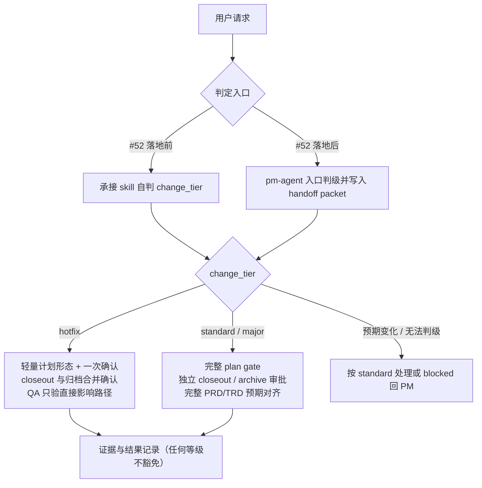

# 变更分级契约 PRD

## 1. 背景与动机

仓库执行流程中已存在多道串行门禁并持续增加：`feature-implementor` 的 plan gate、closeout gate、issue #54 计划新增的 archive gate、QA E2E 门禁、skill eval 的 Fresh Sub-Agent 门禁，以及 issue #52 计划新增的 PM entry gate。每道门禁单看都有明确理由，但仓库层面没有任何地方定义"什么规模的变更需要哪几道门"。

现行规则要求"小功能、单文件变更和轻量 bug fix 也不能跳过实施计划门禁"，叠加 #52 后，一个轻量 bug fix 的完整链路是：PM 入口分类 -> 预期对齐 -> 实施计划 + 用户确认 -> 实现 -> closeout -> 归档审批，其中至少 3 处需要用户交互确认。门禁强度与变更风险不匹配，会推高日常轻量任务的流程成本，并促使用户绕开流程直接点名下游 skill，与 #52 的收口目标冲突。

## 2. 目标与非目标

### 目标

1. 在 `AGENTS.md` 定义 `hotfix` / `standard` / `major` 三级变更分级契约，作为所有角色门禁强度的唯一引用来源。
2. 各 skill 的门禁不再各自默认最严，而是引用统一分级取强度。
3. `hotfix` 等级的完整链路中，用户交互确认不超过 1 次（不含最终交付确认），且验证证据要求不被削弱。
4. 为 #52 的 fast lane 判定和 handoff packet `change_tier` 字段提供跨角色共享的判定标准。
5. eval 覆盖轻量链路放行与 `hotfix` 名义滥用阻断。

### 非目标

1. 不取消任何现有门禁，只调整其按等级的强度和确认合并方式。
2. 不改变 eval 的 Fresh Sub-Agent 门禁（它作用于 skill 自身的测试流程，与产品变更分级无关）。
3. 不在本功能内实现 #52 的 PM 收口本体。

## 3. 用户画像

| 用户画像 | 描述 | 核心诉求 | 痛点 |
| --- | --- | --- | --- |
| 仓库维护者 | 维护 Agent skill 行为、门禁和 eval 的人。 | 门禁强度与变更风险匹配，轻量任务不被流程拖慢。 | 每新增一道门禁，小变更链路成本不受控地累积。 |
| Engineer Agent 使用者 | 通过 `feature-implementor` 落地实现。 | 轻量修复走轻量计划形态，仍留证据。 | 单文件 typo 修复也要走完整计划 + 多次确认。 |
| QA Agent 使用者 | 通过 `qa-agent` 更新和执行 E2E。 | 修复类变更只验证直接影响路径。 | 所有变更一律要求完整预期对齐门禁。 |
| PM Agent 使用者 | 通过 `pm-agent` 入口分类请求。 | fast lane 有统一判定标准。 | 缺少跨角色分级依据，只能在 routing 里临时发明。 |

## 4. 用户故事与场景

| ID | 用户故事 | 优先级 | 验收标准 |
| --- | --- | --- | --- |
| US-001 | 作为维护者，我希望变更分级在 `AGENTS.md` 有唯一定义源，以便所有角色引用同一套等级。 | P0 | `AGENTS.md` 存在变更分级契约章节，定义等级、判定信号和各门禁分级强度。 |
| US-002 | 作为实现者，我希望 `hotfix` 允许轻量计划形态，以便单文件修复不走完整计划流程。 | P0 | plan gate 按 `change_tier` 取强度；`hotfix` 用轻量计划形态且仅一次确认。 |
| US-003 | 作为实现者，我希望 `hotfix` 的 closeout 与归档合并为一次确认，以便收尾不重复审批。 | P0 | closeout / archive gate 按 `change_tier` 取强度。 |
| US-004 | 作为 QA 使用者，我希望 `hotfix` 只验证直接影响路径并追加结果，以便修复验证聚焦。 | P0 | QA E2E 门禁按 `change_tier` 取强度，证据仍必须记录。 |
| US-005 | 作为维护者，我希望以 `hotfix` 名义跳过预期变更对齐的请求被阻断，以便分级不成为逃逸通道。 | P0 | 预期变化的请求按 `standard` 处理或 blocked 回 PM。 |
| US-006 | 作为 PM 使用者，我希望 #52 落地后 `change_tier` 进入 handoff packet，以便 fast lane 直接引用本契约。 | P1 | `pm-agent` 契约措辞已预留 `change_tier` handoff packet 字段衔接。 |

## 5. 功能需求

| ID | 功能 | 描述 | 优先级 | 验收标准 |
| --- | --- | --- | --- | --- |
| FR-001 | 三级分级定义 | `AGENTS.md` 定义 `hotfix` / `standard` / `major` 及判定信号。 | P0 | `hotfix`：不改变已批准 PRD/TRD 预期、可由一条验证命令覆盖；`standard`：有对应 `feature_path`、预期可能变化；`major`：影响多角色文档、marketplace 注册表或 contract 脚本。 |
| FR-002 | 判定入口 | #52 落地前由承接请求的 skill 自判并记录 `change_tier`；#52 落地后由 `pm-agent` 入口判级并写入 handoff packet。 | P0 | 契约明确两阶段判定入口；无法判级时按 `standard` 处理。 |
| FR-003 | plan gate 分级 | `hotfix` 允许轻量计划形态（追加 scope 条目或简化模板，具体形态由 TRD 阶段确定）；`standard` / `major` 维持完整流程。 | P0 | `feature-implementor` SKILL 与 planner 引用统一分级。 |
| FR-004 | closeout / archive gate 分级 | `hotfix` 合并 closeout 与归档为一次确认；`standard` / `major` 维持独立审批。 | P0 | `feature-implementor` SKILL 与 reviewer 引用统一分级，兼容 #54 archive gate。 |
| FR-005 | QA E2E 门禁分级 | `hotfix` 只要求验证直接影响路径并追加结果；`standard` 以上维持预期对齐门禁。 | P0 | `qa-agent` SKILL 引用统一分级。 |
| FR-006 | PM entry gate 衔接 | `hotfix` 与交付类请求走 fast lane（#52 落地后生效）。 | P1 | `pm-agent` SKILL 记录分级职责与 fast lane 引用。 |
| FR-007 | 证据不削弱 | 分级只调整门禁形态和确认次数，不取消证据要求。 | P0 | 各 gate 分级表述均保留验证证据和结果记录要求。 |
| FR-008 | Eval 覆盖 | `hotfix` 单文件修复走轻量链路；试图以 `hotfix` 名义跳过预期变更对齐被阻塞；`hotfix` E2E 只验证直接影响路径。 | P1 | 相关 eval 使用 schema `1.0`，执行后更新 durable `comparison.md`。 |

## 6. 用户流程

## 7. 验收标准

| ID | 验收标准 | 验证方式 |
| --- | --- | --- |
| AC-001 | `AGENTS.md` 存在变更分级契约，且是唯一定义源。 | 人工审查 + `rg "变更分级契约"`。 |
| AC-002 | `hotfix` 完整链路用户交互确认不超过 1 次（不含最终交付确认），验证证据要求不削弱。 | 审查 plan gate 与 closeout / archive gate 分级表述。 |
| AC-003 | `feature-implementor` 的 plan / closeout / archive gate 按 `change_tier` 取强度。 | 审查 SKILL.md、planner、reviewer。 |
| AC-004 | QA E2E 门禁按 `change_tier` 取强度。 | 审查 `qa-agent` SKILL.md。 |
| AC-005 | `pm-agent` 契约措辞为 #52 的 `change_tier` handoff packet 字段留好衔接。 | 审查 `pm-agent` SKILL.md。 |
| AC-006 | eval 覆盖 `hotfix` 轻量链路、`standard` 完整门禁与 `hotfix` 名义滥用阻断。 | `check_eval_contract` 通过，执行后更新 `comparison.md`。 |

## 8. 风险与缓解

| 风险 | 影响 | 缓解 |
| --- | --- | --- |
| `hotfix` 被滥用为逃逸通道。 | 预期变更绕过 PM 对齐。 | 判定信号要求不改变已批准预期；预期变化一律按 `standard` 或 blocked。 |
| 各 skill 复制分级定义导致漂移。 | 多个事实源冲突。 | 各 gate 只加一小段引用 `AGENTS.md` 契约，不重写分级定义。 |
| #52 / #54 未落地导致衔接措辞失效。 | 契约与后续 issue 返工。 | 判定入口分两阶段表述；archive gate 以"生效时"条件引用。 |

## 9. 假设与待确认问题

| 类型 | 内容 | Owner | Blocking |
| --- | --- | --- | --- |
| Decision | 分级只调整门禁形态和确认次数，不取消任何证据要求。 | Maintainer | No |
| Decision | Fresh Sub-Agent 门禁不参与本分级。 | Maintainer | No |
| Assumption | `hotfix` 轻量计划的具体形态（追加 scope 条目或简化模板）由 TRD 阶段确定。 | Engineer | No |
| Open Question | #52 落地时 fast lane 的 delivery / 状态查询清单是否需要扩展。 | Maintainer | No |
