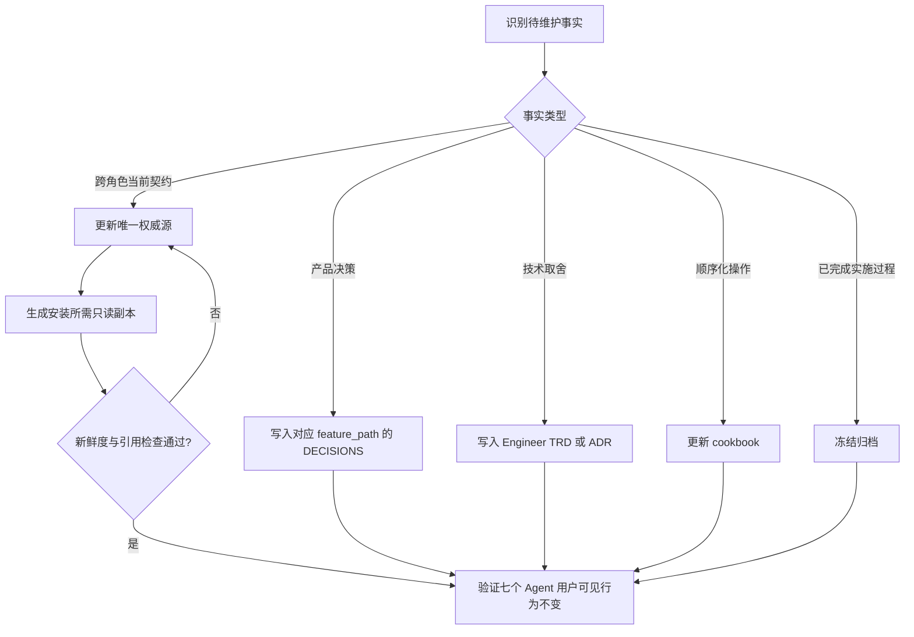

# 仓库文档权威与生命周期治理 PRD

## 1. 背景与动机

仓库已建立 PM-first 路由、跨角色 handoff、`feature_path` 文档树、Skill eval 和实施计划归档规则，但维护知识同时存在于 `AGENTS.md`、Role Router、Specialist Skill、PRD、TRD 与 `IMPLEMENTATION_PLAN.md`。同一规则在多个位置被人工维护，维护者难以快速判断当前行为的权威来源，也难以区分产品决策、技术取舍、当前契约、操作流程和历史证据。

Issue #285 的只读扫描确认了以下当前状态：

- PM 与 Engineer 文档树共有 119 份 Markdown，约 24,853 行；
- 13 份 `status: Implemented` 的实施计划仍位于活跃入口，另有 1 份
  `docs-agent` 父计划虽标记为 `Draft`，但对应 Issue 已关闭、PR 已合并且正文记录全部实施完成；
- 5 份活跃文档超过 500 行；
- 21 个 Specialist 指令文件重复同一文档消费前置规则；
- Security Specialist 重复维护相似的 PM entry、结论升级和 closeout 协议；
- Role Router 的内容超过其既定入口与分流职责；
- Design、QA、DevOps、Security 四个过程文档根当前不存在，也没有需要空目录对称的真实交付物。

这些问题不会直接新增或删除 Agent 能力，但会扩大修改一条规则时的同步面，使过期计划和重复协议继续被当作当前事实读取。维护者需要一套最小治理契约，让每类事实有唯一归属、已交付过程退出活跃入口，并用可验证的派生关系替代人工同步副本。

## 2. 当前状态与目标状态

### 2.1 当前状态

| 方面 | 当前事实 | 造成的问题 |
| --- | --- | --- |
| 文档职责 | 当前行为、设计理由、操作步骤与历史过程分散在多个文档类型中。 | 无法快速判断唯一权威，修改同步面不清晰。 |
| 计划生命周期 | 14 份已完成计划仍占用活跃 `IMPLEMENTATION_PLAN.md` 入口，其中 1 份 frontmatter 仍错误标记为 `Draft`。 | 活跃入口不能可靠表示尚未完成工作。 |
| 跨插件契约 | 同一共享规则由多个 Specialist 人工复制。 | 副本可能漂移，安装后的实际规则难以核验。 |
| Router 边界 | Router 包含下游流程和字段解释。 | 入口职责与 Specialist 协议混杂。 |
| QA E2E 模板 | 产品需求与账号、用例、脚本、报告模板细节边界不清。 | 同类模板可能在 PM、QA 与 Skill 指令间重复。 |
| 角色文档树 | 四个角色没有过程文档根。 | 如果只为结构对称补齐，会制造没有真实 owner 的空镜像。 |

### 2.2 目标状态

- 每类当前事实、产品决策、技术取舍、操作流程和历史证据都有明确且唯一的权威 owner；
- 14 份已完成计划全部进入冻结归档，活跃计划入口只表示仍有未完成范围的工作；
- PM 产品决策继续按 `feature_path` 保存在 `DECISIONS.md`，技术取舍保存在 Engineer 的 TRD 或 ADR，不新增中央 `docs/decisions/`；
- 跨插件共享契约由一个权威源维护，发布或安装时生成插件内只读副本，并能证明副本与源一致；
- QA E2E 模板由 QA Skill reference 唯一拥有；
- Role Router 只保留入口凭据、路由表、阻塞条件和 Specialist 指针；精确机器预算由 Engineer TRD 定义；
- 不为 Design、QA、DevOps、Security 创建无真实交付物的空文档镜像；
- 七个 Agent 的用户可见职责、触发结果和可用能力保持不变。

## 3. 目标与非目标

### 3.1 目标

1. 为仓库文档类型建立唯一职责、禁止内容和权威位置，使每条跨角色规则可定位到一个 owner。
2. 将 14 份已完成计划从活跃入口全部冻结归档，同时保留可通过仓库历史复核的原始内容。
3. 将人工维护的跨插件共享契约副本替换为单一权威源与可核验的只读派生副本。
4. 收窄 Role Router 和 Specialist 的职责边界，减少重复协议而不改变用户可见行为。
5. 为超长活跃文档形成基于内容所有权的保留、收窄或拆分结论，而不是只按行数机械拆分。

### 3.2 非目标

1. 不改变七个 Agent 的产品职责、用户可用能力或既有协作顺序。
2. 不要求每个 standard 变更创建决策记录，也不要求每个 Skill 同时拥有 PRD、TRD 和实施计划。
3. 不新增中央 `docs/decisions/`，不把 Engineer 技术取舍迁入 PM 决策记录。
4. 不创建 Design、QA、DevOps、Security 空文档镜像。
5. 不引入完整双语 hash 配对、大规模文档站治理或与本需求无关的新抽象。
6. 不在 PRD 中确定生成工具、机器预算阈值、脚本路径或其他技术实现细节。

## 4. 用户画像

| 用户画像 | 描述 | 核心诉求 | 痛点 |
| --- | --- | --- | --- |
| 仓库维护者 | 负责修改跨角色规则、审查文档和准备发布。 | 能快速定位权威来源与必要同步面。 | 同一规则存在多份人工维护副本，已交付过程混在活跃入口。 |
| Role / Skill 维护者 | 维护 Router、Specialist 和安装后的可读规则。 | 只维护自身职责，并能可靠消费共享契约。 | 通用协议重复占用 Skill 内容，副本可能漂移。 |
| 贡献者与审查者 | 根据 PRD、TRD、计划和检查结果实施或审查变更。 | 清楚区分当前事实、决策理由、执行计划与历史证据。 | 文档状态与实际生命周期不一致，评审需要重复考证。 |

## 5. 用户故事与场景

| ID | 用户故事 | 优先级 | 验收标准 |
| --- | --- | --- | --- |
| US-001 | 作为仓库维护者，我希望每类文档和跨角色规则有唯一权威 owner，以便修改时只更新正确来源。 | P0 | 文档职责表覆盖本需求涉及的所有文档类型；每条共享规则只有一个人工维护的权威源。 |
| US-002 | 作为贡献者，我希望已完成计划退出活跃入口，以便活跃计划只表示尚未完成工作。 | P0 | 当前复核识别的 14 份已完成计划全部位于冻结归档，原活跃路径不再保留这些计划。 |
| US-003 | 作为 Skill 维护者，我希望安装后的共享契约副本可追溯到唯一源并验证新鲜度，以便跨插件消费不依赖人工同步。 | P0 | 每个需要本地副本的安装产物均标明派生关系；源与副本一致性检查通过，人工权威副本数量为 1。 |
| US-004 | 作为 Role 维护者，我希望 Router 与 Specialist 各自只保留应有职责，以便入口协议和领域执行协议不再重复。 | P0 | 七个 Router 均只包含批准的四类内容；重复的通用 entry、消费、closeout 或升级协议不再由 Specialist 独立维护。 |
| US-005 | 作为现有用户，我希望治理调整不改变七个 Agent 的可用行为，以便无需学习新的使用方式。 | P0 | 现有用户可见路由与 Skill 行为回归结果无差异；没有新增、删除或重命名用户可用能力。 |

## 6. 功能需求

| ID | 功能 | 描述 | 优先级 | 验收标准 |
| --- | --- | --- | --- | --- |
| FR-001 | 文档职责与权威表 | 定义根规则、架构地图、文档治理、cookbook、产品决策、技术取舍、Role README、Skill 指令、共享契约与历史计划的职责及禁止内容。 | P0 | 每类文档均有一个权威位置、明确职责和至少一项禁止内容；不存在两个位置同时声明为人工维护权威源。 |
| FR-002 | 实施计划冻结归档 | 将当前复核识别的 14 份已完成活跃计划全部冻结归档，不删除其历史内容。 | P0 | 14/14 计划可在冻结归档中定位；活跃入口对应文件为 0；相关稳定引用均指向当前有效位置。 |
| FR-003 | 决策所有权 | PM 产品决策保留在对应 `feature_path/DECISIONS.md`；Engineer 技术取舍保留在 TRD 或 ADR。 | P0 | 仓库未新增中央 `docs/decisions/`；抽样与全量规则检查均未发现产品决策和技术取舍的 owner 冲突。 |
| FR-004 | 共享契约派生 | 跨插件 handoff、closeout、Security escalation 与文档消费协议采用一个权威源；分发边界需要时生成插件内只读副本并校验新鲜度。 | P0 | 每类共享契约只有一个源；所有派生副本可追溯且一致性通过；修改源而未刷新副本时检查必须失败。 |
| FR-005 | Router 与 Specialist 边界 | Router 只保留入口凭据、路由表、阻塞条件和 Specialist 指针；Specialist 只保留自身领域协议与消费共享契约所需的最小条件和结果。 | P0 | 七个 Router 的内容均可归入四类允许项；重复通用协议为 0；精确机器预算只在 Engineer 设计中定义。 |
| FR-006 | QA E2E 模板唯一 owner | 账号引用、测试用例、脚本片段与报告模板由 QA Skill reference 唯一拥有，PM 文档只保留产品要求和验收。 | P0 | 同一模板定义的人工维护权威源为 1；其他位置只引用 owner，不复制完整模板。 |
| FR-007 | 超长文档归属审查 | 对 5 份超过 500 行的活跃文档逐份给出保留、收窄或拆分结论及章节归属映射。 | P0 | 5/5 文档均有结论和章节映射；每项迁移后的内容由其真实 owner 承接，不创建空镜像。 |
| FR-008 | 行为与结构约束 | 治理变更不得改变七个 Agent 的用户可见行为，也不得为了目录对称创建空角色文档树。 | P0 | 用户可见行为回归差异为 0；新增空 Design、QA、DevOps、Security 镜像数量为 0。 |

## 7. 非功能需求

| 分类 | 需求 | 指标 | 目标 |
| --- | --- | --- | --- |
| 唯一性 | 当前规则只由一个位置人工维护。 | 每条跨角色规则的权威源数量 | 1 |
| 生命周期一致性 | 已完成计划不占用活跃入口。 | 本次 14 份计划在活跃入口的残留数 | 0 |
| 新鲜度 | 派生副本与权威源保持一致。 | 共享契约 freshness 检查通过率 | 100% |
| 可追溯性 | 移动后的稳定引用可定位有效目标。 | 受影响文档链接与 `feature_path` 对齐率 | 100% |
| 兼容性 | 用户可见 Agent 与 Skill 行为保持不变。 | 既有行为回归差异数 | 0 |
| 结构克制 | 不创建没有真实交付物的角色镜像。 | 新增空角色文档根数量 | 0 |

## 8. 治理流程

## 9. 交互与可读性要求

本功能不新增终端用户界面。维护者阅读体验必须满足：

- 从一个文档类型即可判断其职责、禁止内容和权威 owner；
- 从派生副本可定位权威源，但派生副本不表现为可独立维护的事实源；
- 从活跃计划入口看到的内容只代表仍需完成的工作；
- 从 Role Router 可快速看到入口条件、可选 Specialist 与阻塞结果，而不会混入 Specialist 的完整执行协议；
- 归档状态和权威关系使用稳定文字表达，不依赖颜色、图标或特定渲染器。

## 10. 治理对象模型

| 对象 | 关键属性 | 关系与约束 |
| --- | --- | --- |
| 权威文档 | 文档类型、owner、职责、禁止内容 | 每类事实只有一个人工维护权威 owner。 |
| 派生副本 | 来源、生成状态、新鲜度 | 必须来自一个权威源，不可独立编辑。 |
| 产品决策 | feature_path、状态、理由、后果 | 归 PM 对应 `DECISIONS.md` 所有。 |
| 技术取舍 | feature_path、技术背景、方案、后果 | 归 Engineer TRD 或 ADR 所有。 |
| 实施计划 | feature_path、生命周期状态、归档位置 | `Implemented` 且无未完成范围时退出活跃入口。 |
| Router 契约 | 入口凭据、路由表、阻塞条件、Specialist 指针 | 不承载 Specialist 完整执行协议。 |
| QA E2E 模板 | 模板类型、QA owner、引用者 | 由 QA Skill reference 唯一维护。 |

## 11. 接口触点

| 触点 | 当前用途 | 目标约束 |
| --- | --- | --- |
| 根 `AGENTS.md` | 仓库级常驻规则与不变量。 | 只保留每次工作必须携带的规则，并指向专项 owner。 |
| `docs/architecture.md` | 仓库当前架构地图。 | 描述七个角色、安装方式、路由、协作链和扩展关系的当前事实。 |
| `docs/AGENTS.md` | 文档树治理规则。 | 定义文档层级、归属、生命周期和检查规则。 |
| `docs/cookbook/` | 维护者操作流程。 | 保存新增或修改 Skill、eval 与发布等顺序化操作。 |
| PM `DECISIONS.md` | 产品决策记录。 | 只保存已接受产品决策及其理由和后果。 |
| Engineer TRD / ADR | 技术设计与技术取舍。 | 不与 PM 决策记录争夺技术 owner。 |
| Role README / `SKILL.md` | 角色能力目录与 Skill 独有协议。 | README 不复制执行协议；Skill 不复制共享契约全文。 |
| 活跃与归档实施计划 | 当前执行范围与冻结历史。 | 两者按生命周期明确分离。 |

## 12. 假设与约束

| 类型 | 描述 | 如果不成立的影响 |
| --- | --- | --- |
| 已知事实 | Issue 扫描识别出 13 份 `Implemented` 活跃计划；当前复核另确认 1 份状态漂移但已完成的父计划，共 14 份。 | 数量漂移时先复核扫描范围，再更新实施清单，不静默遗漏。 |
| 已接受决策 | 14 份已完成计划全部冻结归档，不删除。 | 归档必须保留内容与历史可追溯性。 |
| 已接受决策 | 跨插件共享契约采用单一权威源与生成的只读副本。 | 若某安装方式无法读取副本，发布不得宣称验证完成。 |
| 约束 | 精确 Router 机器预算、生成方式和检查实现由 Engineer 设计。 | PM 只定义可验证结果，不预设技术实现。 |
| 约束 | 本需求不改变七个 Agent 用户可见行为。 | 发现行为变化时必须停止并重新进行产品范围确认。 |

## 13. 依赖

- GitHub Issue #285 提供当前状态扫描、目标方向、非目标和初始验收范围；
- 用户在 2026-08-15 确认已完成计划采用全部冻结归档，并批准其余已列治理决策；
- 现有 `feature_path`、实施计划归档和变更分级契约提供生命周期与变更强度基础；
- Engineer 后续设计负责把本 PRD 的结果约束转化为精确迁移清单、机器预算和检查方案；
- 现有仓库契约、文档检查与 Skill eval 结果提供回归证据。

## 14. 发布计划与里程碑

| 阶段 | 范围 | 完成门槛 | 负责人 |
| --- | --- | --- | --- |
| 阶段 1 | 文档职责、唯一 owner 与禁止内容。 | 所有目标文档类型均有唯一职责结论。 | PM / Engineer |
| 阶段 2 | 14 份实施计划冻结归档与生命周期对齐。 | 14/14 可在归档定位，活跃残留为 0。 | Engineer |
| 阶段 3 | 共享契约派生、Router 与 Specialist 收窄。 | 权威源唯一，派生副本新鲜，Router 边界符合 FR-005。 | Engineer / Role maintainer |
| 阶段 4 | QA E2E 模板与 5 份超长文档归属收敛。 | 唯一 owner 与 5/5 章节映射均确认。 | QA / PM / Engineer |
| 阶段 5 | 仓库级验证与交付审查。 | 全部 P0 验收通过且用户可见行为差异为 0。 | Engineer / Reviewer |

本功能不按日期自动放行；每个阶段只在其完成门槛有可复核证据后进入下一阶段。

## 15. 迁移与回滚

### 15.1 迁移要求

1. 先确认文档职责和权威 owner，再移动或收窄内容，避免先删除后补归属。
2. 14 份已完成计划以冻结归档方式迁移，保留完整历史内容与来源关系。
3. 共享契约在所有消费边界均能读取且新鲜度通过后，才移除旧人工维护副本。
4. Router、Specialist、QA E2E 模板和超长文档按已确认 owner 迁移；其他位置保留必要引用，不复制完整规则。
5. 每个阶段独立验证链接、生命周期、契约一致性与用户可见行为。

### 15.2 回滚要求

- 冻结归档导致有效未完成工作丢失时，将对应精确计划恢复到原活跃入口，并记录未完成范围；
- 派生副本在任一受支持安装方式下不可读取或不新鲜时，回滚该阶段的消费切换，恢复上一版已验证权威关系；
- Router 或 Specialist 收窄造成用户可见行为差异时，回滚该阶段变更并重新确认产品边界；
- 回滚只恢复最近一个未通过验收的阶段，不引入永久双轨或未批准的兼容兜底。

## 16. 风险与缓解

| 风险 | 可能性 | 影响 | 缓解 |
| --- | --- | --- | --- |
| 把仍有未完成范围的计划误归档。 | 中 | 活跃工作失去入口。 | 归档前逐份核对状态与未完成范围；发现例外时停止该项迁移。 |
| 共享契约源唯一，但某插件安装后无法消费派生副本。 | 中 | 安装后的 Skill 缺少必要协议。 | 以 Claude 与 Codex 两类安装结果作为交付门槛，不通过则回滚消费切换。 |
| 收窄 Router 时误删必要阻塞行为。 | 中 | 请求可能绕过门禁或错误路由。 | 以四类保留职责和用户可见行为回归共同验收。 |
| 按行数机械拆分超长文档。 | 中 | 内容移动到错误 owner，形成新的重复。 | 每份文档先做章节所有权映射，再决定保留、收窄或拆分。 |
| 为结构对称创建空目录。 | 低 | 增加无 owner 的维护面。 | 仅在存在真实交付物时创建对应角色路径。 |
| 治理范围扩展成全面文档重写。 | 中 | diff 难以追溯并引入行为变化。 | 每处变更必须追溯到本 PRD 的 P0 要求，其他问题另行分类。 |

## 17. 待确认问题

无阻塞性产品问题。Router 的精确机器预算、共享副本生成方式、检查落点和逐文件迁移顺序由 Engineer TRD 与实施计划确定，但不得改变本 PRD 的权威 owner、生命周期、非目标和行为兼容要求。

## 18. P0 验收汇总

| 验收域 | 完成条件 | 证据 |
| --- | --- | --- |
| 权威归属 | 每类文档与跨角色规则都有唯一 owner、职责和禁止内容。 | 文档职责表与仓库契约检查结果。 |
| 计划生命周期 | 14 份已完成计划全部冻结归档，活跃残留为 0。 | 归档清单、活跃树扫描与链接检查。 |
| 决策边界 | PM 决策留在 feature-path `DECISIONS.md`，技术取舍留在 TRD / ADR。 | 文档树审查；中央 `docs/decisions/` 不存在。 |
| 共享契约 | 一个权威源生成全部必要只读副本，freshness 为 100%。 | 源与副本关系清单及一致性检查。 |
| Router / Specialist | 七个 Router 仅含四类允许内容，Specialist 不再人工复制通用协议。 | 内容分类审查与重复规则扫描。 |
| QA E2E | QA Skill reference 是模板唯一 owner。 | 模板定义清单与引用审查。 |
| 超长文档 | 5/5 有保留、收窄或拆分结论及章节映射。 | 经确认的逐文档映射。 |
| 行为兼容 | 七个 Agent 的用户可见能力、名称和行为无变化。 | 既有 contract、eval 与回归结果。 |
| 结构克制 | 没有新增空角色文档镜像或未经需求追溯的抽象。 | 最终 diff 审查。 |
