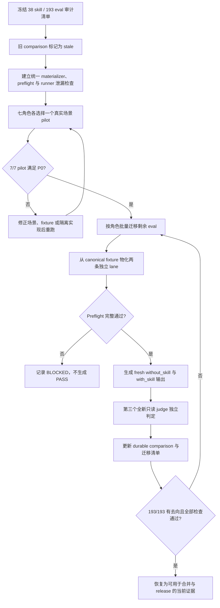

# Eval 真实场景与 Lane 隔离重构 PRD

## 1. 背景与动机

仓库现有常规 skill eval 已具备 `evals.json`、`eval_metadata.json` 和 durable
`comparison.md` 等基础产物，但大量评测仍以内部协议、路由字段或预期答案为中心，不能稳定代表真实用户会提出的任务。Issue #246 的审计基线显示，排除 manual-only 的 `manual-gen` 后，待审查范围为 38 个 skill、193 条 eval；其中 172 条需要重写或至少人工复核。

当前 paired eval 的隔离方式也未形成统一闭环。Prompt、workspace README、metadata、历史 comparison、父会话上下文或专用 runner 都可能向 candidate 暴露评测意图；不同角色对 scratch workspace、Git 根、目标 skill 可见性和运行时状态采用不同处理方式。即使重新执行旧 eval，也可能得到形式完整但缺少用户代表性或因 lane 泄漏而失真的结论。

本功能把常规 eval 的可信目标改为：以真实用户场景定义任务，以目标 skill 是否加载作为 `with_skill` 与 `without_skill` 的唯一变量，并以隔离 preflight、fresh baseline、独立 judge 和 durable comparison 形成可复核证据链。

首轮 193 条 fresh paired 执行得到 59 PASS、9 PASS (partial coverage) 和
125 FAIL。该结果证明迁移与隔离链路可运行，但同时暴露共享契约路径不可读、路由/门禁
不完整、证据与产物缺失，以及少量 fixture 与断言不可能同时成立等共因。维护者要求先按
共因完成整改，再统一重跑；旧 FAIL 在重跑前只是诊断输入，不是最终 closeout 结论。

### 1.1 当前状态与目标状态

| 维度 | 当前状态 | 目标状态 |
| --- | --- | --- |
| 场景来源 | 大量 prompt 从内部协议或断言反向构造。 | 每条 eval 先定义真实用户、处境、材料、约束和可观察结果。 |
| Candidate 输入 | 部分 prompt、README 或 runner 暴露 lane、expected output、assertion 或 skill 信息。 | Candidate 只看到自然用户请求和宿主原生事实。 |
| Lane 隔离 | 各角色自行处理，无法统一证明相同初始状态和唯一变量。 | 两条 lane 从同一 canonical fixture 物化到独立 scratch 目录和独立 Git 根，并完成统一 preflight。 |
| 结果证据 | 旧 comparison 可能基于过时场景、旧 baseline 或不完整隔离。 | 每个保留 eval 都有 fresh paired 输出、独立 judge 结论和按新标准更新的 comparison。 |
| 重跑范围 | 辅助 skill 的任意内容变化会连带使依赖它的 eval 失效。 | eval 只随目标 skill 或自身评测输入变化而失效；辅助 skill 内容变化不建立跨 skill 重跑关系。 |
| 协议 freshness | 完整 runner、persistence 和报告格式源码变化会连带使全部历史 comparison stale。 | 跨版本只比较 execution、runtime、judge 与四项 eval 输入组成的 schema v2；所有源码 manifest 仅用于同轮 drift。 |

## 2. 目标与非目标

### 2.1 目标

1. 对 38 个常规 skill、193 条 eval 建立逐条迁移记录，并为每条旧 eval 记录保留、合并或删除结论。
2. 先在 designer、devops、docs、engineer、product_manager、qa、security 七个角色各完成一个端到端 pilot，通过后再批量迁移其余 eval。
3. 使每个保留 eval 的 prompt、fixture 和 assertions 都以真实用户结果为中心，不向 candidate 泄露评测脚手架或答案。
4. 用统一 scratch materializer 和隔离 preflight 证明两条 lane 的 fixture 一致、运行目录独立、目标 skill 可见性符合约束且运行时已隔离或重置。
5. 为每个保留 eval 重新生成 `without_skill` baseline、`with_skill` 输出和独立 judge 结论，并更新 durable `comparison.md`。
6. 用静态检查和确定性隔离测试阻止已知泄漏重新进入 candidate lane；每条 eval 结束（含 FAIL、BLOCKED 和异常）必须删除全部过程产物，只保留 durable `comparison.md`。
7. 批量入口最多使用 10 个跨角色 worker 并行处理不同 eval；每条 eval 内仍严格按 `without_skill → with_skill → judge` 顺序执行。
8. 对 fresh FAIL 先聚类定位共享根因，修复 skill、fixture 或 assertions 的真实缺陷后再运行正式 eval；不得用弱化断言或伪造 fixture 制造 PASS。
9. 将辅助 skill 限定为运行环境依赖：完整记录并锁定当次执行内容，但不因其后续内容变化连带使其他目标 skill 的 comparison 失效。
10. 保持 Issue #246 的 193 条迁移清单为不可扩充的历史基线；冻结后新增 eval 独立接受完整静态契约与 fresh paired 执行，不依赖迁移清单登记才能持久化结果。
11. 将 durable comparison 的跨版本身份固定为 schema v2 七字段，并把 execution/judging、runtime/isolation、persistence/inventory 分离；所有参与执行的源码 manifest 仍在同轮锁定，任何漂移均阻塞。

### 2.2 非目标

- 不把 `manual-gen` 纳入常规 paired eval；它继续遵循 manual-only 契约。
- 不修改与 fresh FAIL 无关的 skill 行为；只有 durable evidence 证明目标 skill 缺少既有仓库契约时，才做可追溯的最小协议修正。
- 不引入与 Issue #246 无关的抽象、功能、发布能力或仓库治理规则。
- 不提交 transcript、candidate output、baseline output、judge verdict、timing、diagnostics、运行期 workspace 或其他 runtime artifact。
- 不要求迁移后的 eval 数量必须仍为 193；合并或删除必须有逐条理由和可追溯映射。

## 3. 用户画像

| 用户画像 | 描述 | 核心诉求 | 痛点 |
| --- | --- | --- | --- |
| Skill 维护者 | 负责设计 skill 行为与评测覆盖。 | 确认 skill 对真实任务有可观察价值。 | 旧 prompt 容易把协议答案直接告诉 baseline。 |
| Eval 迁移者 | 负责重写场景、fixture、assertions 和 comparison。 | 使用一套明确且可重复的迁移与隔离流程。 | 各角色 runner 和 workspace 结构不一致。 |
| PR / Release 审查者 | 负责判断评测结论能否作为合并或发布依据。 | 从 durable comparison 追溯本轮输入、隔离和 judge 结论。 | 旧 comparison 无法证明当前场景和隔离标准。 |
| Runner 维护者 | 维护 paired eval 与确定性检查工具。 | 阻止脚手架、父上下文和运行时状态跨 lane 泄漏。 | 专用 runner 可能在启动方式或消息中泄露评测信息。 |

## 4. 用户故事与场景

| ID | 用户故事 | 优先级 | 验收标准 |
| --- | --- | --- | --- |
| US-001 | 作为 skill 维护者，我希望 eval 复现真实用户会提出的任务，以便判断 skill 是否改善用户可观察结果。 | P0 | 每个保留 eval 都记录用户身份、处境、触发原因、目标、已有材料、约束和成功标准；prompt 不含评测或内部协议提示。 |
| US-002 | 作为迁移者，我希望先通过七角色 pilot 固定迁移方法，以便批量处理时不复制未经验证的设计。 | P0 | 七个角色各有一个 pilot 完成 scenario、paired run、preflight、fresh judge 和 comparison；全部满足 P0 后才开始其余批量迁移。 |
| US-003 | 作为 runner 维护者，我希望两条 lane 只有目标 skill 可见性不同，以便结果差异能归因于目标 skill。 | P0 | 两条 lane 使用逐字相同消息和内容 hash 一致的 fixture；目录、Git 根和运行时隔离可证明；`without_skill` 无法读取目标 skill 或另一条 lane。 |
| US-004 | 作为审查者，我希望每条旧 eval 都有迁移去向且每个保留 eval 都有 fresh 证据，以便完整判断 193 条审计基线是否处理完。 | P0 | 迁移记录覆盖 193/193；每个保留 eval 都有本轮 fresh baseline、with-skill 输出、独立 judge 结论和更新后的 comparison。 |
| US-005 | 作为 release 审查者，我希望旧结论在迁移期间明确失效，以免过时 comparison 被用作当前 release 依据。 | P0 | 未按新标准重跑的 comparison 被标记为 stale 或等效阻塞状态；静态检查、隔离测试和 artifact 检查全部通过后才可恢复为当前证据。 |
| US-006 | 作为 eval 维护者，我希望迁移完成后新增的 eval 可以直接接受当前契约校验和 fresh 执行，以免历史迁移清单成为永久登记表或运行阻塞。 | P0 | 冻结后的 eval 不写入 193 条迁移清单；runner 在清单零匹配时仍可持久化 comparison，所有当前 eval 均接受严格 schema、scenario、metadata 和 fixture 校验。 |
| US-007 | 作为评测审查者，我希望持久化、inventory 或报告格式调整不会批量作废历史证据，同时 execution、runtime 或 judge 协议变化仍会使 comparison stale。 | P0 | Schema v2 只使用七个明确身份字段；全部执行源码 manifest 在同轮开始与持久化前一致，否则 `BLOCKED`。 |

## 5. 功能需求

| ID | 功能 | 描述 | 优先级 | 验收标准 |
| --- | --- | --- | --- | --- |
| FR-001 | 全量迁移清单 | 以 Issue #246 的 38 个 skill、193 条 eval 为审计基线，记录每条 eval 的旧标识、目标 skill、角色、处理结论和新标识。 | P0 | 清单覆盖 193/193；保留、合并和删除数量之和为 193；合并或删除均有理由且能定位替代覆盖。 |
| FR-002 | 场景优先设计 | 每条保留 eval 先定义真实场景，再编写自然 prompt 和语义 assertions；assertions 只约束用户结果、事实、安全边界或确有必要的阻塞。 | P0 | 场景字段齐全；prompt 离开测试仓库仍可独立成立；禁止出现 lane、eval、assertion、expected output、内部 gate、模型/工具参数和“用户说：”包装。 |
| FR-003 | Fixture 与 README 清理 | Candidate fixture 只保留宿主原生事实和原始证据；重写或删除 answer-bearing README、`.rules`、`evidence.md` 或同义答案材料。 | P0 | Candidate lane 中不存在为命中 assertion 创建的说明文件；保留的 README 只描述宿主产品或仓库事实，且不含 expected behavior、评分线索或 skill 指令。 |
| FR-004 | 七角色 pilot 与批量迁移 | designer、devops、docs、engineer、product_manager、qa、security 各选择一个代表性真实场景完成端到端 pilot；pilot 通过后按角色迁移其余 eval。 | P0 | 7/7 pilot 通过 FR-002、FR-003、FR-005 至 FR-009；批量迁移前有可复用的通过证据；最终满足 FR-001。 |
| FR-005 | 统一 Scratch Materializer | 从同一 canonical fixture 分别物化 `with_skill` 和 `without_skill`，为每条 lane 创建独立顶层 scratch 目录、Git 根和受控用户配置。 | P0 | 两份 candidate-visible fixture 的文件清单和内容 hash 一致；不存在共享可写 cwd、可读取的 sibling lane 或源仓库根运行；仅 `with_skill` 安装并加载目标 skill 及其明确依赖。 |
| FR-006 | 隔离 Preflight | 在 candidate 启动前验证 fixture 一致性、禁止文件排除、skill 可见性、工作目录、运行时隔离或重置状态以及 judge 上下文。 | P0 | 每次 paired run 都产生完整 preflight 结果；任一项无法证明时本轮为 `BLOCKED`，不得写成 PASS；进程、端口、数据库、浏览器、登录态和下载目录均有隔离、重置或阻塞结论。 |
| FR-007 | Candidate 与 Judge 边界 | 两条 lane 接收逐字相同的自然消息；candidate 不接触 assertions、expected output、历史 comparison 或 judge 材料；judge 使用第三个全新只读 `gpt-5.6-luna` medium 上下文。 | P0 | Candidate 泄漏扫描为 0 命中；两条消息 hash 一致；judge 仅在两条输出锁定后读取 assertions 和必要原始证据，且不读取 lane 自评。 |
| FR-008 | Runner 泄漏修复 | 修复 QA runner 已知的 lane、metadata、expected output 和源仓库根泄漏，并审计其余专用 runner 的同类风险。 | P0 | QA runner 不再向 candidate 发送评测编排信息，也不从源仓库根启动 baseline；所有专用 runner 都有审计结论，发现的问题在迁移完成前修复并有回归测试。 |
| FR-009 | Fresh 结果与治理检查 | 每轮重新生成 baseline，锁定两条输出后由独立 judge 判定，并更新 durable comparison；comparison 只随目标 skill、评测定义、metadata、fixture、judge 或 runner/runtime 输入变化而失效，辅助 skill 内容变化仅保留为当次执行证据；所有 runtime root、candidate 输出、snapshot、judge package/verdict、transcript、timing 和 diagnostics 在 runner 退出前删除。 | P0 | 每个保留 eval 的 comparison 记录本轮来源、完整 skill 环境、preflight、两条 lane、judge、Behavior/Coverage 与 Overall result；修改辅助 skill 内容不会连带使其他目标 skill 的 comparison 失效，修改依赖清单或目标 skill 仍会失效；成功、FAIL、BLOCKED 和异常路径均只留下 durable comparison；仓库、eval、artifact、doc contract 及相关确定性测试通过。 |
| FR-010 | FAIL 聚类与并发重跑 | 首轮 fresh FAIL 按共享路径、路由/门禁、证据核验、产物完整性和 fixture 可执行性聚类；全部已确认根因整改完成后，统一入口以最多 10 个 worker 跨角色运行。 | P0 | 每个整改可追溯到 fresh assertion evidence；批量测试证明并发上限为 10、共享 inventory 写入安全、单 eval paired 顺序不变；最终不存在未解释的 FAIL/BLOCKED。 |
| FR-011 | 冻结后 Eval 生命周期 | `migration-inventory.json` 只记录 Issue #246 冻结的 193 条旧 eval，不作为后续 eval 注册表；runner 持久化时按 retained identity 的匹配数量决定是否更新清单。 | P0 | 零匹配时只事务写入当前 comparison 且清单逐字不变；唯一匹配时同步更新 comparison 与迁移状态；多于一个匹配时拒绝持久化并报告契约错误。静态 checker 对所有当前常规 eval 执行同一严格输入契约，不因缺少迁移记录而降级。 |
| FR-012 | Identity Schema v2 | 跨版本 freshness 精确使用 `target_skill_sha256`、`eval_definition_sha256`、`metadata_sha256`、`fixture_sha256`、`execution_protocol_sha256`、`runtime_protocol_sha256`、`judge_schema_sha256`。 | P0 | 新 writer 只写七字段；迁移后 checker 只接受 v2，不调用 Git、不保留 v1/v2 双轨。完整 runner、persistence、inventory、报告格式及其他执行源码 manifest 只用于同轮 source-drift，任一变化均 `BLOCKED`。 |
| FR-013 | 一次性 V2 迁移 | 迁移器先核验旧 Executor 来源与当前真实输入，再把 196 份常规 comparison 收敛为单轨 v2；冻结 inventory 不参与迁移。 | P0 | 187 份 FRESH 机械迁移并逐字保持 verdict/evidence，分布为 127 PASS/FULL、46 PASS/PARTIAL、12 FAIL/FULL、2 FAIL/PARTIAL；807 assertions 保持 717 PASS、70 NOT_EXERCISED、20 FAIL。trd-gen 6 份保持 stale 待 fresh，PM 3 份保持 PENDING 待首次 fresh；1 份 manual-only 原样不迁移。迁移报告记录实际旧 hash、source commit、分类和逐字保持校验。 |

## 6. 非功能需求

| 分类 | 需求 | 指标 | 目标 |
| --- | --- | --- | --- |
| 可追溯性 | 审计基线中的每条 eval 都可定位迁移结论。 | 旧 eval 映射覆盖率 | 193/193 |
| 隔离性 | Candidate 不可读取评测脚手架、目标外 skill 或另一条 lane。 | 禁止项扫描与跨 lane 可见性 | 0 命中、0 可见 |
| 可重复性 | 同一 canonical fixture 物化出的两条 lane 内容一致。 | 文件清单与内容 hash | 100% 一致 |
| 可判定性 | 无法证明隔离时不得产出通过结论。 | Preflight 不完整时的结果 | 100% `BLOCKED` |
| 产物卫生 | 运行期证据仅在单条执行期间存在，退出前无条件删除；CI 不上传 runtime tree。 | Runner 退出后的 runtime artifact | 0 个 |
| 一致性 | 同一源码树上的确定性检查结果稳定。 | 重复执行静态检查 | 违规列表一致 |

## 7. 用户流程

合并或删除的 eval 不执行 paired run，但必须在迁移清单中记录理由、替代覆盖和对应 durable 证据。外部运行时无法隔离或恢复到相同初始状态时，该轮保持 `BLOCKED`，不得复用历史 baseline 或降低隔离要求。

## 8. 交互与输出要求

本功能不新增终端用户界面。迁移与 runner 的 CLI / 报告输出必须满足：

- 明确列出 eval 标识、角色、目标 skill 和当前阶段；
- 显示 canonical fixture hash、两条 lane hash、禁止项扫描和 skill 可见性结果；
- 对 preflight 失败给出具体缺失证据，并输出 `BLOCKED`；
- 不在 candidate 消息中出现 lane 名、skill 路径、expected output、assertions 或评测说明；
- 不把 runtime 路径或 runtime artifact 写入 durable comparison 之外的仓库事实。

## 9. 数据模型

| 对象 | 关键字段 | 关系与约束 |
| --- | --- | --- |
| 迁移记录 | old_eval_id、role、skill、disposition、new_eval_id、reason | 每条 Issue #246 冻结旧 eval 恰有一条处理结论；冻结后新增 eval 不进入该对象。 |
| 真实场景 | persona、situation、trigger、goal、materials、constraints、success | 每个保留 eval 恰有一个场景定义。 |
| Eval 定义 | id、prompt、expected_output、assertions、workspace | Prompt 不承载 expected output 或 assertions。 |
| Canonical fixture | source_root、manifest、content_hash | 是两条 candidate lane 的唯一 fixture 来源。 |
| Lane workspace | mode、scratch_root、git_root、fixture_hash、skill_visibility | 两条 lane 独立；仅目标 skill 可见性不同。 |
| Preflight 结果 | fixture_match、excluded_files、skill_visibility、runtime_reset、judge_context | 任一必填项失败或未知即阻塞。 |
| Judge 结论 | assertions、raw_evidence、behavior_result、coverage_result、overall_result | 在两条输出锁定后由第三个上下文生成。 |
| Durable comparison | source_revision、preflight_summary、lane_summary、judge_summary、latest_result | 只记录可长期复核的结论，不承载 runtime artifact。 |
| Comparison identity v2 | 七个 `*_sha256` 字段 | 四项 eval 输入与 execution/runtime/judge 三项协议共同决定跨版本 freshness。 |
| 同轮源码锁 | 完整源码 manifest | 覆盖 CLI、identity、execution、judging、runtime、persistence、inventory、report format；只验证本轮无漂移，不进入历史 freshness。 |

## 10. 接口触点

| 接口 | 用途 | 目标行为 |
| --- | --- | --- |
| `agents/*/test/*/evals/evals.json` | 定义自然 prompt、expected output、workspace 和 assertions。 | Prompt 与评测脚手架分离，原 193 条均有迁移去向。 |
| `eval_metadata.json` | 描述 canonical fixture、清理和 deterministic runner 输入。 | 不进入 candidate lane；不把历史 runtime 产物变成 fixture。 |
| `comparison.md` | 保存最新 durable 评测结论。 | 旧结论先 stale；保留 eval 完成 fresh paired run 和 judge 后更新。 |
| 统一 scratch materializer / preflight | 物化 lane 并验证隔离。 | 所有角色复用同一隔离语义，不各自复制不一致逻辑。 |
| QA 与其他专用 runner | 执行角色特有 eval。 | 只接收 canonical fixture 和自然用户消息，不泄露评测信息。 |
| Repository / eval / artifact / doc checkers | 校验结构、泄漏、产物和文档契约。 | 对已知违规稳定失败，对合法宿主事实不误报。 |
| `migration-inventory.json` / durable writer | 保存历史迁移状态并事务持久化最新结果。 | 清单固定为 193 条；冻结后 eval 零匹配时仅写 comparison，唯一匹配才更新清单，多匹配阻塞。 |
| Identity writer / checker | 写入并验证 schema v2 七字段。 | 迁移后 checker 只接受 v2；正常检查不读取 Git 历史。 |
| 一次性 migration audit | 核验旧来源并记录 196 份分类。 | 可记录实际 hash 与 source commit，但这些值不硬编码进正常 writer/checker。 |

## 11. 假设与约束

| 类型 | 描述 | 如果不成立的影响 |
| --- | --- | --- |
| 已知事实 | Issue #246 的审计基线为 38 个常规 skill、193 条 eval。 | 后续仓库增减单独按当前 eval 契约处理，不改写冻结迁移清单。 |
| 约束 | 193 条迁移清单是 Issue #246 的冻结历史账本，不是后续 eval 注册表。 | 新增 eval 不改变 schema 1.0、冻结计数或历史 counts；runner 和 checker 必须独立支持其严格校验与 fresh 结果。 |
| 约束 | Schema v2 迁移是一次性切换。 | 迁移失败不部分写；成功后正常 checker 不提供 v1 兼容或 Git 历史回退。 |
| 约束 | `manual-gen` 是唯一 manual-only 例外，不进入本次 paired eval。 | 不得用本次机制伪造其真实环境证据。 |
| 约束 | Candidate 与 judge 使用的模型和 reasoning effort 遵循现行 eval 执行契约。 | 指定模型不可用时本轮 `BLOCKED`，不得静默替换。 |
| 约束 | 两条 lane 的唯一变量是目标 skill 是否加载。 | 存在其他差异时，本轮输出不得作为比较证据。 |
| 约束 | Runtime artifact 在每条测试结束时删除，历史结果只通过 durable comparison 表达。 | Cleanup、artifact 或 CI 上传检查失败时不得完成迁移。 |
| 约束 | 本次只重构 eval 定义、fixture、runner、隔离基础设施、检查和 durable comparison。 | 发现 skill 业务协议缺陷时另行建项，不在本 issue 顺手修改。 |

## 12. 依赖

- Issue #246、#238 和 #234 提供审计范围与前置结论；Issue #277 提供冻结后 eval 持久化和 trd-gen eval-006 缺陷证据。
- `AGENTS.md` 提供 eval schema、paired lane、fresh judge、comparison 和 runtime artifact 契约。
- 38 个目标 skill 的 `SKILL.md` 及其明确引用提供被测行为依据。
- 七个角色现有 eval workspace、专用 runner 和 contract checker 提供迁移输入。
- `gpt-5.6-luna` medium 会话可用于两条 candidate lane 与独立 judge；不可用时对应评测阻塞。

## 13. 发布计划与里程碑

| 阶段 | 范围 | 完成门槛 | 负责人 |
| --- | --- | --- | --- |
| 阶段 1 | PM / Engineer 文档与全量迁移清单。 | 范围、非目标、193 条基线和技术计划一致。 | PM / Engineer |
| 阶段 2 | 统一 materializer、preflight、QA runner 修复与 runner 审计。 | 隔离确定性测试覆盖已知泄漏路径。 | Engineer |
| 阶段 3 | 七角色端到端 pilot。 | 7/7 pilot 满足全部 P0，且 comparison 使用 fresh 证据。 | 各角色维护者 / Engineer |
| 阶段 4 | 按角色批量迁移与 fresh paired eval。 | 193/193 有去向；所有保留 eval 完成新 comparison。 | 各角色维护者 / Engineer |
| 阶段 5 | 仓库级收尾验证。 | Repository、eval、artifact、doc contract 与相关确定性测试通过。 | Engineer / Reviewer |
| 阶段 6 | Fresh FAIL 聚类整改与并发重跑。 | 已确认根因全部修复；10 worker 重跑后不存在未解释的 FAIL/BLOCKED，过程产物为 0。 | Skill owner / Engineer |
| 阶段 7 | 冻结后 eval 缺陷收敛。 | 193 条 inventory 不变；零/一/多匹配持久化测试通过；trd-gen eval-006 与 PM scope-guard 三条 eval 生成可复核 fresh 结果。 | Engineer / Skill owner |
| 阶段 8 | Identity schema v2 单轨迁移。 | 187/6/3 分类与 807 条 assertion 审计通过，inventory 零改，checker 只接受 v2；授权后完成 trd-gen 6 条与 PM scope-guard 3 条 fresh eval。 | Engineer / Reviewer |

本功能不以日期驱动放行。任一阶段未达到完成门槛时，后续 comparison 不作为 release 依据。

## 14. 风险与缓解

| 风险 | 可能性 | 影响 | 缓解 |
| --- | --- | --- | --- |
| 193 条逐项迁移产生遗漏或编号漂移。 | 高 | 旧 eval 无去向，覆盖事实不可追溯。 | 以全量迁移清单做唯一盘点入口，并校验 193/193。 |
| 过度追求自然语言导致 skill 特有行为失去覆盖。 | 中 | Eval 真实但不能区分 skill 价值。 | 从用户结果和 skill 契约共同提取 assertions，由 pilot 验证区分度。 |
| 静态泄漏检查误报宿主原生文档。 | 中 | 合法 fixture 被阻塞。 | 检查候选可见性和答案措辞，不以文件名本身一刀切；用正反 fixture 测试。 |
| 外部运行时无法完全隔离。 | 中 | Lane 结果受前序状态污染。 | 优先独立运行时；只能共享时串行并恢复同一初始状态，否则 `BLOCKED`。 |
| 旧 comparison 在迁移中继续被引用。 | 高 | Release 依据与当前契约不一致。 | 先统一标记 stale，并以迁移清单和静态检查阻止误用。 |
| 批量执行成本促使复用历史 baseline。 | 中 | Comparison 不再是同轮对照。 | 每轮强制 fresh baseline；无法完成时记录阻塞，不降级。 |
| 并发 worker 竞争写 inventory 或残留大体积 scratch。 | 中 | Durable 状态损坏或磁盘膨胀。 | Durable transaction 使用进程内写锁；每个 worker 在 `finally` 删除完整 runtime root，并用并发与异常回归测试证明。 |
| 把 skill 缺陷误判成 eval 缺陷。 | 高 | 通过弱化断言掩盖真实行为差距。 | 先核对 skill 契约、用户目标和 candidate 原始证据；只有不可能执行或材料事实不成立时才改 fixture/assertion。 |
| 协议模块边界遗漏真实执行行为。 | 中 | 行为变化未使 comparison stale。 | Execution/judging 与 runtime/isolation 的文件集合显式固定并做 mutation 测试；persistence/inventory 不参与 candidate 或 judge 行为。 |
| 一次性迁移部分写入或改动结论。 | 中 | 仓库出现双轨或证据失真。 | 先 dry-run 和完整审计，再原子写入；验证 187 份结论与 807 条 assertion 证据逐字保持，失败不落盘。 |

## 15. 待确认问题

无阻塞性产品问题。统一 materializer 的具体模块路径、CLI 形态和测试文件落点由 Engineer TRD 与实施计划确定，但不得改变本 PRD 的范围、唯一变量、隔离证据和验收门槛。

## 16. P0 验收汇总

| 验收域 | 完成条件 | 证据 |
| --- | --- | --- |
| 全量范围 | 38 个 skill、193 条旧 eval 全部有保留、合并或删除结论。 | 迁移清单校验结果。 |
| Pilot | 七个角色各一个 pilot，7/7 满足 FR-002 至 FR-009。 | 七份更新后的 durable comparison 与 preflight 摘要。 |
| 批量迁移 | 每个保留 eval 都有本轮 paired 输出、独立 judge 和更新后的 comparison。 | Comparison 汇总与迁移清单。 |
| Lane 隔离 | Fixture hash 一致、消息逐字相同、目录和 Git 根独立、禁止项零命中、skill 可见性正确。 | Materializer / preflight 确定性测试与运行摘要。 |
| Runner 治理 | QA 已知泄漏修复，其他专用 runner 审计完成且问题清零。 | Runner 审计清单与回归测试。 |
| 结论有效性 | 未迁移结论保持 stale 或 `BLOCKED`，完成项使用新 Behavior / Coverage / Overall 结果。 | Durable comparison 与静态检查。 |
| 仓库质量 | Repository、eval、artifact、doc contract 和相关确定性测试全部通过。 | 最终验证命令输出；git 跟踪的 runtime artifact 为 0。 |
| 冻结后 eval | 新增 eval 不依赖迁移登记即可通过严格校验并持久化 fresh 结果。 | 零/一/多匹配回归测试、清单无 diff、三份 PM scope-guard comparison。 |
| Identity v2 | 跨版本只随七项真实输入/协议变化，同轮源码 drift 零容忍。 | v2 writer/checker、协议 mutation、完整 manifest drift 与单轨拒绝 v1 测试。 |
| 一次性迁移 | 196 份常规 comparison 按 187 fresh、6 stale、3 pending 完成分类，manual-only 不动。 | Migration audit JSON、逐字证据校验、迁移后二次 dry-run 零 diff、inventory bytes 相同。 |
