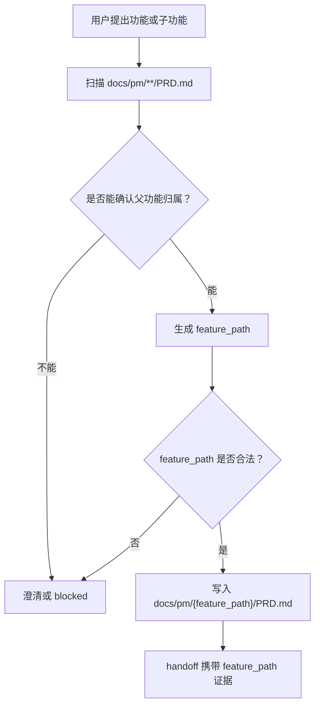
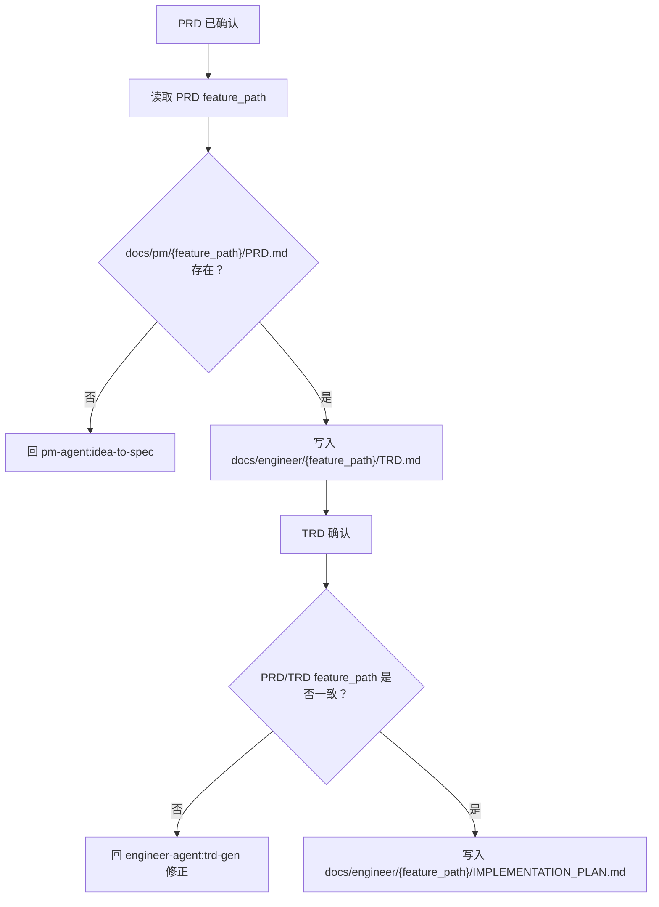

# PRD/TRD 多级功能目录契约 PRD

## 1. 背景与动机

GitHub issue #37 已确认当前文档目录契约存在跨 PM 和 Engineer 链路的结构性缺口：现有 PRD、TRD 和实施计划主要使用 `docs/{agent}/{feature-name}/` 或 `docs/pm/{feature}/PRD.md`、`docs/engineer/{feature}/TRD.md` 这类单层目录。该规则会把子功能误识别为同级功能，导致新需求被写成错误的并列 PRD、TRD 或 `IMPLEMENTATION_PLAN.md`。

典型场景是已有一级功能 `Chat Interface`，新增子功能 `Chat History Search` 时，文档应落在 `Chat Interface` 下的子功能目录，而不是在 `docs/pm/` 或 `docs/engineer/` 下创建一个新的并列顶层目录。

QA E2E 已经使用功能树模型。PM、Engineer、TRD、实施计划和 QA E2E 链路需要升级到同一套多级 `feature_path` 语义，避免需求、技术设计、实施计划和后续 QA 资产之间发生目录漂移。

## 2. 目标与非目标

### 目标

1. 将文档生成契约从单层 `{feature-name}` 升级为允许多级的 `{feature_path}`。
2. 确保 PRD、TRD 和 `IMPLEMENTATION_PLAN.md` 使用同一个功能路径镜像关系。
3. 在 PM 文档生成前扫描已有 `docs/pm/**/PRD.md`，判断新需求是否属于已有父功能。
4. 在 Engineer TRD 和实施计划生成前校验 PRD/TRD 路径、frontmatter 和引用是否一致。
5. 对父功能归属不清、路径缺层、PRD/TRD 缺失或路径冲突的情况，明确 blocked 或 handoff 门禁。
6. 保持旧单层目录兼容，已有单层目录视为一级功能，不做强制批量迁移。
7. 增加 eval 覆盖，防止后续 skill 回退为错误并列目录生成。
8. 正式定义仓库治理和跨 Agent 协作类文档的顶层 namespace，避免治理文档继续落在松散一级目录。
9. 明确 legacy artifact 的归档路径、frontmatter 字段和 repository contract 处理方式。

### 非目标

1. 不一次性迁移所有历史单层文档。
2. 不改变 PRD、TRD、实施计划的职责边界。
3. 不把 QA E2E 目录模型改回单层路径；QA E2E 统一使用 `docs/qa/e2e/{feature_path}/`。
4. 不让 `feature-implementor` 在缺少 PRD/TRD 路径对齐时自行补写需求或技术设计。
5. 不自动猜测模糊父功能；无法确认时应询问用户或 blocked。

## 3. 用户画像

| 用户画像 | 描述 | 核心诉求 | 痛点 |
| --- | --- | --- | --- |
| 仓库维护者 | 维护 Agent skill 行为、文档契约和 eval 的人。 | 文档产物按功能树稳定归档，便于 review 和 release。 | 子功能被写成并列目录后，需要人工追踪和修正。 |
| PM Agent 使用者 | 通过 `idea-to-spec` 生成或更新 PRD/BRD/DECISIONS。 | 新功能和子功能能落到正确位置。 | 父功能不清楚时，Agent 可能直接创建错误顶层目录。 |
| Engineer Agent 使用者 | 从 PRD 生成 TRD、实施计划和代码执行任务。 | TRD 和实施计划镜像 PM 路径。 | 缺少路径门禁会让实现基于错误文档。 |
| Skill 作者 | 维护 PM、Engineer、QA、Design、DevOps、Security skill。 | 跨 skill 的路径规则一致、可测试。 | 每个 skill 自行解释 feature，会产生路径漂移。 |

## 4. 用户故事与场景

| ID | 用户故事 | 优先级 | 验收标准 |
| --- | --- | --- | --- |
| US-001 | 作为维护者，我希望子功能 PRD 写入父功能目录下，以便不会把子功能误认为一级功能。 | P0 | 当已有父功能 PRD 与新需求匹配时，PM 产物写入 `docs/pm/{feature_path}/...`，不因路径超过三级而 blocked。 |
| US-002 | 作为 Engineer Agent 使用者，我希望 TRD 镜像 PRD 的功能路径，以便技术设计不会脱离产品文档。 | P0 | `docs/engineer/{feature_path}/TRD.md` 的 `related_prd` 指向同一 `feature_path` 下的 PRD。 |
| US-003 | 作为实现者，我希望实施计划只在 PRD/TRD 路径一致时生成，以便不会基于错误层级开始实现。 | P0 | 缺 PRD、缺 TRD、路径不一致、frontmatter 不一致时，`feature-implementor` 不写 `IMPLEMENTATION_PLAN.md`。 |
| US-004 | 作为维护者，我希望旧单层文档继续可读，以便历史功能不被一次性迁移阻断。 | P0 | 无 `feature_path` 的旧单层目录被视为一级功能；后续触及时补字段或按确认规则迁移。 |
| US-005 | 作为 Skill 作者，我希望 eval 能覆盖父功能识别和缺层阻断，以便路径契约不会回退。 | P0 | `idea-to-spec`、`trd-gen`、`feature-implementor` 至少各有语义断言覆盖嵌套路径成功与缺失门禁。 |
| US-006 | 作为下游 Agent 使用者，我希望 Design、QA、DevOps、Security 报告使用同一功能路径，以便跨角色产物能互相定位。 | P1 | feature-scoped 下游产物引用同一 `feature_path`，不自行创建同义并列目录。 |
| US-007 | 作为维护者，我希望 API 文档和 ADR 由 Engineer 生成，以便 PM 不越界写工程文档。 | P0 | PM 只输出 API / ADR 背景和 handoff；Engineer 在 `docs/engineer/{feature_path}/` 下生成 `API.md` 与 `ADR-*.md`。 |
| US-008 | 作为维护者，我希望仓库规则类文档归入 `repository-governance/...`，以便目录契约、eval 证据和 CI 规则不散落为同级功能。 | P0 | `repository-governance/{topic}` 是合法 feature namespace，并可被 PM、Engineer 和下游目录镜像。 |
| US-009 | 作为维护者，我希望跨 Agent 协作文档归入 `agent-collaboration/...`，以便 handoff、分工和协作规则不被误归到单个 Agent。 | P0 | `agent-collaboration/{topic}` 是合法 feature namespace，并要求下游使用同一 `feature_path`。 |

## 5. 功能需求

| ID | 功能 | 描述 | 优先级 | 验收标准 |
| --- | --- | --- | --- | --- |
| FR-001 | Feature Path 模型 | 使用允许多级的 `feature_path` 表示功能归属。 | P0 | 合法路径为一个或多个 lower kebab-case 目录段，例如 `chat-interface`、`chat-interface/history-search`、`chat-interface/history-search/export/reporting`。 |
| FR-002 | PM 生成前扫描 | PM 文档生成或更新前读取 `docs/pm/**/PRD.md` 和存在的 `DECISIONS.md`。 | P0 | 新需求属于已有父功能时，不创建新的顶层目录；无法判断时 blocked 或澄清。 |
| FR-003 | PM 产物路径 | PRD、BRD、DECISIONS 和 PM working draft 使用 `docs/pm/{feature_path}/`。 | P0 | `PRD.md`、`BRD.md`、`DECISIONS.md`、`design.md` 均在同一 PM feature path 下。 |
| FR-004 | Engineer 路径镜像 | Engineer TRD 和实施计划镜像 PM feature path。 | P0 | TRD 写入 `docs/engineer/{feature_path}/TRD.md`，实施计划写入 `docs/engineer/{feature_path}/IMPLEMENTATION_PLAN.md`。 |
| FR-005 | Frontmatter 追踪字段 | 正式文档 frontmatter 增加 `feature_path`、`parent_feature`、`feature_level`。 | P0 | 新建或实质更新的 PRD/TRD/IMPLEMENTATION_PLAN 都包含这些字段；旧文档缺字段时按兼容规则读取。 |
| FR-006 | 交接包 | PM 到 Engineer、TRD 到 Implementor 的交接包携带路径证据。 | P0 | 交接包包含 `feature_path`、`parent_feature`、`feature_level`、`feature_path_evidence`、来源文档。 |
| FR-007 | 实施计划门禁 | `feature-implementor` 在写实施计划前校验 PRD/TRD 路径一致。 | P0 | 缺 PRD 回 `pm-agent:idea-to-spec`；缺 TRD 或 TRD stale 回 `engineer-agent:trd-gen`；路径冲突 blocked。 |
| FR-008 | Debugger 对齐 | `debugger` 读取现有功能预期时使用 feature path。 | P0 | bug 修复前按 `docs/pm/{feature_path}/PRD.md` 和 `docs/engineer/{feature_path}/TRD.md` 对齐预期。 |
| FR-009 | 下游消费一致 | Design、QA、DevOps、Security feature-scoped 产物消费同一 feature path。 | P1 | 下游文档或报告不能创建同义顶层目录；路径不清时回 PM/Engineer 对齐。 |
| FR-010 | 旧路径兼容 | 现有单层 `{feature}` 目录继续视为一级功能。 | P0 | 不因缺少 `feature_path` 字段阻断旧文档读取；触及时补齐字段或记录迁移决策。 |
| FR-011 | 误放目录处理 | 对已确认误放的并列目录定义迁移边界。 | P0 | 只有在维护者确认后才移动历史文档；普通生成流程只阻断新错误，不擅自迁移。 |
| FR-012 | Eval 覆盖 | 增加路径成功、缺层阻断和 handoff 断言。 | P0 | 相关 eval 使用 schema `1.0`，实际执行 eval 或 fresh subagent validation 后更新 durable `comparison.md`。 |
| FR-013 | API / ADR Engineer ownership | API 文档和 ADR 由 Engineer 拥有，PM 只负责产品范围、约束和决策背景 handoff。 | P0 | `idea-to-spec` 不直接触发 PM 内部 `api-gen` / `adr-gen`；`trd-gen` 负责 `docs/engineer/{feature_path}/API.md` 和 `ADR-*.md`。 |
| FR-014 | Agent/Skill Governance PRD 路径 | 仓库自身 Agent/Skill 治理 PRD 必须保留 `docs/pm/agents/{agent}/skills/{skill}/PRD.md` 的 `skills` 目录段。 | P0 | 这类 PRD 的 `feature_path` 必须为 `agents/{agent}/skills/{skill}`，`parent_feature` 为 `agents/{agent}/skills`，`feature_level` 为 `4`；该路径是统一多级口径下的普通合法路径，不再是例外。 |
| FR-015 | Repository Governance Namespace | 仓库级规则、目录契约、eval 证据规则、CI 和 repository contract 文档使用 `repository-governance/{topic}`。 | P0 | `repository-governance/feature-path-contract`、`repository-governance/eval-baseline-evidence-contract` 这类路径合法；`parent_feature` 为 `repository-governance`。 |
| FR-016 | Agent Collaboration Namespace | 多个 Agent 之间的交接、分工、路由和协作门禁文档使用 `agent-collaboration/{topic}`。 | P0 | `agent-collaboration/frontend-ui-routing-contract` 这类路径合法；下游产物镜像同一 `feature_path`。 |
| FR-017 | Legacy Artifact 归档 | 旧实施计划优先并入新的父功能路径；作为历史证据保留时放入父功能目录下 `_legacy/` 子目录。 | P0 | legacy 文件必须标记 `legacy_of`、`legacy_reason`、`superseded_by`；repository contract 默认不按 canonical PRD/TRD/Plan 校验 `_legacy/`，但应检查 legacy 字段完整性。 |

## 6. 用户流程

### 新建或更新 PRD



### 生成 TRD 与实施计划



## 7. 数据模型

| 字段 | 类型 | 说明 |
| --- | --- | --- |
| `feature_path` | string | 多级路径，使用 `/` 分隔目录段，例如 `chat-interface/history-search/export/reporting`。 |
| `feature` | string | 兼容字段，推荐等于 `feature_path` 的最后一级 slug 或历史一级功能 slug。 |
| `parent_feature` | string 或 `N/A` | 父级 feature path；一级功能使用 `N/A`。 |
| `feature_level` | integer | 功能层级，取值为任意正整数，必须等于 `feature_path` 段数。 |
| `feature_path_evidence` | list | 路径归属证据，例如匹配到的父 PRD、用户明确确认、issue 引用或 DECISIONS 记录。 |

Agent/Skill 治理 PRD 使用同一多级口径：`docs/pm/agents/{agent}/skills/{skill}/PRD.md`
必须使用 `feature_path=agents/{agent}/skills/{skill}` 和 `feature_level=4`，
以保证 canonical lookup 指向真实文件。

仓库级治理和跨 Agent 协作文档使用下列合法顶层 namespace：

| Namespace | 适用范围 | 示例 feature_path | parent_feature |
| --- | --- | --- | --- |
| `repository-governance/...` | 仓库规则、目录契约、eval 证据规则、CI、repository contract。 | `repository-governance/feature-path-contract` | `repository-governance` |
| `agent-collaboration/...` | 多 Agent 交接、分工、路由、跨角色协作门禁。 | `agent-collaboration/frontend-ui-routing-contract` | `agent-collaboration` |

这两个 namespace 是源契约定义的一级归类，不要求存在 `docs/pm/repository-governance/PRD.md`
或 `docs/pm/agent-collaboration/PRD.md` 作为父 PRD 才能使用；具体主题仍必须满足
`feature_path`、`parent_feature` 和 `feature_level` 一致性要求。

## 8. 目录契约

| 角色 | 产物 | 目标路径 |
| --- | --- | --- |
| PM | PRD | `docs/pm/{feature_path}/PRD.md` |
| PM | BRD | `docs/pm/{feature_path}/BRD.md` |
| PM | DECISIONS | `docs/pm/{feature_path}/DECISIONS.md` |
| PM | working draft | `docs/pm/{feature_path}/design.md` |
| Engineer | TRD | `docs/engineer/{feature_path}/TRD.md` |
| Engineer | IMPLEMENTATION_PLAN | `docs/engineer/{feature_path}/IMPLEMENTATION_PLAN.md` |
| Engineer | API | `docs/engineer/{feature_path}/API.md` |
| Engineer | ADR | `docs/engineer/{feature_path}/ADR-*.md` |
| Design | feature-scoped design docs | `docs/design/{feature_path}/...` |
| QA | E2E assets | `docs/qa/e2e/{feature_path}/...` |
| DevOps | feature-scoped reports | `docs/devops/{feature_path}/...` |
| Security | feature-scoped reviews | `docs/security/{feature_path}/...` |

Legacy artifact 不作为 canonical feature 文档入口。旧实施计划优先并入新的父功能路径；
确需保留历史证据时，放在父功能目录下：

```text
docs/engineer/{parent_feature}/_legacy/{legacy_slug}/IMPLEMENTATION_PLAN.md
```

legacy 文件 frontmatter 必须包含：

```yaml
legacy_of: "<parent_feature 或 canonical feature_path>"
legacy_reason: "<保留为历史证据的原因>"
superseded_by: "<canonical 文档路径或 N/A>"
```

repository contract 对 `_legacy/` 的处理应与 canonical PRD/TRD/Plan 分开：
默认跳过 canonical 路径镜像校验，或使用专门规则检查 `legacy_of`、
`legacy_reason`、`superseded_by` 是否存在且非空。

## 9. 验收标准

| ID | 验收标准 | 验证方式 |
| --- | --- | --- |
| AC-001 | 子功能不会默认创建并列一级 PRD。 | `idea-to-spec` eval 使用已有父 PRD fixture 验证生成路径。 |
| AC-002 | TRD 和实施计划镜像 PRD 的 `feature_path`。 | `trd-gen` 和 `feature-implementor` eval 检查路径与 frontmatter。 |
| AC-003 | 缺 PRD、缺 TRD、路径冲突时不会生成实施计划。 | `feature-implementor` eval 检查 blocked/handoff 输出。 |
| AC-004 | 旧单层路径仍可读取。 | fixture 包含无 `feature_path` 的旧一级目录并验证兼容读取。 |
| AC-005 | 实际执行 eval 或 fresh subagent validation 后，durable `comparison.md` 与对话/PR 结论一致。 | 检查对应 eval workspace 的 `comparison.md`。 |
| AC-006 | API / ADR 请求不会由 PM 直接生成 Engineer 文档。 | `idea-to-spec` 与 `trd-gen` eval 覆盖 Engineer handoff、输出路径和禁止 PM 内部 `api-gen` / `adr-gen`。 |
| AC-007 | `repository-governance/...` 和 `agent-collaboration/...` 被识别为合法顶层 namespace。 | repository contract 或静态检查接受这两个 namespace 下的 PRD/TRD/Plan 镜像路径。 |
| AC-008 | plan-only legacy artifact 有明确处置记录。 | `_legacy/` 文件具备 `legacy_of`、`legacy_reason`、`superseded_by`，且 canonical 扫描不把它们当作活跃计划。 |

## 10. 发布计划与里程碑

| Phase | Scope | Owner |
| --- | --- | --- |
| PRD/TRD | 固化需求、技术契约和实施计划输入。 | PM / Engineer |
| Implementation Plan | 由 `feature-implementor` 基于 PRD/TRD 输出详细实施计划。 | Engineer |
| Skill Updates | 更新 PM、Engineer、下游消费方 skill 与内部规则。 | Engineer |
| Eval | 更新并执行相关 skill eval，刷新 durable `comparison.md`。 | Engineer / QA |
| Release Preflight | 运行仓库契约、eval 契约和 artifact 检查。 | Maintainer |

## 11. 风险与缓解

| 风险 | 影响 | 缓解 |
| --- | --- | --- |
| 父功能识别过度自动化。 | 需求写入错误父目录。 | 只在证据明确时自动归属；否则澄清或 blocked。 |
| 旧文档缺少新字段。 | 读取旧项目时误 blocked。 | 单层旧目录视为一级功能，触及时补齐字段。 |
| TRD 或实施计划路径与 PRD 漂移。 | 后续实现基于错误需求。 | 生成前强制校验路径、frontmatter 和 `related_prd`。 |
| eval 只检查字符串，不检查语义路径。 | 仍可能生成错误目录。 | 使用语义断言检查父功能识别、blocked 和 handoff 包。 |

## 12. 假设与待确认问题

| 类型 | 内容 | Owner | Blocking |
| --- | --- | --- | --- |
| Decision | `feature_path` 支持多级统一口径；合法深度由功能树决定，不因超过三级而 blocked。 | Maintainer | No |
| Decision | `repository-governance/...` 和 `agent-collaboration/...` 是合法顶层 feature namespace，不需要额外父 PRD 才能承载具体主题。 | Maintainer | No |
| Decision | 旧实施计划优先并入新的父功能路径；仅作为历史证据保留时归档到父功能目录下 `_legacy/`，并标记 `legacy_of`、`legacy_reason`、`superseded_by`。 | Maintainer | No |
| Assumption | 旧单层目录不批量迁移，只在触及时补字段、迁入确认父功能，或按 legacy artifact 规则归档。 | Maintainer | No |
| Assumption | 新文档继续保留 `feature` 作为兼容字段；`feature_path` 是完整路径主键，一级功能时二者可以相同，嵌套功能时 `feature` 使用末级 slug。 | Engineer | No |
| Open Question | 是否需要为已误放的历史目录提供一次性迁移脚本，还是仅通过人工 PR 迁移。 | Maintainer | No |
