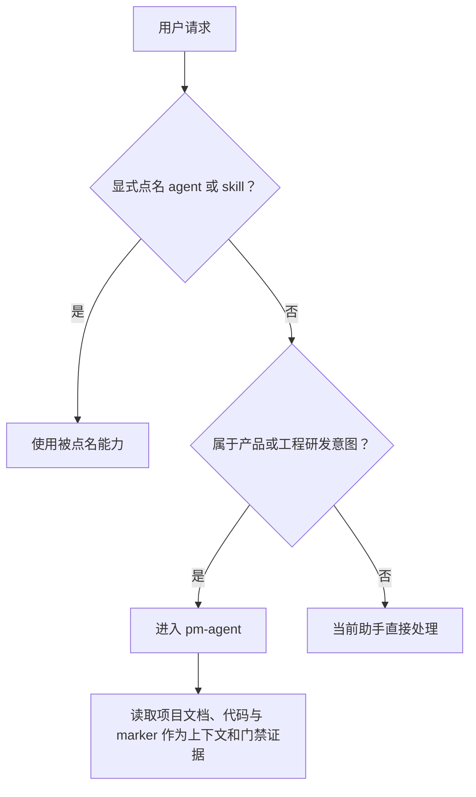

# PM 研发意图入口与路由过程收敛 PRD

## 1. 当前状态

`pm-agent` 是研发协作请求的默认入口，负责分类、范围确认、变更分级和下游 handoff。
当前自动触发规则仍把项目目录、文档或 marker 作为入口判断依据，导致两类偏差：没有
PRD/TRD 的明确研发请求可能无法进入 PM，而处于已启用项目中的普通非研发请求可能被
强制分类。同时，7 个 role router 仍要求向用户显式输出 routing decision 或 routing block，
把内部流程信息暴露为用户交付内容。

本轮处理 GitHub issue #281 与 #282，只调整自动入口判断和 router 的强制输出要求。
既有内部分类、门禁、handoff packet 与 specialist 职责边界保持不变。

## 2. 目标

1. 未显式点名能力时，按用户请求是否属于产品或工程研发意图决定是否进入 `pm-agent`。
2. 用户显式点名 `pm-agent`、role agent 或 skill 时，无条件使用被点名能力。
3. 项目文档、代码和 marker 只在进入 PM 后作为上下文与门禁证据，不作为自动触发的
   首要依据。
4. 删除 7 个 router 强制向用户展示路由过程的要求，让用户回答聚焦任务本身。
5. 保留内部分类、门禁、handoff packet 字段和 specialist 执行规则。

## 3. 非目标

1. 不修改 specialist gate 逻辑或 handoff packet schema。
2. 不新增隐藏路由协议、输出抽象、配置项或运行时机制。
3. 不讨论宿主或系统层的具体输出行为；本需求只约束仓库内 skill 流程。
4. 不改变显式调用语义，不以请求是否属于研发意图拒绝用户明确点名的能力。
5. 不增加新的 agent、skill 或 release 版本。

## 4. 用户流程

## 5. 功能需求

### FR-010：自动入口按研发意图判断

- 未显式点名能力时，先判断请求是否属于产品或工程研发工作。
- 研发意图包括新产品或功能、需求变更、bug、代码实现、测试、设计交付、部署、发布、
  安全审查、正式项目文档和研发项目状态等现有 PM 分类范围。
- 属于研发意图时进入 `pm-agent`；不属于研发意图时由当前助手直接处理。
- 自动判断不以当前目录是否启用 dev-agent-skills、是否存在 `docs/`、PRD、TRD、代码或
  marker 为首要条件。

### FR-011：显式调用始终生效

- 用户显式点名 `pm-agent`、任一 role agent 或任一 skill 时，使用被点名能力。
- 显式点名优先于自动入口判断，不因请求内容被判断为非研发而拒绝调用。
- 被点名能力内部原有 gate 和职责边界继续执行，本需求不提供绕过门禁的权限。

### FR-012：项目上下文后置

- 进入 `pm-agent` 后，继续读取项目文档、代码、marker 和已确认 handoff 作为分类、
  `feature_path`、`change_tier` 与 specialist gate 的证据。
- 上述证据只影响进入 PM 后如何处理，不决定未显式请求是否应进入 PM。

### FR-013：移除 router 强制路由过程输出

- `pm-agent`、Designer、Engineer、QA、DevOps、Security、Docs 共 7 个 router 不再要求
  显式输出“已路由到”、`Routing decision`、routing block、YAML、selected specialist、
  owner 或同类内部过程信息。
- 仅删除“必须向用户展示”的要求，不重新定义新的用户输出协议。
- router 的内部选择规则、入口门禁、handoff 数据和 specialist 路由表保持不变。

## 6. 验收场景

| ID | 场景 | 期望 |
| --- | --- | --- |
| AC-010 | 无 PRD/TRD 的目录中请求实现新功能 | 自动进入 `pm-agent` |
| AC-011 | 有完整项目文档的目录中请求处理普通非研发事项 | 不自动进入 `pm-agent` |
| AC-012 | 用户显式点名 `pm-agent` 处理非研发请求 | 使用 `pm-agent`，其内部规则照常执行 |
| AC-013 | 用户显式点名下游 role agent 或 specialist | 使用被点名能力，其入口 gate 照常执行 |
| AC-014 | 研发请求完成 router 分类 | 用户侧结果不因 skill 契约被强制包含 routing block 或 routing decision |
| AC-015 | 删除强制输出要求后执行下游流程 | 内部 gate、handoff 字段和职责边界保持不变 |

## 7. 发布边界

本轮在一个 PR 内完成 PRD/TRD、7 个 router、发现描述、必要用户文档、受影响 eval、
deterministic tests 与 `skills-lock.json` 的同步。PR 创建后等待 CI、Codex Review 和维护者
确认；不在本轮自动合并。

## 8. 风险与约束

| 风险 | 约束 |
| --- | --- |
| 研发意图描述过窄导致漏触发 | eval 同时覆盖“无 docs 的研发请求”和“有 docs 的非研发请求” |
| 显式调用被自动判断覆盖 | eval 固定验证显式点名优先 |
| 删除输出文案时误删内部路由规则 | diff 审查与 deterministic tests 检查 gate、handoff 字段仍存在 |
| 修改范围扩大为新协议 | 实施计划禁止新增输出抽象、配置项和 handoff schema 变更 |

## 9. 最终决策

- 自动入口采用“显式调用优先，其余按研发意图判断”。
- 项目上下文只作为进入 PM 后的处理证据。
- #282 采用最小删除：移除 7 个 router 强制展示路由过程的要求。
- 本轮实施门禁、归档门禁和计划门禁已由 Neplich 于 2026-08-14 批准。
